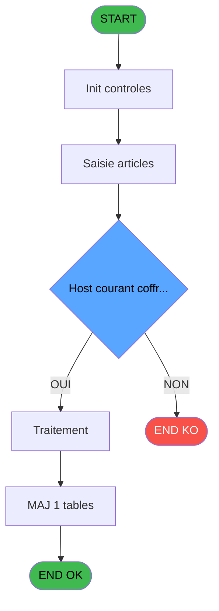
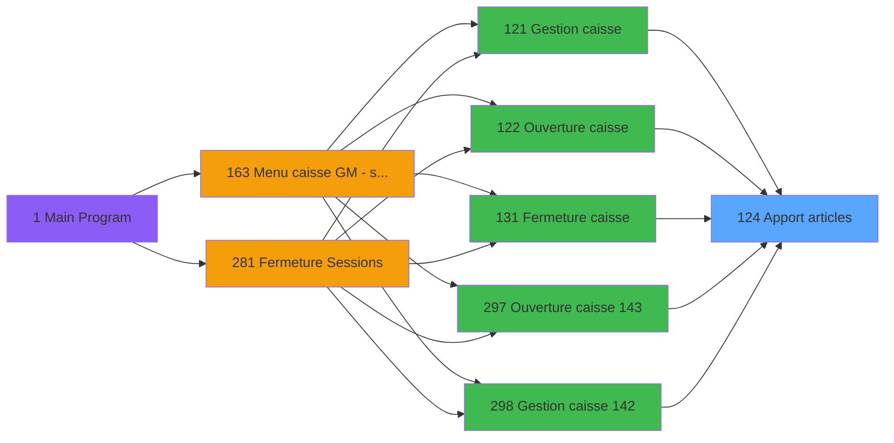
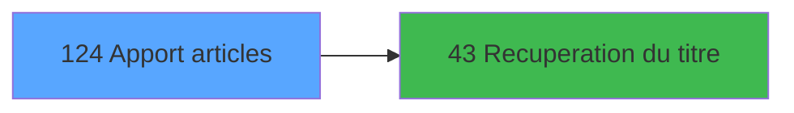

# ADH IDE 124 - Apport articles

> **Analyse**: Phases 1-4 2026-02-08 03:04 -> 03:04 (4s) | Assemblage 03:04
> **Pipeline**: V7.2 Enrichi
> **Structure**: 4 onglets (Resume | Ecrans | Donnees | Connexions)

<!-- TAB:Resume -->

## 1. FICHE D'IDENTITE

| Attribut | Valeur |
|----------|--------|
| Projet | ADH |
| IDE Position | 124 |
| Nom Programme | Apport articles |
| Fichier source | `Prg_124.xml` |
| Dossier IDE | Ventes |
| Taches | 5 (0 ecrans visibles) |
| Tables modifiees | 1 |
| Programmes appeles | 1 |
| Complexite | **BASSE** (score 12/100) |

## 2. DESCRIPTION FONCTIONNELLE

# ADH IDE 124 - Apport articles

Le programme gère l'ajout d'articles au coffre durant une session de caisse. Il fonctionne en deux phases : d'abord il affiche une grille permettant à l'opérateur de saisir les articles avec leurs quantités et montants, puis il valide et persiste les données dans la table `gestion_article_session`. Ce programme est appelé depuis les écrans principaux de gestion de caisse (IDE 121, 122, 131, 297, 298, 299), ce qui indique qu'il s'agit d'une fonction critique du cycle de caisse.

Le processus suit une logique de saisie directe : l'opérateur entre les informations des articles (montants, quantités), et le programme les stocke temporairement en session pour consultation ultérieure ou récapitulatif. Avant de finaliser, le programme appelle IDE 43 pour récupérer le titre ou la description complète de chaque article, garantissant la cohérence des données saisies avec le référentiel articles.

La validation des articles ajoutés est probablement intégrée au workflow global de caisse (ouverture/fermeture), avec possibilité de corriger ou supprimer les entrées. La table `gestion_article_session` agit comme zone de travail temporaire, vidée ou archivée lors de la clôture de session. Ce programme fait partie de la boucle métier "chargement coffre" qui précède les opérations commerciales.

## 3. BLOCS FONCTIONNELS

## 5. REGLES METIER

1 regles identifiees:

### Autres (1 regles)

#### [RM-001] Negation de (Param coffre 2 est ouvert [E]) AND NOT p.i.Host courant coffr... [F] (condition inversee)

| Element | Detail |
|---------|--------|
| **Condition** | `NOT (Param coffre 2 est ouvert [E]) AND NOT p.i.Host courant coffr... [F]` |
| **Si vrai** | Action si vrai |
| **Variables** | ER (Param coffre 2 est ouvert) |
| **Expression source** | Expression 2 : `NOT (Param coffre 2 est ouvert [E]) AND NOT p.i.Host courant` |
| **Exemple** | Si NOT (Param coffre 2 est ouvert [E]) AND NOT p.i.Host courant coffr... [F] → Action si vrai |

## 6. CONTEXTE

- **Appele par**: [Gestion caisse (IDE 121)](ADH-IDE-121.md), [Ouverture caisse (IDE 122)](ADH-IDE-122.md), [Fermeture caisse (IDE 131)](ADH-IDE-131.md), [Ouverture caisse 143 (IDE 297)](ADH-IDE-297.md), [Gestion caisse 142 (IDE 298)](ADH-IDE-298.md), [Fermeture caisse 144 (IDE 299)](ADH-IDE-299.md)
- **Appelle**: 1 programmes | **Tables**: 5 (W:1 R:0 L:4) | **Taches**: 5 | **Expressions**: 4

<!-- TAB:Ecrans -->

## 8. ECRANS

*(Programme sans ecran visible)*

## 9. NAVIGATION

### 9.3 Structure hierarchique (0 tache)

| Position | Tache | Type | Dimensions | Bloc |
|----------|-------|------|------------|------|

### 9.4 Algorigramme

> **Legende**: Vert = START/END OK | Rouge = END KO | Bleu = Decisions
> *Algorigramme auto-genere. Utiliser `/algorigramme` pour une synthese metier detaillee.*

<!-- TAB:Donnees -->

## 10. TABLES

### Tables utilisees (5)

| ID | Nom | Description | Type | R | W | L | Usages |
|----|-----|-------------|------|---|---|---|--------|
| 196 | gestion_article_session | Articles et stock | DB |   | **W** |   | 2 |
| 248 | sessions_coffre2 | Sessions de caisse | DB |   |   | L | 1 |
| 246 | histo_sessions_caisse | Sessions de caisse | DB |   |   | L | 1 |
| 217 | comptage_coffre_histo | Etat du coffre | DB |   |   | L | 1 |
| 222 | comptage_caisse_histo | Sessions de caisse | DB |   |   | L | 1 |

### Colonnes par table (5 / 1 tables avec colonnes identifiees)

Table 196 - gestion_article_session (**W**) - 2 usages

| Lettre | Variable | Acces | Type |
|--------|----------|-------|------|
| A | v.hisuser | W | Unicode |
| B | v.hischronohisto | W | Numeric |
| C | Montant articles | W | Numeric |
| D | titre | W | Alpha |
| E | v.Coffre 2 ouvert? | W | Logical |
| F | V.Mvt stock article Coffre2 | W | Numeric |
| G | V.Quantité Dispo Max Coffre 2 | W | Numeric |
| H | v.Date/Time | W | Unicode |

## 11. VARIABLES

### 11.1 Parametres entrants (1)

Variables recues du programme appelant ([Gestion caisse (IDE 121)](ADH-IDE-121.md)).

| Lettre | Nom | Type | Usage dans |
|--------|-----|------|-----------|
| ES | p.i.Host courant coffre 2 ? | Logical | - |

### 11.2 Variables de session (1)

Variables persistantes pendant toute la session.

| Lettre | Nom | Type | Usage dans |
|--------|-----|------|-----------|
| EU | v.Date/Time | Unicode | - |

### 11.3 Autres (6)

Variables diverses.

| Lettre | Nom | Type | Usage dans |
|--------|-----|------|-----------|
| EN | Param masque montant | Alpha | - |
| EO | Param montant articles | Numeric | - |
| EP | Param devise locale | Alpha | - |
| EQ | Param quand | Alpha | - |
| ER | Param coffre 2 est ouvert | Logical | 1x refs |
| ET | Fin | Logical | 1x refs |

## 12. EXPRESSIONS

**4 / 4 expressions decodees (100%)**

### 12.1 Repartition par type

| Type | Expressions | Regles |
|------|-------------|--------|
| NEGATION | 1 | 5 |
| OTHER | 2 | 0 |
| CAST_LOGIQUE | 1 | 0 |

### 12.2 Expressions cles par type

#### NEGATION (1 expressions)

| Type | IDE | Expression | Regle |
|------|-----|------------|-------|
| NEGATION | 2 | `NOT (Param coffre 2 est ouvert [E]) AND NOT p.i.Host courant coffr... [F]` | [RM-001](#rm-RM-001) |

#### OTHER (2 expressions)

| Type | IDE | Expression | Regle |
|------|-----|------------|-------|
| OTHER | 4 | `NOT(ExpCalc('2'EXP))` | - |
| OTHER | 1 | `Fin [G]` | - |

#### CAST_LOGIQUE (1 expressions)

| Type | IDE | Expression | Regle |
|------|-----|------------|-------|
| CAST_LOGIQUE | 3 | `'TRUE'LOG` | - |

<!-- TAB:Connexions -->

## 13. GRAPHE D'APPELS

### 13.1 Chaine depuis Main (Callers)

Main -> ... -> [Gestion caisse (IDE 121)](ADH-IDE-121.md) -> **Apport articles (IDE 124)**

Main -> ... -> [Ouverture caisse (IDE 122)](ADH-IDE-122.md) -> **Apport articles (IDE 124)**

Main -> ... -> [Fermeture caisse (IDE 131)](ADH-IDE-131.md) -> **Apport articles (IDE 124)**

Main -> ... -> [Ouverture caisse 143 (IDE 297)](ADH-IDE-297.md) -> **Apport articles (IDE 124)**

Main -> ... -> [Gestion caisse 142 (IDE 298)](ADH-IDE-298.md) -> **Apport articles (IDE 124)**

Main -> ... -> [Fermeture caisse 144 (IDE 299)](ADH-IDE-299.md) -> **Apport articles (IDE 124)**

### 13.2 Callers

| IDE | Nom Programme | Nb Appels |
|-----|---------------|-----------|
| [121](ADH-IDE-121.md) | Gestion caisse | 1 |
| [122](ADH-IDE-122.md) | Ouverture caisse | 1 |
| [131](ADH-IDE-131.md) | Fermeture caisse | 1 |
| [297](ADH-IDE-297.md) | Ouverture caisse 143 | 1 |
| [298](ADH-IDE-298.md) | Gestion caisse 142 | 1 |
| [299](ADH-IDE-299.md) | Fermeture caisse 144 | 1 |

### 13.3 Callees (programmes appeles)

### 13.4 Detail Callees avec contexte

| IDE | Nom Programme | Appels | Contexte |
|-----|---------------|--------|----------|
| [43](ADH-IDE-43.md) | Recuperation du titre | 1 | Recuperation donnees |

## 14. RECOMMANDATIONS MIGRATION

### 14.1 Profil du programme

| Metrique | Valeur | Impact migration |
|----------|--------|-----------------|
| Lignes de logique | 123 | Programme compact |
| Expressions | 4 | Peu de logique |
| Tables WRITE | 1 | Impact faible |
| Sous-programmes | 1 | Peu de dependances |
| Ecrans visibles | 0 | Ecran unique ou traitement batch |
| Code desactive | 0% (0 / 123) | Code sain |
| Regles metier | 1 | Quelques regles a preserver |

### 14.2 Plan de migration par bloc

### 14.3 Dependances critiques

| Dependance | Type | Appels | Impact |
|------------|------|--------|--------|
| gestion_article_session | Table WRITE (Database) | 2x | Schema + repository |
| [Recuperation du titre (IDE 43)](ADH-IDE-43.md) | Sous-programme | 1x | Normale - Recuperation donnees |

---
*Spec DETAILED generee par Pipeline V7.2 - 2026-02-08 03:05*
