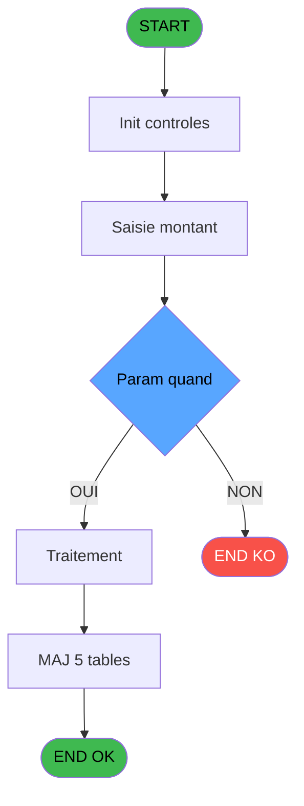
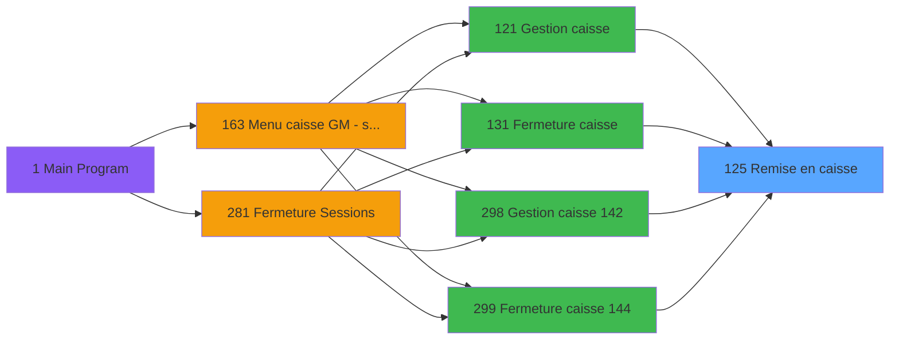
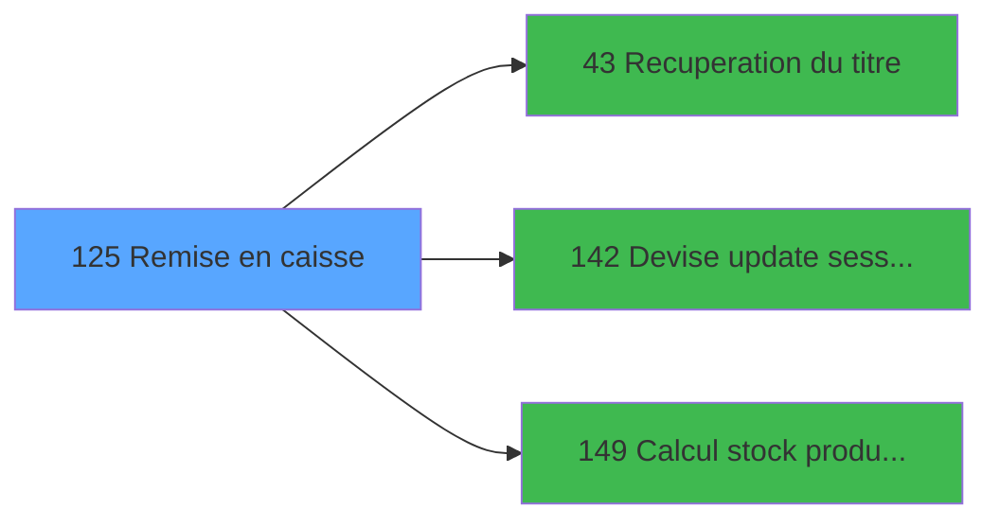

# ADH IDE 125 - Remise en caisse

> **Analyse**: Phases 1-4 2026-02-08 03:05 -> 03:05 (4s) | Assemblage 03:05
> **Pipeline**: V7.2 Enrichi
> **Structure**: 4 onglets (Resume | Ecrans | Donnees | Connexions)

<!-- TAB:Resume -->

## 1. FICHE D'IDENTITE

| Attribut | Valeur |
|----------|--------|
| Projet | ADH |
| IDE Position | 125 |
| Nom Programme | Remise en caisse |
| Fichier source | `Prg_125.xml` |
| Dossier IDE | Caisse |
| Taches | 33 (0 ecrans visibles) |
| Tables modifiees | 5 |
| Programmes appeles | 3 |
| Complexite | **BASSE** (score 38/100) |

## 2. DESCRIPTION FONCTIONNELLE

ADH IDE 125 - REMISE EN CAISSE est un programme de gestion des remises d'articles et devises en session caisse. Il traite les mouvements de stock lors des dépôts en caisse : articles vendus, devises reçues, approvionnements. Le programme valide les quantités, contrôle les écarts de stock, et met à jour les tables de gestion de session (gestion_article_session, gestion_devise_session) ainsi que la trace des approvisionnements (saisie_approvisionnement).

Le flux principal récupère d'abord le titre du membre (IDE 43) pour contextualiser la remise, puis enregistre les mouvements de devises via une mise à jour de session WebSocket (IDE 142). Le programme calcule ensuite les stocks produits (IDE 149) pour vérifier la cohérence des quantités restantes. Les validations incluent les contrôles d'écart : si le montant remis ne correspond pas aux ventes enregistrées, le programme génère un PV de comptabilité (pv_comptable) documentant l'anomalie.

Ce programme est critique dans la chaîne de fermeture caisse - appelé depuis les écrans de Gestion Caisse (IDE 121, 298) et Fermeture Caisse (IDE 131, 299), il garantit que chaque remise d'argent et d'articles est tracée et équilibrée avant la clôture définitive de la session.

## 3. BLOCS FONCTIONNELS

## 5. REGLES METIER

1 regles identifiees:

### Autres (1 regles)

#### [RM-001] Condition: Param quand [D] different de 'P'

| Element | Detail |
|---------|--------|
| **Condition** | `Param quand [D]<>'P'` |
| **Si vrai** | Action si vrai |
| **Variables** | EQ (Param quand) |
| **Expression source** | Expression 2 : `Param quand [D]<>'P'` |
| **Exemple** | Si Param quand [D]<>'P' → Action si vrai |

## 6. CONTEXTE

- **Appele par**: [Gestion caisse (IDE 121)](ADH-IDE-121.md), [Fermeture caisse (IDE 131)](ADH-IDE-131.md), [Gestion caisse 142 (IDE 298)](ADH-IDE-298.md), [Fermeture caisse 144 (IDE 299)](ADH-IDE-299.md)
- **Appelle**: 3 programmes | **Tables**: 9 (W:5 R:7 L:3) | **Taches**: 33 | **Expressions**: 2

<!-- TAB:Ecrans -->

## 8. ECRANS

*(Programme sans ecran visible)*

## 9. NAVIGATION

### 9.3 Structure hierarchique (0 tache)

| Position | Tache | Type | Dimensions | Bloc |
|----------|-------|------|------------|------|

### 9.4 Algorigramme

> **Legende**: Vert = START/END OK | Rouge = END KO | Bleu = Decisions
> *Algorigramme auto-genere. Utiliser `/algorigramme` pour une synthese metier detaillee.*

<!-- TAB:Donnees -->

## 10. TABLES

### Tables utilisees (9)

| ID | Nom | Description | Type | R | W | L | Usages |
|----|-----|-------------|------|---|---|---|--------|
| 505 | pv_comptable |  | TMP | R | **W** | L | 9 |
| 232 | gestion_devise_session | Sessions de caisse | DB | R | **W** | L | 7 |
| 244 | saisie_approvisionnement | Comptage approvisionnement | DB | R | **W** | L | 4 |
| 196 | gestion_article_session | Articles et stock | DB |   | **W** |   | 2 |
| 501 | email_reprise |  | TMP |   | **W** |   | 1 |
| 89 | moyen_paiement___mop |  | DB | R |   |   | 2 |
| 140 | moyen_paiement___mop |  | DB | R |   |   | 2 |
| 67 | tables___________tab |  | DB | R |   |   | 1 |
| 70 | date_comptable___dat |  | DB | R |   |   | 1 |

### Colonnes par table (4 / 9 tables avec colonnes identifiees)

Table 505 - pv_comptable (R/**W**/L) - 9 usages

| Lettre | Variable | Acces | Type |
|--------|----------|-------|------|
| EN | v date comptable | W | Date |

Table 232 - gestion_devise_session (R/**W**/L) - 7 usages

| Lettre | Variable | Acces | Type |
|--------|----------|-------|------|
| EO | Param devise locale | W | Alpha |
| ES | Nbre devises | W | Numeric |
| EX | Param Nbre devise comptees | W | Numeric |
| FE | Param Mt versement Nb devises | W | Numeric |

Table 244 - saisie_approvisionnement (R/**W**/L) - 4 usages

*Table utilisee uniquement en Link ou aucune colonne Real identifiee dans le DataView.*

Table 196 - gestion_article_session (**W**) - 2 usages

| Lettre | Variable | Acces | Type |
|--------|----------|-------|------|
| A | V STOCK PRODUIT | W | Numeric |
| B | TOTAL | W | Numeric |

Table 501 - email_reprise (**W**) - 1 usages

*Table utilisee uniquement en Link ou aucune colonne Real identifiee dans le DataView.*

Table 89 - moyen_paiement___mop (R) - 2 usages

*Table utilisee uniquement en Link ou aucune colonne Real identifiee dans le DataView.*

Table 140 - moyen_paiement___mop (R) - 2 usages

*Table utilisee uniquement en Link ou aucune colonne Real identifiee dans le DataView.*

Table 67 - tables___________tab (R) - 1 usages

*Table utilisee uniquement en Link ou aucune colonne Real identifiee dans le DataView.*

Table 70 - date_comptable___dat (R) - 1 usages

| Lettre | Variable | Acces | Type |
|--------|----------|-------|------|
| EN | v date comptable | R | Date |

## 11. VARIABLES

### 11.1 Parametres entrants (1)

Variables recues du programme appelant ([Gestion caisse (IDE 121)](ADH-IDE-121.md)).

| Lettre | Nom | Type | Usage dans |
|--------|-----|------|-----------|
| FH | p.i.Host courant coffre 2 ? | Logical | - |

### 11.2 Autres (21)

Variables diverses.

| Lettre | Nom | Type | Usage dans |
|--------|-----|------|-----------|
| EN | Param societe | Alpha | - |
| EO | Param devise locale | Alpha | - |
| EP | Param masque montant | Alpha | - |
| EQ | Param quand | Alpha | 1x refs |
| ER | Param Montant compte | Numeric | - |
| ES | Param Montant compte monnaie | Numeric | - |
| ET | Param Montant compte produits | Numeric | - |
| EU | Param Montant compte cartes | Numeric | - |
| EV | Param Montant compte cheques | Numeric | - |
| EW | Param Montant compte od | Numeric | - |
| EX | Param Nbre devise comptees | Numeric | - |
| EY | Param Montant versement | Numeric | - |
| EZ | Param Mt versement monnaie | Numeric | - |
| FA | Param Mt versement produits | Numeric | - |
| FB | Param Mt versement cartes | Numeric | - |
| FC | Param Mt versement cheque | Numeric | - |
| FD | Param Mt versement od | Numeric | - |
| FE | Param Mt versement Nb devises | Numeric | - |
| FF | Param UNI/BI | Alpha | - |
| FG | Param coffre 2 est ouvert | Logical | - |
| FI | Fin | Logical | 1x refs |

Toutes les 22 variables (liste complete)

| Cat | Lettre | Nom Variable | Type |
|-----|--------|--------------|------|
| P0 | **FH** | p.i.Host courant coffre 2 ? | Logical |
| Autre | **EN** | Param societe | Alpha |
| Autre | **EO** | Param devise locale | Alpha |
| Autre | **EP** | Param masque montant | Alpha |
| Autre | **EQ** | Param quand | Alpha |
| Autre | **ER** | Param Montant compte | Numeric |
| Autre | **ES** | Param Montant compte monnaie | Numeric |
| Autre | **ET** | Param Montant compte produits | Numeric |
| Autre | **EU** | Param Montant compte cartes | Numeric |
| Autre | **EV** | Param Montant compte cheques | Numeric |
| Autre | **EW** | Param Montant compte od | Numeric |
| Autre | **EX** | Param Nbre devise comptees | Numeric |
| Autre | **EY** | Param Montant versement | Numeric |
| Autre | **EZ** | Param Mt versement monnaie | Numeric |
| Autre | **FA** | Param Mt versement produits | Numeric |
| Autre | **FB** | Param Mt versement cartes | Numeric |
| Autre | **FC** | Param Mt versement cheque | Numeric |
| Autre | **FD** | Param Mt versement od | Numeric |
| Autre | **FE** | Param Mt versement Nb devises | Numeric |
| Autre | **FF** | Param UNI/BI | Alpha |
| Autre | **FG** | Param coffre 2 est ouvert | Logical |
| Autre | **FI** | Fin | Logical |

## 12. EXPRESSIONS

**2 / 2 expressions decodees (100%)**

### 12.1 Repartition par type

| Type | Expressions | Regles |
|------|-------------|--------|
| CONDITION | 1 | 5 |
| OTHER | 1 | 0 |

### 12.2 Expressions cles par type

#### CONDITION (1 expressions)

| Type | IDE | Expression | Regle |
|------|-----|------------|-------|
| CONDITION | 2 | `Param quand [D]<>'P'` | [RM-001](#rm-RM-001) |

#### OTHER (1 expressions)

| Type | IDE | Expression | Regle |
|------|-----|------------|-------|
| OTHER | 1 | `Fin [V]` | - |

<!-- TAB:Connexions -->

## 13. GRAPHE D'APPELS

### 13.1 Chaine depuis Main (Callers)

Main -> ... -> [Gestion caisse (IDE 121)](ADH-IDE-121.md) -> **Remise en caisse (IDE 125)**

Main -> ... -> [Fermeture caisse (IDE 131)](ADH-IDE-131.md) -> **Remise en caisse (IDE 125)**

Main -> ... -> [Gestion caisse 142 (IDE 298)](ADH-IDE-298.md) -> **Remise en caisse (IDE 125)**

Main -> ... -> [Fermeture caisse 144 (IDE 299)](ADH-IDE-299.md) -> **Remise en caisse (IDE 125)**

### 13.2 Callers

| IDE | Nom Programme | Nb Appels |
|-----|---------------|-----------|
| [121](ADH-IDE-121.md) | Gestion caisse | 1 |
| [131](ADH-IDE-131.md) | Fermeture caisse | 1 |
| [298](ADH-IDE-298.md) | Gestion caisse 142 | 1 |
| [299](ADH-IDE-299.md) | Fermeture caisse 144 | 1 |

### 13.3 Callees (programmes appeles)

### 13.4 Detail Callees avec contexte

| IDE | Nom Programme | Appels | Contexte |
|-----|---------------|--------|----------|
| [43](ADH-IDE-43.md) | Recuperation du titre | 1 | Recuperation donnees |
| [142](ADH-IDE-142.md) | Devise update session WS | 1 | Mise a jour donnees |
| [149](ADH-IDE-149.md) | Calcul stock produit WS | 1 | Calcul de donnees |

## 14. RECOMMANDATIONS MIGRATION

### 14.1 Profil du programme

| Metrique | Valeur | Impact migration |
|----------|--------|-----------------|
| Lignes de logique | 512 | Programme volumineux |
| Expressions | 2 | Peu de logique |
| Tables WRITE | 5 | Impact modere |
| Sous-programmes | 3 | Peu de dependances |
| Ecrans visibles | 0 | Ecran unique ou traitement batch |
| Code desactive | 0% (0 / 512) | Code sain |
| Regles metier | 1 | Quelques regles a preserver |

### 14.2 Plan de migration par bloc

### 14.3 Dependances critiques

| Dependance | Type | Appels | Impact |
|------------|------|--------|--------|
| gestion_article_session | Table WRITE (Database) | 2x | Schema + repository |
| gestion_devise_session | Table WRITE (Database) | 5x | Schema + repository |
| saisie_approvisionnement | Table WRITE (Database) | 1x | Schema + repository |
| email_reprise | Table WRITE (Temp) | 1x | Schema + repository |
| pv_comptable | Table WRITE (Temp) | 2x | Schema + repository |
| [Calcul stock produit WS (IDE 149)](ADH-IDE-149.md) | Sous-programme | 1x | Normale - Calcul de donnees |
| [Devise update session WS (IDE 142)](ADH-IDE-142.md) | Sous-programme | 1x | Normale - Mise a jour donnees |
| [Recuperation du titre (IDE 43)](ADH-IDE-43.md) | Sous-programme | 1x | Normale - Recuperation donnees |

---
*Spec DETAILED generee par Pipeline V7.2 - 2026-02-08 03:05*
