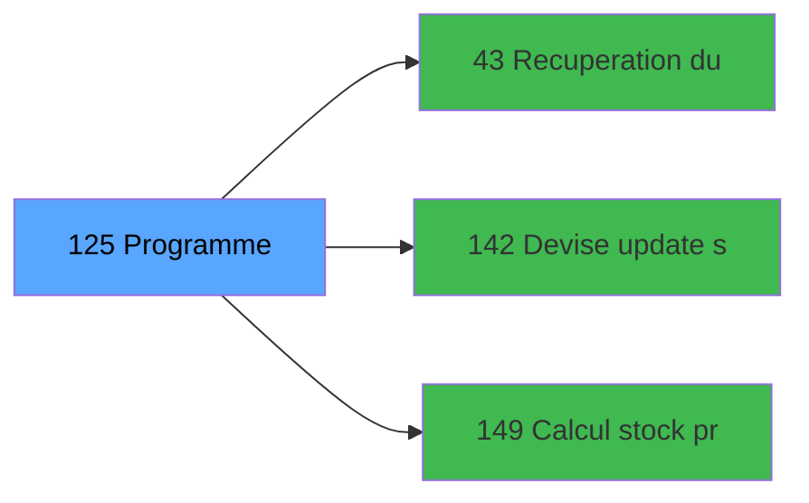

# ADH IDE 125 - Remise en caisse

> **Version spec**: 3.5
> **Analyse**: 2026-01-27 17:57
> **Source**: `Prg_XXX.xml`

---

<!-- TAB:Fonctionnel -->

## SPECIFICATION FONCTIONNELLE

### 1.1 Objectif metier

| Element | Description |
|---------|-------------|
| **Qui** | Operateur |
| **Quoi** | Remise en caisse
 |
| **Pourquoi** | A documenter |
| **Declencheur** | A identifier |

### 1.2 Regles metier

| Code | Regle | Condition |
|------|-------|-----------|
| RM-001 | A documenter | - |

### 1.3 Flux utilisateur

1. Demarrage programme
2. Traitement principal
3. Fin programme

### 1.4 Cas d'erreur

| Erreur | Comportement |
|--------|--------------|
| - | A documenter |

---

<!-- TAB:Technique -->

## SPECIFICATION TECHNIQUE

### 2.1 Identification

| Attribut | Valeur |
|----------|--------|
| **Format IDE** | ADH IDE 125 |
| **Description** | Remise en caisse
 |
| **Module** | ADH |

### 2.2 Tables

| # | Nom physique | Acces | Usage |
|---|--------------|-------|-------|
| #67 | `Table_67` | R | 1x |
| #70 | `Table_70` | R | 1x |
| #89 | `Table_89` | R | 2x |
| #140 | `Table_140` | R | 2x |
| #196 | `Table_196` | **W** | 2x |
| #232 | `Table_232` | LINK | 1x |
| #232 | `Table_232` | R | 1x |
| #232 | `Table_232` | **W** | 5x |
| #244 | `Table_244` | LINK | 1x |
| #244 | `Table_244` | R | 2x |
| #244 | `Table_244` | **W** | 1x |
| #501 | `Table_501` | **W** | 1x |
| #505 | `Table_505` | LINK | 5x |
| #505 | `Table_505` | R | 2x |
| #505 | `Table_505` | **W** | 2x |
### 2.3 Parametres d'entree

### 2.4 Algorigramme

### 2.5 Expressions cles

### 2.6 Variables importantes

### 2.7 Statistiques

---

<!-- TAB:Cartographie -->

## CARTOGRAPHIE APPLICATIVE

### 3.1 Chaine d'appels depuis Main

### 3.2 Callers directs

| IDE | Programme | Nb appels |
|-----|-----------|-----------|
| 121 | Gestion caisse | 1 |
| 131 | Fermeture caisse | 1 |
| 298 | Gestion caisse 142 | 1 |
| 299 | Fermeture caisse 144 | 1 |
### 3.3 Callees

| Niv | IDE | Programme | Nb appels |
|-----|-----|-----------|-----------|
| 1 | 43 | Recuperation du titre | 1 |
| 1 | 142 | Devise update session WS | 1 |
| 1 | 149 | Calcul stock produit WS | 1 |
### 3.4 Verification orphelin

| Critere | Resultat |
|---------|----------|
| Callers actifs | A verifier |
| **Conclusion** | A analyser |

---

## HISTORIQUE

| Date | Action | Auteur |
|------|--------|--------|
| 2026-01-27 19:46 | **DATA POPULATED** - Tables, Callgraph (2 expr) | Script |
| 2026-01-27 17:57 | **Upgrade V3.5** - TAB markers, Mermaid | Claude |

---

*Specification V3.5 - Format avec TAB markers et Mermaid*
