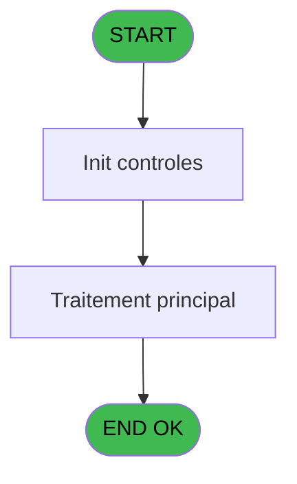
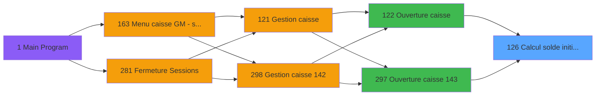
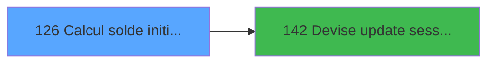

# ADH IDE 126 - Calcul solde initial WS

> **Analyse**: Phases 1-4 2026-02-08 03:05 -> 03:05 (4s) | Assemblage 03:05
> **Pipeline**: V7.2 Enrichi
> **Structure**: 4 onglets (Resume | Ecrans | Donnees | Connexions)

<!-- TAB:Resume -->

## 1. FICHE D'IDENTITE

| Attribut | Valeur |
|----------|--------|
| Projet | ADH |
| IDE Position | 126 |
| Nom Programme | Calcul solde initial WS |
| Fichier source | `Prg_126.xml` |
| Dossier IDE | Comptabilite |
| Taches | 7 (0 ecrans visibles) |
| Tables modifiees | 0 |
| Programmes appeles | 1 |
| Complexite | **BASSE** (score 12/100) |

## 2. DESCRIPTION FONCTIONNELLE

ADH IDE 126 est un programme utilitaire appelé lors de l'ouverture de caisse pour calculer le solde initial de la session en cours de devise. Il se positionne dans le flux d'ouverture caisse (IDE 122 ou IDE 297) et reçoit comme paramètres le numéro de session, la devise, et potentiellement les détails du coffre. Son rôle principal est d'interroger les opérations antérieures pour déterminer le solde disponible avant la nouvelle session.

Le programme exécute une logique de somme cumulative sur les mouvements de caisse (crédits et débits) filtrés par devise et session précédente, puis met à jour le solde initial dans la session courante via un appel à IDE 142 (Devise update session WS). Cette architecture garantit la continuité des soldes entre sessions et évite les incohérences de trésorerie.

C'est un programme de support transactionnel crítico pour la gestion quotidienne de caisse — sans lui, l'ouverture de session ne pourrait pas s'initialiser correctement avec le solde d'entrée. Il utilise probablement des tables REF comme les devises et les mouvements de caisse pour effectuer ses calculs.

## 3. BLOCS FONCTIONNELS

## 5. REGLES METIER

*(Aucune regle metier identifiee dans les expressions)*

## 6. CONTEXTE

- **Appele par**: [Ouverture caisse (IDE 122)](ADH-IDE-122.md), [Ouverture caisse 143 (IDE 297)](ADH-IDE-297.md)
- **Appelle**: 1 programmes | **Tables**: 7 (W:0 R:4 L:3) | **Taches**: 7 | **Expressions**: 12

<!-- TAB:Ecrans -->

## 8. ECRANS

*(Programme sans ecran visible)*

## 9. NAVIGATION

### 9.3 Structure hierarchique (0 tache)

| Position | Tache | Type | Dimensions | Bloc |
|----------|-------|------|------------|------|

### 9.4 Algorigramme

> **Legende**: Vert = START/END OK | Rouge = END KO | Bleu = Decisions
> *Algorigramme auto-genere. Utiliser `/algorigramme` pour une synthese metier detaillee.*

<!-- TAB:Donnees -->

## 10. TABLES

### Tables utilisees (7)

| ID | Nom | Description | Type | R | W | L | Usages |
|----|-----|-------------|------|---|---|---|--------|
| 249 | histo_sessions_caisse_detail | Sessions de caisse | DB | R |   |   | 2 |
| 77 | articles_________art | Articles et stock | DB | R |   |   | 2 |
| 139 | moyens_reglement_mor | Reglements / paiements | DB | R |   |   | 1 |
| 50 | moyens_reglement_mor | Reglements / paiements | DB | R |   |   | 1 |
| 250 | histo_sessions_caisse_devise | Sessions de caisse | DB |   |   | L | 2 |
| 222 | comptage_caisse_histo | Sessions de caisse | DB |   |   | L | 1 |
| 247 | histo_sessions_caisse_article | Articles et stock | DB |   |   | L | 1 |

### Colonnes par table (5 / 4 tables avec colonnes identifiees)

Table 249 - histo_sessions_caisse_detail (R) - 2 usages

| Lettre | Variable | Acces | Type |
|--------|----------|-------|------|
| A | P.i. societe | R | Alpha |
| B | P.i. devise locale | R | Alpha |
| C | P.i. session | R | Numeric |
| D | P.o. solde initial | R | Numeric |
| E | P.o. solde initial monnaie | R | Numeric |
| F | P.o. solde initial produits | R | Numeric |
| G | P.o. solde initial cartes | R | Numeric |
| H | P.o. solde initial cheques | R | Numeric |
| I | P.o. solde initial od | R | Numeric |
| J | P.o. nbre devise initial | R | Numeric |
| K | P.i. UNI/BI | R | Alpha |
| L | P.i.Session VIL ouverte ? | R | Logical |

Table 77 - articles_________art (R) - 2 usages

*Table utilisee uniquement en Link ou aucune colonne Real identifiee dans le DataView.*

Table 139 - moyens_reglement_mor (R) - 1 usages

| Lettre | Variable | Acces | Type |
|--------|----------|-------|------|
| A | EXISTE TYPE F precedent | R | Logical |
| B | RUPTURE_DEV_MOP | R | Alpha |

Table 50 - moyens_reglement_mor (R) - 1 usages

*Table utilisee uniquement en Link ou aucune colonne Real identifiee dans le DataView.*

## 11. VARIABLES

### 11.1 Parametres entrants (12)

Variables recues du programme appelant ([Ouverture caisse (IDE 122)](ADH-IDE-122.md)).

| Lettre | Nom | Type | Usage dans |
|--------|-----|------|-----------|
| EN | P.i. societe | Alpha | - |
| EO | P.i. devise locale | Alpha | - |
| EP | P.i. session | Numeric | - |
| EQ | P.o. solde initial | Numeric | - |
| ER | P.o. solde initial monnaie | Numeric | - |
| ES | P.o. solde initial produits | Numeric | - |
| ET | P.o. solde initial cartes | Numeric | - |
| EU | P.o. solde initial cheques | Numeric | - |
| EV | P.o. solde initial od | Numeric | - |
| EW | P.o. nbre devise initial | Numeric | - |
| EX | P.i. UNI/BI | Alpha | - |
| EY | P.i.Session VIL ouverte ? | Logical | 2x parametre entrant |

## 12. EXPRESSIONS

**12 / 12 expressions decodees (100%)**

### 12.1 Repartition par type

| Type | Expressions | Regles |
|------|-------------|--------|
| CONSTANTE | 2 | 0 |
| REFERENCE_VG | 1 | 0 |
| OTHER | 9 | 0 |

### 12.2 Expressions cles par type

#### CONSTANTE (2 expressions)

| Type | IDE | Expression | Regle |
|------|-----|------------|-------|
| CONSTANTE | 3 | `'F'` | - |
| CONSTANTE | 2 | `'F'` | - |

#### REFERENCE_VG (1 expressions)

| Type | IDE | Expression | Regle |
|------|-----|------------|-------|
| REFERENCE_VG | 1 | `VG1` | - |

#### OTHER (9 expressions)

| Type | IDE | Expression | Regle |
|------|-----|------------|-------|
| OTHER | 10 | `[V]` | - |
| OTHER | 9 | `[U]` | - |
| OTHER | 12 | `[X]` | - |
| OTHER | 11 | `[W]` | - |
| OTHER | 8 | `P.i.Session VIL ouverte ? [L]` | - |
| ... | | *+4 autres* | |

<!-- TAB:Connexions -->

## 13. GRAPHE D'APPELS

### 13.1 Chaine depuis Main (Callers)

Main -> ... -> [Ouverture caisse (IDE 122)](ADH-IDE-122.md) -> **Calcul solde initial WS (IDE 126)**

Main -> ... -> [Ouverture caisse 143 (IDE 297)](ADH-IDE-297.md) -> **Calcul solde initial WS (IDE 126)**

### 13.2 Callers

| IDE | Nom Programme | Nb Appels |
|-----|---------------|-----------|
| [122](ADH-IDE-122.md) | Ouverture caisse | 1 |
| [297](ADH-IDE-297.md) | Ouverture caisse 143 | 1 |

### 13.3 Callees (programmes appeles)

### 13.4 Detail Callees avec contexte

| IDE | Nom Programme | Appels | Contexte |
|-----|---------------|--------|----------|
| [142](ADH-IDE-142.md) | Devise update session WS | 4 | Mise a jour donnees |

## 14. RECOMMANDATIONS MIGRATION

### 14.1 Profil du programme

| Metrique | Valeur | Impact migration |
|----------|--------|-----------------|
| Lignes de logique | 134 | Programme compact |
| Expressions | 12 | Peu de logique |
| Tables WRITE | 0 | Impact faible |
| Sous-programmes | 1 | Peu de dependances |
| Ecrans visibles | 0 | Ecran unique ou traitement batch |
| Code desactive | 0% (0 / 134) | Code sain |
| Regles metier | 0 | Pas de regle identifiee |

### 14.2 Plan de migration par bloc

### 14.3 Dependances critiques

| Dependance | Type | Appels | Impact |
|------------|------|--------|--------|
| [Devise update session WS (IDE 142)](ADH-IDE-142.md) | Sous-programme | 4x | **CRITIQUE** - Mise a jour donnees |

---
*Spec DETAILED generee par Pipeline V7.2 - 2026-02-08 03:06*
