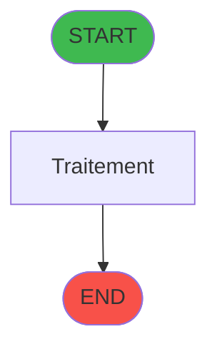
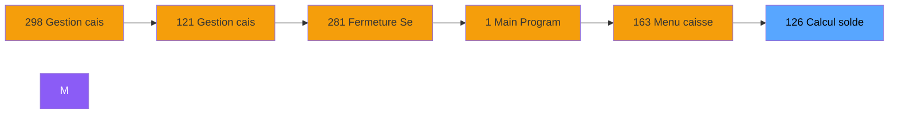
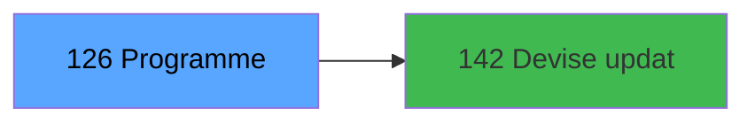

# ADH IDE 126 - Calcul solde initial WS

> **Version spec**: 3.5
> **Analyse**: 2026-01-27 17:57
> **Source**: `Prg_XXX.xml`

---

<!-- TAB:Fonctionnel -->

## SPECIFICATION FONCTIONNELLE

### 1.1 Objectif metier

| Element | Description |
|---------|-------------|
| **Qui** | Operateur |
| **Quoi** | Calcul solde initial WS
 |
| **Pourquoi** | A documenter |
| **Declencheur** | A identifier |

### 1.2 Regles metier

| Code | Regle | Condition |
|------|-------|-----------|
| RM-001 | A documenter | - |

### 1.3 Flux utilisateur

1. Demarrage programme
2. Traitement principal
3. Fin programme

### 1.4 Cas d'erreur

| Erreur | Comportement |
|--------|--------------|
| - | A documenter |

---

<!-- TAB:Technique -->

## SPECIFICATION TECHNIQUE

### 2.1 Identification

| Attribut | Valeur |
|----------|--------|
| **Format IDE** | ADH IDE 126 |
| **Description** | Calcul solde initial WS
 |
| **Module** | ADH |

### 2.2 Tables

| # | Nom logique | Nom physique | Acces | Usage |
|---|-------------|--------------|-------|-------|
| 50 | moyens_reglement_mor | `cafil028_dat` | R | 1x |
| 77 | articles_________art | `cafil055_dat` | R | 2x |
| 139 | moyens_reglement_mor | `cafil117_dat` | R | 1x |
| 222 | comptage_caisse_histo | `caisse_compcais_histo2` | L | 1x |
| 247 | histo_sessions_caisse_article | `caisse_session_article` | L | 1x |
| 249 | histo_sessions_caisse_detail | `caisse_session_detail` | R | 2x |
| 250 | histo_sessions_caisse_devise | `caisse_session_devise` | L | 2x |
### 2.3 Parametres d'entree

| Variable | Nom | Type | Picture |
|----------|-----|------|---------|
| - | Aucun parametre | - | - |
### 2.4 Algorigramme

### 2.5 Expressions cles

| IDE | Expression | Commentaire |
|-----|------------|-------------|
| 1 | `{32768,1}` | - |
| 2 | `'F'` | - |
| 3 | `'F'` | - |
| 4 | `{0,18}` | - |
| 5 | `{0,19}` | - |
| 6 | `NOT({0,12})` | - |
| 7 | `{0,20}` | - |
| 8 | `{0,12}` | - |
| 9 | `{0,21}` | - |
| 10 | `{0,22}` | - |
| 11 | `{0,23}` | - |
| 12 | `{0,24}` | - |

> **Total**: 12 expressions (affichees: 12)
### 2.6 Variables importantes

### 2.7 Statistiques

| Metrique | Valeur |
|----------|--------|
| **Taches** | 7 |
| **Lignes logique** | 134 |
| **Lignes desactivees** | 0 |
---

<!-- TAB:Cartographie -->

## CARTOGRAPHIE APPLICATIVE

### 3.1 Chaine d'appels depuis Main

### 3.2 Callers directs

| IDE | Programme | Nb appels |
|-----|-----------|-----------|
| 122 | Ouverture caisse | 1 |
| 297 | Ouverture caisse 143 | 1 |
### 3.3 Callees

| Niv | IDE | Programme | Nb appels |
|-----|-----|-----------|-----------|
| 1 | 142 | Devise update session WS | 4 |
### 3.4 Verification orphelin

| Critere | Resultat |
|---------|----------|
| Callers actifs | A verifier |
| **Conclusion** | A analyser |

---

## HISTORIQUE

| Date | Action | Auteur |
|------|--------|--------|
| 2026-01-27 20:21 | **DATA V2** - Tables reelles, Expressions, Stats, CallChain | Script |
| 2026-01-27 19:46 | **DATA POPULATED** - Tables, Callgraph (12 expr) | Script |
| 2026-01-27 17:57 | **Upgrade V3.5** - TAB markers, Mermaid | Claude |

---

*Specification V3.5 - Format avec TAB markers et Mermaid*
