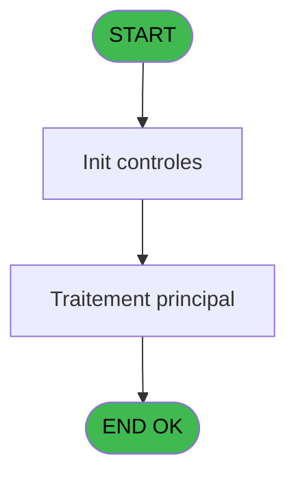
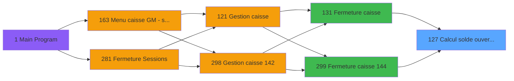

# ADH IDE 127 - Calcul solde ouverture WS

> **Analyse**: Phases 1-4 2026-02-08 03:06 -> 03:06 (4s) | Assemblage 03:06
> **Pipeline**: V7.2 Enrichi
> **Structure**: 4 onglets (Resume | Ecrans | Donnees | Connexions)

<!-- TAB:Resume -->

## 1. FICHE D'IDENTITE

| Attribut | Valeur |
|----------|--------|
| Projet | ADH |
| IDE Position | 127 |
| Nom Programme | Calcul solde ouverture WS |
| Fichier source | `Prg_127.xml` |
| Dossier IDE | Comptabilite |
| Taches | 4 (0 ecrans visibles) |
| Tables modifiees | 0 |
| Programmes appeles | 1 |
| Complexite | **BASSE** (score 5/100) |

## 2. DESCRIPTION FONCTIONNELLE

ADH IDE 127 calcule le solde d'ouverture de caisse en devises, en consolidant les montants saisis lors de l'ouverture par devise. Le programme traite chaque devise déclarée dans le paramètre d'entrée, extrait le montant correspondant de la session, et effectue les conversions monétaires nécessaires vers la devise de référence du club (généralement EUR). C'est un programme pivot entre les données d'ouverture brutes et les états financiers consolidés.

Le flux opérationnel repose sur un appel externe à ADH IDE 142 (Devise update session WS) qui actualise les taux de change en vigueur avant le calcul. Cette dépendance garantit que les conversions utilisent les taux corrects à la date d'ouverture, évitant les écarts de change dus à des taux obsolètes. Le programme valide également l'intégrité des montants par devise et signale les anomalies (devises manquantes, taux introuvables, montants négatifs).

En fermeture de caisse (IDE 131, IDE 299), ce programme est réinvoqué pour valider la cohérence entre le solde d'ouverture enregistré et le solde calculé rétrospectivement. Un écart à ce stade signale soit une modification frauduleuse des paramètres de session, soit une erreur dans la capture initiale des devises.

## 3. BLOCS FONCTIONNELS

## 5. REGLES METIER

*(Aucune regle metier identifiee dans les expressions)*

## 6. CONTEXTE

- **Appele par**: [Fermeture caisse (IDE 131)](ADH-IDE-131.md), [Fermeture caisse 144 (IDE 299)](ADH-IDE-299.md)
- **Appelle**: 1 programmes | **Tables**: 4 (W:0 R:3 L:1) | **Taches**: 4 | **Expressions**: 9

<!-- TAB:Ecrans -->

## 8. ECRANS

*(Programme sans ecran visible)*

## 9. NAVIGATION

### 9.3 Structure hierarchique (0 tache)

| Position | Tache | Type | Dimensions | Bloc |
|----------|-------|------|------------|------|

### 9.4 Algorigramme

> **Legende**: Vert = START/END OK | Rouge = END KO | Bleu = Decisions
> *Algorigramme auto-genere. Utiliser `/algorigramme` pour une synthese metier detaillee.*

<!-- TAB:Donnees -->

## 10. TABLES

### Tables utilisees (4)

| ID | Nom | Description | Type | R | W | L | Usages |
|----|-----|-------------|------|---|---|---|--------|
| 139 | moyens_reglement_mor | Reglements / paiements | DB | R |   |   | 1 |
| 249 | histo_sessions_caisse_detail | Sessions de caisse | DB | R |   |   | 1 |
| 50 | moyens_reglement_mor | Reglements / paiements | DB | R |   |   | 1 |
| 232 | gestion_devise_session | Sessions de caisse | DB |   |   | L | 2 |

### Colonnes par table (2 / 3 tables avec colonnes identifiees)

Table 139 - moyens_reglement_mor (R) - 1 usages

*Table utilisee uniquement en Link ou aucune colonne Real identifiee dans le DataView.*

Table 249 - histo_sessions_caisse_detail (R) - 1 usages

| Lettre | Variable | Acces | Type |
|--------|----------|-------|------|
| A | Param societe | R | Alpha |
| B | Param devise locale | R | Alpha |
| C | Param solde ouverture | R | Numeric |
| D | Param solde ouverture monnaie | R | Numeric |
| E | Param solde ouverture produits | R | Numeric |
| F | Param solde ouverture cartes | R | Numeric |
| G | Param solde ouverture cheques | R | Numeric |
| H | Param solde ouverture od | R | Numeric |
| I | Param nbre devise | R | Numeric |
| J | Param UNI/BI | R | Alpha |

Table 50 - moyens_reglement_mor (R) - 1 usages

*Table utilisee uniquement en Link ou aucune colonne Real identifiee dans le DataView.*

## 11. VARIABLES

### 11.1 Autres (10)

Variables diverses.

| Lettre | Nom | Type | Usage dans |
|--------|-----|------|-----------|
| EN | Param societe | Alpha | - |
| EO | Param devise locale | Alpha | - |
| EP | Param solde ouverture | Numeric | - |
| EQ | Param solde ouverture monnaie | Numeric | - |
| ER | Param solde ouverture produits | Numeric | - |
| ES | Param solde ouverture cartes | Numeric | - |
| ET | Param solde ouverture cheques | Numeric | - |
| EU | Param solde ouverture od | Numeric | - |
| EV | Param nbre devise | Numeric | - |
| EW | Param UNI/BI | Alpha | - |

## 12. EXPRESSIONS

**9 / 9 expressions decodees (100%)**

### 12.1 Repartition par type

| Type | Expressions | Regles |
|------|-------------|--------|
| CONSTANTE | 1 | 0 |
| REFERENCE_VG | 1 | 0 |
| OTHER | 7 | 0 |

### 12.2 Expressions cles par type

#### CONSTANTE (1 expressions)

| Type | IDE | Expression | Regle |
|------|-----|------------|-------|
| CONSTANTE | 2 | `'L'` | - |

#### REFERENCE_VG (1 expressions)

| Type | IDE | Expression | Regle |
|------|-----|------------|-------|
| REFERENCE_VG | 1 | `VG1` | - |

#### OTHER (7 expressions)

| Type | IDE | Expression | Regle |
|------|-----|------------|-------|
| OTHER | 7 | `[S]` | - |
| OTHER | 8 | `[T]` | - |
| OTHER | 9 | `[U]` | - |
| OTHER | 6 | `[R]` | - |
| OTHER | 3 | `[O]` | - |
| ... | | *+2 autres* | |

<!-- TAB:Connexions -->

## 13. GRAPHE D'APPELS

### 13.1 Chaine depuis Main (Callers)

Main -> ... -> [Fermeture caisse (IDE 131)](ADH-IDE-131.md) -> **Calcul solde ouverture WS (IDE 127)**

Main -> ... -> [Fermeture caisse 144 (IDE 299)](ADH-IDE-299.md) -> **Calcul solde ouverture WS (IDE 127)**

### 13.2 Callers

| IDE | Nom Programme | Nb Appels |
|-----|---------------|-----------|
| [131](ADH-IDE-131.md) | Fermeture caisse | 1 |
| [299](ADH-IDE-299.md) | Fermeture caisse 144 | 1 |

### 13.3 Callees (programmes appeles)

### 13.4 Detail Callees avec contexte

| IDE | Nom Programme | Appels | Contexte |
|-----|---------------|--------|----------|
| [142](ADH-IDE-142.md) | Devise update session WS | 2 | Mise a jour donnees |

## 14. RECOMMANDATIONS MIGRATION

### 14.1 Profil du programme

| Metrique | Valeur | Impact migration |
|----------|--------|-----------------|
| Lignes de logique | 97 | Programme compact |
| Expressions | 9 | Peu de logique |
| Tables WRITE | 0 | Impact faible |
| Sous-programmes | 1 | Peu de dependances |
| Ecrans visibles | 0 | Ecran unique ou traitement batch |
| Code desactive | 0% (0 / 97) | Code sain |
| Regles metier | 0 | Pas de regle identifiee |

### 14.2 Plan de migration par bloc

### 14.3 Dependances critiques

| Dependance | Type | Appels | Impact |
|------------|------|--------|--------|
| [Devise update session WS (IDE 142)](ADH-IDE-142.md) | Sous-programme | 2x | Haute - Mise a jour donnees |

---
*Spec DETAILED generee par Pipeline V7.2 - 2026-02-08 03:06*
