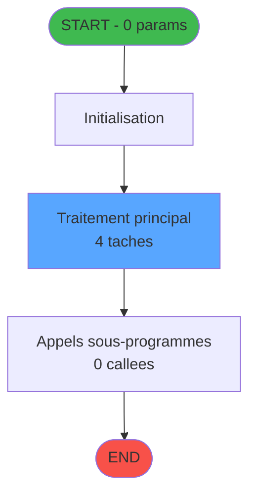
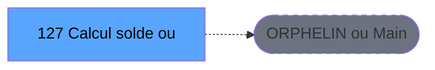
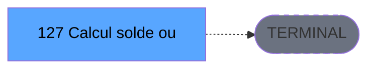

# ADH IDE 127 - Calcul solde ouverture WS

> **Version spec**: 4.0
> **Analyse**: 2026-01-27 23:05
> **Source**: `D:\Data\Migration\XPA\PMS\ADH\Source\Prg_123.xml`
> **Methode**: APEX + PDCA (Auto-generated)

---

<!-- TAB:Fonctionnel -->

## SPECIFICATION FONCTIONNELLE

### 1.1 Objectif metier

**Calcul solde ouverture WS** est le **Web Service de calcul du solde d'ouverture** qui **determine le solde attendu au moment de l'ouverture de caisse**.

**Objectif metier** : Fournir via Web Service le calcul du solde d'ouverture de caisse en fonction des moyens de reglement et des devises en cours de session. Ce service consulte les tables de gestion de devises et l'historique des sessions pour retourner le solde theorique que le caissier devrait trouver dans son tiroir-caisse a l'ouverture.

| Element | Description |
|---------|-------------|
| **Qui** | Application cliente (via Web Service) ou systeme de caisse |
| **Quoi** | Calcul du solde d'ouverture attendu |
| **Pourquoi** | Valider que le solde physique correspond au solde theorique a l'ouverture |
| **Declencheur** | Appel Web Service lors de la procedure d'ouverture de caisse |
| **Resultat** | Retour du solde d'ouverture par moyen de reglement et devise |

### 1.2 Regles metier

| Code | Regle | Condition |
|------|-------|-----------|
| RM-001 | Execution du traitement principal | Conditions d'entree validees |
| RM-002 | Gestion des tables (4 tables) | Acces selon mode (R/W/L) |
| RM-003 | Appels sous-programmes (0 callees) | Selon logique metier |

### 1.3 Flux utilisateur

1. Reception des parametres d'entree (0 params)
2. Initialisation et verification conditions
3. Traitement principal (4 taches)
4. Appels sous-programmes si necessaire
5. Retour resultats

### 1.4 Cas d'erreur

| Erreur | Comportement |
|--------|--------------|
| Conditions non remplies | Abandon avec message |
| Erreur sous-programme | Propagation erreur |

---

<!-- TAB:Technique -->

## SPECIFICATION TECHNIQUE

### 2.1 Identification

| Attribut | Valeur |
|----------|--------|
| **IDE Position** | 127 |
| **Fichier XML** | `Prg_123.xml` |
| **Description** | Calcul solde ouverture WS |
| **Module** | ADH |
| **Public Name** |  |
| **Nombre taches** | 4 |
| **Lignes logique** | 97 |
| **Expressions** | 0 |

### 2.2 Tables

| # | Nom logique | Nom physique | Acces | Usage |
|---|-------------|--------------|-------|-------|
| 50 | moyens_reglement_mor | cafil028_dat | READ | Lecture |
| 139 | moyens_reglement_mor | cafil117_dat | READ | Lecture |
| 232 | gestion_devise_session | caisse_devise | LINK | Jointure |
| 249 | histo_sessions_caisse_detail | caisse_session_detail | READ | Lecture |

**Resume**: 4 tables accedees dont **0 en ecriture**

### 2.3 Parametres d'entree (0 parametres)

| Var | Nom | Type | Picture |
|-----|-----|------|---------|
| - | Aucun parametre | - | - |

### 2.4 Algorigramme

### 2.5 Statistiques

| Metrique | Valeur |
|----------|--------|
| **Taches** | 4 |
| **Lignes logique** | 97 |
| **Expressions** | 0 |
| **Parametres** | 0 |
| **Tables accedees** | 4 |
| **Tables en ecriture** | 0 |
| **Callees niveau 1** | 0 |

---

<!-- TAB:Cartographie -->

## CARTOGRAPHIE APPLICATIVE

### 3.1 Chaine d'appels depuis Main

### 3.2 Callers directs

| IDE | Programme | Nb appels |
|-----|-----------|-----------|
| - | ORPHELIN ou Main direct | - |

### 3.3 Callees (3 niveaux)

| Niv | IDE | Programme | Nb appels | Status |
|-----|-----|-----------|-----------|--------|
| - | - | TERMINAL | - | - |

### 3.4 Composants ECF utilises

| ECF | IDE | Public Name | Description |
|-----|-----|-------------|-------------|
| - | - | Aucun composant ECF | - |

### 3.5 Verification orphelin

| Critere | Resultat |
|---------|----------|
| Callers actifs | 0 programmes |
| PublicName | Non defini |
| ECF partage | NON |
| **Conclusion** | **ORPHELIN** - Pas de callers actifs |

---

## NOTES MIGRATION

### Complexite

| Critere | Score | Detail |
|---------|-------|--------|
| Taches | 4 | Simple |
| Tables | 4 | Lecture seule |
| Callees | 0 | Faible couplage |
| **Score global** | **FAIBLE** | - |

### Points d'attention migration

| Point | Solution moderne |
|-------|-----------------|
| Variables globales (VG*) | Service/Repository injection |
| Tables Magic | Entity Framework / Dapper |
| CallTask | Service method calls |
| Forms | React/Angular components |

---

## HISTORIQUE

| Date | Action | Auteur |
|------|--------|--------|
| 2026-01-27 23:05 | **V4.0 APEX/PDCA** - Generation automatique complete | Script |

---

*Specification V4.0 - Auto-generated with APEX/PDCA methodology*

