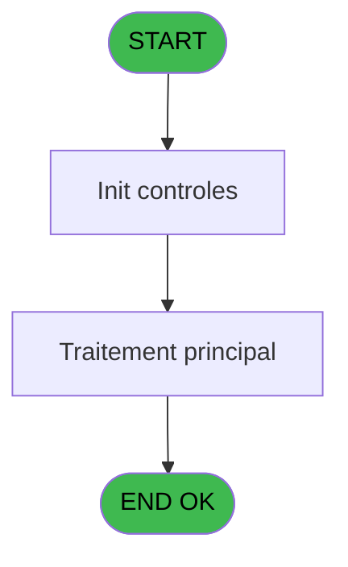
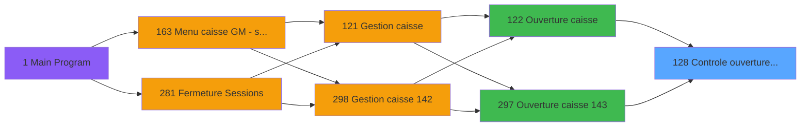
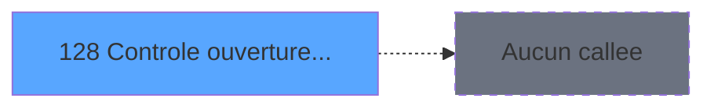

# ADH IDE 128 - Controle ouverture caisse WS

> **Analyse**: Phases 1-4 2026-02-08 03:06 -> 03:06 (4s) | Assemblage 03:06
> **Pipeline**: V7.2 Enrichi
> **Structure**: 4 onglets (Resume | Ecrans | Donnees | Connexions)

<!-- TAB:Resume -->

## 1. FICHE D'IDENTITE

| Attribut | Valeur |
|----------|--------|
| Projet | ADH |
| IDE Position | 128 |
| Nom Programme | Controle ouverture caisse WS |
| Fichier source | `Prg_128.xml` |
| Dossier IDE | Caisse |
| Taches | 2 (0 ecrans visibles) |
| Tables modifiees | 0 |
| Programmes appeles | 0 |
| Complexite | **BASSE** (score 0/100) |

## 2. DESCRIPTION FONCTIONNELLE

Le programme ADH IDE 128 effectue un contrôle préalable avant l'ouverture d'une session de caisse. Il valide que les conditions nécessaires sont réunies : vérification que la caisse n'est pas déjà ouverte, que l'opérateur dispose des droits requis, et que les paramètres de session sont corrects. Ce programme agit comme un gatekeeper, bloquant les ouvertures invalides avant qu'elles n'affectent les données critiques.

Le flux d'exécution repose sur une série de vérifications conditionnelles. Pour chaque condition d'erreur rencontrée (caisse déjà ouverte, droits insuffisants, paramètres manquants), le programme retourne un code d'erreur spécifique permettant au programme appelant (IDE 122 ou IDE 297) de gérer l'erreur appropriée et d'afficher un message utilisateur adapté. Les validations s'exécutent dans un ordre logique : d'abord les vérifications d'état, puis celles de droits.

Le programme utilise probablement des tables de référence (droits opérateurs, configuration caisse) et des variables de session pour consulter l'état courant. Il s'inscrit dans le workflow critique d'ouverture caisse : tout passage obligatoire avant que l'IDE 122 ou IDE 297 ne créent une nouvelle session avec les mouvements initiaux de comptage.

## 3. BLOCS FONCTIONNELS

## 5. REGLES METIER

2 regles identifiees:

### Autres (2 regles)

#### [RM-001] Condition: Param UNI/BI [C] different de 'B'

| Element | Detail |
|---------|--------|
| **Condition** | `Param UNI/BI [C]<>'B'` |
| **Si vrai** | Action si vrai |
| **Variables** | EP (Param UNI/BI) |
| **Expression source** | Expression 8 : `Param UNI/BI [C]<>'B'` |
| **Exemple** | Si Param UNI/BI [C]<>'B' → Action si vrai |

#### [RM-002] Condition: Param UNI/BI [C] egale 'B'

| Element | Detail |
|---------|--------|
| **Condition** | `Param UNI/BI [C]='B'` |
| **Si vrai** | Action si vrai |
| **Variables** | EP (Param UNI/BI) |
| **Expression source** | Expression 9 : `Param UNI/BI [C]='B'` |
| **Exemple** | Si Param UNI/BI [C]='B' → Action si vrai |

## 6. CONTEXTE

- **Appele par**: [Ouverture caisse (IDE 122)](ADH-IDE-122.md), [Ouverture caisse 143 (IDE 297)](ADH-IDE-297.md)
- **Appelle**: 0 programmes | **Tables**: 3 (W:0 R:1 L:2) | **Taches**: 2 | **Expressions**: 9

<!-- TAB:Ecrans -->

## 8. ECRANS

*(Programme sans ecran visible)*

## 9. NAVIGATION

### 9.3 Structure hierarchique (0 tache)

| Position | Tache | Type | Dimensions | Bloc |
|----------|-------|------|------------|------|

### 9.4 Algorigramme

> **Legende**: Vert = START/END OK | Rouge = END KO | Bleu = Decisions
> *Algorigramme auto-genere. Utiliser `/algorigramme` pour une synthese metier detaillee.*

<!-- TAB:Donnees -->

## 10. TABLES

### Tables utilisees (3)

| ID | Nom | Description | Type | R | W | L | Usages |
|----|-----|-------------|------|---|---|---|--------|
| 139 | moyens_reglement_mor | Reglements / paiements | DB | R |   |   | 1 |
| 232 | gestion_devise_session | Sessions de caisse | DB |   |   | L | 1 |
| 141 | devises__________dev | Devises / taux de change | DB |   |   | L | 1 |

### Colonnes par table (2 / 1 tables avec colonnes identifiees)

Table 139 - moyens_reglement_mor (R) - 1 usages

*Table utilisee uniquement en Link ou aucune colonne Real identifiee dans le DataView.*

## 11. VARIABLES

### 11.1 Autres (21)

Variables diverses.

| Lettre | Nom | Type | Usage dans |
|--------|-----|------|-----------|
| EN | Param societe | Alpha | - |
| EO | Param devise locale | Alpha | - |
| EP | Param UNI/BI | Alpha | 2x refs |
| EQ | Param chrono session | Numeric | - |
| ER | Param solde initial | Numeric | 7x refs |
| ES | Param solde initial monnaie | Numeric | - |
| ET | Param solde initial produits | Numeric | - |
| EU | Param solde initial cartes | Numeric | - |
| EV | Param solde initial cheques | Numeric | - |
| EW | Param solde initial od | Numeric | 1x refs |
| EX | Param solde initial nbre devise | Numeric | - |
| EY | Param appro coffre | Numeric | 2x refs |
| EZ | Param appro articles | Numeric | 2x refs |
| FA | Param appro Nbre devises | Numeric | 1x refs |
| FB | Param caisse calculee | Numeric | - |
| FC | Param caisse calculee monnaie | Numeric | - |
| FD | Param caisse calculee produits | Numeric | - |
| FE | Param caisse calculee cartes | Numeric | - |
| FF | Param caisse calculee cheque | Numeric | - |
| FG | Param caisse calculee od | Numeric | - |
| FH | Param caisse calculee nb devise | Numeric | - |

Toutes les 21 variables (liste complete)

| Cat | Lettre | Nom Variable | Type |
|-----|--------|--------------|------|
| Autre | **EN** | Param societe | Alpha |
| Autre | **EO** | Param devise locale | Alpha |
| Autre | **EP** | Param UNI/BI | Alpha |
| Autre | **EQ** | Param chrono session | Numeric |
| Autre | **ER** | Param solde initial | Numeric |
| Autre | **ES** | Param solde initial monnaie | Numeric |
| Autre | **ET** | Param solde initial produits | Numeric |
| Autre | **EU** | Param solde initial cartes | Numeric |
| Autre | **EV** | Param solde initial cheques | Numeric |
| Autre | **EW** | Param solde initial od | Numeric |
| Autre | **EX** | Param solde initial nbre devise | Numeric |
| Autre | **EY** | Param appro coffre | Numeric |
| Autre | **EZ** | Param appro articles | Numeric |
| Autre | **FA** | Param appro Nbre devises | Numeric |
| Autre | **FB** | Param caisse calculee | Numeric |
| Autre | **FC** | Param caisse calculee monnaie | Numeric |
| Autre | **FD** | Param caisse calculee produits | Numeric |
| Autre | **FE** | Param caisse calculee cartes | Numeric |
| Autre | **FF** | Param caisse calculee cheque | Numeric |
| Autre | **FG** | Param caisse calculee od | Numeric |
| Autre | **FH** | Param caisse calculee nb devise | Numeric |

## 12. EXPRESSIONS

**9 / 9 expressions decodees (100%)**

### 12.1 Repartition par type

| Type | Expressions | Regles |
|------|-------------|--------|
| CALCULATION | 4 | 0 |
| CONDITION | 2 | 2 |
| OTHER | 3 | 0 |

### 12.2 Expressions cles par type

#### CALCULATION (4 expressions)

| Type | IDE | Expression | Regle |
|------|-----|------------|-------|
| CALCULATION | 3 | `Param solde initial pr... [G]+Param appro articles [M]` | - |
| CALCULATION | 7 | `Param solde initial nb... [K]+Param appro Nbre devises [N]` | - |
| CALCULATION | 1 | `Param solde initial [E]+Param appro coffre [L]+Param appro articles [M]` | - |
| CALCULATION | 2 | `Param solde initial mo... [F]+Param appro coffre [L]` | - |

#### CONDITION (2 expressions)

| Type | IDE | Expression | Regle |
|------|-----|------------|-------|
| CONDITION | 9 | `Param UNI/BI [C]='B'` | [RM-002](#rm-RM-002) |
| CONDITION | 8 | `Param UNI/BI [C]<>'B'` | [RM-001](#rm-RM-001) |

#### OTHER (3 expressions)

| Type | IDE | Expression | Regle |
|------|-----|------------|-------|
| OTHER | 6 | `Param solde initial od [J]` | - |
| OTHER | 5 | `Param solde initial ch... [I]` | - |
| OTHER | 4 | `Param solde initial ca... [H]` | - |

<!-- TAB:Connexions -->

## 13. GRAPHE D'APPELS

### 13.1 Chaine depuis Main (Callers)

Main -> ... -> [Ouverture caisse (IDE 122)](ADH-IDE-122.md) -> **Controle ouverture caisse WS (IDE 128)**

Main -> ... -> [Ouverture caisse 143 (IDE 297)](ADH-IDE-297.md) -> **Controle ouverture caisse WS (IDE 128)**

### 13.2 Callers

| IDE | Nom Programme | Nb Appels |
|-----|---------------|-----------|
| [122](ADH-IDE-122.md) | Ouverture caisse | 1 |
| [297](ADH-IDE-297.md) | Ouverture caisse 143 | 1 |

### 13.3 Callees (programmes appeles)

### 13.4 Detail Callees avec contexte

| IDE | Nom Programme | Appels | Contexte |
|-----|---------------|--------|----------|
| - | (aucun) | - | - |

## 14. RECOMMANDATIONS MIGRATION

### 14.1 Profil du programme

| Metrique | Valeur | Impact migration |
|----------|--------|-----------------|
| Lignes de logique | 89 | Programme compact |
| Expressions | 9 | Peu de logique |
| Tables WRITE | 0 | Impact faible |
| Sous-programmes | 0 | Peu de dependances |
| Ecrans visibles | 0 | Ecran unique ou traitement batch |
| Code desactive | 0% (0 / 89) | Code sain |
| Regles metier | 2 | Quelques regles a preserver |

### 14.2 Plan de migration par bloc

### 14.3 Dependances critiques

| Dependance | Type | Appels | Impact |
|------------|------|--------|--------|

---
*Spec DETAILED generee par Pipeline V7.2 - 2026-02-08 03:07*
