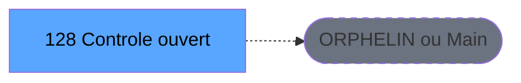

# ADH IDE 128 - Controle ouverture caisse WS

> **Version spec**: 4.0
> **Analyse**: 2026-01-27 23:05
> **Source**: `D:\Data\Migration\XPA\PMS\ADH\Source\Prg_124.xml`
> **Methode**: APEX + PDCA (Auto-generated)

---

<!-- TAB:Fonctionnel -->

## SPECIFICATION FONCTIONNELLE

### 1.1 Objectif metier

**Controle ouverture caisse WS** est le **Web Service de verification d'ouverture** qui **controle les conditions prealables a l'ouverture d'une caisse**.

**Objectif metier** : Fournir via Web Service un controle de coherence avant l'ouverture de caisse. Ce service verifie que les moyens de reglement sont correctement configures, que les devises sont disponibles et que la session precedente a ete correctement cloturee. Il agit comme un garde-fou pour eviter les ouvertures de caisse dans un etat incoherent.

| Element | Description |
|---------|-------------|
| **Qui** | Application cliente (via Web Service) ou systeme de caisse |
| **Quoi** | Verification des prerequis d'ouverture de caisse |
| **Pourquoi** | S'assurer que toutes les conditions sont reunies avant d'autoriser l'ouverture |
| **Declencheur** | Appel Web Service avant la procedure d'ouverture de caisse |
| **Resultat** | Validation OK ou liste des anomalies bloquantes |

### 1.2 Regles metier

| Code | Regle | Condition |
|------|-------|-----------|
| RM-001 | Execution du traitement principal | Conditions d'entree validees |
| RM-002 | Gestion des tables (3 tables) | Acces selon mode (R/W/L) |
| RM-003 | Appels sous-programmes (0 callees) | Selon logique metier |

### 1.3 Flux utilisateur

1. Reception des parametres d'entree (0 params)
2. Initialisation et verification conditions
3. Traitement principal (2 taches)
4. Appels sous-programmes si necessaire
5. Retour resultats

### 1.4 Cas d'erreur

| Erreur | Comportement |
|--------|--------------|
| Conditions non remplies | Abandon avec message |
| Erreur sous-programme | Propagation erreur |

---

<!-- TAB:Technique -->

## SPECIFICATION TECHNIQUE

### 2.1 Identification

| Attribut | Valeur |
|----------|--------|
| **IDE Position** | 128 |
| **Fichier XML** | `Prg_124.xml` |
| **Description** | Controle ouverture caisse WS |
| **Module** | ADH |
| **Public Name** |  |
| **Nombre taches** | 2 |
| **Lignes logique** | 89 |
| **Expressions** | 0 |

### 2.2 Tables

| # | Nom logique | Nom physique | Acces | Usage |
|---|-------------|--------------|-------|-------|
| 139 | moyens_reglement_mor | cafil117_dat | READ | Lecture |
| 141 | devises__________dev | cafil119_dat | LINK | Jointure |
| 232 | gestion_devise_session | caisse_devise | LINK | Jointure |

**Resume**: 3 tables accedees dont **0 en ecriture**

### 2.3 Parametres d'entree (0 parametres)

| Var | Nom | Type | Picture |
|-----|-----|------|---------|
| - | Aucun parametre | - | - |

### 2.4 Algorigramme

### 2.5 Statistiques

| Metrique | Valeur |
|----------|--------|
| **Taches** | 2 |
| **Lignes logique** | 89 |
| **Expressions** | 0 |
| **Parametres** | 0 |
| **Tables accedees** | 3 |
| **Tables en ecriture** | 0 |
| **Callees niveau 1** | 0 |

---

<!-- TAB:Cartographie -->

## CARTOGRAPHIE APPLICATIVE

### 3.1 Chaine d'appels depuis Main

### 3.2 Callers directs

| IDE | Programme | Nb appels |
|-----|-----------|-----------|
| - | ORPHELIN ou Main direct | - |

### 3.3 Callees (3 niveaux)

| Niv | IDE | Programme | Nb appels | Status |
|-----|-----|-----------|-----------|--------|
| - | - | TERMINAL | - | - |

### 3.4 Composants ECF utilises

| ECF | IDE | Public Name | Description |
|-----|-----|-------------|-------------|
| - | - | Aucun composant ECF | - |

### 3.5 Verification orphelin

| Critere | Resultat |
|---------|----------|
| Callers actifs | 0 programmes |
| PublicName | Non defini |
| ECF partage | NON |
| **Conclusion** | **ORPHELIN** - Pas de callers actifs |

---

## NOTES MIGRATION

### Complexite

| Critere | Score | Detail |
|---------|-------|--------|
| Taches | 2 | Simple |
| Tables | 3 | Lecture seule |
| Callees | 0 | Faible couplage |
| **Score global** | **FAIBLE** | - |

### Points d'attention migration

| Point | Solution moderne |
|-------|-----------------|
| Variables globales (VG*) | Service/Repository injection |
| Tables Magic | Entity Framework / Dapper |
| CallTask | Service method calls |
| Forms | React/Angular components |

---

## HISTORIQUE

| Date | Action | Auteur |
|------|--------|--------|
| 2026-01-27 23:05 | **V4.0 APEX/PDCA** - Generation automatique complete | Script |

---

*Specification V4.0 - Auto-generated with APEX/PDCA methodology*

