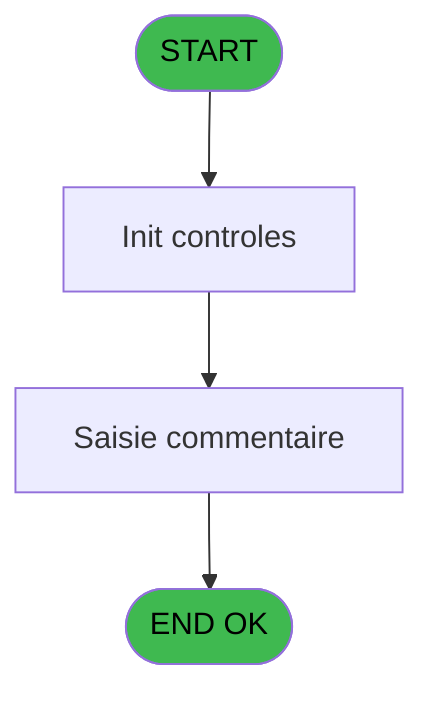
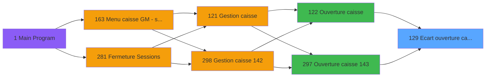
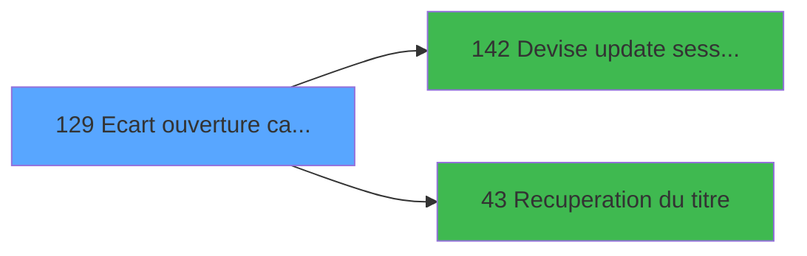

# ADH IDE 129 - Ecart ouverture caisse

> **Analyse**: Phases 1-4 2026-02-08 03:07 -> 03:07 (4s) | Assemblage 03:07
> **Pipeline**: V7.2 Enrichi
> **Structure**: 4 onglets (Resume | Ecrans | Donnees | Connexions)

<!-- TAB:Resume -->

## 1. FICHE D'IDENTITE

| Attribut | Valeur |
|----------|--------|
| Projet | ADH |
| IDE Position | 129 |
| Nom Programme | Ecart ouverture caisse |
| Fichier source | `Prg_129.xml` |
| Dossier IDE | Caisse |
| Taches | 9 (0 ecrans visibles) |
| Tables modifiees | 0 |
| Programmes appeles | 2 |
| Complexite | **BASSE** (score 12/100) |

## 2. DESCRIPTION FONCTIONNELLE

# ADH IDE 129 - Calcul Ecart Ouverture Caisse

**ADH IDE 129** valide et enregistre l'écart monétaire détecté à l'ouverture d'une session de caisse. Le programme reçoit les montants saisis (comptage initial) et les compare aux montants attendus du système (solde précédent de la devise). Il calcule l'écart positif ou négatif et le persiste en base de données dans la table des écarts d'ouverture.

Le flux démarre depuis l'écran d'ouverture de session (**ADH IDE 122** ou **ADH IDE 297**) où l'opérateur saisit le montant physique en caisse. **ADH IDE 129** valide cet écart : si la différence dépasse un seuil d'alerte configurable, le programme peut bloquer l'ouverture ou générer un avertissement. Il appelle ensuite **ADH IDE 142** (Devise update session WS) pour synchroniser le nouvel état de la devise dans la session active, puis **ADH IDE 43** (Récupération du titre) pour récupérer les libellés d'affichage.

Ce programme est critique dans le workflow de caisse car il garantit la traçabilité des différences monétaires et alimente les rapports de contrôle interne (audit trail). Les écarts sont enregistrés avec horodatage et numéro de session pour reconciliation ultérieure.

## 3. BLOCS FONCTIONNELS

## 5. REGLES METIER

*(Aucune regle metier identifiee dans les expressions)*

## 6. CONTEXTE

- **Appele par**: [Ouverture caisse (IDE 122)](ADH-IDE-122.md), [Ouverture caisse 143 (IDE 297)](ADH-IDE-297.md)
- **Appelle**: 2 programmes | **Tables**: 8 (W:0 R:3 L:5) | **Taches**: 9 | **Expressions**: 1

<!-- TAB:Ecrans -->

## 8. ECRANS

*(Programme sans ecran visible)*

## 9. NAVIGATION

### 9.3 Structure hierarchique (0 tache)

| Position | Tache | Type | Dimensions | Bloc |
|----------|-------|------|------------|------|

### 9.4 Algorigramme

> **Legende**: Vert = START/END OK | Rouge = END KO | Bleu = Decisions
> *Algorigramme auto-genere. Utiliser `/algorigramme` pour une synthese metier detaillee.*

<!-- TAB:Donnees -->

## 10. TABLES

### Tables utilisees (8)

| ID | Nom | Description | Type | R | W | L | Usages |
|----|-----|-------------|------|---|---|---|--------|
| 139 | moyens_reglement_mor | Reglements / paiements | DB | R |   |   | 2 |
| 50 | moyens_reglement_mor | Reglements / paiements | DB | R |   |   | 2 |
| 706 | parametre_port_serie |  | DB | R |   |   | 1 |
| 232 | gestion_devise_session | Sessions de caisse | DB |   |   | L | 3 |
| 141 | devises__________dev | Devises / taux de change | DB |   |   | L | 2 |
| 492 | edition_tableau_recap |  | DB |   |   | L | 1 |
| 250 | histo_sessions_caisse_devise | Sessions de caisse | DB |   |   | L | 1 |
| 90 | devises__________dev | Devises / taux de change | DB |   |   | L | 1 |

### Colonnes par table (4 / 3 tables avec colonnes identifiees)

Table 139 - moyens_reglement_mor (R) - 2 usages

| Lettre | Variable | Acces | Type |
|--------|----------|-------|------|
| A | ------------------ compte | R | Alpha |
| B | ------------------ controle | R | Alpha |
| C | RUPTURE_DEV_MOP | R | Alpha |

Table 50 - moyens_reglement_mor (R) - 2 usages

| Lettre | Variable | Acces | Type |
|--------|----------|-------|------|
| A | ------------------ compte | R | Alpha |
| B | ------------------ controle | R | Alpha |

Table 706 - parametre_port_serie (R) - 1 usages

*Table utilisee uniquement en Link ou aucune colonne Real identifiee dans le DataView.*

## 11. VARIABLES

### 11.1 Autres (30)

Variables diverses.

| Lettre | Nom | Type | Usage dans |
|--------|-----|------|-----------|
| EN | Param societe | Alpha | - |
| EO | Param chrono session | Numeric | - |
| EP | Param devise locale | Alpha | - |
| EQ | Param masque montant | Alpha | - |
| ER | Param quand | Alpha | - |
| ES | Param caisse comptee | Numeric | - |
| ET | Param caisse comptee monnaie | Numeric | - |
| EU | Param caisse comptee produits | Numeric | - |
| EV | Param caisse comptee cartes | Numeric | - |
| EW | Param caisse comptee cheques | Numeric | - |
| EX | Param caisse comptee od | Numeric | - |
| EY | Param caisse comptee nb devise | Numeric | - |
| EZ | Param caisse calculee | Numeric | - |
| FA | Param caisse calculee monnaie | Numeric | - |
| FB | Param caisse calculee produits | Numeric | - |
| FC | Param caisse calculee cartes | Numeric | - |
| FD | Param caisse calculee cheques | Numeric | - |
| FE | Param caisse calculee od | Numeric | - |
| FF | Param caisse calculee nb devise | Numeric | - |
| FG | Param montant ecart | Numeric | - |
| FH | Param montant ecart monnaie | Numeric | - |
| FI | Param montant ecart produits | Numeric | - |
| FJ | Param montant ecart cartes | Numeric | - |
| FK | Param montant ecart cheques | Numeric | - |
| FL | Param montant ecart od | Numeric | - |
| FM | Param ecart nb devise | Numeric | - |
| FN | Param commentaire | Alpha | - |
| FO | Param commentaire devise | Alpha | - |
| FP | Param UNI/BI | Alpha | - |
| FQ | Fin | Logical | 1x refs |

Toutes les 30 variables (liste complete)

| Cat | Lettre | Nom Variable | Type |
|-----|--------|--------------|------|
| Autre | **EN** | Param societe | Alpha |
| Autre | **EO** | Param chrono session | Numeric |
| Autre | **EP** | Param devise locale | Alpha |
| Autre | **EQ** | Param masque montant | Alpha |
| Autre | **ER** | Param quand | Alpha |
| Autre | **ES** | Param caisse comptee | Numeric |
| Autre | **ET** | Param caisse comptee monnaie | Numeric |
| Autre | **EU** | Param caisse comptee produits | Numeric |
| Autre | **EV** | Param caisse comptee cartes | Numeric |
| Autre | **EW** | Param caisse comptee cheques | Numeric |
| Autre | **EX** | Param caisse comptee od | Numeric |
| Autre | **EY** | Param caisse comptee nb devise | Numeric |
| Autre | **EZ** | Param caisse calculee | Numeric |
| Autre | **FA** | Param caisse calculee monnaie | Numeric |
| Autre | **FB** | Param caisse calculee produits | Numeric |
| Autre | **FC** | Param caisse calculee cartes | Numeric |
| Autre | **FD** | Param caisse calculee cheques | Numeric |
| Autre | **FE** | Param caisse calculee od | Numeric |
| Autre | **FF** | Param caisse calculee nb devise | Numeric |
| Autre | **FG** | Param montant ecart | Numeric |
| Autre | **FH** | Param montant ecart monnaie | Numeric |
| Autre | **FI** | Param montant ecart produits | Numeric |
| Autre | **FJ** | Param montant ecart cartes | Numeric |
| Autre | **FK** | Param montant ecart cheques | Numeric |
| Autre | **FL** | Param montant ecart od | Numeric |
| Autre | **FM** | Param ecart nb devise | Numeric |
| Autre | **FN** | Param commentaire | Alpha |
| Autre | **FO** | Param commentaire devise | Alpha |
| Autre | **FP** | Param UNI/BI | Alpha |
| Autre | **FQ** | Fin | Logical |

## 12. EXPRESSIONS

**1 / 1 expressions decodees (100%)**

### 12.1 Repartition par type

| Type | Expressions | Regles |
|------|-------------|--------|
| OTHER | 1 | 0 |

### 12.2 Expressions cles par type

#### OTHER (1 expressions)

| Type | IDE | Expression | Regle |
|------|-----|------------|-------|
| OTHER | 1 | `Fin [BD]` | - |

<!-- TAB:Connexions -->

## 13. GRAPHE D'APPELS

### 13.1 Chaine depuis Main (Callers)

Main -> ... -> [Ouverture caisse (IDE 122)](ADH-IDE-122.md) -> **Ecart ouverture caisse (IDE 129)**

Main -> ... -> [Ouverture caisse 143 (IDE 297)](ADH-IDE-297.md) -> **Ecart ouverture caisse (IDE 129)**

### 13.2 Callers

| IDE | Nom Programme | Nb Appels |
|-----|---------------|-----------|
| [122](ADH-IDE-122.md) | Ouverture caisse | 1 |
| [297](ADH-IDE-297.md) | Ouverture caisse 143 | 1 |

### 13.3 Callees (programmes appeles)

### 13.4 Detail Callees avec contexte

| IDE | Nom Programme | Appels | Contexte |
|-----|---------------|--------|----------|
| [142](ADH-IDE-142.md) | Devise update session WS | 2 | Mise a jour donnees |
| [43](ADH-IDE-43.md) | Recuperation du titre | 1 | Recuperation donnees |

## 14. RECOMMANDATIONS MIGRATION

### 14.1 Profil du programme

| Metrique | Valeur | Impact migration |
|----------|--------|-----------------|
| Lignes de logique | 251 | Taille moyenne |
| Expressions | 1 | Peu de logique |
| Tables WRITE | 0 | Impact faible |
| Sous-programmes | 2 | Peu de dependances |
| Ecrans visibles | 0 | Ecran unique ou traitement batch |
| Code desactive | 0% (0 / 251) | Code sain |
| Regles metier | 0 | Pas de regle identifiee |

### 14.2 Plan de migration par bloc

### 14.3 Dependances critiques

| Dependance | Type | Appels | Impact |
|------------|------|--------|--------|
| [Devise update session WS (IDE 142)](ADH-IDE-142.md) | Sous-programme | 2x | Haute - Mise a jour donnees |
| [Recuperation du titre (IDE 43)](ADH-IDE-43.md) | Sous-programme | 1x | Normale - Recuperation donnees |

---
*Spec DETAILED generee par Pipeline V7.2 - 2026-02-08 03:08*
