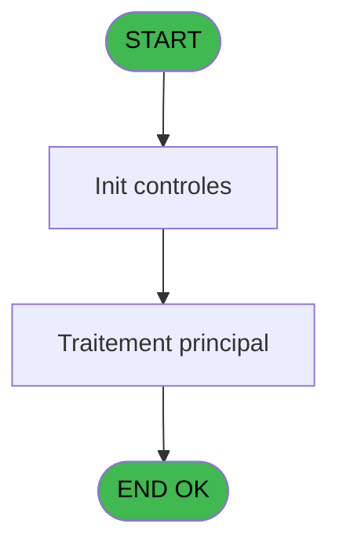

# ADH IDE 13 - calculate week #

> **Analyse**: Phases 1-4 2026-02-07 03:39 -> 03:39 (29s) | Assemblage 03:39
> **Pipeline**: V7.2 Enrichi
> **Structure**: 4 onglets (Resume | Ecrans | Donnees | Connexions)

<!-- TAB:Resume -->

## 1. FICHE D'IDENTITE

| Attribut | Valeur |
|----------|--------|
| Projet | ADH |
| IDE Position | 13 |
| Nom Programme | calculate week # |
| Fichier source | `Prg_13.xml` |
| Dossier IDE | General |
| Taches | 1 (0 ecrans visibles) |
| Tables modifiees | 0 |
| Programmes appeles | 0 |

## 2. DESCRIPTION FONCTIONNELLE

**calculate week #** assure la gestion complete de ce processus, accessible depuis [Catching stats (IDE 12)](ADH-IDE-12.md).

Le flux de traitement s'organise en **1 blocs fonctionnels** :

- **Calcul** (1 tache) : calculs de montants, stocks ou compteurs

## 3. BLOCS FONCTIONNELS

### 3.1 Calcul (1 tache)

Calculs metier : montants, stocks, compteurs.

---

#### 13 - calculate week #

**Role** : Calcul : calculate week #.
**Variables liees** : B (<.week #), F (EOF 1st week), H (weeks between)

## 5. REGLES METIER

*(Aucune regle metier identifiee)*

## 6. CONTEXTE

- **Appele par**: [Catching stats (IDE 12)](ADH-IDE-12.md)
- **Appelle**: 0 programmes | **Tables**: 0 (W:0 R:0 L:0) | **Taches**: 1 | **Expressions**: 7

<!-- TAB:Ecrans -->

## 8. ECRANS

*(Programme sans ecran visible)*

## 9. NAVIGATION

### 9.3 Structure hierarchique (1 tache)

| Position | Tache | Type | Dimensions | Bloc |
|----------|-------|------|------------|------|
| **13.1** | [**calculate week #** (13)](#t1) | MDI | - | Calcul |

### 9.4 Algorigramme

> **Legende**: Vert = START/END OK | Rouge = END KO | Bleu = Decisions
> *Algorigramme auto-genere. Utiliser `/algorigramme` pour une synthese metier detaillee.*

<!-- TAB:Donnees -->

## 10. TABLES

### Tables utilisees (0)

| ID | Nom | Description | Type | R | W | L | Usages |
|----|-----|-------------|------|---|---|---|--------|

### Colonnes par table (0 / 0 tables avec colonnes identifiees)

## 11. VARIABLES

### 11.1 Autres (8)

Variables diverses.

| Lettre | Nom | Type | Usage dans |
|--------|-----|------|-----------|
| A | >.date | Date | 3x refs |
| B | <.week # | Numeric | - |
| C | BOY pdate | Date | 2x refs |
| D | DOW(BOY pdate) | Numeric | 1x refs |
| E | #days from BOY | Numeric | 1x refs |
| F | EOF 1st week | Date | [13](#t1) |
| G | Days between | Numeric | 1x refs |
| H | weeks between | Numeric | 1x refs |

## 12. EXPRESSIONS

**7 / 7 expressions decodees (100%)**

### 12.1 Repartition par type

| Type | Expressions | Regles |
|------|-------------|--------|
| CALCULATION | 1 | 0 |
| CONDITION | 4 | 0 |
| OTHER | 2 | 0 |

### 12.2 Expressions cles par type

#### CALCULATION (1 expressions)

| Type | IDE | Expression | Regle |
|------|-----|------------|-------|
| CALCULATION | 3 | `7-DOW(BOY pdate) [D]` | - |

#### CONDITION (4 expressions)

| Type | IDE | Expression | Regle |
|------|-----|------------|-------|
| CONDITION | 6 | `Fix (IF (Days between [G] MOD 7=0,Days between [G]/7,Days between [G]/7+1),2,0)+1` | - |
| CONDITION | 1 | `BOY (>.date [A])` | - |
| CONDITION | 4 | `BOY (>.date [A])+#days from BOY [E]` | - |
| CONDITION | 5 | `>.date [A]-EOF 1st week [F]` | - |

#### OTHER (2 expressions)

| Type | IDE | Expression | Regle |
|------|-----|------------|-------|
| OTHER | 7 | `weeks between [H]` | - |
| OTHER | 2 | `DOW (BOY pdate [C])` | - |

<!-- TAB:Connexions -->

## 13. GRAPHE D'APPELS

### 13.1 Chaine depuis Main (Callers)

Main -> ... -> [Catching stats (IDE 12)](ADH-IDE-12.md) -> **calculate week # (IDE 13)**

### 13.2 Callers

| IDE | Nom Programme | Nb Appels |
|-----|---------------|-----------|
| [12](ADH-IDE-12.md) | Catching stats | 1 |

### 13.3 Callees (programmes appeles)

### 13.4 Detail Callees avec contexte

| IDE | Nom Programme | Appels | Contexte |
|-----|---------------|--------|----------|
| - | (aucun) | - | - |

## 14. RECOMMANDATIONS MIGRATION

### 14.1 Profil du programme

| Metrique | Valeur | Impact migration |
|----------|--------|-----------------|
| Lignes de logique | 17 | Programme compact |
| Expressions | 7 | Peu de logique |
| Tables WRITE | 0 | Impact faible |
| Sous-programmes | 0 | Peu de dependances |
| Ecrans visibles | 0 | Ecran unique ou traitement batch |
| Code desactive | 0% (0 / 17) | Code sain |
| Regles metier | 0 | Pas de regle identifiee |

### 14.2 Plan de migration par bloc

#### Calcul (1 tache: 0 ecran, 1 traitement)

- **Strategie** : Services de calcul purs (Domain Services).
- Migrer la logique de calcul (stock, compteurs, montants)

### 14.3 Dependances critiques

| Dependance | Type | Appels | Impact |
|------------|------|--------|--------|

---
*Spec DETAILED generee par Pipeline V7.2 - 2026-02-07 03:39*
