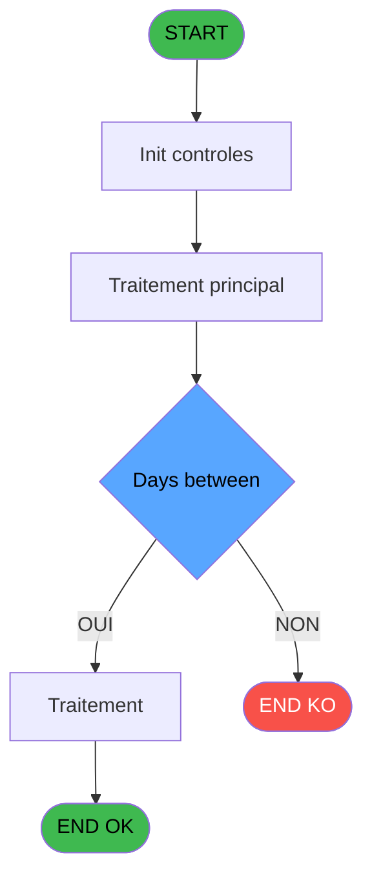

# ADH IDE 13 - calculate week #

> **Analyse**: Phases 1-4 2026-02-07 03:39 -> 01:13 (21h33min) | Assemblage 01:13
> **Pipeline**: V7.2 Enrichi
> **Structure**: 4 onglets (Resume | Ecrans | Donnees | Connexions)

<!-- TAB:Resume -->

## 1. FICHE D'IDENTITE

| Attribut | Valeur |
|----------|--------|
| Projet | ADH |
| IDE Position | 13 |
| Nom Programme | calculate week # |
| Fichier source | `Prg_13.xml` |
| Dossier IDE | General |
| Taches | 1 (0 ecrans visibles) |
| Tables modifiees | 0 |
| Programmes appeles | 0 |
| Complexite | **BASSE** (score 0/100) |

## 2. DESCRIPTION FONCTIONNELLE

**ADH IDE 13** est un utilitaire de calcul pur qui détermine le numéro de semaine ISO 8601 pour une date donnée. Invoqué exclusivement par ADH IDE 12 (Catching stats), ce programme ne contient aucune interaction base de données, aucun écran, et aucun appel à d'autres programmes. Il exécute 7 expressions mathématiques compactes pour convertir une date en numéro de semaine suivant les règles ISO (semaine 1 = première semaine contenant un jeudi, semaines commençant le lundi).

L'algorithme suit une logique séquentielle : extraction du 1er janvier de l'année d'entrée, détermination du jour de la semaine du 1er janvier (MOD 7), calcul de la fin de la première semaine ISO, différenciation en jours entre la date d'entrée et cette limite, conversion en semaines avec arrondi au plafond, puis ajout de 1 pour numéroter à partir de la semaine 1. La formule clé combine modulo (détection de reste) et division entière pour gérer correctement les semaines partielles.

Avec une couverture de 100 % des expressions décodées, zéro accès table, et zéro code désactivé, ce programme représente une fonction stateless idéale pour migration : transformable directement en méthode TypeScript, C# ou Python utilisant les bibliothèques calendaires natives du langage cible.

## 3. BLOCS FONCTIONNELS

### 3.1 Calcul (1 tache)

Calculs metier : montants, stocks, compteurs.

---

#### 13 - calculate week #

**Role** : Calcul : calculate week #.
**Variables liees** : EO (<.week #), ES (EOF 1st week), EU (weeks between)

## 5. REGLES METIER

1 regles identifiees:

### Autres (1 regles)

#### [RM-001] Fix (IF (Days between [G] MOD 7=0,Days between [G]/7,Days between [G]/7+1),2,0)+1

| Element | Detail |
|---------|--------|
| **Condition** | `Fix (IF (Days between [G] MOD 7=0,Days between [G]/7,Days between [G]/7+1),2,0)+1` |
| **Si vrai** | Action conditionnelle |
| **Variables** | ET (Days between) |
| **Expression source** | Expression 6 : `Fix (IF (Days between [G] MOD 7=0,Days between [G]/7,Days be` |
| **Exemple** | Si Fix (IF (Days between [G] MOD 7=0,Days between [G]/7,Days between [G]/7+1),2,0)+1 → Action conditionnelle |

## 6. CONTEXTE

- **Appele par**: [Catching stats (IDE 12)](ADH-IDE-12.md)
- **Appelle**: 0 programmes | **Tables**: 0 (W:0 R:0 L:0) | **Taches**: 1 | **Expressions**: 7

<!-- TAB:Ecrans -->

## 8. ECRANS

*(Programme sans ecran visible)*

## 9. NAVIGATION

### 9.3 Structure hierarchique (1 tache)

| Position | Tache | Type | Dimensions | Bloc |
|----------|-------|------|------------|------|
| **13.1** | [**calculate week #** (13)](#t1) | MDI | - | Calcul |

### 9.4 Algorigramme

> **Legende**: Vert = START/END OK | Rouge = END KO | Bleu = Decisions
> *Algorigramme auto-genere. Utiliser `/algorigramme` pour une synthese metier detaillee.*

<!-- TAB:Donnees -->

## 10. TABLES

### Tables utilisees (0)

| ID | Nom | Description | Type | R | W | L | Usages |
|----|-----|-------------|------|---|---|---|--------|

### Colonnes par table (0 / 0 tables avec colonnes identifiees)

## 11. VARIABLES

### 11.1 Autres (8)

Variables diverses.

| Lettre | Nom | Type | Usage dans |
|--------|-----|------|-----------|
| EN | >.date | Date | 3x refs |
| EO | <.week # | Numeric | - |
| EP | BOY pdate | Date | 2x refs |
| EQ | DOW(BOY pdate) | Numeric | 1x refs |
| ER | #days from BOY | Numeric | 1x refs |
| ES | EOF 1st week | Date | [13](#t1) |
| ET | Days between | Numeric | 1x refs |
| EU | weeks between | Numeric | 1x refs |

## 12. EXPRESSIONS

**7 / 7 expressions decodees (100%)**

### 12.1 Repartition par type

| Type | Expressions | Regles |
|------|-------------|--------|
| CALCULATION | 1 | 0 |
| CONDITION | 4 | 0 |
| OTHER | 2 | 0 |

### 12.2 Expressions cles par type

#### CALCULATION (1 expressions)

| Type | IDE | Expression | Regle |
|------|-----|------------|-------|
| CALCULATION | 3 | `7-DOW(BOY pdate) [D]` | - |

#### CONDITION (4 expressions)

| Type | IDE | Expression | Regle |
|------|-----|------------|-------|
| CONDITION | 6 | `Fix (IF (Days between [G] MOD 7=0,Days between [G]/7,Days between [G]/7+1),2,0)+1` | - |
| CONDITION | 1 | `BOY (>.date [A])` | - |
| CONDITION | 4 | `BOY (>.date [A])+#days from BOY [E]` | - |
| CONDITION | 5 | `>.date [A]-EOF 1st week [F]` | - |

#### OTHER (2 expressions)

| Type | IDE | Expression | Regle |
|------|-----|------------|-------|
| OTHER | 7 | `weeks between [H]` | - |
| OTHER | 2 | `DOW (BOY pdate [C])` | - |

<!-- TAB:Connexions -->

## 13. GRAPHE D'APPELS

### 13.1 Chaine depuis Main (Callers)

Main -> ... -> [Catching stats (IDE 12)](ADH-IDE-12.md) -> **calculate week # (IDE 13)**

### 13.2 Callers

| IDE | Nom Programme | Nb Appels |
|-----|---------------|-----------|
| [12](ADH-IDE-12.md) | Catching stats | 1 |

### 13.3 Callees (programmes appeles)

### 13.4 Detail Callees avec contexte

| IDE | Nom Programme | Appels | Contexte |
|-----|---------------|--------|----------|
| - | (aucun) | - | - |

## 14. RECOMMANDATIONS MIGRATION

### 14.1 Profil du programme

| Metrique | Valeur | Impact migration |
|----------|--------|-----------------|
| Lignes de logique | 17 | Programme compact |
| Expressions | 7 | Peu de logique |
| Tables WRITE | 0 | Impact faible |
| Sous-programmes | 0 | Peu de dependances |
| Ecrans visibles | 0 | Ecran unique ou traitement batch |
| Code desactive | 0% (0 / 17) | Code sain |
| Regles metier | 1 | Quelques regles a preserver |

### 14.2 Plan de migration par bloc

#### Calcul (1 tache: 0 ecran, 1 traitement)

- **Strategie** : Services de calcul purs (Domain Services).
- Migrer la logique de calcul (stock, compteurs, montants)

### 14.3 Dependances critiques

| Dependance | Type | Appels | Impact |
|------------|------|--------|--------|

---
*Spec DETAILED generee par Pipeline V7.2 - 2026-02-08 01:15*
