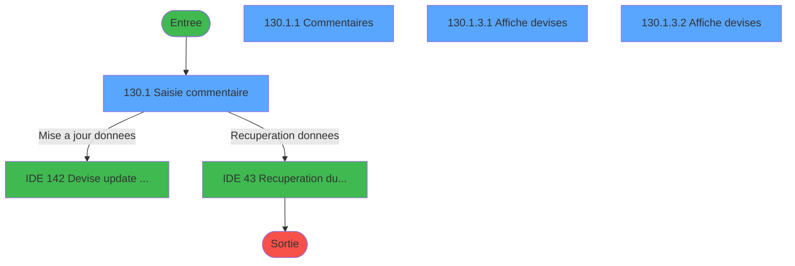
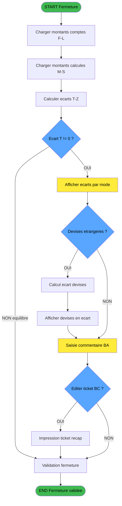
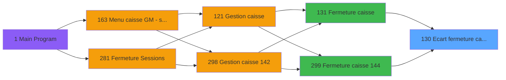
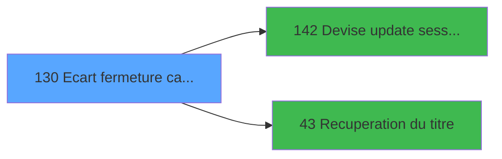

# ADH IDE 130 - Ecart fermeture caisse

> **Analyse**: Phases 1-4 2026-02-07 03:49 -> 03:50 (28s) | Assemblage 03:50
> **Pipeline**: V7.2 Enrichi
> **Structure**: 4 onglets (Resume | Ecrans | Donnees | Connexions)

<!-- TAB:Resume -->

## 1. FICHE D'IDENTITE

| Attribut | Valeur |
|----------|--------|
| Projet | ADH |
| IDE Position | 130 |
| Nom Programme | Ecart fermeture caisse |
| Fichier source | `Prg_130.xml` |
| Dossier IDE | Caisse |
| Taches | 10 (4 ecrans visibles) |
| Tables modifiees | 0 |
| Programmes appeles | 2 |

## 2. DESCRIPTION FONCTIONNELLE

**Ecart fermeture caisse** est le **controleur de caisse** qui compare les montants **comptes physiquement** par l'operateur avec les montants **calcules par le systeme** lors de la fermeture de session.

**Objectif metier** : Detecter et documenter les ecarts entre la caisse reelle et la caisse theorique, permettant d'identifier les erreurs de manipulation ou les anomalies.

**Principe de calcul** :
- **Caisse comptee** (F-L) : Montants saisis manuellement par l'operateur apres comptage physique
- **Caisse calculee** (M-S) : Montants theoriques calcules par le systeme depuis les operations
- **Ecart** (T-Z) : Difference = Comptee - Calculee (positif = excedent, negatif = deficit)

**Modes de paiement analyses** :
| Variable Comptee | Variable Calculee | Variable Ecart | Mode |
|------------------|-------------------|----------------|------|
| F | M | T | **Total general** |
| G | N | U | Monnaie (especes) |
| H | O | V | Produits |
| I | P | W | Cartes bancaires |
| J | Q | X | Cheques |
| K | R | Y | Operations diverses (OD) |
| L | S | Z | Nombre de devises |

Appele depuis [Fermeture caisse (IDE 131)](ADH-IDE-131.md), [Fermeture caisse 144 (IDE 299)](ADH-IDE-299.md).

Le flux de traitement s'organise en **5 blocs fonctionnels** :

- **Consultation** (3 taches) : ecrans de recherche, selection et consultation
- **Calcul** (3 taches) : calculs de montants, stocks ou compteurs
- **Traitement** (2 taches) : traitements metier divers
- **Impression** (1 tache) : generation de tickets et documents
- **Saisie** (1 tache) : ecrans de saisie utilisateur (formulaires, champs, donnees)

Detail : phases du traitement

#### Phase 1 : Traitement (2 taches)

- **130** - Ecart fermeture caisse
- **130.1.1** - Commentaires **[[ECRAN]](#ecran-t3)**

Delegue a : [Devise update session WS (IDE 142)](ADH-IDE-142.md), [Recuperation du titre (IDE 43)](ADH-IDE-43.md)

#### Phase 2 : Saisie (1 tache)

- **130.1** - Saisie commentaire **[[ECRAN]](#ecran-t2)**

#### Phase 3 : Calcul (3 taches)

- **130.1.2** - Calcul ecart sur devise
- **130.1.2.1** - Calcul ecart sur devise
- **130.1.2.2** - Calcul ecart sur devise

#### Phase 4 : Consultation (3 taches)

- **130.1.3** - Affiche devises **[[ECRAN]](#ecran-t7)**
- **130.1.3.1** - Affiche devises **[[ECRAN]](#ecran-t8)**
- **130.1.3.2** - Affiche devises **[[ECRAN]](#ecran-t9)**

Delegue a : [Recuperation du titre (IDE 43)](ADH-IDE-43.md)

#### Phase 5 : Impression (1 tache)

- **130.1.4** - Ticket

## 3. BLOCS FONCTIONNELS

### 3.1 Traitement (2 taches)

Traitements internes.

---

#### 130 - Ecart fermeture caisse

**Role** : Traitement : Ecart fermeture caisse.
**Variables liees** : F (Param caisse comptee), G (Param caisse comptee monnaie), H (Param caisse comptee produits), I (Param caisse comptee cartes), J (Param caisse comptee cheques)
**Delegue a** : [Devise update session WS (IDE 142)](ADH-IDE-142.md), [Recuperation du titre (IDE 43)](ADH-IDE-43.md)

---

#### 130.1.1 - Commentaires [[ECRAN]](#ecran-t3)

**Role** : Traitement : Commentaires.
**Ecran** : 480 x 0 DLU (MDI) | [Voir mockup](#ecran-t3)
**Delegue a** : [Devise update session WS (IDE 142)](ADH-IDE-142.md), [Recuperation du titre (IDE 43)](ADH-IDE-43.md)

### 3.2 Saisie (1 tache)

L'operateur saisit les donnees de la transaction via 1 ecran (Saisie commentaire).

---

#### 130.1 - Saisie commentaire [[ECRAN]](#ecran-t2)

**Role** : Saisie des donnees : Saisie commentaire.
**Ecran** : 1000 x 240 DLU (MDI) | [Voir mockup](#ecran-t2)
**Variables liees** : BA (Param commentaire), BB (Param commentaire devise)

### 3.3 Calcul (3 taches)

Calculs metier : montants, stocks, compteurs.

---

#### 130.1.2 - Calcul ecart sur devise

**Role** : Calcul : Calcul ecart sur devise.
**Variables liees** : C (Param devise locale), L (Param caisse comptee nb devise), M (Param caisse calculee), N (Param caisse calculee monnaie), O (Param caisse calculee produits)

---

#### 130.1.2.1 - Calcul ecart sur devise

**Role** : Calcul : Calcul ecart sur devise.
**Variables liees** : C (Param devise locale), L (Param caisse comptee nb devise), M (Param caisse calculee), N (Param caisse calculee monnaie), O (Param caisse calculee produits)

---

#### 130.1.2.2 - Calcul ecart sur devise

**Role** : Calcul : Calcul ecart sur devise.
**Variables liees** : C (Param devise locale), L (Param caisse comptee nb devise), M (Param caisse calculee), N (Param caisse calculee monnaie), O (Param caisse calculee produits)

### 3.4 Consultation (3 taches)

Ecrans de recherche et consultation.

---

#### 130.1.3 - Affiche devises [[ECRAN]](#ecran-t7)

**Role** : Reinitialisation : Affiche devises.
**Ecran** : 501 x 240 DLU (MDI) | [Voir mockup](#ecran-t7)

---

#### 130.1.3.1 - Affiche devises [[ECRAN]](#ecran-t8)

**Role** : Reinitialisation : Affiche devises.
**Ecran** : 1002 x 240 DLU (MDI) | [Voir mockup](#ecran-t8)

---

#### 130.1.3.2 - Affiche devises [[ECRAN]](#ecran-t9)

**Role** : Reinitialisation : Affiche devises.
**Ecran** : 1002 x 240 DLU (MDI) | [Voir mockup](#ecran-t9)

### 3.5 Impression (1 tache)

Generation des documents et tickets.

---

#### 130.1.4 - Ticket

**Role** : Generation du document : Ticket.
**Variables liees** : BC (Param editer ticket recap)

## 5. REGLES METIER

### 5.1 Calcul des ecarts

| Regle | Formule | Description |
|-------|---------|-------------|
| **RM-130-01** | `T = F - M` | Ecart total = Total compte - Total calcule |
| **RM-130-02** | `U = G - N` | Ecart monnaie = Monnaie comptee - Monnaie calculee |
| **RM-130-03** | `V = H - O` | Ecart produits = Produits comptes - Produits calcules |
| **RM-130-04** | `W = I - P` | Ecart cartes = Cartes comptees - Cartes calculees |
| **RM-130-05** | `X = J - Q` | Ecart cheques = Cheques comptes - Cheques calcules |
| **RM-130-06** | `Y = K - R` | Ecart OD = OD comptes - OD calcules |
| **RM-130-07** | `Z = L - S` | Ecart nb devises = Nb devises compte - Nb devises calcule |

### 5.2 Interpretation des ecarts

| Valeur ecart | Signification | Action |
|--------------|---------------|--------|
| `= 0` | Caisse equilibree | OK - Pas d'action |
| `> 0` | Excedent de caisse | Investiguer source du surplus |
| `< 0` | Deficit de caisse | Investiguer manque (erreur, vol, oubli) |

### 5.3 Commentaires obligatoires

- **BA** : Commentaire general sur les ecarts (obligatoire si ecart > 0)
- **BB** : Commentaire specifique aux ecarts devises etrangeres
- **BC** : Flag pour editer le ticket recapitulatif

## 6. CONTEXTE

- **Appele par**: [Fermeture caisse (IDE 131)](ADH-IDE-131.md), [Fermeture caisse 144 (IDE 299)](ADH-IDE-299.md)
- **Appelle**: 2 programmes | **Tables**: 7 (W:0 R:3 L:4) | **Taches**: 10 | **Expressions**: 2

<!-- TAB:Ecrans -->

## 8. ECRANS

### 8.1 Forms visibles (4 / 10)

| # | Position | Tache | Nom | Type | Largeur | Hauteur | Bloc |
|---|----------|-------|-----|------|---------|---------|------|
| 1 | 130.1 | 130.1 | Saisie commentaire | MDI | 1000 | 240 | Saisie |
| 2 | 130.1.1 | 130.1.1 | Commentaires | MDI | 480 | 0 | Traitement |
| 3 | 130.1.3.1 | 130.1.3.1 | Affiche devises | MDI | 1002 | 240 | Consultation |
| 4 | 130.1.3.2 | 130.1.3.2 | Affiche devises | MDI | 1002 | 240 | Consultation |

### 8.2 Mockups Ecrans

---

#### 130.1 - Saisie commentaire
**Tache** : [130.1](#t2) | **Type** : MDI | **Dimensions** : 1000 x 240 DLU
**Bloc** : Saisie | **Titre IDE** : Saisie commentaire

<!-- FORM-DATA:
{
    "width":  1000,
    "vFactor":  8,
    "type":  "MDI",
    "hFactor":  8,
    "controls":  [
                     {
                         "x":  0,
                         "type":  "label",
                         "var":  "",
                         "y":  0,
                         "w":  1000,
                         "fmt":  "",
                         "name":  "",
                         "h":  18,
                         "color":  "",
                         "text":  "",
                         "parent":  null
                     },
                     {
                         "x":  141,
                         "type":  "label",
                         "var":  "",
                         "y":  28,
                         "w":  851,
                         "fmt":  "",
                         "name":  "",
                         "h":  18,
                         "color":  "142",
                         "text":  "Validation des ecarts (fermeture caisse)",
                         "parent":  null
                     },
                     {
                         "x":  141,
                         "type":  "label",
                         "var":  "",
                         "y":  49,
                         "w":  851,
                         "fmt":  "",
                         "name":  "",
                         "h":  126,
                         "color":  "",
                         "text":  "",
                         "parent":  null
                     },
                     {
                         "x":  148,
                         "type":  "label",
                         "var":  "",
                         "y":  55,
                         "w":  112,
                         "fmt":  "",
                         "name":  "",
                         "h":  12,
                         "color":  "7",
                         "text":  "Monnaie",
                         "parent":  null
                     },
                     {
                         "x":  267,
                         "type":  "label",
                         "var":  "",
                         "y":  55,
                         "w":  112,
                         "fmt":  "",
                         "name":  "",
                         "h":  12,
                         "color":  "7",
                         "text":  "Cartes",
                         "parent":  null
                     },
                     {
                         "x":  385,
                         "type":  "label",
                         "var":  "",
                         "y":  55,
                         "w":  112,
                         "fmt":  "",
                         "name":  "",
                         "h":  12,
                         "color":  "7",
                         "text":  "Chèques",
                         "parent":  null
                     },
                     {
                         "x":  504,
                         "type":  "label",
                         "var":  "",
                         "y":  55,
                         "w":  112,
                         "fmt":  "",
                         "name":  "",
                         "h":  12,
                         "color":  "7",
                         "text":  "Produits",
                         "parent":  null
                     },
                     {
                         "x":  625,
                         "type":  "label",
                         "var":  "",
                         "y":  55,
                         "w":  144,
                         "fmt":  "",
                         "name":  "",
                         "h":  12,
                         "color":  "7",
                         "text":  "TOTAL",
                         "parent":  null
                     },
                     {
                         "x":  769,
                         "type":  "label",
                         "var":  "",
                         "y":  55,
                         "w":  112,
                         "fmt":  "",
                         "name":  "",
                         "h":  12,
                         "color":  "",
                         "text":  "OD",
                         "parent":  null
                     },
                     {
                         "x":  888,
                         "type":  "label",
                         "var":  "",
                         "y":  55,
                         "w":  99,
                         "fmt":  "",
                         "name":  "",
                         "h":  12,
                         "color":  "",
                         "text":  "Devises",
                         "parent":  null
                     },
                     {
                         "x":  5,
                         "type":  "label",
                         "var":  "",
                         "y":  80,
                         "w":  127,
                         "fmt":  "",
                         "name":  "",
                         "h":  10,
                         "color":  "148",
                         "text":  "Caisse comptée",
                         "parent":  null
                     },
                     {
                         "x":  5,
                         "type":  "label",
                         "var":  "",
                         "y":  102,
                         "w":  127,
                         "fmt":  "",
                         "name":  "",
                         "h":  10,
                         "color":  "148",
                         "text":  "Caisse contrôlée",
                         "parent":  null
                     },
                     {
                         "x":  5,
                         "type":  "label",
                         "var":  "",
                         "y":  124,
                         "w":  127,
                         "fmt":  "",
                         "name":  "",
                         "h":  10,
                         "color":  "144",
                         "text":  "Montant écart",
                         "parent":  null
                     },
                     {
                         "x":  148,
                         "type":  "label",
                         "var":  "",
                         "y":  153,
                         "w":  112,
                         "fmt":  "",
                         "name":  "",
                         "h":  10,
                         "color":  "",
                         "text":  "Commentaire",
                         "parent":  null
                     },
                     {
                         "x":  148,
                         "type":  "label",
                         "var":  "",
                         "y":  187,
                         "w":  112,
                         "fmt":  "",
                         "name":  "",
                         "h":  10,
                         "color":  "",
                         "text":  "Devises",
                         "parent":  null
                     },
                     {
                         "x":  0,
                         "type":  "label",
                         "var":  "",
                         "y":  216,
                         "w":  1000,
                         "fmt":  "",
                         "name":  "",
                         "h":  24,
                         "color":  "",
                         "text":  "",
                         "parent":  null
                     },
                     {
                         "x":  437,
                         "type":  "label",
                         "var":  "",
                         "y":  224,
                         "w":  128,
                         "fmt":  "",
                         "name":  "",
                         "h":  10,
                         "color":  "",
                         "text":  "Monnaie locale",
                         "parent":  42
                     },
                     {
                         "x":  269,
                         "type":  "edit",
                         "var":  "",
                         "y":  153,
                         "w":  715,
                         "fmt":  "",
                         "name":  "Commentaire",
                         "h":  10,
                         "color":  "6",
                         "text":  "",
                         "parent":  null
                     },
                     {
                         "x":  269,
                         "type":  "edit",
                         "var":  "",
                         "y":  187,
                         "w":  715,
                         "fmt":  "",
                         "name":  "Commentaire ecart devise",
                         "h":  10,
                         "color":  "6",
                         "text":  "",
                         "parent":  null
                     },
                     {
                         "x":  2,
                         "type":  "edit",
                         "var":  "",
                         "y":  5,
                         "w":  267,
                         "fmt":  "30",
                         "name":  "",
                         "h":  8,
                         "color":  "",
                         "text":  "",
                         "parent":  null
                     },
                     {
                         "x":  740,
                         "type":  "edit",
                         "var":  "",
                         "y":  5,
                         "w":  248,
                         "fmt":  "WWW  DD MMM YYYYT",
                         "name":  "",
                         "h":  8,
                         "color":  "",
                         "text":  "",
                         "parent":  null
                     },
                     {
                         "x":  5,
                         "type":  "image",
                         "var":  "",
                         "y":  28,
                         "w":  127,
                         "fmt":  "",
                         "name":  "",
                         "h":  47,
                         "color":  "",
                         "text":  "",
                         "parent":  null
                     },
                     {
                         "x":  148,
                         "type":  "edit",
                         "var":  "",
                         "y":  80,
                         "w":  112,
                         "fmt":  "N## ### ### ###.###Z",
                         "name":  "",
                         "h":  10,
                         "color":  "7",
                         "text":  "",
                         "parent":  null
                     },
                     {
                         "x":  267,
                         "type":  "edit",
                         "var":  "",
                         "y":  80,
                         "w":  112,
                         "fmt":  "N## ### ### ###.###Z",
                         "name":  "",
                         "h":  10,
                         "color":  "7",
                         "text":  "",
                         "parent":  null
                     },
                     {
                         "x":  385,
                         "type":  "edit",
                         "var":  "",
                         "y":  80,
                         "w":  112,
                         "fmt":  "N## ### ### ###.###Z",
                         "name":  "",
                         "h":  10,
                         "color":  "7",
                         "text":  "",
                         "parent":  null
                     },
                     {
                         "x":  504,
                         "type":  "edit",
                         "var":  "",
                         "y":  80,
                         "w":  112,
                         "fmt":  "N## ### ### ###.###Z",
                         "name":  "",
                         "h":  10,
                         "color":  "7",
                         "text":  "",
                         "parent":  null
                     },
                     {
                         "x":  625,
                         "type":  "edit",
                         "var":  "",
                         "y":  80,
                         "w":  144,
                         "fmt":  "N## ### ### ###.###Z",
                         "name":  "",
                         "h":  10,
                         "color":  "7",
                         "text":  "",
                         "parent":  null
                     },
                     {
                         "x":  769,
                         "type":  "edit",
                         "var":  "",
                         "y":  80,
                         "w":  112,
                         "fmt":  "N## ### ### ###.###Z",
                         "name":  "",
                         "h":  10,
                         "color":  "42",
                         "text":  "",
                         "parent":  null
                     },
                     {
                         "x":  888,
                         "type":  "edit",
                         "var":  "",
                         "y":  80,
                         "w":  99,
                         "fmt":  "6Z",
                         "name":  "",
                         "h":  10,
                         "color":  "1",
                         "text":  "",
                         "parent":  null
                     },
                     {
                         "x":  148,
                         "type":  "edit",
                         "var":  "",
                         "y":  102,
                         "w":  112,
                         "fmt":  "N## ### ### ###.###Z",
                         "name":  "",
                         "h":  10,
                         "color":  "7",
                         "text":  "",
                         "parent":  null
                     },
                     {
                         "x":  267,
                         "type":  "edit",
                         "var":  "",
                         "y":  102,
                         "w":  112,
                         "fmt":  "N## ### ### ###.###Z",
                         "name":  "",
                         "h":  10,
                         "color":  "7",
                         "text":  "",
                         "parent":  null
                     },
                     {
                         "x":  385,
                         "type":  "edit",
                         "var":  "",
                         "y":  102,
                         "w":  112,
                         "fmt":  "N## ### ### ###.###Z",
                         "name":  "",
                         "h":  10,
                         "color":  "7",
                         "text":  "",
                         "parent":  null
                     },
                     {
                         "x":  504,
                         "type":  "edit",
                         "var":  "",
                         "y":  102,
                         "w":  112,
                         "fmt":  "N## ### ### ###.###Z",
                         "name":  "",
                         "h":  10,
                         "color":  "7",
                         "text":  "",
                         "parent":  null
                     },
                     {
                         "x":  625,
                         "type":  "edit",
                         "var":  "",
                         "y":  102,
                         "w":  144,
                         "fmt":  "N## ### ### ###.###Z",
                         "name":  "",
                         "h":  10,
                         "color":  "7",
                         "text":  "",
                         "parent":  null
                     },
                     {
                         "x":  769,
                         "type":  "edit",
                         "var":  "",
                         "y":  102,
                         "w":  112,
                         "fmt":  "N## ### ### ###.###Z",
                         "name":  "",
                         "h":  10,
                         "color":  "42",
                         "text":  "",
                         "parent":  null
                     },
                     {
                         "x":  888,
                         "type":  "edit",
                         "var":  "",
                         "y":  102,
                         "w":  99,
                         "fmt":  "6Z",
                         "name":  "",
                         "h":  10,
                         "color":  "1",
                         "text":  "",
                         "parent":  null
                     },
                     {
                         "x":  148,
                         "type":  "edit",
                         "var":  "",
                         "y":  124,
                         "w":  112,
                         "fmt":  "N## ### ### ###.###Z",
                         "name":  "",
                         "h":  10,
                         "color":  "166",
                         "text":  "",
                         "parent":  null
                     },
                     {
                         "x":  267,
                         "type":  "edit",
                         "var":  "",
                         "y":  124,
                         "w":  112,
                         "fmt":  "N## ### ### ###.###Z",
                         "name":  "",
                         "h":  10,
                         "color":  "166",
                         "text":  "",
                         "parent":  null
                     },
                     {
                         "x":  385,
                         "type":  "edit",
                         "var":  "",
                         "y":  124,
                         "w":  112,
                         "fmt":  "N## ### ### ###.###Z",
                         "name":  "",
                         "h":  10,
                         "color":  "166",
                         "text":  "",
                         "parent":  null
                     },
                     {
                         "x":  504,
                         "type":  "edit",
                         "var":  "",
                         "y":  124,
                         "w":  112,
                         "fmt":  "N## ### ### ###.###Z",
                         "name":  "",
                         "h":  10,
                         "color":  "166",
                         "text":  "",
                         "parent":  null
                     },
                     {
                         "x":  625,
                         "type":  "edit",
                         "var":  "",
                         "y":  124,
                         "w":  144,
                         "fmt":  "N## ### ### ###.###Z",
                         "name":  "",
                         "h":  10,
                         "color":  "166",
                         "text":  "",
                         "parent":  null
                     },
                     {
                         "x":  769,
                         "type":  "edit",
                         "var":  "",
                         "y":  124,
                         "w":  112,
                         "fmt":  "N## ### ### ###.###Z",
                         "name":  "",
                         "h":  10,
                         "color":  "143",
                         "text":  "",
                         "parent":  null
                     },
                     {
                         "x":  888,
                         "type":  "edit",
                         "var":  "",
                         "y":  124,
                         "w":  99,
                         "fmt":  "6Z",
                         "name":  "",
                         "h":  10,
                         "color":  "1",
                         "text":  "",
                         "parent":  null
                     },
                     {
                         "x":  12,
                         "type":  "button",
                         "var":  "",
                         "y":  219,
                         "w":  154,
                         "fmt":  "A\u0026bandon",
                         "name":  "",
                         "h":  18,
                         "color":  "",
                         "text":  "",
                         "parent":  null
                     },
                     {
                         "x":  184,
                         "type":  "button",
                         "var":  "",
                         "y":  219,
                         "w":  240,
                         "fmt":  "\u0026Ecart devises",
                         "name":  "",
                         "h":  18,
                         "color":  "",
                         "text":  "",
                         "parent":  null
                     },
                     {
                         "x":  637,
                         "type":  "button",
                         "var":  "",
                         "y":  219,
                         "w":  154,
                         "fmt":  "\u0026Ticket",
                         "name":  "",
                         "h":  18,
                         "color":  "",
                         "text":  "",
                         "parent":  null
                     },
                     {
                         "x":  834,
                         "type":  "button",
                         "var":  "",
                         "y":  219,
                         "w":  154,
                         "fmt":  "\u0026Validation",
                         "name":  "",
                         "h":  18,
                         "color":  "",
                         "text":  "",
                         "parent":  null
                     },
                     {
                         "x":  583,
                         "type":  "edit",
                         "var":  "",
                         "y":  224,
                         "w":  42,
                         "fmt":  "",
                         "name":  "",
                         "h":  10,
                         "color":  "7",
                         "text":  "",
                         "parent":  42
                     }
                 ],
    "taskId":  "130.1",
    "height":  240
}
-->

<strong>Champs : 26 champs</strong>

| Pos (x,y) | Nom | Variable | Type |
|-----------|-----|----------|------|
| 269,153 | Commentaire | - | edit |
| 269,187 | Commentaire ecart devise | - | edit |
| 2,5 | 30 | - | edit |
| 740,5 | WWW  DD MMM YYYYT | - | edit |
| 148,80 | N## ### ### ###.###Z | - | edit |
| 267,80 | N## ### ### ###.###Z | - | edit |
| 385,80 | N## ### ### ###.###Z | - | edit |
| 504,80 | N## ### ### ###.###Z | - | edit |
| 625,80 | N## ### ### ###.###Z | - | edit |
| 769,80 | N## ### ### ###.###Z | - | edit |
| 888,80 | 6Z | - | edit |
| 148,102 | N## ### ### ###.###Z | - | edit |
| 267,102 | N## ### ### ###.###Z | - | edit |
| 385,102 | N## ### ### ###.###Z | - | edit |
| 504,102 | N## ### ### ###.###Z | - | edit |
| 625,102 | N## ### ### ###.###Z | - | edit |
| 769,102 | N## ### ### ###.###Z | - | edit |
| 888,102 | 6Z | - | edit |
| 148,124 | N## ### ### ###.###Z | - | edit |
| 267,124 | N## ### ### ###.###Z | - | edit |
| 385,124 | N## ### ### ###.###Z | - | edit |
| 504,124 | N## ### ### ###.###Z | - | edit |
| 625,124 | N## ### ### ###.###Z | - | edit |
| 769,124 | N## ### ### ###.###Z | - | edit |
| 888,124 | 6Z | - | edit |
| 583,224 | (sans nom) | - | edit |

<strong>Boutons : 4 boutons</strong>

| Bouton | Pos (x,y) | Action |
|--------|-----------|--------|
| Abandon | 12,219 | Annule et retour au menu |
| Ecart devises | 184,219 | Bouton fonctionnel |
| Ticket | 637,219 | Lance l'impression |
| Validation | 834,219 | Valide la saisie et enregistre |

---

#### 130.1.1 - Commentaires
**Tache** : [130.1.1](#t3) | **Type** : MDI | **Dimensions** : 480 x 0 DLU
**Bloc** : Traitement | **Titre IDE** : Commentaires

<!-- FORM-DATA:
{
    "width":  480,
    "vFactor":  8,
    "type":  "MDI",
    "hFactor":  8,
    "controls":  [
                     {
                         "x":  3,
                         "type":  "label",
                         "var":  "",
                         "y":  181,
                         "w":  474,
                         "fmt":  "",
                         "name":  "",
                         "h":  19,
                         "color":  "",
                         "text":  "",
                         "parent":  null
                     },
                     {
                         "x":  99,
                         "type":  "table",
                         "var":  "",
                         "name":  "",
                         "titleH":  12,
                         "color":  "196",
                         "w":  283,
                         "y":  10,
                         "fmt":  "",
                         "parent":  null,
                         "text":  "",
                         "rowH":  14,
                         "h":  142,
                         "cols":  [
                                      {
                                          "title":  "Libellé",
                                          "layer":  1,
                                          "w":  250
                                      }
                                  ],
                         "rows":  1
                     },
                     {
                         "x":  106,
                         "type":  "edit",
                         "var":  "",
                         "y":  24,
                         "w":  240,
                         "fmt":  "",
                         "name":  "",
                         "h":  10,
                         "color":  "196",
                         "text":  "",
                         "parent":  3
                     },
                     {
                         "x":  106,
                         "type":  "edit",
                         "var":  "",
                         "y":  24,
                         "w":  240,
                         "fmt":  "",
                         "name":  "",
                         "h":  10,
                         "color":  "196",
                         "text":  "",
                         "parent":  3
                     },
                     {
                         "x":  13,
                         "type":  "button",
                         "var":  "",
                         "y":  184,
                         "w":  144,
                         "fmt":  "\u0026Selectionner",
                         "name":  "",
                         "h":  14,
                         "color":  "",
                         "text":  "",
                         "parent":  null
                     },
                     {
                         "x":  325,
                         "type":  "button",
                         "var":  "",
                         "y":  184,
                         "w":  144,
                         "fmt":  "\u0026Quitter",
                         "name":  "",
                         "h":  14,
                         "color":  "",
                         "text":  "",
                         "parent":  null
                     },
                     {
                         "x":  211,
                         "type":  "image",
                         "var":  "",
                         "y":  158,
                         "w":  58,
                         "fmt":  "",
                         "name":  "",
                         "h":  18,
                         "color":  "",
                         "text":  "",
                         "parent":  null
                     }
                 ],
    "taskId":  "130.1.1",
    "height":  0
}
-->

<strong>Champs : 2 champs</strong>

| Pos (x,y) | Nom | Variable | Type |
|-----------|-----|----------|------|
| 106,24 | (sans nom) | - | edit |
| 106,24 | (sans nom) | - | edit |

<strong>Boutons : 2 boutons</strong>

| Bouton | Pos (x,y) | Action |
|--------|-----------|--------|
| Selectionner | 13,184 | Ouvre la selection |
| Quitter | 325,184 | Quitte le programme |

---

#### 130.1.3.1 - Affiche devises
**Tache** : [130.1.3.1](#t8) | **Type** : MDI | **Dimensions** : 1002 x 240 DLU
**Bloc** : Consultation | **Titre IDE** : Affiche devises

<!-- FORM-DATA:
{
    "width":  1002,
    "vFactor":  8,
    "type":  "MDI",
    "hFactor":  8,
    "controls":  [
                     {
                         "x":  0,
                         "type":  "label",
                         "var":  "",
                         "y":  1,
                         "w":  1000,
                         "fmt":  "",
                         "name":  "",
                         "h":  18,
                         "color":  "",
                         "text":  "",
                         "parent":  null
                     },
                     {
                         "x":  0,
                         "type":  "label",
                         "var":  "",
                         "y":  214,
                         "w":  1000,
                         "fmt":  "",
                         "name":  "",
                         "h":  24,
                         "color":  "",
                         "text":  "",
                         "parent":  null
                     },
                     {
                         "x":  437,
                         "type":  "label",
                         "var":  "",
                         "y":  222,
                         "w":  80,
                         "fmt":  "",
                         "name":  "",
                         "h":  10,
                         "color":  "",
                         "text":  "Monnaie",
                         "parent":  4
                     },
                     {
                         "x":  26,
                         "type":  "label",
                         "var":  "",
                         "y":  223,
                         "w":  154,
                         "fmt":  "",
                         "name":  "",
                         "h":  10,
                         "color":  "",
                         "text":  "Devises en écart",
                         "parent":  null
                     },
                     {
                         "x":  176,
                         "type":  "table",
                         "var":  "",
                         "name":  "",
                         "titleH":  12,
                         "color":  "110",
                         "w":  649,
                         "y":  23,
                         "fmt":  "",
                         "parent":  null,
                         "text":  "",
                         "rowH":  10,
                         "h":  190,
                         "cols":  [
                                      {
                                          "title":  "Devise",
                                          "layer":  1,
                                          "w":  152
                                      },
                                      {
                                          "title":  "Mode paiement",
                                          "layer":  2,
                                          "w":  154
                                      },
                                      {
                                          "title":  "Quantité contrôlée",
                                          "layer":  3,
                                          "w":  151
                                      },
                                      {
                                          "title":  "Quantité Comptée",
                                          "layer":  4,
                                          "w":  159
                                      }
                                  ],
                         "rows":  4
                     },
                     {
                         "x":  740,
                         "type":  "edit",
                         "var":  "",
                         "y":  6,
                         "w":  248,
                         "fmt":  "WWW  DD MMM YYYYT",
                         "name":  "",
                         "h":  8,
                         "color":  "",
                         "text":  "",
                         "parent":  null
                     },
                     {
                         "x":  522,
                         "type":  "edit",
                         "var":  "",
                         "y":  222,
                         "w":  42,
                         "fmt":  "",
                         "name":  "",
                         "h":  10,
                         "color":  "7",
                         "text":  "",
                         "parent":  4
                     },
                     {
                         "x":  185,
                         "type":  "edit",
                         "var":  "",
                         "y":  223,
                         "w":  82,
                         "fmt":  "",
                         "name":  "",
                         "h":  10,
                         "color":  "6",
                         "text":  "",
                         "parent":  null
                     },
                     {
                         "x":  834,
                         "type":  "button",
                         "var":  "",
                         "y":  217,
                         "w":  154,
                         "fmt":  "\u0026Quitter",
                         "name":  "",
                         "h":  18,
                         "color":  "",
                         "text":  "",
                         "parent":  null
                     },
                     {
                         "x":  2,
                         "type":  "edit",
                         "var":  "",
                         "y":  6,
                         "w":  267,
                         "fmt":  "30",
                         "name":  "",
                         "h":  8,
                         "color":  "",
                         "text":  "",
                         "parent":  null
                     },
                     {
                         "x":  182,
                         "type":  "edit",
                         "var":  "",
                         "y":  37,
                         "w":  140,
                         "fmt":  "",
                         "name":  "mor_devise",
                         "h":  8,
                         "color":  "110",
                         "text":  "",
                         "parent":  9
                     },
                     {
                         "x":  378,
                         "type":  "edit",
                         "var":  "",
                         "y":  37,
                         "w":  59,
                         "fmt":  "",
                         "name":  "mor_mop",
                         "h":  8,
                         "color":  "110",
                         "text":  "",
                         "parent":  9
                     },
                     {
                         "x":  488,
                         "type":  "edit",
                         "var":  "",
                         "y":  37,
                         "w":  142,
                         "fmt":  "",
                         "name":  "quantite",
                         "h":  8,
                         "color":  "110",
                         "text":  "",
                         "parent":  9
                     },
                     {
                         "x":  642,
                         "type":  "edit",
                         "var":  "",
                         "y":  37,
                         "w":  142,
                         "fmt":  "",
                         "name":  "quantite_0001",
                         "h":  8,
                         "color":  "110",
                         "text":  "",
                         "parent":  9
                     }
                 ],
    "taskId":  "130.1.3.1",
    "height":  240
}
-->

<strong>Champs : 8 champs</strong>

| Pos (x,y) | Nom | Variable | Type |
|-----------|-----|----------|------|
| 740,6 | WWW  DD MMM YYYYT | - | edit |
| 522,222 | (sans nom) | - | edit |
| 185,223 | (sans nom) | - | edit |
| 2,6 | 30 | - | edit |
| 182,37 | mor_devise | - | edit |
| 378,37 | mor_mop | - | edit |
| 488,37 | quantite | - | edit |
| 642,37 | quantite_0001 | - | edit |

<strong>Boutons : 1 boutons</strong>

| Bouton | Pos (x,y) | Action |
|--------|-----------|--------|
| Quitter | 834,217 | Quitte le programme |

---

#### 130.1.3.2 - Affiche devises
**Tache** : [130.1.3.2](#t9) | **Type** : MDI | **Dimensions** : 1002 x 240 DLU
**Bloc** : Consultation | **Titre IDE** : Affiche devises

<!-- FORM-DATA:
{
    "width":  1002,
    "vFactor":  8,
    "type":  "MDI",
    "hFactor":  8,
    "controls":  [
                     {
                         "x":  0,
                         "type":  "label",
                         "var":  "",
                         "y":  1,
                         "w":  1000,
                         "fmt":  "",
                         "name":  "",
                         "h":  18,
                         "color":  "",
                         "text":  "",
                         "parent":  null
                     },
                     {
                         "x":  0,
                         "type":  "label",
                         "var":  "",
                         "y":  214,
                         "w":  1000,
                         "fmt":  "",
                         "name":  "",
                         "h":  24,
                         "color":  "",
                         "text":  "",
                         "parent":  null
                     },
                     {
                         "x":  437,
                         "type":  "label",
                         "var":  "",
                         "y":  222,
                         "w":  80,
                         "fmt":  "",
                         "name":  "",
                         "h":  10,
                         "color":  "",
                         "text":  "Monnaie",
                         "parent":  4
                     },
                     {
                         "x":  26,
                         "type":  "label",
                         "var":  "",
                         "y":  223,
                         "w":  154,
                         "fmt":  "",
                         "name":  "",
                         "h":  10,
                         "color":  "",
                         "text":  "Devises en écart",
                         "parent":  null
                     },
                     {
                         "x":  176,
                         "type":  "table",
                         "var":  "",
                         "name":  "",
                         "titleH":  12,
                         "color":  "110",
                         "w":  651,
                         "y":  24,
                         "fmt":  "",
                         "parent":  null,
                         "text":  "",
                         "rowH":  10,
                         "h":  190,
                         "cols":  [
                                      {
                                          "title":  "Devise",
                                          "layer":  1,
                                          "w":  152
                                      },
                                      {
                                          "title":  "Mode paiement",
                                          "layer":  2,
                                          "w":  154
                                      },
                                      {
                                          "title":  "Quantité contrôlée",
                                          "layer":  3,
                                          "w":  151
                                      },
                                      {
                                          "title":  "Quantité Comptée",
                                          "layer":  4,
                                          "w":  159
                                      }
                                  ],
                         "rows":  4
                     },
                     {
                         "x":  740,
                         "type":  "edit",
                         "var":  "",
                         "y":  6,
                         "w":  248,
                         "fmt":  "WWW  DD MMM YYYYT",
                         "name":  "",
                         "h":  8,
                         "color":  "",
                         "text":  "",
                         "parent":  null
                     },
                     {
                         "x":  522,
                         "type":  "edit",
                         "var":  "",
                         "y":  222,
                         "w":  42,
                         "fmt":  "",
                         "name":  "",
                         "h":  10,
                         "color":  "7",
                         "text":  "",
                         "parent":  4
                     },
                     {
                         "x":  185,
                         "type":  "edit",
                         "var":  "",
                         "y":  223,
                         "w":  82,
                         "fmt":  "",
                         "name":  "",
                         "h":  10,
                         "color":  "6",
                         "text":  "",
                         "parent":  null
                     },
                     {
                         "x":  834,
                         "type":  "button",
                         "var":  "",
                         "y":  217,
                         "w":  154,
                         "fmt":  "\u0026Quitter",
                         "name":  "",
                         "h":  18,
                         "color":  "",
                         "text":  "",
                         "parent":  null
                     },
                     {
                         "x":  7,
                         "type":  "edit",
                         "var":  "",
                         "y":  6,
                         "w":  267,
                         "fmt":  "30",
                         "name":  "",
                         "h":  8,
                         "color":  "",
                         "text":  "",
                         "parent":  null
                     },
                     {
                         "x":  182,
                         "type":  "edit",
                         "var":  "",
                         "y":  38,
                         "w":  140,
                         "fmt":  "",
                         "name":  "mor_devise",
                         "h":  8,
                         "color":  "110",
                         "text":  "",
                         "parent":  9
                     },
                     {
                         "x":  378,
                         "type":  "edit",
                         "var":  "",
                         "y":  38,
                         "w":  59,
                         "fmt":  "",
                         "name":  "mor_mop",
                         "h":  8,
                         "color":  "110",
                         "text":  "",
                         "parent":  9
                     },
                     {
                         "x":  488,
                         "type":  "edit",
                         "var":  "",
                         "y":  38,
                         "w":  142,
                         "fmt":  "",
                         "name":  "quantite",
                         "h":  8,
                         "color":  "110",
                         "text":  "",
                         "parent":  9
                     },
                     {
                         "x":  642,
                         "type":  "edit",
                         "var":  "",
                         "y":  38,
                         "w":  142,
                         "fmt":  "",
                         "name":  "quantite_0001",
                         "h":  8,
                         "color":  "110",
                         "text":  "",
                         "parent":  9
                     }
                 ],
    "taskId":  "130.1.3.2",
    "height":  240
}
-->

<strong>Champs : 8 champs</strong>

| Pos (x,y) | Nom | Variable | Type |
|-----------|-----|----------|------|
| 740,6 | WWW  DD MMM YYYYT | - | edit |
| 522,222 | (sans nom) | - | edit |
| 185,223 | (sans nom) | - | edit |
| 7,6 | 30 | - | edit |
| 182,38 | mor_devise | - | edit |
| 378,38 | mor_mop | - | edit |
| 488,38 | quantite | - | edit |
| 642,38 | quantite_0001 | - | edit |

<strong>Boutons : 1 boutons</strong>

| Bouton | Pos (x,y) | Action |
|--------|-----------|--------|
| Quitter | 834,217 | Quitte le programme |

## 9. NAVIGATION

### 9.1 Enchainement des ecrans

**Detail par enchainement :**

| Depuis | Action | Vers | Retour |
|--------|--------|------|--------|
| Saisie commentaire | Mise a jour donnees | [Devise update session WS (IDE 142)](ADH-IDE-142.md) | Retour ecran |
| Saisie commentaire | Recuperation donnees | [Recuperation du titre (IDE 43)](ADH-IDE-43.md) | Retour ecran |

### 9.3 Structure hierarchique (10 taches)

| Position | Tache | Type | Dimensions | Bloc |
|----------|-------|------|------------|------|
| **130.1** | [**Ecart fermeture caisse** (130)](#t1) | MDI | - | Traitement |
| 130.1.1 | [Commentaires (130.1.1)](#t3) [mockup](#ecran-t3) | MDI | 480x0 | |
| **130.2** | [**Saisie commentaire** (130.1)](#t2) [mockup](#ecran-t2) | MDI | 1000x240 | Saisie |
| **130.3** | [**Calcul ecart sur devise** (130.1.2)](#t4) | MDI | - | Calcul |
| 130.3.1 | [Calcul ecart sur devise (130.1.2.1)](#t5) | MDI | - | |
| 130.3.2 | [Calcul ecart sur devise (130.1.2.2)](#t6) | MDI | - | |
| **130.4** | [**Affiche devises** (130.1.3)](#t7) [mockup](#ecran-t7) | MDI | 501x240 | Consultation |
| 130.4.1 | [Affiche devises (130.1.3.1)](#t8) [mockup](#ecran-t8) | MDI | 1002x240 | |
| 130.4.2 | [Affiche devises (130.1.3.2)](#t9) [mockup](#ecran-t9) | MDI | 1002x240 | |
| **130.5** | [**Ticket** (130.1.4)](#t10) | MDI | - | Impression |

### 9.4 Algorigramme

> **Legende**: Vert = START/END | Bleu = Decisions | Jaune = Actions cles

<!-- TAB:Donnees -->

## 10. TABLES

### Tables utilisees (7)

| ID | Nom | Description | Type | R | W | L | Usages |
|----|-----|-------------|------|---|---|---|--------|
| 50 | moyens_reglement_mor | Reglements / paiements | DB | R |   |   | 2 |
| 90 | devises__________dev | Devises / taux de change | DB |   |   | L | 1 |
| 139 | moyens_reglement_mor | Reglements / paiements | DB | R |   |   | 2 |
| 141 | devises__________dev | Devises / taux de change | DB |   |   | L | 2 |
| 232 | gestion_devise_session | Sessions de caisse | DB |   |   | L | 4 |
| 492 | edition_tableau_recap |  | DB |   |   | L | 1 |
| 706 | parametre_port_serie |  | DB | R |   |   | 1 |

### Colonnes par table (4 / 3 tables avec colonnes identifiees)

Table 50 - moyens_reglement_mor (R) - 2 usages

| Lettre | Variable | Acces | Type |
|--------|----------|-------|------|
| A | ------------------ compte | R | Alpha |
| B | ------------------ controle | R | Alpha |

Table 139 - moyens_reglement_mor (R) - 2 usages

| Lettre | Variable | Acces | Type |
|--------|----------|-------|------|
| A | ------------------ compte | R | Alpha |
| B | ------------------ controle | R | Alpha |
| C | RUPTURE_DEV_MOP | R | Alpha |

Table 706 - parametre_port_serie (R) - 1 usages

*Table utilisee uniquement en Link ou aucune colonne Real identifiee dans le DataView.*

## 11. VARIABLES

### 11.1 Autres (31)

Variables diverses.

| Lettre | Nom | Type | Usage dans |
|--------|-----|------|-----------|
| A | Param societe | Alpha | - |
| B | Param chrono session | Numeric | - |
| C | Param devise locale | Alpha | - |
| D | Param masque montant | Alpha | - |
| E | Param quand | Alpha | - |
| F | Param caisse comptee | Numeric | - |
| G | Param caisse comptee monnaie | Numeric | - |
| H | Param caisse comptee produits | Numeric | - |
| I | Param caisse comptee cartes | Numeric | - |
| J | Param caisse comptee cheques | Numeric | - |
| K | Param caisse comptee od | Numeric | - |
| L | Param caisse comptee nb devise | Numeric | - |
| M | Param caisse calculee | Numeric | - |
| N | Param caisse calculee monnaie | Numeric | - |
| O | Param caisse calculee produits | Numeric | - |
| P | Param caisse calculee cartes | Numeric | - |
| Q | Param caisse calculee cheques | Numeric | - |
| R | Param caisse calculee od | Numeric | - |
| S | Param caisse calculee nb devise | Numeric | - |
| T | Param montant ecart | Numeric | - |
| U | Param montant ecart monnaie | Numeric | - |
| V | Param montant ecart produits | Numeric | - |
| W | Param montant ecart cartes | Numeric | - |
| X | Param montant ecart cheques | Numeric | - |
| Y | Param montant ecart od | Numeric | - |
| Z | Param ecart nb devise | Numeric | - |
| BA | Param commentaire | Alpha | - |
| BB | Param commentaire devise | Alpha | - |
| BC | Param editer ticket recap | Logical | - |
| BD | Param UNI/BI | Alpha | - |
| BE | Fin | Logical | - |

Toutes les 31 variables (liste complete)

| Cat | Lettre | Nom Variable | Type |
|-----|--------|--------------|------|
| Autre | **A** | Param societe | Alpha |
| Autre | **B** | Param chrono session | Numeric |
| Autre | **C** | Param devise locale | Alpha |
| Autre | **D** | Param masque montant | Alpha |
| Autre | **E** | Param quand | Alpha |
| Autre | **F** | Param caisse comptee | Numeric |
| Autre | **G** | Param caisse comptee monnaie | Numeric |
| Autre | **H** | Param caisse comptee produits | Numeric |
| Autre | **I** | Param caisse comptee cartes | Numeric |
| Autre | **J** | Param caisse comptee cheques | Numeric |
| Autre | **K** | Param caisse comptee od | Numeric |
| Autre | **L** | Param caisse comptee nb devise | Numeric |
| Autre | **M** | Param caisse calculee | Numeric |
| Autre | **N** | Param caisse calculee monnaie | Numeric |
| Autre | **O** | Param caisse calculee produits | Numeric |
| Autre | **P** | Param caisse calculee cartes | Numeric |
| Autre | **Q** | Param caisse calculee cheques | Numeric |
| Autre | **R** | Param caisse calculee od | Numeric |
| Autre | **S** | Param caisse calculee nb devise | Numeric |
| Autre | **T** | Param montant ecart | Numeric |
| Autre | **U** | Param montant ecart monnaie | Numeric |
| Autre | **V** | Param montant ecart produits | Numeric |
| Autre | **W** | Param montant ecart cartes | Numeric |
| Autre | **X** | Param montant ecart cheques | Numeric |
| Autre | **Y** | Param montant ecart od | Numeric |
| Autre | **Z** | Param ecart nb devise | Numeric |
| Autre | **BA** | Param commentaire | Alpha |
| Autre | **BB** | Param commentaire devise | Alpha |
| Autre | **BC** | Param editer ticket recap | Logical |
| Autre | **BD** | Param UNI/BI | Alpha |
| Autre | **BE** | Fin | Logical |

## 12. EXPRESSIONS

**2 / 2 expressions decodees (100%)**

### 12.1 Repartition par type

| Type | Expressions | Regles |
|------|-------------|--------|
| CAST_LOGIQUE | 1 | 0 |
| OTHER | 1 | 0 |

### 12.2 Expressions cles par type

#### CAST_LOGIQUE (1 expressions)

| Type | IDE | Expression | Regle |
|------|-----|------------|-------|
| CAST_LOGIQUE | 1 | `'FALSE'LOG` | - |

#### OTHER (1 expressions)

| Type | IDE | Expression | Regle |
|------|-----|------------|-------|
| OTHER | 2 | `[AE]` | - |

<!-- TAB:Connexions -->

## 13. GRAPHE D'APPELS

### 13.1 Chaine depuis Main (Callers)

Main -> ... -> [Fermeture caisse (IDE 131)](ADH-IDE-131.md) -> **Ecart fermeture caisse (IDE 130)**

Main -> ... -> [Fermeture caisse 144 (IDE 299)](ADH-IDE-299.md) -> **Ecart fermeture caisse (IDE 130)**

### 13.2 Callers

| IDE | Nom Programme | Nb Appels |
|-----|---------------|-----------|
| [131](ADH-IDE-131.md) | Fermeture caisse | 1 |
| [299](ADH-IDE-299.md) | Fermeture caisse 144 | 1 |

### 13.3 Callees (programmes appeles)

### 13.4 Detail Callees avec contexte

| IDE | Nom Programme | Appels | Contexte |
|-----|---------------|--------|----------|
| [142](ADH-IDE-142.md) | Devise update session WS | 2 | Mise a jour donnees |
| [43](ADH-IDE-43.md) | Recuperation du titre | 1 | Recuperation donnees |

## 14. RECOMMANDATIONS MIGRATION

### 14.1 Profil du programme

| Metrique | Valeur | Impact migration |
|----------|--------|-----------------|
| Lignes de logique | 260 | Taille moyenne |
| Expressions | 2 | Peu de logique |
| Tables WRITE | 0 | Impact faible |
| Sous-programmes | 2 | Peu de dependances |
| Ecrans visibles | 4 | Quelques ecrans |
| Code desactive | 0% (0 / 260) | Code sain |
| Regles metier | 0 | Pas de regle identifiee |

### 14.2 Plan de migration par bloc

#### Traitement (2 taches: 1 ecran, 1 traitement)

- **Strategie** : Orchestrateur avec 1 ecrans (Razor/React) et 1 traitements backend (services).
- Les ecrans deviennent des composants UI, les traitements invisibles deviennent des services injectables.
- 2 sous-programme(s) a migrer ou a reutiliser depuis les services existants.
- Decomposer les taches en services unitaires testables.

#### Saisie (1 tache: 1 ecran, 0 traitement)

- **Strategie** : Formulaire React/Blazor avec validation Zod/FluentValidation.
- Reproduire 1 ecran : Saisie commentaire
- Validation temps reel cote client + serveur

#### Calcul (3 taches: 0 ecran, 3 traitements)

- **Strategie** : Services de calcul purs (Domain Services).
- Migrer la logique de calcul (stock, compteurs, montants)

#### Consultation (3 taches: 3 ecrans, 0 traitement)

- **Strategie** : Composants de recherche/selection en modales.
- 3 ecrans : Affiche devises, Affiche devises, Affiche devises

#### Impression (1 tache: 0 ecran, 1 traitement)

- **Strategie** : Templates HTML -> PDF via wkhtmltopdf ou Puppeteer.
- `PrintService` injectable avec choix imprimante

### 14.3 Dependances critiques

| Dependance | Type | Appels | Impact |
|------------|------|--------|--------|
| [Devise update session WS (IDE 142)](ADH-IDE-142.md) | Sous-programme | 2x | Haute - Mise a jour donnees |
| [Recuperation du titre (IDE 43)](ADH-IDE-43.md) | Sous-programme | 1x | Normale - Recuperation donnees |

---
*Spec DETAILED generee par Pipeline V7.2 - 2026-02-07 03:50*
