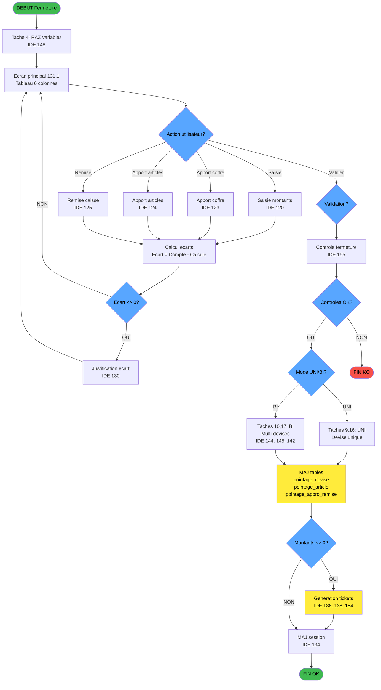
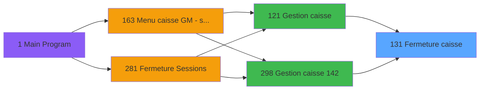
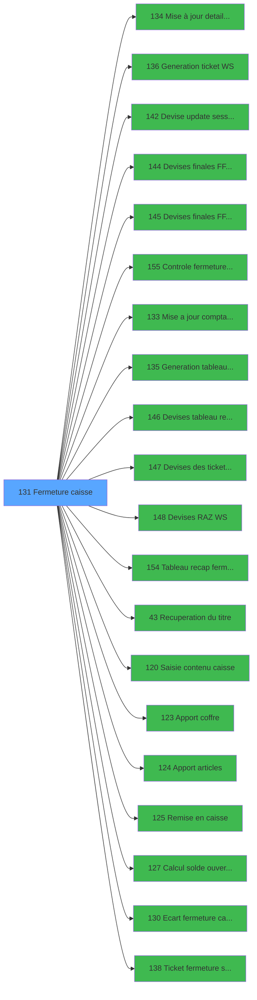

# ADH IDE 131 - Fermeture caisse

> **Analyse**: Phases 1-4 2026-02-07 03:49 -> 03:50 (27s) | Assemblage 03:50
> **Pipeline**: V7.2 Enrichi
> **Structure**: 4 onglets (Resume | Ecrans | Donnees | Connexions)

<!-- TAB:Resume -->

## 1. FICHE D'IDENTITE

| Attribut | Valeur |
|----------|--------|
| Projet | ADH |
| IDE Position | 131 |
| Nom Programme | Fermeture caisse |
| Fichier source | `Prg_131.xml` |
| Dossier IDE | Caisse |
| Taches | 22 (5 ecrans visibles) |
| Tables modifiees | 3 |
| Programmes appeles | 20 |

## 2. DESCRIPTION FONCTIONNELLE

### 2.1 Objectif metier

**Fermeture caisse** cloture une session de caisse en comparant les montants COMPTES physiquement par le caissier aux montants CALCULES theoriquement par le systeme. Le processus:

1. **Affiche un tableau recapitulatif** avec 6 colonnes de moyens de paiement (Cash, Cartes, Cheques, Produits, OD, Devises)
2. **Compare 4 lignes de valeurs** pour chaque moyen:
   - Solde ouverture (montant initial)
   - Montant compte (saisi par le caissier)
   - Montant calcule (theorique systeme)
   - Ecart (difference compte - calcule)
3. **Detecte les ecarts** et oblige le caissier a les justifier via commentaire
4. **Calcule le solde final** = Montant compte - Versement au coffre
5. **Genere les tickets de fermeture** (fermeture session, remises/appros, tableau recap)
6. **Met a jour l'historique** dans les tables pointage_*

### 2.2 Flux utilisateur principal

```
DEBUT
  |
  v
[Affichage ecran principal 131.1]
  - Tableau 6 colonnes x 4 lignes
  - Boutons: Saisie, Apport coffre, Apport articles, Remise, Ecart, Valider
  |
  v
[Caissier saisit les montants comptes]
  -> Appelle IDE 120 (Saisie contenu caisse)
  |
  v
[Systeme calcule ecarts]
  Ecart = Montant_compte - Montant_calcule
  |
  +-- Si Ecart <> 0 --> [Justification obligatoire]
  |                      -> Appelle IDE 130 (Ecart fermeture caisse)
  |                      -> Saisie commentaire ecart
  v
[Caissier effectue versement au coffre]
  -> Appelle IDE 123 (Apport coffre)
  -> Appelle IDE 125 (Remise en caisse)
  |
  v
[Validation fermeture - IDE 155]
  - Controle: tous les moyens ont ete pointes
  - Controle: ecarts justifies si existants
  |
  v
[Generation tickets]
  -> IDE 138 (Ticket fermeture session)
  -> IDE 136 (Generation ticket WS) pour remises/appros
  -> IDE 154 (Tableau recap fermeture)
  |
  v
[Mise a jour tables historique]
  -> IDE 134 (MAJ detail session WS)
  -> pointage_devise, pointage_article, pointage_appro_remise
  |
  v
FIN
```

### 2.3 Acces au programme

Appele depuis:
- [Gestion caisse (IDE 121)](ADH-IDE-121.md) - Mode standard
- [Gestion caisse 142 (IDE 298)](ADH-IDE-298.md) - Mode 142

### 2.4 Donnees modifiees

| Table | Role | Operations |
|-------|------|------------|
| pointage_devise | Enregistre les comptages par devise | WRITE - Maj montants et ecarts |
| pointage_article | Enregistre les comptages produits | WRITE - Maj stocks produits |
| pointage_appro_remise | Enregistre les mouvements coffre | WRITE - Flag edition ticket |

<details>
<summary>Detail : phases du traitement</summary>

#### Phase 1 : Traitement (19 taches)

- **131** - Fermeture caisse
- **131.1** - Fermeture caisse **[[ECRAN]](#ecran-t2)**
- **131.1.1** - (sans nom) **[[ECRAN]](#ecran-t3)**
- **131.1.2** - (sans nom) **[[ECRAN]](#ecran-t7)**
- **131.1.2.1** - Devises finales
- **131.1.2.1.1** - Devises finales
- **131.1.2.1.2** - Devises finales
- **131.1.2.2** - Update AppRem
- **131.1.2.2.1** - Update devises
- **131.1.2.2.2** - Update produits
- **131.1.3** - (sans nom) **[[ECRAN]](#ecran-t14)**
- **131.1.3.1** - Devises finales
- **131.1.3.1.1** - Devises finales
- **131.1.3.1.2** - Devises finales
- **131.1.3.2** - Update AppRem
- **131.1.3.2.1** - Update devises
- **131.1.3.2.2** - Update produits
- **131.1.4** - Detail devises **[[ECRAN]](#ecran-t21)**
- **131.1.4.1** - Detail devises **[[ECRAN]](#ecran-t22)**

Delegue a : [Mise à jour detail session WS (IDE 134)](ADH-IDE-134.md), [Devise update session WS (IDE 142)](ADH-IDE-142.md), [Devises finales F/F Nbre WS (IDE 144)](ADH-IDE-144.md), [Devises finales F/F Qte WS (IDE 145)](ADH-IDE-145.md), [Generation tableau recap WS (IDE 135)](ADH-IDE-135.md), [Devises tableau recap WS (IDE 146)](ADH-IDE-146.md), [Tableau recap fermeture (IDE 154)](ADH-IDE-154.md), [Recuperation du titre (IDE 43)](ADH-IDE-43.md), [Apport coffre (IDE 123)](ADH-IDE-123.md), [Apport articles (IDE 124)](ADH-IDE-124.md), [Remise en caisse (IDE 125)](ADH-IDE-125.md), [Ecart fermeture caisse (IDE 130)](ADH-IDE-130.md)

#### Phase 2 : Initialisation (1 tache)

- **131.1.1.1** - raz

Delegue a : [Devises RAZ WS (IDE 148)](ADH-IDE-148.md)

#### Phase 3 : Validation (1 tache)

- **131.1.1.2** - Validation

Delegue a : [Controle fermeture caisse WS (IDE 155)](ADH-IDE-155.md)

#### Phase 4 : Calcul (1 tache)

- **131.1.1.3** - Maj devises comptees

Delegue a : [Mise a jour comptage caisse WS (IDE 133)](ADH-IDE-133.md), [Calcul solde ouverture WS (IDE 127)](ADH-IDE-127.md)

#### Tables impactees

| Table | Operations | Role metier |
|-------|-----------|-------------|
| pointage_devise | **W** (2 usages) | Devises / taux de change |
| pointage_article | **W** (2 usages) | Articles et stock |
| pointage_appro_remise | **W** (2 usages) |  |

</details>

## 3. BLOCS FONCTIONNELS

### 3.1 Traitement (19 taches)

Traitements internes.

---

#### <a id="t1"></a>131 - Fermeture caisse

**Role** : Tache d'orchestration : point d'entree du programme (19 sous-taches). Coordonne l'enchainement des traitements.

<details>
<summary>18 sous-taches directes</summary>

| Tache | Nom | Bloc |
|-------|-----|------|
| [131.1](#t2) | Fermeture caisse **[[ECRAN]](#ecran-t2)** | Traitement |
| [131.1.1](#t3) | (sans nom) **[[ECRAN]](#ecran-t3)** | Traitement |
| [131.1.2](#t7) | (sans nom) **[[ECRAN]](#ecran-t7)** | Traitement |
| [131.1.2.1](#t8) | Devises finales | Traitement |
| [131.1.2.1.1](#t9) | Devises finales | Traitement |
| [131.1.2.1.2](#t10) | Devises finales | Traitement |
| [131.1.2.2](#t11) | Update AppRem | Traitement |
| [131.1.2.2.1](#t12) | Update devises | Traitement |
| [131.1.2.2.2](#t13) | Update produits | Traitement |
| [131.1.3](#t14) | (sans nom) **[[ECRAN]](#ecran-t14)** | Traitement |
| [131.1.3.1](#t15) | Devises finales | Traitement |
| [131.1.3.1.1](#t16) | Devises finales | Traitement |
| [131.1.3.1.2](#t17) | Devises finales | Traitement |
| [131.1.3.2](#t18) | Update AppRem | Traitement |
| [131.1.3.2.1](#t19) | Update devises | Traitement |
| [131.1.3.2.2](#t20) | Update produits | Traitement |
| [131.1.4](#t21) | Detail devises **[[ECRAN]](#ecran-t21)** | Traitement |
| [131.1.4.1](#t22) | Detail devises **[[ECRAN]](#ecran-t22)** | Traitement |

</details>
**Variables liees** : K (Param fermeture validee), DA (Edition ticket fermeture)

---

#### <a id="t2"></a>131.1 - Fermeture caisse [[ECRAN]](#ecran-t2)

**Role** : Traitement : Fermeture caisse.
**Ecran** : 1318 x 271 DLU (MDI) | [Voir mockup](#ecran-t2)
**Variables liees** : K (Param fermeture validee), DA (Edition ticket fermeture)

---

#### <a id="t3"></a>131.1.1 - (sans nom) [[ECRAN]](#ecran-t3)

**Role** : Traitement interne.
**Ecran** : 240 x 24 DLU (MDI) | [Voir mockup](#ecran-t3)

---

#### <a id="t7"></a>131.1.2 - (sans nom) [[ECRAN]](#ecran-t7)

**Role** : Traitement interne.
**Ecran** : 240 x 24 DLU (MDI) | [Voir mockup](#ecran-t7)

---

#### <a id="t8"></a>131.1.2.1 - Devises finales

**Role** : Traitement : Devises finales.

---

#### <a id="t9"></a>131.1.2.1.1 - Devises finales

**Role** : Traitement : Devises finales.

---

#### <a id="t10"></a>131.1.2.1.2 - Devises finales

**Role** : Traitement : Devises finales.

---

#### <a id="t11"></a>131.1.2.2 - Update AppRem

**Role** : Traitement : Update AppRem.

---

#### <a id="t12"></a>131.1.2.2.1 - Update devises

**Role** : Traitement : Update devises.

---

#### <a id="t13"></a>131.1.2.2.2 - Update produits

**Role** : Traitement : Update produits.
**Variables liees** : W (Montant initial produits), BD (Montant compte produits), BK (Montant calcule produits), BR (Montant ecart produits), CA (Montant versement produits)

---

#### <a id="t14"></a>131.1.3 - (sans nom) [[ECRAN]](#ecran-t14)

**Role** : Traitement interne.
**Ecran** : 240 x 24 DLU (MDI) | [Voir mockup](#ecran-t14)

---

#### <a id="t15"></a>131.1.3.1 - Devises finales

**Role** : Traitement : Devises finales.

---

#### <a id="t16"></a>131.1.3.1.1 - Devises finales

**Role** : Traitement : Devises finales.

---

#### <a id="t17"></a>131.1.3.1.2 - Devises finales

**Role** : Traitement : Devises finales.

---

#### <a id="t18"></a>131.1.3.2 - Update AppRem

**Role** : Traitement : Update AppRem.

---

#### <a id="t19"></a>131.1.3.2.1 - Update devises

**Role** : Traitement : Update devises.

---

#### <a id="t20"></a>131.1.3.2.2 - Update produits

**Role** : Traitement : Update produits.
**Variables liees** : W (Montant initial produits), BD (Montant compte produits), BK (Montant calcule produits), BR (Montant ecart produits), CA (Montant versement produits)

---

#### <a id="t21"></a>131.1.4 - Detail devises [[ECRAN]](#ecran-t21)

**Role** : Traitement : Detail devises.
**Ecran** : 390 x 146 DLU (MDI) | [Voir mockup](#ecran-t21)

---

#### <a id="t22"></a>131.1.4.1 - Detail devises [[ECRAN]](#ecran-t22)

**Role** : Traitement : Detail devises.
**Ecran** : 781 x 156 DLU (MDI) | [Voir mockup](#ecran-t22)


### 3.2 Initialisation (1 tache)

Reinitialisation d'etats et variables de travail.

---

#### <a id="t4"></a>131.1.1.1 - raz

**Role** : Reinitialisation des variables de travail.


### 3.3 Validation (1 tache)

Controles de coherence : 1 tache verifie les donnees et conditions.

---

#### <a id="t5"></a>131.1.1.2 - Validation

**Role** : Verification : Validation.
**Variables liees** : CX (Validation comptage chrono his), CY (Validation comptage date), CZ (Validation comptage time)
**Delegue a** : [Controle fermeture caisse WS (IDE 155)](ADH-IDE-155.md)


### 3.4 Calcul (1 tache)

Calculs metier : montants, stocks, compteurs.

---

#### <a id="t6"></a>131.1.1.3 - Maj devises comptees

**Role** : Traitement : Maj devises comptees.
**Delegue a** : [Mise a jour comptage caisse WS (IDE 133)](ADH-IDE-133.md), [Calcul solde ouverture WS (IDE 127)](ADH-IDE-127.md)


## 5. REGLES METIER

### 5.1 Formules de calcul principales

| Formule | Calcul | Variables IDE |
|---------|--------|---------------|
| **Ecart** | Montant_compte - Montant_calcule | BP = BB - BI |
| **Solde final** | Montant_compte - Versement | CI = BB - BY |
| **Solde final monnaie** | Compte_monnaie - Versement_monnaie | CJ = BC - BZ |
| **Solde final produits** | Compte_produits - Versement_produits | CK = BD - CA |
| **Solde final cartes** | Compte_cartes - Versement_cartes | CL = BE - CB |
| **Solde final cheques** | Compte_cheques - Versement_cheques | CM = BF - CC |
| **Solde final OD** | Compte_od - Versement_od | CN = BG - CD |

### 5.2 Conditions de declenchement

| Condition | Expression IDE 9 | Action declenchee |
|-----------|------------------|-------------------|
| **Edition ticket remise/appro** | `BF<>0 OR BG<>0 OR BB<>0 OR BC<>0 OR BE<>0 OR BH<>0 OR BD<>0` | Appel IDE 136 (Generation ticket WS) si au moins un montant compte est non nul |
| **Mode UNI/BI** | Variable H (Param Uni/Bi) | Branchement vers tache 9 (UNI) ou tache 10 (BI) pour traitement devises |
| **Session VIL ouverte** | NOT Q (Expression 12) | Bloque validation si sessions villages encore ouvertes |

### 5.3 Regles de validation (IDE 155)

| Regle | Description | Consequence si echec |
|-------|-------------|---------------------|
| **R1** | Tous les moyens de paiement doivent etre pointes | Bouton Valider desactive |
| **R2** | Ecarts non nuls doivent avoir un commentaire | Blocage validation |
| **R3** | Session VIL fermee obligatoire | Affichage message d'erreur |

### 5.4 Logique de mise a jour tables

**Tache 12 - Update devises (131.1.2.2.1)**:
- Copie les valeurs comptees de `gestion_devise_session` vers `pointage_devise`
- Colonnes: BA, BH, BO, BV, BX, CE, CH, CO, CP, CW

**Tache 13 - Update produits (131.1.2.2.2)**:
- Met a jour les quantites produits dans `pointage_article`
- Formule: Montant_ecart_produits = Montant_compte_produits - Montant_calcule_produits (BR = BD - BK)

### 5.5 Gestion multi-devises

Le programme supporte 2 modes:
- **Mode UNI** (taches 9, 16): Devise unique, traitement simplifie
- **Mode BI** (taches 10, 17): Multi-devises, iteration sur toutes les devises actives via IDE 144/145

Les devises sont traitees par:
- IDE 144 (Devises finales F/F Nbre WS) - Calcul nombre devises
- IDE 145 (Devises finales F/F Qte WS) - Calcul quantite devises
- IDE 142 (Devise update session WS) - Mise a jour session

### 5.6 Edition des tickets

| Ticket | Programme | Condition |
|--------|-----------|-----------|
| Ticket fermeture session | IDE 138 | Toujours a la validation |
| Ticket remises/appros | IDE 136 | Si montants <> 0 (Expression 9) |
| Tableau recapitulatif | IDE 154 | Si demande utilisateur ou ecart |

## 6. CONTEXTE

- **Appele par**: [Gestion caisse (IDE 121)](ADH-IDE-121.md), [Gestion caisse 142 (IDE 298)](ADH-IDE-298.md)
- **Appelle**: 20 programmes | **Tables**: 10 (W:3 R:6 L:2) | **Taches**: 22 | **Expressions**: 12

<!-- TAB:Ecrans -->

## 8. ECRANS

### 8.1 Forms visibles (5 / 22)

| # | Position | Tache | Nom | Type | Largeur | Hauteur | Bloc |
|---|----------|-------|-----|------|---------|---------|------|
| 1 | 131.1 | 131.1 | Fermeture caisse | MDI | 1318 | 271 | Traitement |
| 2 | 131.1.1 | 131.1.1 | (sans nom) | MDI | 240 | 24 | Traitement |
| 3 | 131.1.2 | 131.1.2 | (sans nom) | MDI | 240 | 24 | Traitement |
| 4 | 131.1.3 | 131.1.3 | (sans nom) | MDI | 240 | 24 | Traitement |
| 5 | 131.1.4.1 | 131.1.4.1 | Detail devises | MDI | 781 | 156 | Traitement |

### 8.2 Mockups Ecrans

---

#### <a id="ecran-t2"></a>131.1 - Fermeture caisse
**Tache** : [131.1](#t2) | **Type** : MDI | **Dimensions** : 1318 x 271 DLU
**Bloc** : Traitement | **Titre IDE** : Fermeture caisse

<!-- FORM-DATA:
{
    "width":  1318,
    "vFactor":  8,
    "type":  "MDI",
    "hFactor":  8,
    "controls":  [
                     {
                         "x":  0,
                         "type":  "label",
                         "var":  "",
                         "y":  0,
                         "w":  1316,
                         "fmt":  "",
                         "name":  "",
                         "h":  18,
                         "color":  "",
                         "text":  "",
                         "parent":  null
                     },
                     {
                         "x":  265,
                         "type":  "label",
                         "var":  "",
                         "y":  22,
                         "w":  603,
                         "fmt":  "",
                         "name":  "",
                         "h":  18,
                         "color":  "142",
                         "text":  "Fermeture session de caisse",
                         "parent":  null
                     },
                     {
                         "x":  247,
                         "type":  "label",
                         "var":  "",
                         "y":  44,
                         "w":  151,
                         "fmt":  "",
                         "name":  "",
                         "h":  12,
                         "color":  "7",
                         "text":  "Cash",
                         "parent":  null
                     },
                     {
                         "x":  403,
                         "type":  "label",
                         "var":  "",
                         "y":  44,
                         "w":  120,
                         "fmt":  "",
                         "name":  "",
                         "h":  12,
                         "color":  "7",
                         "text":  "Cartes",
                         "parent":  null
                     },
                     {
                         "x":  531,
                         "type":  "label",
                         "var":  "",
                         "y":  44,
                         "w":  120,
                         "fmt":  "",
                         "name":  "",
                         "h":  12,
                         "color":  "7",
                         "text":  "Chèques",
                         "parent":  null
                     },
                     {
                         "x":  656,
                         "type":  "label",
                         "var":  "",
                         "y":  44,
                         "w":  120,
                         "fmt":  "",
                         "name":  "",
                         "h":  12,
                         "color":  "7",
                         "text":  "Produits",
                         "parent":  null
                     },
                     {
                         "x":  780,
                         "type":  "label",
                         "var":  "",
                         "y":  44,
                         "w":  144,
                         "fmt":  "",
                         "name":  "",
                         "h":  12,
                         "color":  "7",
                         "text":  "TOTAL",
                         "parent":  null
                     },
                     {
                         "x":  938,
                         "type":  "label",
                         "var":  "",
                         "y":  44,
                         "w":  112,
                         "fmt":  "",
                         "name":  "",
                         "h":  12,
                         "color":  "7",
                         "text":  "OD",
                         "parent":  null
                     },
                     {
                         "x":  1052,
                         "type":  "label",
                         "var":  "",
                         "y":  44,
                         "w":  100,
                         "fmt":  "",
                         "name":  "",
                         "h":  12,
                         "color":  "7",
                         "text":  "Devises",
                         "parent":  null
                     },
                     {
                         "x":  1058,
                         "type":  "label",
                         "var":  "",
                         "y":  61,
                         "w":  87,
                         "fmt":  "",
                         "name":  "",
                         "h":  14,
                         "color":  "",
                         "text":  "",
                         "parent":  null
                     },
                     {
                         "x":  50,
                         "type":  "label",
                         "var":  "",
                         "y":  62,
                         "w":  192,
                         "fmt":  "",
                         "name":  "",
                         "h":  12,
                         "color":  "7",
                         "text":  "Solde ouverture",
                         "parent":  null
                     },
                     {
                         "x":  8,
                         "type":  "label",
                         "var":  "",
                         "y":  82,
                         "w":  924,
                         "fmt":  "",
                         "name":  "",
                         "h":  61,
                         "color":  "",
                         "text":  "",
                         "parent":  null
                     },
                     {
                         "x":  8,
                         "type":  "label",
                         "var":  "",
                         "y":  82,
                         "w":  36,
                         "fmt":  "",
                         "name":  "",
                         "h":  61,
                         "color":  "",
                         "text":  "",
                         "parent":  null
                     },
                     {
                         "x":  8,
                         "type":  "line",
                         "var":  "",
                         "y":  82,
                         "w":  924,
                         "fmt":  "",
                         "name":  "",
                         "h":  0,
                         "color":  "",
                         "text":  "",
                         "parent":  null
                     },
                     {
                         "x":  4,
                         "type":  "line",
                         "var":  "",
                         "y":  83,
                         "w":  0,
                         "fmt":  "",
                         "name":  "",
                         "h":  60,
                         "color":  "",
                         "text":  "",
                         "parent":  null
                     },
                     {
                         "x":  50,
                         "type":  "label",
                         "var":  "",
                         "y":  85,
                         "w":  192,
                         "fmt":  "",
                         "name":  "",
                         "h":  12,
                         "color":  "7",
                         "text":  "Pièces de caisse",
                         "parent":  null
                     },
                     {
                         "x":  1155,
                         "type":  "label",
                         "var":  "",
                         "y":  85,
                         "w":  154,
                         "fmt":  "",
                         "name":  "",
                         "h":  12,
                         "color":  "7",
                         "text":  "Pièces saisies",
                         "parent":  null
                     },
                     {
                         "x":  1058,
                         "type":  "label",
                         "var":  "",
                         "y":  97,
                         "w":  87,
                         "fmt":  "",
                         "name":  "",
                         "h":  14,
                         "color":  "",
                         "text":  "",
                         "parent":  null
                     },
                     {
                         "x":  50,
                         "type":  "label",
                         "var":  "",
                         "y":  99,
                         "w":  192,
                         "fmt":  "",
                         "name":  "",
                         "h":  12,
                         "color":  "7",
                         "text":  "Comptage caisse",
                         "parent":  null
                     },
                     {
                         "x":  1155,
                         "type":  "label",
                         "var":  "",
                         "y":  99,
                         "w":  154,
                         "fmt":  "",
                         "name":  "",
                         "h":  12,
                         "color":  "7",
                         "text":  "Caisse comptée",
                         "parent":  null
                     },
                     {
                         "x":  1058,
                         "type":  "label",
                         "var":  "",
                         "y":  112,
                         "w":  87,
                         "fmt":  "",
                         "name":  "",
                         "h":  15,
                         "color":  "",
                         "text":  "",
                         "parent":  null
                     },
                     {
                         "x":  50,
                         "type":  "label",
                         "var":  "",
                         "y":  113,
                         "w":  192,
                         "fmt":  "",
                         "name":  "",
                         "h":  12,
                         "color":  "7",
                         "text":  "Contrôle caisse PMS",
                         "parent":  null
                     },
                     {
                         "x":  1155,
                         "type":  "label",
                         "var":  "",
                         "y":  113,
                         "w":  154,
                         "fmt":  "",
                         "name":  "",
                         "h":  12,
                         "color":  "7",
                         "text":  "Caisse contrôlée",
                         "parent":  null
                     },
                     {
                         "x":  50,
                         "type":  "label",
                         "var":  "",
                         "y":  127,
                         "w":  192,
                         "fmt":  "",
                         "name":  "",
                         "h":  12,
                         "color":  "7",
                         "text":  "Ecart",
                         "parent":  null
                     },
                     {
                         "x":  1058,
                         "type":  "label",
                         "var":  "",
                         "y":  127,
                         "w":  87,
                         "fmt":  "",
                         "name":  "",
                         "h":  13,
                         "color":  "",
                         "text":  "",
                         "parent":  null
                     },
                     {
                         "x":  1155,
                         "type":  "label",
                         "var":  "",
                         "y":  127,
                         "w":  154,
                         "fmt":  "",
                         "name":  "",
                         "h":  12,
                         "color":  "7",
                         "text":  "Pas d\u0027ecart",
                         "parent":  null
                     },
                     {
                         "x":  1155,
                         "type":  "label",
                         "var":  "",
                         "y":  127,
                         "w":  154,
                         "fmt":  "",
                         "name":  "",
                         "h":  12,
                         "color":  "7",
                         "text":  "Ecart validé",
                         "parent":  null
                     },
                     {
                         "x":  1155,
                         "type":  "label",
                         "var":  "",
                         "y":  143,
                         "w":  154,
                         "fmt":  "",
                         "name":  "",
                         "h":  8,
                         "color":  "143",
                         "text":  "Ticket fermeture",
                         "parent":  null
                     },
                     {
                         "x":  8,
                         "type":  "label",
                         "var":  "",
                         "y":  149,
                         "w":  924,
                         "fmt":  "",
                         "name":  "",
                         "h":  48,
                         "color":  "",
                         "text":  "",
                         "parent":  null
                     },
                     {
                         "x":  8,
                         "type":  "label",
                         "var":  "",
                         "y":  149,
                         "w":  36,
                         "fmt":  "",
                         "name":  "",
                         "h":  48,
                         "color":  "",
                         "text":  "",
                         "parent":  null
                     },
                     {
                         "x":  8,
                         "type":  "line",
                         "var":  "",
                         "y":  149,
                         "w":  924,
                         "fmt":  "",
                         "name":  "",
                         "h":  0,
                         "color":  "",
                         "text":  "",
                         "parent":  null
                     },
                     {
                         "x":  4,
                         "type":  "line",
                         "var":  "",
                         "y":  150,
                         "w":  0,
                         "fmt":  "",
                         "name":  "",
                         "h":  46,
                         "color":  "",
                         "text":  "",
                         "parent":  null
                     },
                     {
                         "x":  1058,
                         "type":  "label",
                         "var":  "",
                         "y":  150,
                         "w":  87,
                         "fmt":  "",
                         "name":  "",
                         "h":  14,
                         "color":  "",
                         "text":  "",
                         "parent":  null
                     },
                     {
                         "x":  50,
                         "type":  "label",
                         "var":  "",
                         "y":  153,
                         "w":  192,
                         "fmt":  "",
                         "name":  "",
                         "h":  12,
                         "color":  "7",
                         "text":  "Remise en caisse",
                         "parent":  null
                     },
                     {
                         "x":  1155,
                         "type":  "label",
                         "var":  "",
                         "y":  153,
                         "w":  154,
                         "fmt":  "",
                         "name":  "",
                         "h":  12,
                         "color":  "7",
                         "text":  "Pas de remise",
                         "parent":  null
                     },
                     {
                         "x":  1058,
                         "type":  "label",
                         "var":  "",
                         "y":  165,
                         "w":  87,
                         "fmt":  "",
                         "name":  "",
                         "h":  14,
                         "color":  "",
                         "text":  "",
                         "parent":  null
                     },
                     {
                         "x":  50,
                         "type":  "label",
                         "var":  "",
                         "y":  167,
                         "w":  192,
                         "fmt":  "",
                         "name":  "",
                         "h":  12,
                         "color":  "7",
                         "text":  "Appro caisse",
                         "parent":  null
                     },
                     {
                         "x":  1155,
                         "type":  "label",
                         "var":  "",
                         "y":  167,
                         "w":  154,
                         "fmt":  "",
                         "name":  "",
                         "h":  12,
                         "color":  "7",
                         "text":  "Pas d\u0027appro",
                         "parent":  null
                     },
                     {
                         "x":  50,
                         "type":  "label",
                         "var":  "",
                         "y":  181,
                         "w":  192,
                         "fmt":  "",
                         "name":  "",
                         "h":  12,
                         "color":  "7",
                         "text":  "Appro produits",
                         "parent":  null
                     },
                     {
                         "x":  1155,
                         "type":  "label",
                         "var":  "",
                         "y":  181,
                         "w":  154,
                         "fmt":  "",
                         "name":  "",
                         "h":  12,
                         "color":  "7",
                         "text":  "Pas d\u0027appro",
                         "parent":  null
                     },
                     {
                         "x":  1155,
                         "type":  "label",
                         "var":  "",
                         "y":  196,
                         "w":  154,
                         "fmt":  "",
                         "name":  "",
                         "h":  8,
                         "color":  "143",
                         "text":  "Ticket remise appro",
                         "parent":  null
                     },
                     {
                         "x":  8,
                         "type":  "label",
                         "var":  "",
                         "y":  203,
                         "w":  924,
                         "fmt":  "",
                         "name":  "",
                         "h":  19,
                         "color":  "",
                         "text":  "",
                         "parent":  null
                     },
                     {
                         "x":  8,
                         "type":  "label",
                         "var":  "",
                         "y":  203,
                         "w":  36,
                         "fmt":  "",
                         "name":  "",
                         "h":  19,
                         "color":  "",
                         "text":  "",
                         "parent":  null
                     },
                     {
                         "x":  8,
                         "type":  "line",
                         "var":  "",
                         "y":  203,
                         "w":  924,
                         "fmt":  "",
                         "name":  "",
                         "h":  0,
                         "color":  "",
                         "text":  "",
                         "parent":  null
                     },
                     {
                         "x":  4,
                         "type":  "line",
                         "var":  "",
                         "y":  204,
                         "w":  0,
                         "fmt":  "",
                         "name":  "",
                         "h":  19,
                         "color":  "",
                         "text":  "",
                         "parent":  null
                     },
                     {
                         "x":  50,
                         "type":  "label",
                         "var":  "",
                         "y":  207,
                         "w":  192,
                         "fmt":  "",
                         "name":  "",
                         "h":  12,
                         "color":  "7",
                         "text":  "Tableau recap",
                         "parent":  null
                     },
                     {
                         "x":  1155,
                         "type":  "label",
                         "var":  "",
                         "y":  207,
                         "w":  154,
                         "fmt":  "",
                         "name":  "",
                         "h":  12,
                         "color":  "143",
                         "text":  "Tableau edité",
                         "parent":  null
                     },
                     {
                         "x":  1058,
                         "type":  "label",
                         "var":  "",
                         "y":  227,
                         "w":  87,
                         "fmt":  "",
                         "name":  "",
                         "h":  13,
                         "color":  "",
                         "text":  "",
                         "parent":  null
                     },
                     {
                         "x":  50,
                         "type":  "label",
                         "var":  "",
                         "y":  228,
                         "w":  192,
                         "fmt":  "",
                         "name":  "",
                         "h":  12,
                         "color":  "7",
                         "text":  "Solde final",
                         "parent":  null
                     },
                     {
                         "x":  0,
                         "type":  "label",
                         "var":  "",
                         "y":  247,
                         "w":  1316,
                         "fmt":  "",
                         "name":  "",
                         "h":  24,
                         "color":  "",
                         "text":  "",
                         "parent":  null
                     },
                     {
                         "x":  576,
                         "type":  "label",
                         "var":  "",
                         "y":  255,
                         "w":  120,
                         "fmt":  "",
                         "name":  "",
                         "h":  10,
                         "color":  "",
                         "text":  "Monnaie locale",
                         "parent":  109
                     },
                     {
                         "x":  1151,
                         "type":  "edit",
                         "var":  "",
                         "y":  266,
                         "w":  2,
                         "fmt":  "",
                         "name":  "Field_cursor",
                         "h":  1,
                         "color":  "",
                         "text":  "",
                         "parent":  109
                     },
                     {
                         "x":  9,
                         "type":  "edit",
                         "var":  "",
                         "y":  62,
                         "w":  32,
                         "fmt":  "",
                         "name":  "A",
                         "h":  12,
                         "color":  "148",
                         "text":  "",
                         "parent":  null
                     },
                     {
                         "x":  9,
                         "type":  "edit",
                         "var":  "",
                         "y":  85,
                         "w":  32,
                         "fmt":  "",
                         "name":  "B",
                         "h":  12,
                         "color":  "148",
                         "text":  "",
                         "parent":  null
                     },
                     {
                         "x":  9,
                         "type":  "edit",
                         "var":  "",
                         "y":  99,
                         "w":  32,
                         "fmt":  "",
                         "name":  "C",
                         "h":  12,
                         "color":  "148",
                         "text":  "",
                         "parent":  null
                     },
                     {
                         "x":  9,
                         "type":  "edit",
                         "var":  "",
                         "y":  113,
                         "w":  32,
                         "fmt":  "",
                         "name":  "D",
                         "h":  12,
                         "color":  "148",
                         "text":  "",
                         "parent":  null
                     },
                     {
                         "x":  9,
                         "type":  "edit",
                         "var":  "",
                         "y":  127,
                         "w":  32,
                         "fmt":  "",
                         "name":  "E",
                         "h":  12,
                         "color":  "148",
                         "text":  "",
                         "parent":  null
                     },
                     {
                         "x":  9,
                         "type":  "edit",
                         "var":  "",
                         "y":  153,
                         "w":  32,
                         "fmt":  "",
                         "name":  "F",
                         "h":  12,
                         "color":  "148",
                         "text":  "",
                         "parent":  null
                     },
                     {
                         "x":  9,
                         "type":  "edit",
                         "var":  "",
                         "y":  167,
                         "w":  32,
                         "fmt":  "",
                         "name":  "G",
                         "h":  12,
                         "color":  "148",
                         "text":  "",
                         "parent":  null
                     },
                     {
                         "x":  9,
                         "type":  "edit",
                         "var":  "",
                         "y":  181,
                         "w":  32,
                         "fmt":  "",
                         "name":  "H",
                         "h":  12,
                         "color":  "148",
                         "text":  "",
                         "parent":  null
                     },
                     {
                         "x":  9,
                         "type":  "edit",
                         "var":  "",
                         "y":  207,
                         "w":  32,
                         "fmt":  "",
                         "name":  "I",
                         "h":  12,
                         "color":  "148",
                         "text":  "",
                         "parent":  null
                     },
                     {
                         "x":  9,
                         "type":  "edit",
                         "var":  "",
                         "y":  228,
                         "w":  32,
                         "fmt":  "",
                         "name":  "J",
                         "h":  12,
                         "color":  "148",
                         "text":  "",
                         "parent":  null
                     },
                     {
                         "x":  1155,
                         "type":  "button",
                         "var":  "",
                         "y":  250,
                         "w":  154,
                         "fmt":  "",
                         "name":  "Bouton Validation",
                         "h":  18,
                         "color":  "",
                         "text":  "",
                         "parent":  109
                     },
                     {
                         "x":  2,
                         "type":  "edit",
                         "var":  "",
                         "y":  5,
                         "w":  267,
                         "fmt":  "20",
                         "name":  "",
                         "h":  8,
                         "color":  "",
                         "text":  "",
                         "parent":  null
                     },
                     {
                         "x":  1093,
                         "type":  "edit",
                         "var":  "",
                         "y":  5,
                         "w":  216,
                         "fmt":  "WWW  DD MMM YYYYT",
                         "name":  "",
                         "h":  8,
                         "color":  "",
                         "text":  "",
                         "parent":  null
                     },
                     {
                         "x":  247,
                         "type":  "edit",
                         "var":  "",
                         "y":  62,
                         "w":  151,
                         "fmt":  "N## ### ### ###.###Z",
                         "name":  "",
                         "h":  12,
                         "color":  "7",
                         "text":  "",
                         "parent":  null
                     },
                     {
                         "x":  403,
                         "type":  "edit",
                         "var":  "",
                         "y":  62,
                         "w":  120,
                         "fmt":  "N## ### ### ###.###Z",
                         "name":  "",
                         "h":  12,
                         "color":  "7",
                         "text":  "",
                         "parent":  null
                     },
                     {
                         "x":  531,
                         "type":  "edit",
                         "var":  "",
                         "y":  62,
                         "w":  120,
                         "fmt":  "N## ### ### ###.###Z",
                         "name":  "",
                         "h":  12,
                         "color":  "7",
                         "text":  "",
                         "parent":  null
                     },
                     {
                         "x":  656,
                         "type":  "edit",
                         "var":  "",
                         "y":  62,
                         "w":  120,
                         "fmt":  "N## ### ### ###.###Z",
                         "name":  "",
                         "h":  12,
                         "color":  "7",
                         "text":  "",
                         "parent":  null
                     },
                     {
                         "x":  780,
                         "type":  "edit",
                         "var":  "",
                         "y":  62,
                         "w":  144,
                         "fmt":  "N## ### ### ###.###Z",
                         "name":  "",
                         "h":  12,
                         "color":  "7",
                         "text":  "",
                         "parent":  null
                     },
                     {
                         "x":  938,
                         "type":  "edit",
                         "var":  "",
                         "y":  62,
                         "w":  112,
                         "fmt":  "N## ### ### ###.###Z",
                         "name":  "",
                         "h":  12,
                         "color":  "7",
                         "text":  "",
                         "parent":  null
                     },
                     {
                         "x":  1061,
                         "type":  "edit",
                         "var":  "",
                         "y":  63,
                         "w":  82,
                         "fmt":  "6Z",
                         "name":  "DEV1",
                         "h":  11,
                         "color":  "7",
                         "text":  "",
                         "parent":  12
                     },
                     {
                         "x":  247,
                         "type":  "edit",
                         "var":  "",
                         "y":  99,
                         "w":  151,
                         "fmt":  "N## ### ### ###.###Z",
                         "name":  "",
                         "h":  12,
                         "color":  "7",
                         "text":  "",
                         "parent":  null
                     },
                     {
                         "x":  403,
                         "type":  "edit",
                         "var":  "",
                         "y":  99,
                         "w":  120,
                         "fmt":  "N## ### ### ###.###Z",
                         "name":  "",
                         "h":  12,
                         "color":  "7",
                         "text":  "",
                         "parent":  null
                     },
                     {
                         "x":  531,
                         "type":  "edit",
                         "var":  "",
                         "y":  99,
                         "w":  120,
                         "fmt":  "N## ### ### ###.###Z",
                         "name":  "",
                         "h":  12,
                         "color":  "7",
                         "text":  "",
                         "parent":  null
                     },
                     {
                         "x":  656,
                         "type":  "edit",
                         "var":  "",
                         "y":  99,
                         "w":  120,
                         "fmt":  "N## ### ### ###.###Z",
                         "name":  "",
                         "h":  12,
                         "color":  "7",
                         "text":  "",
                         "parent":  null
                     },
                     {
                         "x":  780,
                         "type":  "edit",
                         "var":  "",
                         "y":  99,
                         "w":  144,
                         "fmt":  "N## ### ### ###.###Z",
                         "name":  "",
                         "h":  12,
                         "color":  "7",
                         "text":  "",
                         "parent":  null
                     },
                     {
                         "x":  938,
                         "type":  "edit",
                         "var":  "",
                         "y":  99,
                         "w":  112,
                         "fmt":  "N## ### ### ###.###Z",
                         "name":  "",
                         "h":  12,
                         "color":  "7",
                         "text":  "",
                         "parent":  null
                     },
                     {
                         "x":  1062,
                         "type":  "edit",
                         "var":  "",
                         "y":  99,
                         "w":  80,
                         "fmt":  "6Z",
                         "name":  "DEV2",
                         "h":  10,
                         "color":  "7",
                         "text":  "",
                         "parent":  29
                     },
                     {
                         "x":  247,
                         "type":  "edit",
                         "var":  "",
                         "y":  113,
                         "w":  151,
                         "fmt":  "N## ### ### ###.###Z",
                         "name":  "",
                         "h":  12,
                         "color":  "7",
                         "text":  "",
                         "parent":  null
                     },
                     {
                         "x":  403,
                         "type":  "edit",
                         "var":  "",
                         "y":  113,
                         "w":  120,
                         "fmt":  "N## ### ### ###.###Z",
                         "name":  "",
                         "h":  12,
                         "color":  "7",
                         "text":  "",
                         "parent":  null
                     },
                     {
                         "x":  531,
                         "type":  "edit",
                         "var":  "",
                         "y":  113,
                         "w":  120,
                         "fmt":  "N## ### ### ###.###Z",
                         "name":  "",
                         "h":  12,
                         "color":  "7",
                         "text":  "",
                         "parent":  null
                     },
                     {
                         "x":  656,
                         "type":  "edit",
                         "var":  "",
                         "y":  113,
                         "w":  120,
                         "fmt":  "N## ### ### ###.###Z",
                         "name":  "",
                         "h":  12,
                         "color":  "7",
                         "text":  "",
                         "parent":  null
                     },
                     {
                         "x":  780,
                         "type":  "edit",
                         "var":  "",
                         "y":  113,
                         "w":  144,
                         "fmt":  "N## ### ### ###.###Z",
                         "name":  "",
                         "h":  12,
                         "color":  "7",
                         "text":  "",
                         "parent":  null
                     },
                     {
                         "x":  938,
                         "type":  "edit",
                         "var":  "",
                         "y":  113,
                         "w":  112,
                         "fmt":  "N## ### ### ###.###Z",
                         "name":  "",
                         "h":  12,
                         "color":  "7",
                         "text":  "",
                         "parent":  null
                     },
                     {
                         "x":  1062,
                         "type":  "edit",
                         "var":  "",
                         "y":  114,
                         "w":  80,
                         "fmt":  "6Z",
                         "name":  "DEV3",
                         "h":  11,
                         "color":  "7",
                         "text":  "",
                         "parent":  40
                     },
                     {
                         "x":  247,
                         "type":  "edit",
                         "var":  "",
                         "y":  127,
                         "w":  151,
                         "fmt":  "N## ### ### ###.###Z",
                         "name":  "",
                         "h":  12,
                         "color":  "7",
                         "text":  "",
                         "parent":  null
                     },
                     {
                         "x":  403,
                         "type":  "edit",
                         "var":  "",
                         "y":  127,
                         "w":  120,
                         "fmt":  "N## ### ### ###.###Z",
                         "name":  "",
                         "h":  12,
                         "color":  "7",
                         "text":  "",
                         "parent":  null
                     },
                     {
                         "x":  531,
                         "type":  "edit",
                         "var":  "",
                         "y":  127,
                         "w":  120,
                         "fmt":  "N## ### ### ###.###Z",
                         "name":  "",
                         "h":  12,
                         "color":  "7",
                         "text":  "",
                         "parent":  null
                     },
                     {
                         "x":  656,
                         "type":  "edit",
                         "var":  "",
                         "y":  127,
                         "w":  120,
                         "fmt":  "N## ### ### ###.###Z",
                         "name":  "",
                         "h":  12,
                         "color":  "7",
                         "text":  "",
                         "parent":  null
                     },
                     {
                         "x":  780,
                         "type":  "edit",
                         "var":  "",
                         "y":  127,
                         "w":  144,
                         "fmt":  "N## ### ### ###.###Z",
                         "name":  "",
                         "h":  12,
                         "color":  "7",
                         "text":  "",
                         "parent":  null
                     },
                     {
                         "x":  938,
                         "type":  "edit",
                         "var":  "",
                         "y":  127,
                         "w":  112,
                         "fmt":  "N## ### ### ###.###Z",
                         "name":  "",
                         "h":  12,
                         "color":  "7",
                         "text":  "",
                         "parent":  null
                     },
                     {
                         "x":  1062,
                         "type":  "edit",
                         "var":  "",
                         "y":  128,
                         "w":  80,
                         "fmt":  "6Z",
                         "name":  "DEV4",
                         "h":  11,
                         "color":  "7",
                         "text":  "",
                         "parent":  59
                     },
                     {
                         "x":  247,
                         "type":  "edit",
                         "var":  "",
                         "y":  153,
                         "w":  151,
                         "fmt":  "N## ### ### ###.###Z",
                         "name":  "",
                         "h":  12,
                         "color":  "7",
                         "text":  "",
                         "parent":  null
                     },
                     {
                         "x":  403,
                         "type":  "edit",
                         "var":  "",
                         "y":  153,
                         "w":  120,
                         "fmt":  "N## ### ### ###.###Z",
                         "name":  "",
                         "h":  12,
                         "color":  "7",
                         "text":  "",
                         "parent":  null
                     },
                     {
                         "x":  531,
                         "type":  "edit",
                         "var":  "",
                         "y":  153,
                         "w":  120,
                         "fmt":  "N## ### ### ###.###Z",
                         "name":  "",
                         "h":  12,
                         "color":  "7",
                         "text":  "",
                         "parent":  null
                     },
                     {
                         "x":  656,
                         "type":  "edit",
                         "var":  "",
                         "y":  153,
                         "w":  120,
                         "fmt":  "N## ### ### ###.###Z",
                         "name":  "",
                         "h":  12,
                         "color":  "7",
                         "text":  "",
                         "parent":  null
                     },
                     {
                         "x":  780,
                         "type":  "edit",
                         "var":  "",
                         "y":  153,
                         "w":  144,
                         "fmt":  "N## ### ### ###.###Z",
                         "name":  "",
                         "h":  12,
                         "color":  "7",
                         "text":  "",
                         "parent":  null
                     },
                     {
                         "x":  938,
                         "type":  "edit",
                         "var":  "",
                         "y":  153,
                         "w":  112,
                         "fmt":  "N## ### ### ###.###Z",
                         "name":  "",
                         "h":  12,
                         "color":  "7",
                         "text":  "",
                         "parent":  null
                     },
                     {
                         "x":  1063,
                         "type":  "edit",
                         "var":  "",
                         "y":  152,
                         "w":  80,
                         "fmt":  "6Z",
                         "name":  "DEV5",
                         "h":  11,
                         "color":  "7",
                         "text":  "",
                         "parent":  68
                     },
                     {
                         "x":  247,
                         "type":  "edit",
                         "var":  "",
                         "y":  167,
                         "w":  151,
                         "fmt":  "## ### ### ###.###Z",
                         "name":  "",
                         "h":  12,
                         "color":  "7",
                         "text":  "",
                         "parent":  null
                     },
                     {
                         "x":  780,
                         "type":  "edit",
                         "var":  "",
                         "y":  167,
                         "w":  144,
                         "fmt":  "N## ### ### ###.###Z",
                         "name":  "",
                         "h":  12,
                         "color":  "7",
                         "text":  "",
                         "parent":  null
                     },
                     {
                         "x":  1062,
                         "type":  "edit",
                         "var":  "",
                         "y":  167,
                         "w":  80,
                         "fmt":  "6Z",
                         "name":  "DEV6",
                         "h":  11,
                         "color":  "7",
                         "text":  "",
                         "parent":  79
                     },
                     {
                         "x":  656,
                         "type":  "edit",
                         "var":  "",
                         "y":  181,
                         "w":  120,
                         "fmt":  "## ### ### ###.###Z",
                         "name":  "",
                         "h":  12,
                         "color":  "7",
                         "text":  "",
                         "parent":  null
                     },
                     {
                         "x":  780,
                         "type":  "edit",
                         "var":  "",
                         "y":  181,
                         "w":  144,
                         "fmt":  "N## ### ### ###.###Z",
                         "name":  "",
                         "h":  12,
                         "color":  "7",
                         "text":  "",
                         "parent":  null
                     },
                     {
                         "x":  247,
                         "type":  "edit",
                         "var":  "",
                         "y":  228,
                         "w":  151,
                         "fmt":  "N## ### ### ###.###Z",
                         "name":  "",
                         "h":  12,
                         "color":  "7",
                         "text":  "",
                         "parent":  null
                     },
                     {
                         "x":  403,
                         "type":  "edit",
                         "var":  "",
                         "y":  228,
                         "w":  120,
                         "fmt":  "",
                         "name":  "",
                         "h":  12,
                         "color":  "7",
                         "text":  "",
                         "parent":  null
                     },
                     {
                         "x":  531,
                         "type":  "edit",
                         "var":  "",
                         "y":  228,
                         "w":  120,
                         "fmt":  "",
                         "name":  "",
                         "h":  12,
                         "color":  "7",
                         "text":  "",
                         "parent":  null
                     },
                     {
                         "x":  656,
                         "type":  "edit",
                         "var":  "",
                         "y":  228,
                         "w":  120,
                         "fmt":  "N## ### ### ###.###Z",
                         "name":  "",
                         "h":  12,
                         "color":  "7",
                         "text":  "",
                         "parent":  null
                     },
                     {
                         "x":  780,
                         "type":  "edit",
                         "var":  "",
                         "y":  228,
                         "w":  144,
                         "fmt":  "N## ### ### ###.###Z",
                         "name":  "",
                         "h":  12,
                         "color":  "7",
                         "text":  "",
                         "parent":  null
                     },
                     {
                         "x":  938,
                         "type":  "edit",
                         "var":  "",
                         "y":  228,
                         "w":  112,
                         "fmt":  "",
                         "name":  "",
                         "h":  12,
                         "color":  "7",
                         "text":  "",
                         "parent":  null
                     },
                     {
                         "x":  1062,
                         "type":  "edit",
                         "var":  "",
                         "y":  229,
                         "w":  80,
                         "fmt":  "6Z",
                         "name":  "DEV9",
                         "h":  10,
                         "color":  "7",
                         "text":  "",
                         "parent":  99
                     },
                     {
                         "x":  12,
                         "type":  "button",
                         "var":  "",
                         "y":  250,
                         "w":  154,
                         "fmt":  "A\u0026bandon",
                         "name":  "",
                         "h":  18,
                         "color":  "",
                         "text":  "",
                         "parent":  109
                     },
                     {
                         "x":  1155,
                         "type":  "button",
                         "var":  "",
                         "y":  250,
                         "w":  154,
                         "fmt":  "\u0026Continuer",
                         "name":  "999",
                         "h":  18,
                         "color":  "",
                         "text":  "",
                         "parent":  109
                     },
                     {
                         "x":  701,
                         "type":  "edit",
                         "var":  "",
                         "y":  255,
                         "w":  42,
                         "fmt":  "",
                         "name":  "",
                         "h":  10,
                         "color":  "7",
                         "text":  "",
                         "parent":  109
                     }
                 ],
    "taskId":  "131.1",
    "height":  271
}
-->

<details>
<summary><strong>Champs : 61 champs</strong></summary>

| Pos (x,y) | Nom | Variable | Type |
|-----------|-----|----------|------|
| 1151,266 | Field_cursor | - | edit |
| 9,62 | A | - | edit |
| 9,85 | B | - | edit |
| 9,99 | C | - | edit |
| 9,113 | D | - | edit |
| 9,127 | E | - | edit |
| 9,153 | F | - | edit |
| 9,167 | G | - | edit |
| 9,181 | H | - | edit |
| 9,207 | I | - | edit |
| 9,228 | J | - | edit |
| 2,5 | 20 | - | edit |
| 1093,5 | WWW  DD MMM YYYYT | - | edit |
| 247,62 | N## ### ### ###.###Z | - | edit |
| 403,62 | N## ### ### ###.###Z | - | edit |
| 531,62 | N## ### ### ###.###Z | - | edit |
| 656,62 | N## ### ### ###.###Z | - | edit |
| 780,62 | N## ### ### ###.###Z | - | edit |
| 938,62 | N## ### ### ###.###Z | - | edit |
| 1061,63 | DEV1 | - | edit |
| 247,99 | N## ### ### ###.###Z | - | edit |
| 403,99 | N## ### ### ###.###Z | - | edit |
| 531,99 | N## ### ### ###.###Z | - | edit |
| 656,99 | N## ### ### ###.###Z | - | edit |
| 780,99 | N## ### ### ###.###Z | - | edit |
| 938,99 | N## ### ### ###.###Z | - | edit |
| 1062,99 | DEV2 | - | edit |
| 247,113 | N## ### ### ###.###Z | - | edit |
| 403,113 | N## ### ### ###.###Z | - | edit |
| 531,113 | N## ### ### ###.###Z | - | edit |
| 656,113 | N## ### ### ###.###Z | - | edit |
| 780,113 | N## ### ### ###.###Z | - | edit |
| 938,113 | N## ### ### ###.###Z | - | edit |
| 1062,114 | DEV3 | - | edit |
| 247,127 | N## ### ### ###.###Z | - | edit |
| 403,127 | N## ### ### ###.###Z | - | edit |
| 531,127 | N## ### ### ###.###Z | - | edit |
| 656,127 | N## ### ### ###.###Z | - | edit |
| 780,127 | N## ### ### ###.###Z | - | edit |
| 938,127 | N## ### ### ###.###Z | - | edit |
| 1062,128 | DEV4 | - | edit |
| 247,153 | N## ### ### ###.###Z | - | edit |
| 403,153 | N## ### ### ###.###Z | - | edit |
| 531,153 | N## ### ### ###.###Z | - | edit |
| 656,153 | N## ### ### ###.###Z | - | edit |
| 780,153 | N## ### ### ###.###Z | - | edit |
| 938,153 | N## ### ### ###.###Z | - | edit |
| 1063,152 | DEV5 | - | edit |
| 247,167 | ## ### ### ###.###Z | - | edit |
| 780,167 | N## ### ### ###.###Z | - | edit |
| 1062,167 | DEV6 | - | edit |
| 656,181 | ## ### ### ###.###Z | - | edit |
| 780,181 | N## ### ### ###.###Z | - | edit |
| 247,228 | N## ### ### ###.###Z | - | edit |
| 403,228 | (sans nom) | - | edit |
| 531,228 | (sans nom) | - | edit |
| 656,228 | N## ### ### ###.###Z | - | edit |
| 780,228 | N## ### ### ###.###Z | - | edit |
| 938,228 | (sans nom) | - | edit |
| 1062,229 | DEV9 | - | edit |
| 701,255 | (sans nom) | - | edit |

</details>

<details>
<summary><strong>Boutons : 3 boutons</strong></summary>

| Bouton | Pos (x,y) | Action |
|--------|-----------|--------|
| Validation | 1155,250 | Valide la saisie et enregistre |
| Abandon | 12,250 | Annule et retour au menu |
| Continuer | 1155,250 | Bouton fonctionnel |

</details>

---

#### <a id="ecran-t3"></a>131.1.1 - (sans nom)
**Tache** : [131.1.1](#t3) | **Type** : MDI | **Dimensions** : 240 x 24 DLU
**Bloc** : Traitement | **Titre IDE** : (sans nom)

<!-- FORM-DATA:
{
    "width":  240,
    "vFactor":  8,
    "type":  "MDI",
    "hFactor":  8,
    "controls":  [
                     {
                         "x":  21,
                         "type":  "label",
                         "var":  "",
                         "y":  8,
                         "w":  200,
                         "fmt":  "",
                         "name":  "",
                         "h":  8,
                         "color":  "143",
                         "text":  "Traitement en cours",
                         "parent":  null
                     }
                 ],
    "taskId":  "131.1.1",
    "height":  24
}
-->

---

#### <a id="ecran-t7"></a>131.1.2 - (sans nom)
**Tache** : [131.1.2](#t7) | **Type** : MDI | **Dimensions** : 240 x 24 DLU
**Bloc** : Traitement | **Titre IDE** : (sans nom)

<!-- FORM-DATA:
{
    "width":  240,
    "vFactor":  8,
    "type":  "MDI",
    "hFactor":  8,
    "controls":  [
                     {
                         "x":  21,
                         "type":  "label",
                         "var":  "",
                         "y":  8,
                         "w":  200,
                         "fmt":  "",
                         "name":  "",
                         "h":  8,
                         "color":  "143",
                         "text":  "Traitement en cours",
                         "parent":  null
                     }
                 ],
    "taskId":  "131.1.2",
    "height":  24
}
-->

---

#### <a id="ecran-t14"></a>131.1.3 - (sans nom)
**Tache** : [131.1.3](#t14) | **Type** : MDI | **Dimensions** : 240 x 24 DLU
**Bloc** : Traitement | **Titre IDE** : (sans nom)

<!-- FORM-DATA:
{
    "width":  240,
    "vFactor":  8,
    "type":  "MDI",
    "hFactor":  8,
    "controls":  [
                     {
                         "x":  21,
                         "type":  "label",
                         "var":  "",
                         "y":  8,
                         "w":  200,
                         "fmt":  "",
                         "name":  "",
                         "h":  8,
                         "color":  "143",
                         "text":  "Traitement en cours",
                         "parent":  null
                     }
                 ],
    "taskId":  "131.1.3",
    "height":  24
}
-->

---

#### <a id="ecran-t22"></a>131.1.4.1 - Detail devises
**Tache** : [131.1.4.1](#t22) | **Type** : MDI | **Dimensions** : 781 x 156 DLU
**Bloc** : Traitement | **Titre IDE** : Detail devises

<!-- FORM-DATA:
{
    "width":  781,
    "vFactor":  8,
    "type":  "MDI",
    "hFactor":  8,
    "controls":  [
                     {
                         "x":  37,
                         "type":  "table",
                         "var":  "",
                         "name":  "",
                         "titleH":  12,
                         "color":  "110",
                         "w":  711,
                         "y":  20,
                         "fmt":  "",
                         "parent":  null,
                         "text":  "",
                         "rowH":  12,
                         "h":  100,
                         "cols":  [
                                      {
                                          "title":  "Code",
                                          "layer":  1,
                                          "w":  56
                                      },
                                      {
                                          "title":  "Mode paiement",
                                          "layer":  2,
                                          "w":  136
                                      },
                                      {
                                          "title":  "Quantité",
                                          "layer":  3,
                                          "w":  150
                                      },
                                      {
                                          "title":  "Pays",
                                          "layer":  4,
                                          "w":  171
                                      },
                                      {
                                          "title":  "Désignation",
                                          "layer":  5,
                                          "w":  167
                                      }
                                  ],
                         "rows":  5
                     },
                     {
                         "x":  45,
                         "type":  "edit",
                         "var":  "",
                         "y":  35,
                         "w":  46,
                         "fmt":  "",
                         "name":  "",
                         "h":  8,
                         "color":  "110",
                         "text":  "",
                         "parent":  2
                     },
                     {
                         "x":  100,
                         "type":  "edit",
                         "var":  "",
                         "y":  35,
                         "w":  124,
                         "fmt":  "",
                         "name":  "",
                         "h":  8,
                         "color":  "110",
                         "text":  "",
                         "parent":  2
                     },
                     {
                         "x":  237,
                         "type":  "edit",
                         "var":  "",
                         "y":  35,
                         "w":  136,
                         "fmt":  "",
                         "name":  "",
                         "h":  8,
                         "color":  "110",
                         "text":  "",
                         "parent":  2
                     },
                     {
                         "x":  386,
                         "type":  "edit",
                         "var":  "",
                         "y":  35,
                         "w":  158,
                         "fmt":  "",
                         "name":  "",
                         "h":  8,
                         "color":  "110",
                         "text":  "",
                         "parent":  2
                     },
                     {
                         "x":  556,
                         "type":  "edit",
                         "var":  "",
                         "y":  35,
                         "w":  156,
                         "fmt":  "",
                         "name":  "",
                         "h":  8,
                         "color":  "110",
                         "text":  "",
                         "parent":  2
                     },
                     {
                         "x":  590,
                         "type":  "button",
                         "var":  "",
                         "y":  128,
                         "w":  154,
                         "fmt":  "Quitter",
                         "name":  "",
                         "h":  14,
                         "color":  "",
                         "text":  "",
                         "parent":  null
                     },
                     {
                         "x":  37,
                         "type":  "edit",
                         "var":  "",
                         "y":  4,
                         "w":  373,
                         "fmt":  "",
                         "name":  "",
                         "h":  10,
                         "color":  "",
                         "text":  "",
                         "parent":  null
                     }
                 ],
    "taskId":  "131.1.4.1",
    "height":  156
}
-->

<details>
<summary><strong>Champs : 6 champs</strong></summary>

| Pos (x,y) | Nom | Variable | Type |
|-----------|-----|----------|------|
| 45,35 | (sans nom) | - | edit |
| 100,35 | (sans nom) | - | edit |
| 237,35 | (sans nom) | - | edit |
| 386,35 | (sans nom) | - | edit |
| 556,35 | (sans nom) | - | edit |
| 37,4 | (sans nom) | - | edit |

</details>

<details>
<summary><strong>Boutons : 1 boutons</strong></summary>

| Bouton | Pos (x,y) | Action |
|--------|-----------|--------|
| Quitter | 590,128 | Quitte le programme |

</details>

## 9. NAVIGATION

### 9.1 Enchainement des ecrans

```mermaid
flowchart TD
    START([Entree])
    style START fill:#3fb950
    VF2[131.1 Fermeture caisse]
    style VF2 fill:#58a6ff
    VF3[131.1.1 sans nom]
    style VF3 fill:#58a6ff
    VF7[131.1.2 sans nom]
    style VF7 fill:#58a6ff
    VF14[131.1.3 sans nom]
    style VF14 fill:#58a6ff
    VF22[131.1.4.1 Detail devises]
    style VF22 fill:#58a6ff
    EXT134[IDE 134 Mise à jour de...]
    style EXT134 fill:#3fb950
    EXT136[IDE 136 Generation tic...]
    style EXT136 fill:#3fb950
    EXT142[IDE 142 Devise update ...]
    style EXT142 fill:#3fb950
    EXT144[IDE 144 Devises finale...]
    style EXT144 fill:#3fb950
    EXT145[IDE 145 Devises finale...]
    style EXT145 fill:#3fb950
    EXT155[IDE 155 Controle ferme...]
    style EXT155 fill:#3fb950
    EXT133[IDE 133 Mise a jour co...]
    style EXT133 fill:#3fb950
    EXT135[IDE 135 Generation tab...]
    style EXT135 fill:#3fb950
    EXT146[IDE 146 Devises tablea...]
    style EXT146 fill:#3fb950
    EXT147[IDE 147 Devises des ti...]
    style EXT147 fill:#3fb950
    EXT148[IDE 148 Devises RAZ WS]
    style EXT148 fill:#3fb950
    EXT154[IDE 154 Tableau recap ...]
    style EXT154 fill:#3fb950
    EXT43[IDE 43 Recuperation du...]
    style EXT43 fill:#3fb950
    EXT120[IDE 120 Saisie contenu...]
    style EXT120 fill:#3fb950
    EXT123[IDE 123 Apport coffre]
    style EXT123 fill:#3fb950
    EXT124[IDE 124 Apport articles]
    style EXT124 fill:#3fb950
    EXT125[IDE 125 Remise en caisse]
    style EXT125 fill:#3fb950
    EXT127[IDE 127 Calcul solde o...]
    style EXT127 fill:#3fb950
    EXT130[IDE 130 Ecart fermetur...]
    style EXT130 fill:#3fb950
    EXT138[IDE 138 Ticket fermetu...]
    style EXT138 fill:#3fb950
    FIN([Sortie])
    style FIN fill:#f85149
    START --> VF2
    VF2 -->|Mise a jour donnees| EXT134
    VF2 -->|Impression ticket/document| EXT136
    VF2 -->|Mise a jour donnees| EXT142
    VF2 -->|Sous-programme| EXT144
    VF2 -->|Sous-programme| EXT145
    VF2 -->|Controle/validation| EXT155
    VF2 -->|Mise a jour donnees| EXT133
    VF2 -->|Sous-programme| EXT135
    EXT138 --> FIN
```



**Detail par enchainement :**

| Depuis | Action | Vers | Retour |
|--------|--------|------|--------|
| Fermeture caisse | Mise a jour donnees | [Mise à jour detail session WS (IDE 134)](ADH-IDE-134.md) | Retour ecran |
| Fermeture caisse | Impression ticket/document | [Generation ticket WS (IDE 136)](ADH-IDE-136.md) | Retour ecran |
| Fermeture caisse | Mise a jour donnees | [Devise update session WS (IDE 142)](ADH-IDE-142.md) | Retour ecran |
| Fermeture caisse | Sous-programme | [Devises finales F/F Nbre WS (IDE 144)](ADH-IDE-144.md) | Retour ecran |
| Fermeture caisse | Sous-programme | [Devises finales F/F Qte WS (IDE 145)](ADH-IDE-145.md) | Retour ecran |
| Fermeture caisse | Controle/validation | [Controle fermeture caisse WS (IDE 155)](ADH-IDE-155.md) | Retour ecran |
| Fermeture caisse | Mise a jour donnees | [Mise a jour comptage caisse WS (IDE 133)](ADH-IDE-133.md) | Retour ecran |
| Fermeture caisse | Sous-programme | [Generation tableau recap WS (IDE 135)](ADH-IDE-135.md) | Retour ecran |
| Fermeture caisse | Sous-programme | [Devises tableau recap WS (IDE 146)](ADH-IDE-146.md) | Retour ecran |
| Fermeture caisse | Impression ticket/document | [Devises des tickets WS (IDE 147)](ADH-IDE-147.md) | Retour ecran |
| Fermeture caisse | Reinitialisation | [Devises RAZ WS (IDE 148)](ADH-IDE-148.md) | Retour ecran |
| Fermeture caisse | Fermeture session | [Tableau recap fermeture (IDE 154)](ADH-IDE-154.md) | Retour ecran |
| Fermeture caisse | Recuperation donnees | [Recuperation du titre (IDE 43)](ADH-IDE-43.md) | Retour ecran |
| Fermeture caisse | Sous-programme | [Saisie contenu caisse (IDE 120)](ADH-IDE-120.md) | Retour ecran |
| Fermeture caisse | Approvisionnement | [Apport coffre (IDE 123)](ADH-IDE-123.md) | Retour ecran |
| Fermeture caisse | Approvisionnement | [Apport articles (IDE 124)](ADH-IDE-124.md) | Retour ecran |
| Fermeture caisse | Programme fidelite | [Remise en caisse (IDE 125)](ADH-IDE-125.md) | Retour ecran |
| Fermeture caisse | Calcul de donnees | [Calcul solde ouverture WS (IDE 127)](ADH-IDE-127.md) | Retour ecran |
| Fermeture caisse | Fermeture session | [Ecart fermeture caisse (IDE 130)](ADH-IDE-130.md) | Retour ecran |
| Fermeture caisse | Impression ticket/document | [Ticket fermeture session (IDE 138)](ADH-IDE-138.md) | Retour ecran |

### 9.3 Structure hierarchique (22 taches)

| Position | Tache | Type | Dimensions | Bloc |
|----------|-------|------|------------|------|
| **131.1** | [**Fermeture caisse** (131)](#t1) | MDI | - | Traitement |
| 131.1.1 | [Fermeture caisse (131.1)](#t2) [mockup](#ecran-t2) | MDI | 1318x271 | |
| 131.1.2 | [(sans nom) (131.1.1)](#t3) [mockup](#ecran-t3) | MDI | 240x24 | |
| 131.1.3 | [(sans nom) (131.1.2)](#t7) [mockup](#ecran-t7) | MDI | 240x24 | |
| 131.1.4 | [Devises finales (131.1.2.1)](#t8) | MDI | - | |
| 131.1.5 | [Devises finales (131.1.2.1.1)](#t9) | MDI | - | |
| 131.1.6 | [Devises finales (131.1.2.1.2)](#t10) | MDI | - | |
| 131.1.7 | [Update AppRem (131.1.2.2)](#t11) | MDI | - | |
| 131.1.8 | [Update devises (131.1.2.2.1)](#t12) | MDI | - | |
| 131.1.9 | [Update produits (131.1.2.2.2)](#t13) | MDI | - | |
| 131.1.10 | [(sans nom) (131.1.3)](#t14) [mockup](#ecran-t14) | MDI | 240x24 | |
| 131.1.11 | [Devises finales (131.1.3.1)](#t15) | MDI | - | |
| 131.1.12 | [Devises finales (131.1.3.1.1)](#t16) | MDI | - | |
| 131.1.13 | [Devises finales (131.1.3.1.2)](#t17) | MDI | - | |
| 131.1.14 | [Update AppRem (131.1.3.2)](#t18) | MDI | - | |
| 131.1.15 | [Update devises (131.1.3.2.1)](#t19) | MDI | - | |
| 131.1.16 | [Update produits (131.1.3.2.2)](#t20) | MDI | - | |
| 131.1.17 | [Detail devises (131.1.4)](#t21) [mockup](#ecran-t21) | MDI | 390x146 | |
| 131.1.18 | [Detail devises (131.1.4.1)](#t22) [mockup](#ecran-t22) | MDI | 781x156 | |
| **131.2** | [**raz** (131.1.1.1)](#t4) | MDI | - | Initialisation |
| **131.3** | [**Validation** (131.1.1.2)](#t5) | MDI | - | Validation |
| **131.4** | [**Maj devises comptees** (131.1.1.3)](#t6) | - | - | Calcul |

### 9.4 Algorigramme Metier



> **Legende**: Vert = START/END OK | Rouge = END KO | Bleu = Decisions | Jaune = Actions cles

#### Resume du flux

1. **Initialisation**: RAZ des variables de travail (IDE 148)
2. **Ecran principal**: Affichage tableau recapitulatif 6 colonnes (Cash, Cartes, Cheques, Produits, OD, Devises)
3. **Boucle saisie**: L'utilisateur peut saisir, apporter au coffre, remettre en caisse
4. **Calcul ecarts**: Automatique apres chaque saisie
5. **Justification**: Obligatoire si ecart <> 0
6. **Validation**: Controles IDE 155 (tous moyens pointes, ecarts justifies, sessions VIL fermees)
7. **Traitement devises**: UNI (devise unique) ou BI (multi-devises)
8. **Mise a jour tables**: pointage_devise, pointage_article, pointage_appro_remise
9. **Edition tickets**: Si montants non nuls
10. **Cloture session**: MAJ historique via IDE 134

<!-- TAB:Donnees -->

## 10. TABLES

### Tables utilisees (10)

| ID | Nom | Description | Type | R | W | L | Usages |
|----|-----|-------------|------|---|---|---|--------|
| 50 | moyens_reglement_mor | Reglements / paiements | DB | R |   |   | 2 |
| 67 | tables___________tab |  | DB | R |   |   | 1 |
| 139 | moyens_reglement_mor | Reglements / paiements | DB | R |   |   | 2 |
| 232 | gestion_devise_session | Sessions de caisse | DB | R |   | L | 2 |
| 241 | pointage_appro_remise |  | DB |   | **W** |   | 2 |
| 242 | pointage_article | Articles et stock | DB |   | **W** |   | 2 |
| 243 | pointage_devise | Devises / taux de change | DB |   | **W** |   | 2 |
| 249 | histo_sessions_caisse_detail | Sessions de caisse | DB | R |   |   | 2 |
| 250 | histo_sessions_caisse_devise | Sessions de caisse | DB |   |   | L | 2 |
| 693 | devise_in | Devises / taux de change | DB | R |   |   | 1 |

### Colonnes par table (6 / 9 tables avec colonnes identifiees)

<details>
<summary>Table 50 - moyens_reglement_mor (R) - 2 usages</summary>

*Table utilisee uniquement en Link ou aucune colonne Real identifiee dans le DataView.*

</details>

<details>
<summary>Table 67 - tables___________tab (R) - 1 usages</summary>

*Table utilisee uniquement en Link ou aucune colonne Real identifiee dans le DataView.*

</details>

<details>
<summary>Table 139 - moyens_reglement_mor (R) - 2 usages</summary>

| Lettre | Variable | Acces | Type |
|--------|----------|-------|------|
| A | Quantite | R | Numeric |
| B | RUPTURE_DEV_MOP | R | Alpha |

</details>

<details>
<summary>Table 232 - gestion_devise_session (R/L) - 2 usages</summary>

| Lettre | Variable | Acces | Type |
|--------|----------|-------|------|
| B | Param devise locale | R | Alpha |
| BA | Nbre devise initial | R | Numeric |
| BH | Nbre devise compte | R | Numeric |
| BO | Nbre devise calcule | R | Numeric |
| BV | Nbre devise ecart | R | Numeric |
| BX | Commentaire ecart devise | R | Alpha |
| CE | Nbre devise versement | R | Numeric |
| CH | Nbre devise apport | R | Numeric |
| CO | Nbre devise solde final | R | Numeric |
| CP | Existe ecart devise | R | Logical |
| CW | Nbre devise tableau | R | Numeric |
| L | Param chrono session | R | Numeric |
| Q | P.Session ouvertes VIL ? | R | Logical |

</details>

<details>
<summary>Table 241 - pointage_appro_remise (**W**) - 2 usages</summary>

| Lettre | Variable | Acces | Type |
|--------|----------|-------|------|
| DB | Edition ticket remise / appro | W | Logical |

</details>

<details>
<summary>Table 242 - pointage_article (**W**) - 2 usages</summary>

*Table utilisee uniquement en Link ou aucune colonne Real identifiee dans le DataView.*

</details>

<details>
<summary>Table 243 - pointage_devise (**W**) - 2 usages</summary>

| Lettre | Variable | Acces | Type |
|--------|----------|-------|------|
| B | Param devise locale | W | Alpha |
| BA | Nbre devise initial | W | Numeric |
| BH | Nbre devise compte | W | Numeric |
| BO | Nbre devise calcule | W | Numeric |
| BV | Nbre devise ecart | W | Numeric |
| BX | Commentaire ecart devise | W | Alpha |
| CE | Nbre devise versement | W | Numeric |
| CH | Nbre devise apport | W | Numeric |
| CO | Nbre devise solde final | W | Numeric |
| CP | Existe ecart devise | W | Logical |
| CW | Nbre devise tableau | W | Numeric |

</details>

<details>
<summary>Table 249 - histo_sessions_caisse_detail (R) - 2 usages</summary>

*Table utilisee uniquement en Link ou aucune colonne Real identifiee dans le DataView.*

</details>

<details>
<summary>Table 693 - devise_in (R) - 1 usages</summary>

| Lettre | Variable | Acces | Type |
|--------|----------|-------|------|
| B | Param devise locale | R | Alpha |
| BA | Nbre devise initial | R | Numeric |
| BH | Nbre devise compte | R | Numeric |
| BO | Nbre devise calcule | R | Numeric |
| BV | Nbre devise ecart | R | Numeric |
| BX | Commentaire ecart devise | R | Alpha |
| CE | Nbre devise versement | R | Numeric |
| CH | Nbre devise apport | R | Numeric |
| CO | Nbre devise solde final | R | Numeric |
| CP | Existe ecart devise | R | Logical |
| CW | Nbre devise tableau | R | Numeric |

</details>

## 11. VARIABLES

### 11.1 Parametres entrants (4)

Variables recues du programme appelant ([Gestion caisse (IDE 121)](ADH-IDE-121.md)).

| Lettre | Nom | Type | Usage dans |
|--------|-----|------|-----------|
| M | p.i.Terminal coffre2 | Numeric | - |
| N | p.i.Hostname coffre 2 | Unicode | - |
| O | p.i.Host courant coffre 2 ? | Logical | - |
| Q | P.Session ouvertes VIL ? | Logical | 1x parametre entrant |

### 11.2 Autres (78)

Variables diverses.

| Lettre | Nom | Type | Usage dans |
|--------|-----|------|-----------|
| A | Param societe | Alpha | - |
| B | Param devise locale | Alpha | - |
| C | Param Nbre decimales | Numeric | - |
| D | Param masque montant | Alpha | - |
| E | Param code village | Alpha | - |
| F | Param nom village | Alpha | - |
| G | Param masque cumul | Alpha | - |
| H | Param Uni/Bi | Alpha | - |
| I | Param village TAI | Alpha | - |
| J | Param Date comptable | Date | - |
| K | Param fermeture validee | Logical | - |
| L | Param chrono session | Numeric | - |
| P | Param coffre 2 est ouvert | Logical | - |
| R | Fin | Logical | 1x refs |
| S | Action | Numeric | 1x refs |
| T | Flag avancement | Numeric | - |
| U | Montant initial | Numeric | - |
| V | Montant initial monnaie | Numeric | - |
| W | Montant initial produits | Numeric | - |
| X | Montant initial cartes | Numeric | - |
| Y | Montant initial cheques | Numeric | - |
| Z | Montant initial od | Numeric | - |
| BA | Nbre devise initial | Numeric | - |
| BB | Montant compte | Numeric | [131.1.1.3](#t6) |
| BC | Montant compte monnaie | Numeric | [131.1.1.3](#t6) |
| BD | Montant compte produits | Numeric | - |
| BE | Montant compte cartes | Numeric | [131.1.1.3](#t6) |
| BF | Montant compte cheques | Numeric | [131.1.1.3](#t6) |
| BG | Montant compte od | Numeric | [131.1.1.3](#t6) |
| BH | Nbre devise compte | Numeric | [131.1.1.3](#t6), [131.1.2.1](#t8), [131.1.2.1.1](#t9) |
| BI | Montant calcule | Numeric | - |
| BJ | Montant calcule monnaie | Numeric | - |
| BK | Montant calcule produits | Numeric | - |
| BL | Montant calcule cartes | Numeric | - |
| BM | Montant calcule cheques | Numeric | - |
| BN | Montant calcule od | Numeric | - |
| BO | Nbre devise calcule | Numeric | - |
| BP | Montant ecart | Numeric | - |
| BQ | Montant ecart monnaie | Numeric | - |
| BR | Montant ecart produits | Numeric | - |
| BS | Montant ecart cartes | Numeric | - |
| BT | Montant ecart cheques | Numeric | - |
| BU | Montant ecart od | Numeric | - |
| BV | Nbre devise ecart | Numeric | - |
| BW | Commentaire ecart | Alpha | - |
| BX | Commentaire ecart devise | Alpha | - |
| BY | Montant versement | Numeric | 4x refs |
| BZ | Montant versement monnaie | Numeric | - |
| CA | Montant versement produits | Numeric | - |
| CB | Montant versement cartes | Numeric | 1x refs |
| CC | Montant versement cheques | Numeric | 1x refs |
| CD | Montant versement od | Numeric | 1x refs |
| CE | Nbre devise versement | Numeric | - |
| CF | Montant apport coffre | Numeric | - |
| CG | Montant apport produits | Numeric | - |
| CH | Nbre devise apport | Numeric | - |
| CI | Montant solde final | Numeric | - |
| CJ | Montant solde final monnaie | Numeric | - |
| CK | Montant solde final produits | Numeric | - |
| CL | Montant solde final cartes | Numeric | - |
| CM | Montant solde final cheques | Numeric | - |
| CN | Montant solde final od | Numeric | - |
| CO | Nbre devise solde final | Numeric | - |
| CP | Existe ecart devise | Logical | - |
| CQ | Montant tableau | Numeric | - |
| CR | Montant tableau monnaie | Numeric | - |
| CS | Montant tableau produit | Numeric | - |
| CT | Montant tableau carte | Numeric | - |
| CU | Montant tableau cheque | Numeric | - |
| CV | Montant tableau od | Numeric | - |
| CW | Nbre devise tableau | Numeric | - |
| CX | Validation comptage chrono his | Numeric | - |
| CY | Validation comptage date | Date | - |
| CZ | Validation comptage time | Time | - |
| DA | Edition ticket fermeture | Logical | - |
| DB | Edition ticket remise / appro | Logical | - |
| DC | Edition ticket recap | Logical | - |
| DD | Editer ticket recap dans ecart | Logical | - |

<details>
<summary>Toutes les 82 variables (liste complete)</summary>

| Cat | Lettre | Nom Variable | Type |
|-----|--------|--------------|------|
| P0 | **M** | p.i.Terminal coffre2 | Numeric |
| P0 | **N** | p.i.Hostname coffre 2 | Unicode |
| P0 | **O** | p.i.Host courant coffre 2 ? | Logical |
| P0 | **Q** | P.Session ouvertes VIL ? | Logical |
| Autre | **A** | Param societe | Alpha |
| Autre | **B** | Param devise locale | Alpha |
| Autre | **C** | Param Nbre decimales | Numeric |
| Autre | **D** | Param masque montant | Alpha |
| Autre | **E** | Param code village | Alpha |
| Autre | **F** | Param nom village | Alpha |
| Autre | **G** | Param masque cumul | Alpha |
| Autre | **H** | Param Uni/Bi | Alpha |
| Autre | **I** | Param village TAI | Alpha |
| Autre | **J** | Param Date comptable | Date |
| Autre | **K** | Param fermeture validee | Logical |
| Autre | **L** | Param chrono session | Numeric |
| Autre | **P** | Param coffre 2 est ouvert | Logical |
| Autre | **R** | Fin | Logical |
| Autre | **S** | Action | Numeric |
| Autre | **T** | Flag avancement | Numeric |
| Autre | **U** | Montant initial | Numeric |
| Autre | **V** | Montant initial monnaie | Numeric |
| Autre | **W** | Montant initial produits | Numeric |
| Autre | **X** | Montant initial cartes | Numeric |
| Autre | **Y** | Montant initial cheques | Numeric |
| Autre | **Z** | Montant initial od | Numeric |
| Autre | **BA** | Nbre devise initial | Numeric |
| Autre | **BB** | Montant compte | Numeric |
| Autre | **BC** | Montant compte monnaie | Numeric |
| Autre | **BD** | Montant compte produits | Numeric |
| Autre | **BE** | Montant compte cartes | Numeric |
| Autre | **BF** | Montant compte cheques | Numeric |
| Autre | **BG** | Montant compte od | Numeric |
| Autre | **BH** | Nbre devise compte | Numeric |
| Autre | **BI** | Montant calcule | Numeric |
| Autre | **BJ** | Montant calcule monnaie | Numeric |
| Autre | **BK** | Montant calcule produits | Numeric |
| Autre | **BL** | Montant calcule cartes | Numeric |
| Autre | **BM** | Montant calcule cheques | Numeric |
| Autre | **BN** | Montant calcule od | Numeric |
| Autre | **BO** | Nbre devise calcule | Numeric |
| Autre | **BP** | Montant ecart | Numeric |
| Autre | **BQ** | Montant ecart monnaie | Numeric |
| Autre | **BR** | Montant ecart produits | Numeric |
| Autre | **BS** | Montant ecart cartes | Numeric |
| Autre | **BT** | Montant ecart cheques | Numeric |
| Autre | **BU** | Montant ecart od | Numeric |
| Autre | **BV** | Nbre devise ecart | Numeric |
| Autre | **BW** | Commentaire ecart | Alpha |
| Autre | **BX** | Commentaire ecart devise | Alpha |
| Autre | **BY** | Montant versement | Numeric |
| Autre | **BZ** | Montant versement monnaie | Numeric |
| Autre | **CA** | Montant versement produits | Numeric |
| Autre | **CB** | Montant versement cartes | Numeric |
| Autre | **CC** | Montant versement cheques | Numeric |
| Autre | **CD** | Montant versement od | Numeric |
| Autre | **CE** | Nbre devise versement | Numeric |
| Autre | **CF** | Montant apport coffre | Numeric |
| Autre | **CG** | Montant apport produits | Numeric |
| Autre | **CH** | Nbre devise apport | Numeric |
| Autre | **CI** | Montant solde final | Numeric |
| Autre | **CJ** | Montant solde final monnaie | Numeric |
| Autre | **CK** | Montant solde final produits | Numeric |
| Autre | **CL** | Montant solde final cartes | Numeric |
| Autre | **CM** | Montant solde final cheques | Numeric |
| Autre | **CN** | Montant solde final od | Numeric |
| Autre | **CO** | Nbre devise solde final | Numeric |
| Autre | **CP** | Existe ecart devise | Logical |
| Autre | **CQ** | Montant tableau | Numeric |
| Autre | **CR** | Montant tableau monnaie | Numeric |
| Autre | **CS** | Montant tableau produit | Numeric |
| Autre | **CT** | Montant tableau carte | Numeric |
| Autre | **CU** | Montant tableau cheque | Numeric |
| Autre | **CV** | Montant tableau od | Numeric |
| Autre | **CW** | Nbre devise tableau | Numeric |
| Autre | **CX** | Validation comptage chrono his | Numeric |
| Autre | **CY** | Validation comptage date | Date |
| Autre | **CZ** | Validation comptage time | Time |
| Autre | **DA** | Edition ticket fermeture | Logical |
| Autre | **DB** | Edition ticket remise / appro | Logical |
| Autre | **DC** | Edition ticket recap | Logical |
| Autre | **DD** | Editer ticket recap dans ecart | Logical |

</details>

## 12. EXPRESSIONS

**12 / 12 expressions decodees (100%)**

### 12.1 Repartition par type

| Type | Expressions | Regles |
|------|-------------|--------|
| CONSTANTE | 2 | 0 |
| CONDITION | 2 | 0 |
| OTHER | 5 | 0 |
| CAST_LOGIQUE | 2 | 0 |
| NEGATION | 1 | 0 |

### 12.2 Expressions cles par type

#### CONSTANTE (2 expressions)

| Type | IDE | Expression | Regle |
|------|-----|------------|-------|
| CONSTANTE | 10 | `'D'` | - |
| CONSTANTE | 8 | `'F'` | - |

#### CONDITION (2 expressions)

| Type | IDE | Expression | Regle |
|------|-----|------------|-------|
| CONDITION | 9 | `Montant compte cheques [BF]<>0 OR Montant compte od [BG]<>0 OR [AZ]<>0 OR Montant compte [BB]<>0 OR Montant compte monnaie [BC]<>0 OR Montant compte cartes [BE]<>0 OR Nbre devise compte [BH]<>0` | - |
| CONDITION | 1 | `Action [S]=0` | - |

#### OTHER (5 expressions)

| Type | IDE | Expression | Regle |
|------|-----|------------|-------|
| OTHER | 5 | `Montant versement cheques [CC]` | - |
| OTHER | 6 | `Montant versement od [CD]` | - |
| OTHER | 4 | `Montant versement cartes [CB]` | - |
| OTHER | 2 | `Fin [R]` | - |
| OTHER | 3 | `Montant versement prod... [CA]` | - |

#### CAST_LOGIQUE (2 expressions)

| Type | IDE | Expression | Regle |
|------|-----|------------|-------|
| CAST_LOGIQUE | 11 | `'TRUE'LOG` | - |
| CAST_LOGIQUE | 7 | `'FALSE'LOG` | - |

#### NEGATION (1 expressions)

| Type | IDE | Expression | Regle |
|------|-----|------------|-------|
| NEGATION | 12 | `NOT P.Session ouvertes VIL ? [Q]` | - |

<!-- TAB:Connexions -->

## 13. GRAPHE D'APPELS

### 13.1 Chaine depuis Main (Callers)

Main -> ... -> [Gestion caisse (IDE 121)](ADH-IDE-121.md) -> **Fermeture caisse (IDE 131)**

Main -> ... -> [Gestion caisse 142 (IDE 298)](ADH-IDE-298.md) -> **Fermeture caisse (IDE 131)**



### 13.2 Callers

| IDE | Nom Programme | Nb Appels |
|-----|---------------|-----------|
| [121](ADH-IDE-121.md) | Gestion caisse | 2 |
| [298](ADH-IDE-298.md) | Gestion caisse 142 | 2 |

### 13.3 Callees (programmes appeles)



### 13.4 Detail Callees avec contexte

| IDE | Nom Programme | Appels | Contexte |
|-----|---------------|--------|----------|
| [134](ADH-IDE-134.md) | Mise à jour detail session WS | 14 | Mise a jour donnees |
| [136](ADH-IDE-136.md) | Generation ticket WS | 7 | Impression ticket/document |
| [142](ADH-IDE-142.md) | Devise update session WS | 5 | Mise a jour donnees |
| [144](ADH-IDE-144.md) | Devises finales F/F Nbre WS | 4 | Sous-programme |
| [145](ADH-IDE-145.md) | Devises finales F/F Qte WS | 4 | Sous-programme |
| [155](ADH-IDE-155.md) | Controle fermeture caisse WS | 3 | Controle/validation |
| [133](ADH-IDE-133.md) | Mise a jour comptage caisse WS | 2 | Mise a jour donnees |
| [135](ADH-IDE-135.md) | Generation tableau recap WS | 2 | Sous-programme |
| [146](ADH-IDE-146.md) | Devises tableau recap WS | 2 | Sous-programme |
| [147](ADH-IDE-147.md) | Devises des tickets WS | 2 | Impression ticket/document |
| [148](ADH-IDE-148.md) | Devises RAZ WS | 2 | Reinitialisation |
| [154](ADH-IDE-154.md) | Tableau recap fermeture | 2 | Fermeture session |
| [43](ADH-IDE-43.md) | Recuperation du titre | 1 | Recuperation donnees |
| [120](ADH-IDE-120.md) | Saisie contenu caisse | 1 | Sous-programme |
| [123](ADH-IDE-123.md) | Apport coffre | 1 | Approvisionnement |
| [124](ADH-IDE-124.md) | Apport articles | 1 | Approvisionnement |
| [125](ADH-IDE-125.md) | Remise en caisse | 1 | Programme fidelite |
| [127](ADH-IDE-127.md) | Calcul solde ouverture WS | 1 | Calcul de donnees |
| [130](ADH-IDE-130.md) | Ecart fermeture caisse | 1 | Fermeture session |
| [138](ADH-IDE-138.md) | Ticket fermeture session | 1 | Impression ticket/document |

## 14. RECOMMANDATIONS MIGRATION

### 14.1 Profil du programme

| Metrique | Valeur | Impact migration |
|----------|--------|-----------------|
| Lignes de logique | 628 | Programme volumineux |
| Expressions | 12 | Peu de logique |
| Tables WRITE | 3 | Impact modere |
| Sous-programmes | 20 | Forte dependance |
| Ecrans visibles | 5 | Quelques ecrans |
| Code desactive | 0% (0 / 628) | Code sain |
| Regles metier | 0 | Pas de regle identifiee |

### 14.2 Plan de migration par bloc

#### Traitement (19 taches: 6 ecrans, 13 traitements)

- **Strategie** : Orchestrateur avec 6 ecrans (Razor/React) et 13 traitements backend (services).
- Les ecrans deviennent des composants UI, les traitements invisibles deviennent des services injectables.
- 20 sous-programme(s) a migrer ou a reutiliser depuis les services existants.
- Decomposer les taches en services unitaires testables.

#### Initialisation (1 tache: 0 ecran, 1 traitement)

- **Strategie** : Constructeur/methode `InitAsync()` dans l'orchestrateur.

#### Validation (1 tache: 0 ecran, 1 traitement)

- **Strategie** : FluentValidation avec validators specifiques.
- Chaque tache de validation -> un validator injectable

#### Calcul (1 tache: 0 ecran, 1 traitement)

- **Strategie** : Services de calcul purs (Domain Services).
- Migrer la logique de calcul (stock, compteurs, montants)

### 14.3 Dependances critiques

| Dependance | Type | Appels | Impact |
|------------|------|--------|--------|
| pointage_appro_remise | Table WRITE (Database) | 2x | Schema + repository |
| pointage_article | Table WRITE (Database) | 2x | Schema + repository |
| pointage_devise | Table WRITE (Database) | 2x | Schema + repository |
| [Mise à jour detail session WS (IDE 134)](ADH-IDE-134.md) | Sous-programme | 14x | **CRITIQUE** - Mise a jour donnees |
| [Generation ticket WS (IDE 136)](ADH-IDE-136.md) | Sous-programme | 7x | **CRITIQUE** - Impression ticket/document |
| [Devise update session WS (IDE 142)](ADH-IDE-142.md) | Sous-programme | 5x | **CRITIQUE** - Mise a jour donnees |
| [Devises finales F/F Qte WS (IDE 145)](ADH-IDE-145.md) | Sous-programme | 4x | **CRITIQUE** - Sous-programme |
| [Devises finales F/F Nbre WS (IDE 144)](ADH-IDE-144.md) | Sous-programme | 4x | **CRITIQUE** - Sous-programme |
| [Controle fermeture caisse WS (IDE 155)](ADH-IDE-155.md) | Sous-programme | 3x | **CRITIQUE** - Controle/validation |
| [Devises des tickets WS (IDE 147)](ADH-IDE-147.md) | Sous-programme | 2x | Haute - Impression ticket/document |
| [Devises RAZ WS (IDE 148)](ADH-IDE-148.md) | Sous-programme | 2x | Haute - Reinitialisation |
| [Tableau recap fermeture (IDE 154)](ADH-IDE-154.md) | Sous-programme | 2x | Haute - Fermeture session |
| [Mise a jour comptage caisse WS (IDE 133)](ADH-IDE-133.md) | Sous-programme | 2x | Haute - Mise a jour donnees |

---
*Spec DETAILED generee par Pipeline V7.2 - 2026-02-07 03:50*
