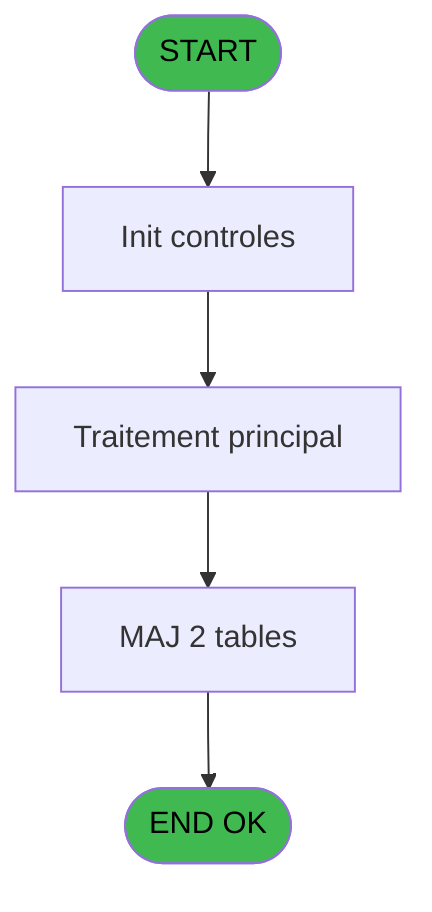
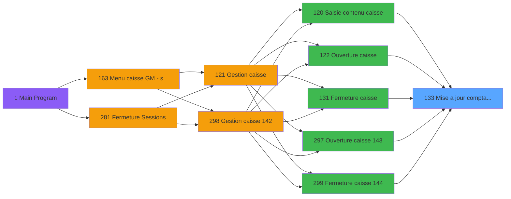
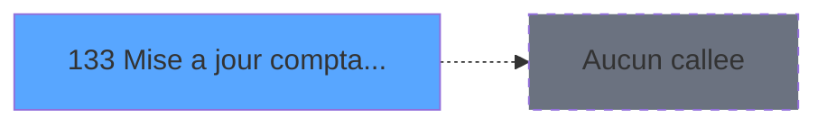

# ADH IDE 133 - Mise a jour comptage caisse WS

> **Analyse**: Phases 1-4 2026-02-08 03:12 -> 03:12 (4s) | Assemblage 03:12
> **Pipeline**: V7.2 Enrichi
> **Structure**: 4 onglets (Resume | Ecrans | Donnees | Connexions)

<!-- TAB:Resume -->

## 1. FICHE D'IDENTITE

| Attribut | Valeur |
|----------|--------|
| Projet | ADH |
| IDE Position | 133 |
| Nom Programme | Mise a jour comptage caisse WS |
| Fichier source | `Prg_133.xml` |
| Dossier IDE | Caisse |
| Taches | 6 (0 ecrans visibles) |
| Tables modifiees | 2 |
| Programmes appeles | 0 |
| Complexite | **BASSE** (score 14/100) |

## 2. DESCRIPTION FONCTIONNELLE

Ce programme met à jour l'historique du comptage de caisse en enregistrant l'état actuel des devises et des mouvements financiers. Il est appelé à plusieurs moments clés du cycle de caisse : lors de l'ouverture initiale (IDE 122), la saisie du contenu (IDE 120), et surtout à la fermeture (IDE 131). Son rôle principal est de créer une trace horodatée de chaque comptage pour permettre le suivi de la trésorerie et l'audit des opérations.

Le programme traite deux tables en parallèle : `comptage_caisse_histo` qui enregistre le comptage global avec ses paramètres (date, heure, opérateur, cumuls), et `comptage_caisse_devise_histo` qui détaille le comptage par devise (montants comptés, écarts, totaux). Cette double enregistrement permet de conserver un historique complet et consultable des états successifs de la caisse.

L'opération est relativement atomique : le programme insère d'abord l'en-tête du comptage, puis boucle sur chaque devise en calculant les sous-totaux et les écarts avant d'insérer les lignes de détail. En cas d'erreur lors de la sauvegarde, la transaction doit être entièrement annulée pour éviter d'avoir des enregistrements incohérents (en-tête sans détails ou vice versa).

## 3. BLOCS FONCTIONNELS

## 5. REGLES METIER

1 regles identifiees:

### Autres (1 regles)

#### [RM-001] Param Quand [A]

| Element | Detail |
|---------|--------|
| **Condition** | `Param Quand [A]` |
| **Si vrai** | Action conditionnelle |
| **Variables** | EN (Param Quand) |
| **Expression source** | Expression 4 : `Param Quand [A]` |
| **Exemple** | Si Param Quand [A] → Action conditionnelle |

## 6. CONTEXTE

- **Appele par**: [Fermeture caisse (IDE 131)](ADH-IDE-131.md), [Saisie contenu caisse (IDE 120)](ADH-IDE-120.md), [Ouverture caisse (IDE 122)](ADH-IDE-122.md), [Ouverture caisse 143 (IDE 297)](ADH-IDE-297.md), [Fermeture caisse 144 (IDE 299)](ADH-IDE-299.md)
- **Appelle**: 0 programmes | **Tables**: 6 (W:2 R:3 L:3) | **Taches**: 6 | **Expressions**: 14

<!-- TAB:Ecrans -->

## 8. ECRANS

*(Programme sans ecran visible)*

## 9. NAVIGATION

### 9.3 Structure hierarchique (0 tache)

| Position | Tache | Type | Dimensions | Bloc |
|----------|-------|------|------------|------|

### 9.4 Algorigramme

> **Legende**: Vert = START/END OK | Rouge = END KO | Bleu = Decisions
> *Algorigramme auto-genere. Utiliser `/algorigramme` pour une synthese metier detaillee.*

<!-- TAB:Donnees -->

## 10. TABLES

### Tables utilisees (6)

| ID | Nom | Description | Type | R | W | L | Usages |
|----|-----|-------------|------|---|---|---|--------|
| 222 | comptage_caisse_histo | Sessions de caisse | DB |   | **W** | L | 2 |
| 220 | comptage_caisse_devise_histo | Sessions de caisse | DB |   | **W** | L | 2 |
| 493 | edition_ticket |  | TMP | R |   |   | 1 |
| 492 | edition_tableau_recap |  | DB | R |   |   | 1 |
| 491 | soldes_par_mop |  | TMP | R |   |   | 1 |
| 223 | comptage_caisse_montant_histo | Sessions de caisse | DB |   |   | L | 1 |

### Colonnes par table (3 / 5 tables avec colonnes identifiees)

Table 222 - comptage_caisse_histo (**W**/L) - 2 usages

| Lettre | Variable | Acces | Type |
|--------|----------|-------|------|
| EO | Param Chrono histo | W | Numeric |
| ES | Param Total caisse | W | Numeric |

Table 220 - comptage_caisse_devise_histo (**W**/L) - 2 usages

| Lettre | Variable | Acces | Type |
|--------|----------|-------|------|
| EO | Param Chrono histo | W | Numeric |
| ES | Param Total caisse | W | Numeric |

Table 493 - edition_ticket (R) - 1 usages

*Table utilisee uniquement en Link ou aucune colonne Real identifiee dans le DataView.*

Table 492 - edition_tableau_recap (R) - 1 usages

*Table utilisee uniquement en Link ou aucune colonne Real identifiee dans le DataView.*

Table 491 - soldes_par_mop (R) - 1 usages

*Table utilisee uniquement en Link ou aucune colonne Real identifiee dans le DataView.*

## 11. VARIABLES

### 11.1 Autres (6)

Variables diverses.

| Lettre | Nom | Type | Usage dans |
|--------|-----|------|-----------|
| EN | Param Quand | Alpha | 1x refs |
| EO | Param Chrono histo | Numeric | 1x refs |
| EP | Param Date Validation | Date | 1x refs |
| EQ | Param Time Validation | Time | 1x refs |
| ER | Param chrono session | Numeric | 1x refs |
| ES | Param Total caisse | Numeric | 1x refs |

## 12. EXPRESSIONS

**14 / 14 expressions decodees (100%)**

### 12.1 Repartition par type

| Type | Expressions | Regles |
|------|-------------|--------|
| REFERENCE_VG | 1 | 0 |
| OTHER | 13 | 0 |

### 12.2 Expressions cles par type

#### REFERENCE_VG (1 expressions)

| Type | IDE | Expression | Regle |
|------|-----|------------|-------|
| REFERENCE_VG | 1 | `VG1` | - |

#### OTHER (13 expressions)

| Type | IDE | Expression | Regle |
|------|-----|------------|-------|
| OTHER | 11 | `{1,4}` | - |
| OTHER | 10 | `{1,3}` | - |
| OTHER | 9 | `Param Total caisse [F]` | - |
| OTHER | 14 | `[H]` | - |
| OTHER | 13 | `[G]` | - |
| ... | | *+8 autres* | |

<!-- TAB:Connexions -->

## 13. GRAPHE D'APPELS

### 13.1 Chaine depuis Main (Callers)

Main -> ... -> [Fermeture caisse (IDE 131)](ADH-IDE-131.md) -> **Mise a jour comptage caisse WS (IDE 133)**

Main -> ... -> [Saisie contenu caisse (IDE 120)](ADH-IDE-120.md) -> **Mise a jour comptage caisse WS (IDE 133)**

Main -> ... -> [Ouverture caisse (IDE 122)](ADH-IDE-122.md) -> **Mise a jour comptage caisse WS (IDE 133)**

Main -> ... -> [Ouverture caisse 143 (IDE 297)](ADH-IDE-297.md) -> **Mise a jour comptage caisse WS (IDE 133)**

Main -> ... -> [Fermeture caisse 144 (IDE 299)](ADH-IDE-299.md) -> **Mise a jour comptage caisse WS (IDE 133)**

### 13.2 Callers

| IDE | Nom Programme | Nb Appels |
|-----|---------------|-----------|
| [131](ADH-IDE-131.md) | Fermeture caisse | 2 |
| [120](ADH-IDE-120.md) | Saisie contenu caisse | 1 |
| [122](ADH-IDE-122.md) | Ouverture caisse | 1 |
| [297](ADH-IDE-297.md) | Ouverture caisse 143 | 1 |
| [299](ADH-IDE-299.md) | Fermeture caisse 144 | 1 |

### 13.3 Callees (programmes appeles)

### 13.4 Detail Callees avec contexte

| IDE | Nom Programme | Appels | Contexte |
|-----|---------------|--------|----------|
| - | (aucun) | - | - |

## 14. RECOMMANDATIONS MIGRATION

### 14.1 Profil du programme

| Metrique | Valeur | Impact migration |
|----------|--------|-----------------|
| Lignes de logique | 105 | Programme compact |
| Expressions | 14 | Peu de logique |
| Tables WRITE | 2 | Impact faible |
| Sous-programmes | 0 | Peu de dependances |
| Ecrans visibles | 0 | Ecran unique ou traitement batch |
| Code desactive | 0% (0 / 105) | Code sain |
| Regles metier | 1 | Quelques regles a preserver |

### 14.2 Plan de migration par bloc

### 14.3 Dependances critiques

| Dependance | Type | Appels | Impact |
|------------|------|--------|--------|
| comptage_caisse_devise_histo | Table WRITE (Database) | 1x | Schema + repository |
| comptage_caisse_histo | Table WRITE (Database) | 1x | Schema + repository |

---
*Spec DETAILED generee par Pipeline V7.2 - 2026-02-08 03:12*
