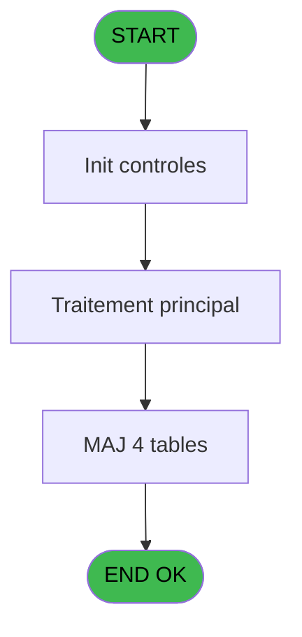
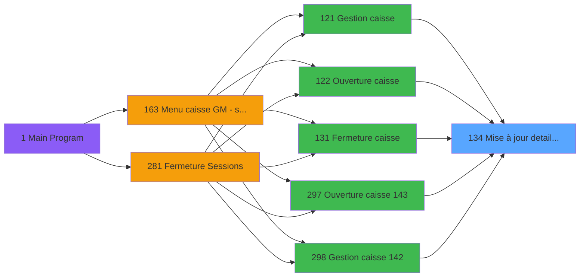
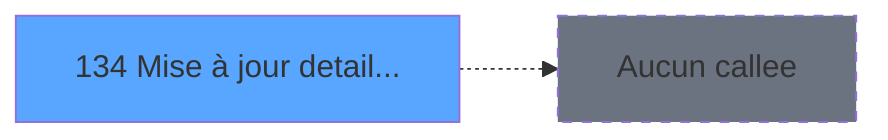

# ADH IDE 134 - Mise à jour detail session WS

> **Analyse**: Phases 1-4 2026-02-08 03:12 -> 03:12 (4s) | Assemblage 03:12
> **Pipeline**: V7.2 Enrichi
> **Structure**: 4 onglets (Resume | Ecrans | Donnees | Connexions)

<!-- TAB:Resume -->

## 1. FICHE D'IDENTITE

| Attribut | Valeur |
|----------|--------|
| Projet | ADH |
| IDE Position | 134 |
| Nom Programme | Mise à jour detail session WS |
| Fichier source | `Prg_134.xml` |
| Dossier IDE | Caisse |
| Taches | 18 (0 ecrans visibles) |
| Tables modifiees | 4 |
| Programmes appeles | 0 |
| Complexite | **BASSE** (score 26/100) |

## 2. DESCRIPTION FONCTIONNELLE

Ce programme met à jour les enregistrements de détail dans les quatre tables d'historique de session caisse (`histo_sessions_caisse_article`, `histo_sessions_caisse_detail`, `histo_sessions_caisse_devise`, `histo_sessions_caisse_remise`). Il reçoit en paramètre les identifiants de session et de détail, puis localise et met à jour le bon enregistrement en fonction du type de détail fourni. C'est un programme utilitaire appelé répétitivement lors des opérations de caisse pour journaliser les modifications apportées aux sessions.

Le programme gère quatre catégories de détail : articles vendus, détails de fermeture (comme les écarts de trésorerie), devises échangées, et remises appliquées. Pour chaque type, il cherche le bon enregistrement dans la table correspondante et le met à jour avec les nouvelles valeurs. Cette séparation en quatre tables permet une traçabilité fine de chaque opération caisse et facilite le reporting ultérieur.

Son intégration dans le flux de gestion caisse en fait un maillon critique : chaque appel depuis l'ouverture (IDE 122, 143) ou la fermeture (IDE 131, 144) ou la gestion manuelle (IDE 121, 298) crée ou modifie des traces dans l'historique, formant ainsi un audit trail complet de la session caisse. Les mises à jour sont appliquées directement aux tables sans passer par des vues, garantissant que chaque modification est enregistrée en base.

## 3. BLOCS FONCTIONNELS

## 5. REGLES METIER

6 regles identifiees:

### Autres (6 regles)

#### [RM-001] Condition: Param Type [G] egale 'E'

| Element | Detail |
|---------|--------|
| **Condition** | `Param Type [G]='E'` |
| **Si vrai** | Action si vrai |
| **Variables** | ET (Param Type) |
| **Expression source** | Expression 17 : `Param Type [G]='E'` |
| **Exemple** | Si Param Type [G]='E' → Action si vrai |

#### [RM-002] Condition: Param Nbre devises [N] different de 0

| Element | Detail |
|---------|--------|
| **Condition** | `Param Nbre devises [N]<>0` |
| **Si vrai** | Action si vrai |
| **Variables** | FA (Param Nbre devises) |
| **Expression source** | Expression 18 : `Param Nbre devises [N]<>0` |
| **Exemple** | Si Param Nbre devises [N]<>0 → Action si vrai |

#### [RM-003] Condition: Param Type [G] egale 'V'

| Element | Detail |
|---------|--------|
| **Condition** | `Param Type [G]='V'` |
| **Si vrai** | Action si vrai |
| **Variables** | ET (Param Type) |
| **Expression source** | Expression 19 : `Param Type [G]='V'` |
| **Exemple** | Si Param Type [G]='V' → Action si vrai |

#### [RM-004] Condition: Param Type [G]='V' AND Param montant produits [J] different de 0

| Element | Detail |
|---------|--------|
| **Condition** | `Param Type [G]='V' AND Param montant produits [J]<>0` |
| **Si vrai** | Action si vrai |
| **Variables** | ET (Param Type), EU (Param montant), EW (Param montant produits) |
| **Expression source** | Expression 20 : `Param Type [G]='V' AND Param montant produits [J]<>0` |
| **Exemple** | Si Param Type [G]='V' AND Param montant produits [J]<>0 → Action si vrai |

#### [RM-005] Condition: Param Quand [E]='O' AND Param Type [G] egale 'I'

| Element | Detail |
|---------|--------|
| **Condition** | `Param Quand [E]='O' AND Param Type [G]='I'` |
| **Si vrai** | Action si vrai |
| **Variables** | ER (Param Quand), ET (Param Type) |
| **Expression source** | Expression 21 : `Param Quand [E]='O' AND Param Type [G]='I'` |
| **Exemple** | Si Param Quand [E]='O' AND Param Type [G]='I' → Action si vrai |

#### [RM-006] Si Param ouverture auto [Q] alors 'O' sinon '')

| Element | Detail |
|---------|--------|
| **Condition** | `Param ouverture auto [Q]` |
| **Si vrai** | 'O' |
| **Si faux** | '') |
| **Variables** | FD (Param ouverture auto) |
| **Expression source** | Expression 25 : `IF(Param ouverture auto [Q],'O','')` |
| **Exemple** | Si Param ouverture auto [Q] → 'O'. Sinon → '') |

## 6. CONTEXTE

- **Appele par**: [Fermeture caisse (IDE 131)](ADH-IDE-131.md), [Ouverture caisse (IDE 122)](ADH-IDE-122.md), [Ouverture caisse 143 (IDE 297)](ADH-IDE-297.md), [Fermeture caisse 144 (IDE 299)](ADH-IDE-299.md), [Gestion caisse (IDE 121)](ADH-IDE-121.md), [Gestion caisse 142 (IDE 298)](ADH-IDE-298.md)
- **Appelle**: 0 programmes | **Tables**: 10 (W:4 R:6 L:0) | **Taches**: 18 | **Expressions**: 25

<!-- TAB:Ecrans -->

## 8. ECRANS

*(Programme sans ecran visible)*

## 9. NAVIGATION

### 9.3 Structure hierarchique (0 tache)

| Position | Tache | Type | Dimensions | Bloc |
|----------|-------|------|------------|------|

### 9.4 Algorigramme

> **Legende**: Vert = START/END OK | Rouge = END KO | Bleu = Decisions
> *Algorigramme auto-genere. Utiliser `/algorigramme` pour une synthese metier detaillee.*

<!-- TAB:Donnees -->

## 10. TABLES

### Tables utilisees (10)

| ID | Nom | Description | Type | R | W | L | Usages |
|----|-----|-------------|------|---|---|---|--------|
| 250 | histo_sessions_caisse_devise | Sessions de caisse | DB |   | **W** |   | 4 |
| 247 | histo_sessions_caisse_article | Articles et stock | DB |   | **W** |   | 2 |
| 249 | histo_sessions_caisse_detail | Sessions de caisse | DB |   | **W** |   | 1 |
| 251 | histo_sessions_caisse_remise | Sessions de caisse | DB |   | **W** |   | 1 |
| 196 | gestion_article_session | Articles et stock | DB | R |   |   | 2 |
| 244 | saisie_approvisionnement | Comptage approvisionnement | DB | R |   |   | 2 |
| 232 | gestion_devise_session | Sessions de caisse | DB | R |   |   | 2 |
| 505 | pv_comptable |  | TMP | R |   |   | 1 |
| 139 | moyens_reglement_mor | Reglements / paiements | DB | R |   |   | 1 |
| 50 | moyens_reglement_mor | Reglements / paiements | DB | R |   |   | 1 |

### Colonnes par table (4 / 10 tables avec colonnes identifiees)

Table 250 - histo_sessions_caisse_devise (**W**) - 4 usages

| Lettre | Variable | Acces | Type |
|--------|----------|-------|------|
| EO | Param devise locale | W | Alpha |
| FA | Param Nbre devises | W | Numeric |
| FC | Param commentaire ecart devise | W | Alpha |

Table 247 - histo_sessions_caisse_article (**W**) - 2 usages

*Table utilisee uniquement en Link ou aucune colonne Real identifiee dans le DataView.*

Table 249 - histo_sessions_caisse_detail (**W**) - 1 usages

| Lettre | Variable | Acces | Type |
|--------|----------|-------|------|
| A | Param societe | W | Alpha |
| B | Param devise locale | W | Alpha |
| C | Param UNI/BI | W | Alpha |
| D | Param chrono session | W | Numeric |
| E | Param Quand | W | Alpha |
| F | Param Quoi | W | Alpha |
| G | Param Type | W | Alpha |
| H | Param montant | W | Numeric |
| I | Param montant monnaie | W | Numeric |
| J | Param montant produits | W | Numeric |
| K | Param montant cartes | W | Numeric |
| L | Param montant cheques | W | Numeric |
| M | Param montant od | W | Numeric |
| N | Param Nbre devises | W | Numeric |
| O | Param commentaire ecart | W | Alpha |
| P | Param commentaire ecart devise | W | Alpha |
| Q | Param ouverture auto | W | Logical |

Table 251 - histo_sessions_caisse_remise (**W**) - 1 usages

*Table utilisee uniquement en Link ou aucune colonne Real identifiee dans le DataView.*

Table 196 - gestion_article_session (R) - 2 usages

| Lettre | Variable | Acces | Type |
|--------|----------|-------|------|
| EQ | Param chrono session | R | Numeric |

Table 244 - saisie_approvisionnement (R) - 2 usages

*Table utilisee uniquement en Link ou aucune colonne Real identifiee dans le DataView.*

Table 232 - gestion_devise_session (R) - 2 usages

| Lettre | Variable | Acces | Type |
|--------|----------|-------|------|
| EO | Param devise locale | R | Alpha |
| EQ | Param chrono session | R | Numeric |
| FA | Param Nbre devises | R | Numeric |
| FC | Param commentaire ecart devise | R | Alpha |

Table 505 - pv_comptable (R) - 1 usages

*Table utilisee uniquement en Link ou aucune colonne Real identifiee dans le DataView.*

Table 139 - moyens_reglement_mor (R) - 1 usages

*Table utilisee uniquement en Link ou aucune colonne Real identifiee dans le DataView.*

Table 50 - moyens_reglement_mor (R) - 1 usages

*Table utilisee uniquement en Link ou aucune colonne Real identifiee dans le DataView.*

## 11. VARIABLES

### 11.1 Autres (17)

Variables diverses.

| Lettre | Nom | Type | Usage dans |
|--------|-----|------|-----------|
| EN | Param societe | Alpha | - |
| EO | Param devise locale | Alpha | - |
| EP | Param UNI/BI | Alpha | - |
| EQ | Param chrono session | Numeric | 1x refs |
| ER | Param Quand | Alpha | 2x refs |
| ES | Param Quoi | Alpha | - |
| ET | Param Type | Alpha | 5x refs |
| EU | Param montant | Numeric | 7x refs |
| EV | Param montant monnaie | Numeric | 1x refs |
| EW | Param montant produits | Numeric | 2x refs |
| EX | Param montant cartes | Numeric | 1x refs |
| EY | Param montant cheques | Numeric | 1x refs |
| EZ | Param montant od | Numeric | 1x refs |
| FA | Param Nbre devises | Numeric | 2x refs |
| FB | Param commentaire ecart | Alpha | 1x refs |
| FC | Param commentaire ecart devise | Alpha | - |
| FD | Param ouverture auto | Logical | 1x refs |

Toutes les 17 variables (liste complete)

| Cat | Lettre | Nom Variable | Type |
|-----|--------|--------------|------|
| Autre | **EN** | Param societe | Alpha |
| Autre | **EO** | Param devise locale | Alpha |
| Autre | **EP** | Param UNI/BI | Alpha |
| Autre | **EQ** | Param chrono session | Numeric |
| Autre | **ER** | Param Quand | Alpha |
| Autre | **ES** | Param Quoi | Alpha |
| Autre | **ET** | Param Type | Alpha |
| Autre | **EU** | Param montant | Numeric |
| Autre | **EV** | Param montant monnaie | Numeric |
| Autre | **EW** | Param montant produits | Numeric |
| Autre | **EX** | Param montant cartes | Numeric |
| Autre | **EY** | Param montant cheques | Numeric |
| Autre | **EZ** | Param montant od | Numeric |
| Autre | **FA** | Param Nbre devises | Numeric |
| Autre | **FB** | Param commentaire ecart | Alpha |
| Autre | **FC** | Param commentaire ecart devise | Alpha |
| Autre | **FD** | Param ouverture auto | Logical |

## 12. EXPRESSIONS

**25 / 25 expressions decodees (100%)**

### 12.1 Repartition par type

| Type | Expressions | Regles |
|------|-------------|--------|
| CALCULATION | 1 | 0 |
| CONDITION | 6 | 6 |
| CONSTANTE | 1 | 0 |
| DATE | 1 | 0 |
| REFERENCE_VG | 1 | 0 |
| OTHER | 14 | 0 |
| STRING | 1 | 0 |

### 12.2 Expressions cles par type

#### CALCULATION (1 expressions)

| Type | IDE | Expression | Regle |
|------|-----|------------|-------|
| CALCULATION | 3 | `[T]+1` | - |

#### CONDITION (6 expressions)

| Type | IDE | Expression | Regle |
|------|-----|------------|-------|
| CONDITION | 20 | `Param Type [G]='V' AND Param montant produits [J]<>0` | [RM-004](#rm-RM-004) |
| CONDITION | 21 | `Param Quand [E]='O' AND Param Type [G]='I'` | [RM-005](#rm-RM-005) |
| CONDITION | 25 | `IF(Param ouverture auto [Q],'O','')` | [RM-006](#rm-RM-006) |
| CONDITION | 17 | `Param Type [G]='E'` | [RM-001](#rm-RM-001) |
| CONDITION | 18 | `Param Nbre devises [N]<>0` | [RM-002](#rm-RM-002) |
| ... | | *+1 autres* | |

#### CONSTANTE (1 expressions)

| Type | IDE | Expression | Regle |
|------|-----|------------|-------|
| CONSTANTE | 22 | `'REC'` | - |

#### DATE (1 expressions)

| Type | IDE | Expression | Regle |
|------|-----|------------|-------|
| DATE | 6 | `Date ()` | - |

#### REFERENCE_VG (1 expressions)

| Type | IDE | Expression | Regle |
|------|-----|------------|-------|
| REFERENCE_VG | 1 | `VG1` | - |

#### OTHER (14 expressions)

| Type | IDE | Expression | Regle |
|------|-----|------------|-------|
| OTHER | 13 | `Param montant od [M]` | - |
| OTHER | 12 | `Param montant cheques [L]` | - |
| OTHER | 11 | `Param montant cartes [K]` | - |
| OTHER | 14 | `Param commentaire ecart [O]` | - |
| OTHER | 24 | `GetHostName ()` | - |
| ... | | *+9 autres* | |

#### STRING (1 expressions)

| Type | IDE | Expression | Regle |
|------|-----|------------|-------|
| STRING | 23 | `Str (VG79,'3P0')` | - |

### 12.3 Toutes les expressions (25)

Voir les 25 expressions

#### CALCULATION (1)

| IDE | Expression Decodee |
|-----|-------------------|
| 3 | `[T]+1` |

#### CONDITION (6)

| IDE | Expression Decodee |
|-----|-------------------|
| 17 | `Param Type [G]='E'` |
| 18 | `Param Nbre devises [N]<>0` |
| 19 | `Param Type [G]='V'` |
| 20 | `Param Type [G]='V' AND Param montant produits [J]<>0` |
| 21 | `Param Quand [E]='O' AND Param Type [G]='I'` |
| 25 | `IF(Param ouverture auto [Q],'O','')` |

#### CONSTANTE (1)

| IDE | Expression Decodee |
|-----|-------------------|
| 22 | `'REC'` |

#### DATE (1)

| IDE | Expression Decodee |
|-----|-------------------|
| 6 | `Date ()` |

#### REFERENCE_VG (1)

| IDE | Expression Decodee |
|-----|-------------------|
| 1 | `VG1` |

#### OTHER (14)

| IDE | Expression Decodee |
|-----|-------------------|
| 2 | `Param chrono session [D]` |
| 4 | `Param Type [G]` |
| 5 | `Param Quand [E]` |
| 7 | `Time ()` |
| 8 | `Param montant [H]` |
| 9 | `Param montant monnaie [I]` |
| 10 | `Param montant produits [J]` |
| 11 | `Param montant cartes [K]` |
| 12 | `Param montant cheques [L]` |
| 13 | `Param montant od [M]` |
| 14 | `Param commentaire ecart [O]` |
| 15 | `Param Nbre devises [N]` |
| 16 | `Param commentaire ecar... [P]` |
| 24 | `GetHostName ()` |

#### STRING (1)

| IDE | Expression Decodee |
|-----|-------------------|
| 23 | `Str (VG79,'3P0')` |

<!-- TAB:Connexions -->

## 13. GRAPHE D'APPELS

### 13.1 Chaine depuis Main (Callers)

Main -> ... -> [Fermeture caisse (IDE 131)](ADH-IDE-131.md) -> **Mise à jour detail session WS (IDE 134)**

Main -> ... -> [Ouverture caisse (IDE 122)](ADH-IDE-122.md) -> **Mise à jour detail session WS (IDE 134)**

Main -> ... -> [Ouverture caisse 143 (IDE 297)](ADH-IDE-297.md) -> **Mise à jour detail session WS (IDE 134)**

Main -> ... -> [Fermeture caisse 144 (IDE 299)](ADH-IDE-299.md) -> **Mise à jour detail session WS (IDE 134)**

Main -> ... -> [Gestion caisse (IDE 121)](ADH-IDE-121.md) -> **Mise à jour detail session WS (IDE 134)**

Main -> ... -> [Gestion caisse 142 (IDE 298)](ADH-IDE-298.md) -> **Mise à jour detail session WS (IDE 134)**

### 13.2 Callers

| IDE | Nom Programme | Nb Appels |
|-----|---------------|-----------|
| [131](ADH-IDE-131.md) | Fermeture caisse | 14 |
| [122](ADH-IDE-122.md) | Ouverture caisse | 7 |
| [297](ADH-IDE-297.md) | Ouverture caisse 143 | 7 |
| [299](ADH-IDE-299.md) | Fermeture caisse 144 | 7 |
| [121](ADH-IDE-121.md) | Gestion caisse | 3 |
| [298](ADH-IDE-298.md) | Gestion caisse 142 | 3 |

### 13.3 Callees (programmes appeles)

### 13.4 Detail Callees avec contexte

| IDE | Nom Programme | Appels | Contexte |
|-----|---------------|--------|----------|
| - | (aucun) | - | - |

## 14. RECOMMANDATIONS MIGRATION

### 14.1 Profil du programme

| Metrique | Valeur | Impact migration |
|----------|--------|-----------------|
| Lignes de logique | 294 | Taille moyenne |
| Expressions | 25 | Peu de logique |
| Tables WRITE | 4 | Impact modere |
| Sous-programmes | 0 | Peu de dependances |
| Ecrans visibles | 0 | Ecran unique ou traitement batch |
| Code desactive | 0% (0 / 294) | Code sain |
| Regles metier | 6 | Quelques regles a preserver |

### 14.2 Plan de migration par bloc

### 14.3 Dependances critiques

| Dependance | Type | Appels | Impact |
|------------|------|--------|--------|
| histo_sessions_caisse_article | Table WRITE (Database) | 2x | Schema + repository |
| histo_sessions_caisse_detail | Table WRITE (Database) | 1x | Schema + repository |
| histo_sessions_caisse_devise | Table WRITE (Database) | 4x | Schema + repository |
| histo_sessions_caisse_remise | Table WRITE (Database) | 1x | Schema + repository |

---
*Spec DETAILED generee par Pipeline V7.2 - 2026-02-08 03:13*
