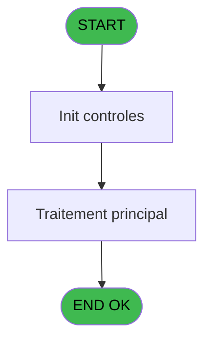
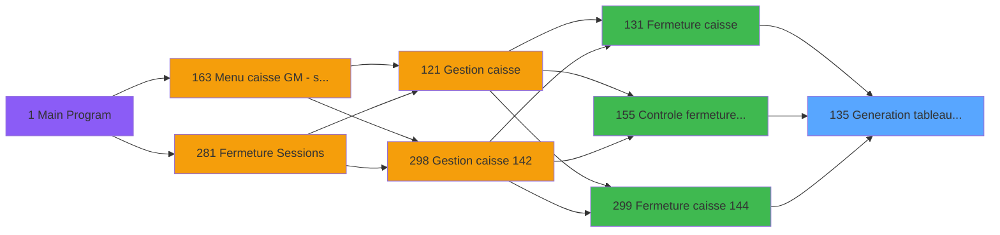
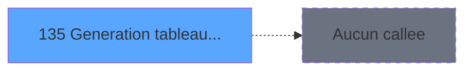

# ADH IDE 135 - Generation tableau recap WS

> **Analyse**: Phases 1-4 2026-02-08 03:13 -> 03:13 (4s) | Assemblage 03:13
> **Pipeline**: V7.2 Enrichi
> **Structure**: 4 onglets (Resume | Ecrans | Donnees | Connexions)

<!-- TAB:Resume -->

## 1. FICHE D'IDENTITE

| Attribut | Valeur |
|----------|--------|
| Projet | ADH |
| IDE Position | 135 |
| Nom Programme | Generation tableau recap WS |
| Fichier source | `Prg_135.xml` |
| Dossier IDE | General |
| Taches | 1 (0 ecrans visibles) |
| Tables modifiees | 0 |
| Programmes appeles | 0 |
| Complexite | **BASSE** (score 0/100) |

## 2. DESCRIPTION FONCTIONNELLE

ADH IDE 135 - GENERATION TABLEAU RECAP WS est un programme de synthèse qui consolide les données de fermeture de caisse en tableau récapitulatif. Appelé à la fin du workflow de fermeture (depuis ADH IDE 131, IDE 155 ou IDE 299), il agrège les mouvements de trésorerie, les écarts détectés et génère un fichier résumé pour transmission au siège ou archivage.

Le programme traite les données de session (devises manipulées, montants comptés vs attendus, écarts par type de mouvement) et les formate dans un tableau lisible. Il gère les différentes devises selon la configuration locale et calcule les totaux consolidés. Le résultat est typiquement exporté en fichier texte ou directement alimenté un module de reporting (WS = Web Service ou Worksheet selon contexte).

Ce programme est essentiel pour l'audit de caisse : il produit la trace documentée de chaque fermeture et permet la réconciliation avec le siège. Sans lui, les équipes terrain n'auraient pas de preuve formelle du solde clôturé. C'est un utility programme sans interface directe, puremnet orienté données et exports.

## 3. BLOCS FONCTIONNELS

## 5. REGLES METIER

*(Aucune regle metier identifiee dans les expressions)*

## 6. CONTEXTE

- **Appele par**: [Controle fermeture caisse WS (IDE 155)](ADH-IDE-155.md), [Fermeture caisse (IDE 131)](ADH-IDE-131.md), [Fermeture caisse 144 (IDE 299)](ADH-IDE-299.md)
- **Appelle**: 0 programmes | **Tables**: 2 (W:0 R:1 L:1) | **Taches**: 1 | **Expressions**: 30

<!-- TAB:Ecrans -->

## 8. ECRANS

*(Programme sans ecran visible)*

## 9. NAVIGATION

### 9.3 Structure hierarchique (0 tache)

| Position | Tache | Type | Dimensions | Bloc |
|----------|-------|------|------------|------|

### 9.4 Algorigramme

> **Legende**: Vert = START/END OK | Rouge = END KO | Bleu = Decisions
> *Algorigramme auto-genere. Utiliser `/algorigramme` pour une synthese metier detaillee.*

<!-- TAB:Donnees -->

## 10. TABLES

### Tables utilisees (2)

| ID | Nom | Description | Type | R | W | L | Usages |
|----|-----|-------------|------|---|---|---|--------|
| 693 | devise_in | Devises / taux de change | DB | R |   |   | 1 |
| 510 | pv_discounts |  | TMP |   |   | L | 1 |

### Colonnes par table (1 / 1 tables avec colonnes identifiees)

Table 693 - devise_in (R) - 1 usages

| Lettre | Variable | Acces | Type |
|--------|----------|-------|------|
| A | Param date comptable | R | Date |
| B | Param numero session | R | Numeric |
| C | Param type | R | Alpha |
| D | Param type appro_vers_coffre | R | Alpha |
| E | Param mode de paiement | R | Alpha |
| F | Param avec change | R | Alpha |
| G | Param code devise | R | Alpha |
| H | Param quantite devise | R | Numeric |
| I | Param taux devise | R | Numeric |
| J | Param montant | R | Numeric |
| K | Param montant monnaie | R | Numeric |
| L | Param montant produits | R | Numeric |
| M | Param montant cartes | R | Numeric |
| N | Param montant chèque | R | Numeric |
| O | Param montant od | R | Numeric |
| P | Param societe | R | Alpha |
| Q | Param compte village | R | Numeric |
| R | Param filiation | R | Numeric |
| S | Param imputation | R | Numeric |
| T | Param sous imputation | R | Numeric |
| U | Param libelle | R | Alpha |
| V | Param libelle complementaire | R | Alpha |
| W | Param nom GM | R | Alpha |
| X | Param quantite article | R | Numeric |
| Y | Param prix article | R | Numeric |

## 11. VARIABLES

### 11.1 Autres (25)

Variables diverses.

| Lettre | Nom | Type | Usage dans |
|--------|-----|------|-----------|
| EN | Param date comptable | Date | 1x refs |
| EO | Param numero session | Numeric | 1x refs |
| EP | Param type | Alpha | 2x refs |
| EQ | Param type appro_vers_coffre | Alpha | - |
| ER | Param mode de paiement | Alpha | 1x refs |
| ES | Param avec change | Alpha | 1x refs |
| ET | Param code devise | Alpha | 1x refs |
| EU | Param quantite devise | Numeric | 1x refs |
| EV | Param taux devise | Numeric | 1x refs |
| EW | Param montant | Numeric | 6x refs |
| EX | Param montant monnaie | Numeric | 1x refs |
| EY | Param montant produits | Numeric | 1x refs |
| EZ | Param montant cartes | Numeric | 1x refs |
| FA | Param montant chèque | Numeric | 1x refs |
| FB | Param montant od | Numeric | 1x refs |
| FC | Param societe | Alpha | 1x refs |
| FD | Param compte village | Numeric | 1x refs |
| FE | Param filiation | Numeric | 1x refs |
| FF | Param imputation | Numeric | 1x refs |
| FG | Param sous imputation | Numeric | 1x refs |
| FH | Param libelle | Alpha | 2x refs |
| FI | Param libelle complementaire | Alpha | - |
| FJ | Param nom GM | Alpha | 1x refs |
| FK | Param quantite article | Numeric | 1x refs |
| FL | Param prix article | Numeric | 1x refs |

Toutes les 25 variables (liste complete)

| Cat | Lettre | Nom Variable | Type |
|-----|--------|--------------|------|
| Autre | **EN** | Param date comptable | Date |
| Autre | **EO** | Param numero session | Numeric |
| Autre | **EP** | Param type | Alpha |
| Autre | **EQ** | Param type appro_vers_coffre | Alpha |
| Autre | **ER** | Param mode de paiement | Alpha |
| Autre | **ES** | Param avec change | Alpha |
| Autre | **ET** | Param code devise | Alpha |
| Autre | **EU** | Param quantite devise | Numeric |
| Autre | **EV** | Param taux devise | Numeric |
| Autre | **EW** | Param montant | Numeric |
| Autre | **EX** | Param montant monnaie | Numeric |
| Autre | **EY** | Param montant produits | Numeric |
| Autre | **EZ** | Param montant cartes | Numeric |
| Autre | **FA** | Param montant chèque | Numeric |
| Autre | **FB** | Param montant od | Numeric |
| Autre | **FC** | Param societe | Alpha |
| Autre | **FD** | Param compte village | Numeric |
| Autre | **FE** | Param filiation | Numeric |
| Autre | **FF** | Param imputation | Numeric |
| Autre | **FG** | Param sous imputation | Numeric |
| Autre | **FH** | Param libelle | Alpha |
| Autre | **FI** | Param libelle complementaire | Alpha |
| Autre | **FJ** | Param nom GM | Alpha |
| Autre | **FK** | Param quantite article | Numeric |
| Autre | **FL** | Param prix article | Numeric |

## 12. EXPRESSIONS

**30 / 30 expressions decodees (100%)**

### 12.1 Repartition par type

| Type | Expressions | Regles |
|------|-------------|--------|
| CALCULATION | 1 | 0 |
| CONSTANTE | 2 | 0 |
| REFERENCE_VG | 1 | 0 |
| OTHER | 26 | 0 |

### 12.2 Expressions cles par type

#### CALCULATION (1 expressions)

| Type | IDE | Expression | Regle |
|------|-----|------------|-------|
| CALCULATION | 1 | `[BA]+1` | - |

#### CONSTANTE (2 expressions)

| Type | IDE | Expression | Regle |
|------|-----|------------|-------|
| CONSTANTE | 4 | `'T'` | - |
| CONSTANTE | 3 | `'FRA'` | - |

#### REFERENCE_VG (1 expressions)

| Type | IDE | Expression | Regle |
|------|-----|------------|-------|
| REFERENCE_VG | 2 | `VG1` | - |

#### OTHER (26 expressions)

| Type | IDE | Expression | Regle |
|------|-----|------------|-------|
| OTHER | 21 | `Param societe [P]` | - |
| OTHER | 22 | `Param compte village [Q]` | - |
| OTHER | 23 | `Param filiation [R]` | - |
| OTHER | 18 | `Param montant cartes [M]` | - |
| OTHER | 19 | `Param montant chèque [N]` | - |
| ... | | *+21 autres* | |

### 12.3 Toutes les expressions (30)

Voir les 30 expressions

#### CALCULATION (1)

| IDE | Expression Decodee |
|-----|-------------------|
| 1 | `[BA]+1` |

#### CONSTANTE (2)

| IDE | Expression Decodee |
|-----|-------------------|
| 3 | `'FRA'` |
| 4 | `'T'` |

#### REFERENCE_VG (1)

| IDE | Expression Decodee |
|-----|-------------------|
| 2 | `VG1` |

#### OTHER (26)

| IDE | Expression Decodee |
|-----|-------------------|
| 5 | `Param date comptable [A]` |
| 6 | `Param numero session [B]` |
| 7 | `Param type [C]` |
| 8 | `[CG]` |
| 9 | `Param type appro_vers_... [D]` |
| 10 | `Param mode de paiement [E]` |
| 11 | `Param avec change [F]` |
| 12 | `Param code devise [G]` |
| 13 | `Param quantite devise [H]` |
| 14 | `Param taux devise [I]` |
| 15 | `Param montant [J]` |
| 16 | `Param montant monnaie [K]` |
| 17 | `Param montant produits [L]` |
| 18 | `Param montant cartes [M]` |
| 19 | `Param montant chèque [N]` |
| 20 | `Param montant od [O]` |
| 21 | `Param societe [P]` |
| 22 | `Param compte village [Q]` |
| 23 | `Param filiation [R]` |
| 24 | `Param imputation [S]` |
| 25 | `Param sous imputation [T]` |
| 26 | `Param libelle [U]` |
| 27 | `Param libelle compleme... [V]` |
| 28 | `Param nom GM [W]` |
| 29 | `Param quantite article [X]` |
| 30 | `Param prix article [Y]` |

<!-- TAB:Connexions -->

## 13. GRAPHE D'APPELS

### 13.1 Chaine depuis Main (Callers)

Main -> ... -> [Controle fermeture caisse WS (IDE 155)](ADH-IDE-155.md) -> **Generation tableau recap WS (IDE 135)**

Main -> ... -> [Fermeture caisse (IDE 131)](ADH-IDE-131.md) -> **Generation tableau recap WS (IDE 135)**

Main -> ... -> [Fermeture caisse 144 (IDE 299)](ADH-IDE-299.md) -> **Generation tableau recap WS (IDE 135)**

### 13.2 Callers

| IDE | Nom Programme | Nb Appels |
|-----|---------------|-----------|
| [155](ADH-IDE-155.md) | Controle fermeture caisse WS | 13 |
| [131](ADH-IDE-131.md) | Fermeture caisse | 2 |
| [299](ADH-IDE-299.md) | Fermeture caisse 144 | 2 |

### 13.3 Callees (programmes appeles)

### 13.4 Detail Callees avec contexte

| IDE | Nom Programme | Appels | Contexte |
|-----|---------------|--------|----------|
| - | (aucun) | - | - |

## 14. RECOMMANDATIONS MIGRATION

### 14.1 Profil du programme

| Metrique | Valeur | Impact migration |
|----------|--------|-----------------|
| Lignes de logique | 98 | Programme compact |
| Expressions | 30 | Peu de logique |
| Tables WRITE | 0 | Impact faible |
| Sous-programmes | 0 | Peu de dependances |
| Ecrans visibles | 0 | Ecran unique ou traitement batch |
| Code desactive | 0% (0 / 98) | Code sain |
| Regles metier | 0 | Pas de regle identifiee |

### 14.2 Plan de migration par bloc

### 14.3 Dependances critiques

| Dependance | Type | Appels | Impact |
|------------|------|--------|--------|

---
*Spec DETAILED generee par Pipeline V7.2 - 2026-02-08 03:13*
