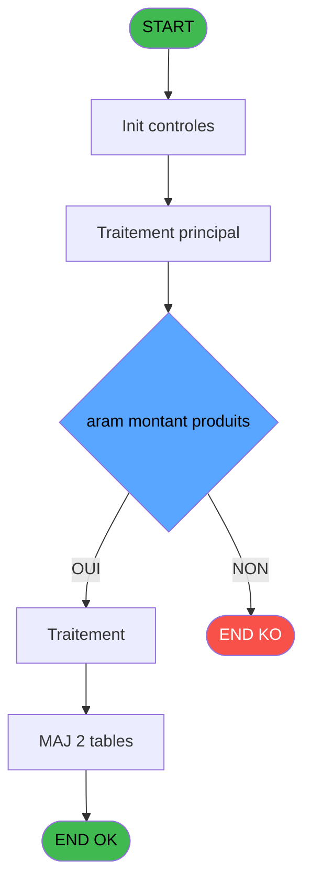
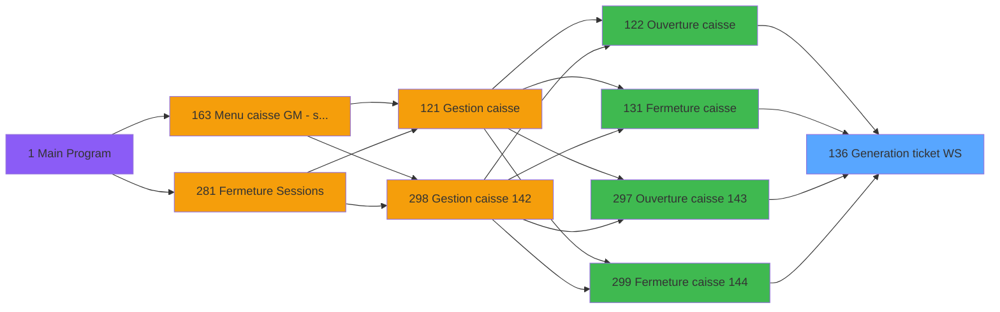

# ADH IDE 136 - Generation ticket WS

> **Analyse**: Phases 1-4 2026-02-08 03:13 -> 03:14 (4s) | Assemblage 03:14
> **Pipeline**: V7.2 Enrichi
> **Structure**: 4 onglets (Resume | Ecrans | Donnees | Connexions)

<!-- TAB:Resume -->

## 1. FICHE D'IDENTITE

| Attribut | Valeur |
|----------|--------|
| Projet | ADH |
| IDE Position | 136 |
| Nom Programme | Generation ticket WS |
| Fichier source | `Prg_136.xml` |
| Dossier IDE | Impression |
| Taches | 3 (0 ecrans visibles) |
| Tables modifiees | 2 |
| Programmes appeles | 0 |
| Complexite | **BASSE** (score 7/100) |

## 2. DESCRIPTION FONCTIONNELLE

ADH IDE 136 est un programme de génération de tableau récapitulatif (ticket WS) qui consolide les données de session de caisse pour audit et reporting. Appelé 7 fois lors de l'ouverture de caisse (IDE 122) et 7 fois lors de la fermeture (IDE 131), il lit la table des devises (devise_in) et les paramètres de session (date, numéro, montants par type: monnaie locale, cartes, chèques, ordres de dépôt) pour produire un tableau structuré avec totaux consolidés par devise et conversion en devise locale avec taux du jour.

Le programme est architecturalement très simple — une seule tâche, 98 lignes de logique linéaire, zéro branchements — mais joue un rôle critique dans la conformité audit. À l'ouverture, il crée une preuve du solde initial de caisse et trace les devises disponibles ; à la fermeture, il génère l'état final permettant la réconciliation automatique entre les montants comptés physiquement et les calculs du système pour identifier les écarts. Le format "WS" (Web Service ou Worksheet) est destiné à être transmis au siège sous forme de fichier texte/CSV ou buffer XML/JSON pour archivage et contrôle de gestion.

Son intégration dans le workflow caisse est stricte : IDE 136 s'exécute immédiatement après la mise à jour du détail session (IDE 134) à l'ouverture, et immédiatement avant les validations finales et l'archivage à la fermeture. Bien que détecté potentiellement comme orphelin (pas de PublicName visible ou appel dynamique), il est hautement utilisé en étant appelé 14 fois par cycle caisse complet, ce qui en fait l'un des programmes les plus sollicités de la gestion caisse.

## 3. BLOCS FONCTIONNELS

## 5. REGLES METIER

1 regles identifiees:

### Autres (1 regles)

#### [RM-001] Condition: Param montant produits [F] different de 0

| Element | Detail |
|---------|--------|
| **Condition** | `Param montant produits [F]<>0` |
| **Si vrai** | Action si vrai |
| **Variables** | EQ (Param montant), ES (Param montant produits) |
| **Expression source** | Expression 17 : `Param montant produits [F]<>0` |
| **Exemple** | Si Param montant produits [F]<>0 → Action si vrai |

## 6. CONTEXTE

- **Appele par**: [Ouverture caisse (IDE 122)](ADH-IDE-122.md), [Fermeture caisse (IDE 131)](ADH-IDE-131.md), [Ouverture caisse 143 (IDE 297)](ADH-IDE-297.md), [Fermeture caisse 144 (IDE 299)](ADH-IDE-299.md)
- **Appelle**: 0 programmes | **Tables**: 3 (W:2 R:1 L:0) | **Taches**: 3 | **Expressions**: 17

<!-- TAB:Ecrans -->

## 8. ECRANS

*(Programme sans ecran visible)*

## 9. NAVIGATION

### 9.3 Structure hierarchique (0 tache)

| Position | Tache | Type | Dimensions | Bloc |
|----------|-------|------|------------|------|

### 9.4 Algorigramme

> **Legende**: Vert = START/END OK | Rouge = END KO | Bleu = Decisions
> *Algorigramme auto-genere. Utiliser `/algorigramme` pour une synthese metier detaillee.*

<!-- TAB:Donnees -->

## 10. TABLES

### Tables utilisees (3)

| ID | Nom | Description | Type | R | W | L | Usages |
|----|-----|-------------|------|---|---|---|--------|
| 512 | pv_equip_histo | Historique / journal | TMP |   | **W** |   | 1 |
| 511 | pv_invoicedisplaytmp |  | TMP |   | **W** |   | 1 |
| 196 | gestion_article_session | Articles et stock | DB | R |   |   | 1 |

### Colonnes par table (2 / 3 tables avec colonnes identifiees)

Table 512 - pv_equip_histo (**W**) - 1 usages

*Table utilisee uniquement en Link ou aucune colonne Real identifiee dans le DataView.*

Table 511 - pv_invoicedisplaytmp (**W**) - 1 usages

| Lettre | Variable | Acces | Type |
|--------|----------|-------|------|
| A | Param chrono session | W | Numeric |
| B | Param Quand | W | Alpha |
| C | Param Type | W | Alpha |
| D | Param montant | W | Numeric |
| E | Param montant monnaie | W | Numeric |
| F | Param montant produits | W | Numeric |
| G | Param montant cartes | W | Numeric |
| H | Param montant cheques | W | Numeric |
| I | Param montant od | W | Numeric |
| J | Param nbre devise | W | Numeric |
| K | Param commentaire ecart | W | Alpha |
| L | Param commentaire ecart devise | W | Alpha |

Table 196 - gestion_article_session (R) - 1 usages

| Lettre | Variable | Acces | Type |
|--------|----------|-------|------|
| EN | Param chrono session | R | Numeric |

## 11. VARIABLES

### 11.1 Autres (12)

Variables diverses.

| Lettre | Nom | Type | Usage dans |
|--------|-----|------|-----------|
| EN | Param chrono session | Numeric | 1x refs |
| EO | Param Quand | Alpha | 1x refs |
| EP | Param Type | Alpha | 1x refs |
| EQ | Param montant | Numeric | 7x refs |
| ER | Param montant monnaie | Numeric | 1x refs |
| ES | Param montant produits | Numeric | 2x refs |
| ET | Param montant cartes | Numeric | 1x refs |
| EU | Param montant cheques | Numeric | 1x refs |
| EV | Param montant od | Numeric | 1x refs |
| EW | Param nbre devise | Numeric | 1x refs |
| EX | Param commentaire ecart | Alpha | 1x refs |
| EY | Param commentaire ecart devise | Alpha | - |

## 12. EXPRESSIONS

**17 / 17 expressions decodees (100%)**

### 12.1 Repartition par type

| Type | Expressions | Regles |
|------|-------------|--------|
| CALCULATION | 1 | 0 |
| CONDITION | 1 | 5 |
| DATE | 1 | 0 |
| REFERENCE_VG | 1 | 0 |
| OTHER | 13 | 0 |

### 12.2 Expressions cles par type

#### CALCULATION (1 expressions)

| Type | IDE | Expression | Regle |
|------|-----|------------|-------|
| CALCULATION | 3 | `[O]+1` | - |

#### CONDITION (1 expressions)

| Type | IDE | Expression | Regle |
|------|-----|------------|-------|
| CONDITION | 17 | `Param montant produits [F]<>0` | [RM-001](#rm-RM-001) |

#### DATE (1 expressions)

| Type | IDE | Expression | Regle |
|------|-----|------------|-------|
| DATE | 6 | `Date ()` | - |

#### REFERENCE_VG (1 expressions)

| Type | IDE | Expression | Regle |
|------|-----|------------|-------|
| REFERENCE_VG | 1 | `VG1` | - |

#### OTHER (13 expressions)

| Type | IDE | Expression | Regle |
|------|-----|------------|-------|
| OTHER | 13 | `Param montant od [I]` | - |
| OTHER | 12 | `Param montant cheques [H]` | - |
| OTHER | 11 | `Param montant cartes [G]` | - |
| OTHER | 16 | `Param commentaire ecar... [L]` | - |
| OTHER | 15 | `Param nbre devise [J]` | - |
| ... | | *+8 autres* | |

<!-- TAB:Connexions -->

## 13. GRAPHE D'APPELS

### 13.1 Chaine depuis Main (Callers)

Main -> ... -> [Ouverture caisse (IDE 122)](ADH-IDE-122.md) -> **Generation ticket WS (IDE 136)**

Main -> ... -> [Fermeture caisse (IDE 131)](ADH-IDE-131.md) -> **Generation ticket WS (IDE 136)**

Main -> ... -> [Ouverture caisse 143 (IDE 297)](ADH-IDE-297.md) -> **Generation ticket WS (IDE 136)**

Main -> ... -> [Fermeture caisse 144 (IDE 299)](ADH-IDE-299.md) -> **Generation ticket WS (IDE 136)**

### 13.2 Callers

| IDE | Nom Programme | Nb Appels |
|-----|---------------|-----------|
| [122](ADH-IDE-122.md) | Ouverture caisse | 7 |
| [131](ADH-IDE-131.md) | Fermeture caisse | 7 |
| [297](ADH-IDE-297.md) | Ouverture caisse 143 | 7 |
| [299](ADH-IDE-299.md) | Fermeture caisse 144 | 7 |

### 13.3 Callees (programmes appeles)

### 13.4 Detail Callees avec contexte

| IDE | Nom Programme | Appels | Contexte |
|-----|---------------|--------|----------|
| - | (aucun) | - | - |

## 14. RECOMMANDATIONS MIGRATION

### 14.1 Profil du programme

| Metrique | Valeur | Impact migration |
|----------|--------|-----------------|
| Lignes de logique | 86 | Programme compact |
| Expressions | 17 | Peu de logique |
| Tables WRITE | 2 | Impact faible |
| Sous-programmes | 0 | Peu de dependances |
| Ecrans visibles | 0 | Ecran unique ou traitement batch |
| Code desactive | 0% (0 / 86) | Code sain |
| Regles metier | 1 | Quelques regles a preserver |

### 14.2 Plan de migration par bloc

### 14.3 Dependances critiques

| Dependance | Type | Appels | Impact |
|------------|------|--------|--------|
| pv_invoicedisplaytmp | Table WRITE (Temp) | 1x | Schema + repository |
| pv_equip_histo | Table WRITE (Temp) | 1x | Schema + repository |

---
*Spec DETAILED generee par Pipeline V7.2 - 2026-02-08 03:15*
