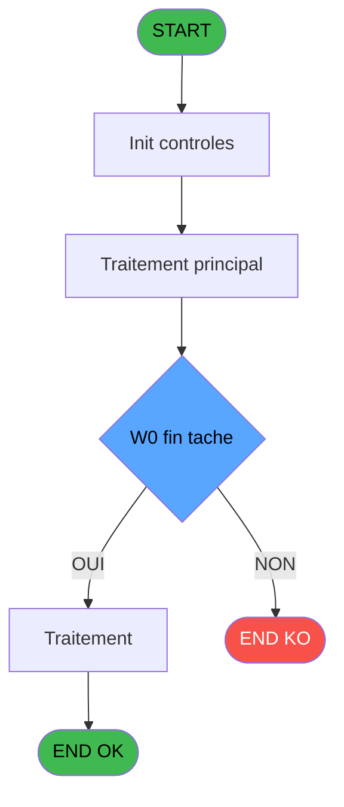
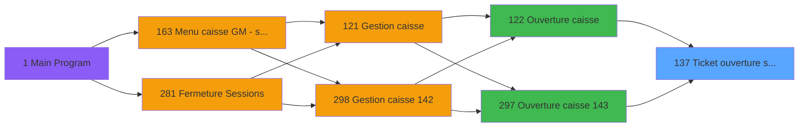
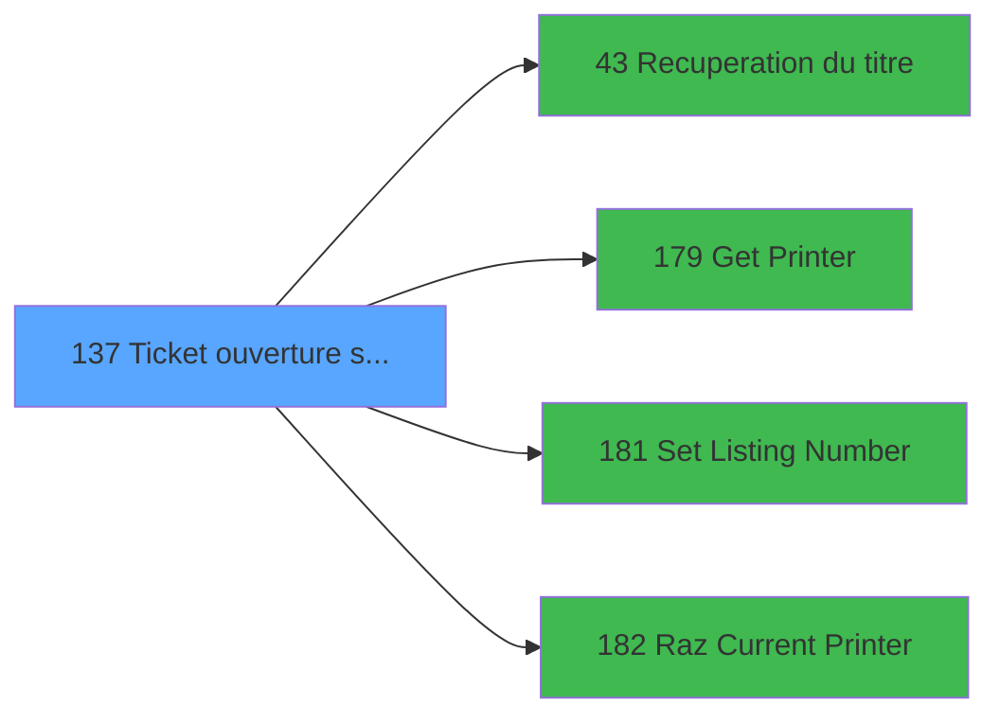

# ADH IDE 137 - Ticket ouverture session

> **Analyse**: Phases 1-4 2026-02-07 03:50 -> 03:16 (23h25min) | Assemblage 03:16
> **Pipeline**: V7.2 Enrichi
> **Structure**: 4 onglets (Resume | Ecrans | Donnees | Connexions)

<!-- TAB:Resume -->

## 1. FICHE D'IDENTITE

| Attribut | Valeur |
|----------|--------|
| Projet | ADH |
| IDE Position | 137 |
| Nom Programme | Ticket ouverture session |
| Fichier source | `Prg_137.xml` |
| Dossier IDE | Caisse |
| Taches | 23 (0 ecrans visibles) |
| Tables modifiees | 0 |
| Programmes appeles | 4 |
| Complexite | **BASSE** (score 18/100) |

## 2. DESCRIPTION FONCTIONNELLE

## ADH IDE 137 - Ticket Ouverture Session

**ADH IDE 137** est un programme utilitaire chargé de générer les tickets d'ouverture de session pour la caisse. Exécuté lors du démarrage (Ouverture caisse IDE 122 ou version 143 IDE 297), il orchestr 23 tâches organisées en trois blocs : un bloc de traitement multi-devise qui accumule les soldes initiaux (caisse, cartes, montants devises), un bloc de calculs qui détermine les taux de change et frais appliqués, et enfin un bloc d'impression qui délègue au sous-programme Récupération du titre (IDE 43) avant de configurer l'imprimante (Get Printer IDE 179, Set Listing IDE 181, Raz Printer IDE 182) pour produire deux versions du ticket : une sortie Printer 1 (A4) et une Printer 9 (TMT88IV terminal).

Le programme accède uniquement en **lecture** à 6 tables bases de données (devise_in pour multi-devise, histo_sessions_caisse_detail pour les montants initiaux, date_comptable pour les dates de référence) sans modifier aucune donnée. Ses 17 variables de travail (W0) se composent des 9 paramètres reçus de l'appelant (société, devise locale, dates, montants initiaux) et des montants calculés par devise (soldes cash/carte, change/frais, versements/retraits). La logique est **100% linéaire** : aucune condition complexe, aucune branche morte, pure accumulation et édition de données.

Au sein de la chaîne métier Gestion Caisse (Main → Menu 163 → Ouverture 122/297 → **137**), ce programme remplit un rôle **non-orphelin mais isolé** : appelé par 2 contextes seulement, il dépend de 4 utilitaires légers et n'impacte aucun programme aval (terminal leaf dans le callgraph). Complexité basse (18/100), profil 100% technique (impression batch), idéal pour migration vers une API REST de génération PDF.

## 3. BLOCS FONCTIONNELS

### 3.1 Traitement (14 taches)

Traitements internes.

---

#### 137 - Tableau recap [[ECRAN]](#ecran-t1)

**Role** : Tache d'orchestration : point d'entree du programme (14 sous-taches). Coordonne l'enchainement des traitements.
**Ecran** : 640 x 0 DLU (MDI) | [Voir mockup](#ecran-t1)

13 sous-taches directes

| Tache | Nom | Bloc |
|-------|-----|------|
| [137.2.1](#t4) | Normal | Traitement |
| [137.2.1.1.1](#t6) | Devise en caisse | Traitement |
| [137.2.1.2](#t7) | (sans nom) | Traitement |
| [137.2.1.2.1](#t8) | Devise en caisse | Traitement |
| [137.2.1.5](#t11) | Lecture historique session det | Traitement |
| [137.3.1](#t13) | Normal | Traitement |
| [137.3.1.1.1](#t15) | Devise en caisse | Traitement |
| [137.3.1.2](#t16) | (sans nom) | Traitement |
| [137.3.1.2.1](#t17) | Devise en caisse | Traitement |
| [137.3.1.5](#t20) | Lecture historique session det | Traitement |
| [137.4](#t21) | Existe Carnet Bar | Traitement |
| [137.5](#t22) | Existe TAI | Traitement |
| [137.6](#t23) | Session | Traitement |

---

#### 137.2.1 - Normal

**Role** : Traitement : Normal.

---

#### 137.2.1.1.1 - Devise en caisse

**Role** : Traitement : Devise en caisse.
**Variables liees** : ER (P0 devise locale), EX (W0 caisse depart), EZ (W0 pièce caisse Rec), FA (W0 pièce caisse Dep)

---

#### 137.2.1.2 - (sans nom)

**Role** : Traitement interne.

---

#### 137.2.1.2.1 - Devise en caisse

**Role** : Traitement : Devise en caisse.
**Variables liees** : ER (P0 devise locale), EX (W0 caisse depart), EZ (W0 pièce caisse Rec), FA (W0 pièce caisse Dep)

---

#### 137.2.1.5 - Lecture historique session det

**Role** : Consultation/chargement : Lecture historique session det.
**Variables liees** : EV (P0 session), FM (W0 date debut session), FN (W0 heure debut session)

---

#### 137.3.1 - Normal

**Role** : Traitement : Normal.

---

#### 137.3.1.1.1 - Devise en caisse

**Role** : Traitement : Devise en caisse.
**Variables liees** : ER (P0 devise locale), EX (W0 caisse depart), EZ (W0 pièce caisse Rec), FA (W0 pièce caisse Dep)

---

#### 137.3.1.2 - (sans nom)

**Role** : Traitement interne.

---

#### 137.3.1.2.1 - Devise en caisse

**Role** : Traitement : Devise en caisse.
**Variables liees** : ER (P0 devise locale), EX (W0 caisse depart), EZ (W0 pièce caisse Rec), FA (W0 pièce caisse Dep)

---

#### 137.3.1.5 - Lecture historique session det

**Role** : Consultation/chargement : Lecture historique session det.
**Variables liees** : EV (P0 session), FM (W0 date debut session), FN (W0 heure debut session)

---

#### 137.4 - Existe Carnet Bar

**Role** : Traitement : Existe Carnet Bar.
**Variables liees** : FJ (W0 Existe Carnet Bar), FK (W0 Existe TAI)

---

#### 137.5 - Existe TAI

**Role** : Traitement : Existe TAI.
**Variables liees** : FJ (W0 Existe Carnet Bar), FK (W0 Existe TAI)

---

#### 137.6 - Session

**Role** : Traitement : Session.
**Variables liees** : EV (P0 session), FM (W0 date debut session), FN (W0 heure debut session)

### 3.2 Calcul (7 taches)

Calculs metier : montants, stocks, compteurs.

---

#### 137.1 - Lecture date comptable

**Role** : Traitement : Lecture date comptable.
**Variables liees** : EU (P0 date comptable), FB (W0 date comptable), FM (W0 date debut session)

---

#### 137.2.1.1 - Calcul change

**Role** : Calcul : Calcul change.
**Variables liees** : FG (W0 change), FH (W0 frais de change)

---

#### 137.2.1.3 - Calcul change

**Role** : Calcul : Calcul change.
**Variables liees** : FG (W0 change), FH (W0 frais de change)

---

#### 137.2.1.4 - Calcul change

**Role** : Calcul : Calcul change.
**Variables liees** : FG (W0 change), FH (W0 frais de change)

---

#### 137.3.1.1 - Calcul change

**Role** : Calcul : Calcul change.
**Variables liees** : FG (W0 change), FH (W0 frais de change)

---

#### 137.3.1.3 - Calcul change

**Role** : Calcul : Calcul change.
**Variables liees** : FG (W0 change), FH (W0 frais de change)

---

#### 137.3.1.4 - Calcul change

**Role** : Calcul : Calcul change.
**Variables liees** : FG (W0 change), FH (W0 frais de change)

### 3.3 Impression (2 taches)

Generation des documents et tickets.

---

#### 137.2 - Printer 1

**Role** : Generation du document : Printer 1.
**Delegue a** : [Get Printer (IDE 179)](ADH-IDE-179.md), [Raz Current Printer (IDE 182)](ADH-IDE-182.md)

---

#### 137.3 - Printer 9

**Role** : Generation du document : Printer 9.
**Delegue a** : [Get Printer (IDE 179)](ADH-IDE-179.md), [Raz Current Printer (IDE 182)](ADH-IDE-182.md)

## 5. REGLES METIER

3 regles identifiees:

### Impression (2 regles)

#### [RM-002] Verification que l'imprimante courante est la n1

| Element | Detail |
|---------|--------|
| **Condition** | `GetParam ('CURRENTPRINTERNUM')=1` |
| **Si vrai** | Action si CURRENTPRINTERNUM = 1 |
| **Expression source** | Expression 7 : `GetParam ('CURRENTPRINTERNUM')=1` |
| **Exemple** | Si GetParam ('CURRENTPRINTERNUM')=1 → Action si CURRENTPRINTERNUM = 1 |
| **Impact** | [137.2 - Printer 1](#t3) |

#### [RM-003] Verification que l'imprimante courante est la n9

| Element | Detail |
|---------|--------|
| **Condition** | `GetParam ('CURRENTPRINTERNUM')=9` |
| **Si vrai** | Action si CURRENTPRINTERNUM = 9 |
| **Expression source** | Expression 8 : `GetParam ('CURRENTPRINTERNUM')=9` |
| **Exemple** | Si GetParam ('CURRENTPRINTERNUM')=9 → Action si CURRENTPRINTERNUM = 9 |
| **Impact** | [137.2 - Printer 1](#t3) |

### Autres (1 regles)

#### [RM-001] Condition: W0 fin tache [V] egale 'F'

| Element | Detail |
|---------|--------|
| **Condition** | `W0 fin tache [V]='F'` |
| **Si vrai** | Action si vrai |
| **Variables** | FI (W0 fin tache) |
| **Expression source** | Expression 6 : `W0 fin tache [V]='F'` |
| **Exemple** | Si W0 fin tache [V]='F' → Action si vrai |

## 6. CONTEXTE

- **Appele par**: [Ouverture caisse (IDE 122)](ADH-IDE-122.md), [Ouverture caisse 143 (IDE 297)](ADH-IDE-297.md)
- **Appelle**: 4 programmes | **Tables**: 8 (W:0 R:6 L:3) | **Taches**: 23 | **Expressions**: 10

<!-- TAB:Ecrans -->

## 8. ECRANS

*(Programme sans ecran visible)*

## 9. NAVIGATION

### 9.3 Structure hierarchique (23 taches)

| Position | Tache | Type | Dimensions | Bloc |
|----------|-------|------|------------|------|
| **137.1** | [**Tableau recap** (137)](#t1) [mockup](#ecran-t1) | MDI | 640x0 | Traitement |
| 137.1.1 | [Normal (137.2.1)](#t4) | MDI | - | |
| 137.1.2 | [Devise en caisse (137.2.1.1.1)](#t6) | MDI | - | |
| 137.1.3 | [(sans nom) (137.2.1.2)](#t7) | MDI | - | |
| 137.1.4 | [Devise en caisse (137.2.1.2.1)](#t8) | MDI | - | |
| 137.1.5 | [Lecture historique session det (137.2.1.5)](#t11) | MDI | - | |
| 137.1.6 | [Normal (137.3.1)](#t13) | MDI | - | |
| 137.1.7 | [Devise en caisse (137.3.1.1.1)](#t15) | MDI | - | |
| 137.1.8 | [(sans nom) (137.3.1.2)](#t16) | MDI | - | |
| 137.1.9 | [Devise en caisse (137.3.1.2.1)](#t17) | MDI | - | |
| 137.1.10 | [Lecture historique session det (137.3.1.5)](#t20) | MDI | - | |
| 137.1.11 | [Existe Carnet Bar (137.4)](#t21) | MDI | - | |
| 137.1.12 | [Existe TAI (137.5)](#t22) | MDI | - | |
| 137.1.13 | [Session (137.6)](#t23) | MDI | - | |
| **137.2** | [**Lecture date comptable** (137.1)](#t2) | MDI | - | Calcul |
| 137.2.1 | [Calcul change (137.2.1.1)](#t5) | MDI | - | |
| 137.2.2 | [Calcul change (137.2.1.3)](#t9) | MDI | - | |
| 137.2.3 | [Calcul change (137.2.1.4)](#t10) | MDI | - | |
| 137.2.4 | [Calcul change (137.3.1.1)](#t14) | MDI | - | |
| 137.2.5 | [Calcul change (137.3.1.3)](#t18) | MDI | - | |
| 137.2.6 | [Calcul change (137.3.1.4)](#t19) | MDI | - | |
| **137.3** | [**Printer 1** (137.2)](#t3) | MDI | - | Impression |
| 137.3.1 | [Printer 9 (137.3)](#t12) | MDI | - | |

### 9.4 Algorigramme

> **Legende**: Vert = START/END OK | Rouge = END KO | Bleu = Decisions
> *Algorigramme auto-genere. Utiliser `/algorigramme` pour une synthese metier detaillee.*

<!-- TAB:Donnees -->

## 10. TABLES

### Tables utilisees (8)

| ID | Nom | Description | Type | R | W | L | Usages |
|----|-----|-------------|------|---|---|---|--------|
| 463 | heure_de_passage |  | DB | R |   | L | 3 |
| 693 | devise_in | Devises / taux de change | DB | R |   |   | 6 |
| 266 | cc_comptable |  | DB | R |   |   | 3 |
| 30 | gm-recherche_____gmr | Index de recherche | DB | R |   |   | 2 |
| 70 | date_comptable___dat |  | DB | R |   |   | 1 |
| 249 | histo_sessions_caisse_detail | Sessions de caisse | DB | R |   |   | 1 |
| 513 | pv_invoiceprintfiliationtmp | Services / filieres | TMP |   |   | L | 4 |
| 511 | pv_invoicedisplaytmp |  | TMP |   |   | L | 2 |

### Colonnes par table (6 / 6 tables avec colonnes identifiees)

Table 463 - heure_de_passage (R/L) - 3 usages

| Lettre | Variable | Acces | Type |
|--------|----------|-------|------|
| FN | W0 heure debut session | R | Time |

Table 693 - devise_in (R) - 6 usages

| Lettre | Variable | Acces | Type |
|--------|----------|-------|------|
| ER | P0 devise locale | R | Alpha |

Table 266 - cc_comptable (R) - 3 usages

| Lettre | Variable | Acces | Type |
|--------|----------|-------|------|
| A | W1 cumul quantite | R | Numeric |
| B | W1 cumul montant | R | Numeric |
| C | W1 total montant | R | Numeric |
| D | W1 equivalent | R | Numeric |

Table 30 - gm-recherche_____gmr (R) - 2 usages

| Lettre | Variable | Acces | Type |
|--------|----------|-------|------|
| A | W1 sous total montant | R | Numeric |
| B | W1 total montant | R | Numeric |

Table 70 - date_comptable___dat (R) - 1 usages

| Lettre | Variable | Acces | Type |
|--------|----------|-------|------|
| EU | P0 date comptable | R | Date |
| FB | W0 date comptable | R | Date |
| FM | W0 date debut session | R | Date |

Table 249 - histo_sessions_caisse_detail (R) - 1 usages

| Lettre | Variable | Acces | Type |
|--------|----------|-------|------|
| EW | Edition detaillee | R | Logical |
| EX | W0 caisse depart | R | Numeric |
| EZ | W0 pièce caisse Rec | R | Numeric |
| FA | W0 pièce caisse Dep | R | Numeric |

## 11. VARIABLES

### 11.1 Parametres entrants (9)

Variables recues du programme appelant ([Ouverture caisse (IDE 122)](ADH-IDE-122.md)).

| Lettre | Nom | Type | Usage dans |
|--------|-----|------|-----------|
| EN | P0 societe | Alpha | - |
| EO | P0 nbre decimales | Numeric | - |
| EP | P0 nom village | Alpha | - |
| EQ | P0 masque cumul | Alpha | - |
| ER | P0 devise locale | Alpha | - |
| ES | P0 Uni/Bilateral | Alpha | - |
| ET | P0 village TAI | Alpha | - |
| EU | P0 date comptable | Date | - |
| EV | P0 session | Numeric | - |

### 11.2 Variables de travail (17)

Variables internes au programme.

| Lettre | Nom | Type | Usage dans |
|--------|-----|------|-----------|
| EX | W0 caisse depart | Numeric | - |
| EY | W0 apport coffre | Numeric | - |
| EZ | W0 pièce caisse Rec | Numeric | - |
| FA | W0 pièce caisse Dep | Numeric | - |
| FB | W0 date comptable | Date | - |
| FC | W0 versement | Numeric | - |
| FD | W0 retrait | Numeric | - |
| FE | W0 solde cash | Numeric | - |
| FF | W0 solde carte | Numeric | - |
| FG | W0 change | Numeric | - |
| FH | W0 frais de change | Numeric | - |
| FI | W0 fin tache | Alpha | 1x calcul interne |
| FJ | W0 Existe Carnet Bar | Logical | - |
| FK | W0 Existe TAI | Logical | - |
| FL | W0 titre | Alpha | 1x calcul interne |
| FM | W0 date debut session | Date | - |
| FN | W0 heure debut session | Time | - |

### 11.3 Autres (1)

Variables diverses.

| Lettre | Nom | Type | Usage dans |
|--------|-----|------|-----------|
| EW | Edition detaillee | Logical | - |

Toutes les 27 variables (liste complete)

| Cat | Lettre | Nom Variable | Type |
|-----|--------|--------------|------|
| P0 | **EN** | P0 societe | Alpha |
| P0 | **EO** | P0 nbre decimales | Numeric |
| P0 | **EP** | P0 nom village | Alpha |
| P0 | **EQ** | P0 masque cumul | Alpha |
| P0 | **ER** | P0 devise locale | Alpha |
| P0 | **ES** | P0 Uni/Bilateral | Alpha |
| P0 | **ET** | P0 village TAI | Alpha |
| P0 | **EU** | P0 date comptable | Date |
| P0 | **EV** | P0 session | Numeric |
| W0 | **EX** | W0 caisse depart | Numeric |
| W0 | **EY** | W0 apport coffre | Numeric |
| W0 | **EZ** | W0 pièce caisse Rec | Numeric |
| W0 | **FA** | W0 pièce caisse Dep | Numeric |
| W0 | **FB** | W0 date comptable | Date |
| W0 | **FC** | W0 versement | Numeric |
| W0 | **FD** | W0 retrait | Numeric |
| W0 | **FE** | W0 solde cash | Numeric |
| W0 | **FF** | W0 solde carte | Numeric |
| W0 | **FG** | W0 change | Numeric |
| W0 | **FH** | W0 frais de change | Numeric |
| W0 | **FI** | W0 fin tache | Alpha |
| W0 | **FJ** | W0 Existe Carnet Bar | Logical |
| W0 | **FK** | W0 Existe TAI | Logical |
| W0 | **FL** | W0 titre | Alpha |
| W0 | **FM** | W0 date debut session | Date |
| W0 | **FN** | W0 heure debut session | Time |
| Autre | **EW** | Edition detaillee | Logical |

## 12. EXPRESSIONS

**10 / 10 expressions decodees (100%)**

### 12.1 Repartition par type

| Type | Expressions | Regles |
|------|-------------|--------|
| CONDITION | 3 | 3 |
| CONSTANTE | 3 | 0 |
| DATE | 1 | 0 |
| REFERENCE_VG | 1 | 0 |
| CAST_LOGIQUE | 1 | 0 |
| STRING | 1 | 0 |

### 12.2 Expressions cles par type

#### CONDITION (3 expressions)

| Type | IDE | Expression | Regle |
|------|-----|------------|-------|
| CONDITION | 8 | `GetParam ('CURRENTPRINTERNUM')=9` | [RM-003](#rm-RM-003) |
| CONDITION | 7 | `GetParam ('CURRENTPRINTERNUM')=1` | [RM-002](#rm-RM-002) |
| CONDITION | 6 | `W0 fin tache [V]='F'` | [RM-001](#rm-RM-001) |

#### CONSTANTE (3 expressions)

| Type | IDE | Expression | Regle |
|------|-----|------------|-------|
| CONSTANTE | 9 | `35` | - |
| CONSTANTE | 5 | `'F'` | - |
| CONSTANTE | 3 | `152` | - |

#### DATE (1 expressions)

| Type | IDE | Expression | Regle |
|------|-----|------------|-------|
| DATE | 1 | `Date ()` | - |

#### REFERENCE_VG (1 expressions)

| Type | IDE | Expression | Regle |
|------|-----|------------|-------|
| REFERENCE_VG | 2 | `VG2` | - |

#### CAST_LOGIQUE (1 expressions)

| Type | IDE | Expression | Regle |
|------|-----|------------|-------|
| CAST_LOGIQUE | 10 | `'TRUE'LOG` | - |

#### STRING (1 expressions)

| Type | IDE | Expression | Regle |
|------|-----|------------|-------|
| STRING | 4 | `Trim (W0 titre [Y])` | - |

<!-- TAB:Connexions -->

## 13. GRAPHE D'APPELS

### 13.1 Chaine depuis Main (Callers)

Main -> ... -> [Ouverture caisse (IDE 122)](ADH-IDE-122.md) -> **Ticket ouverture session (IDE 137)**

Main -> ... -> [Ouverture caisse 143 (IDE 297)](ADH-IDE-297.md) -> **Ticket ouverture session (IDE 137)**

### 13.2 Callers

| IDE | Nom Programme | Nb Appels |
|-----|---------------|-----------|
| [122](ADH-IDE-122.md) | Ouverture caisse | 1 |
| [297](ADH-IDE-297.md) | Ouverture caisse 143 | 1 |

### 13.3 Callees (programmes appeles)

### 13.4 Detail Callees avec contexte

| IDE | Nom Programme | Appels | Contexte |
|-----|---------------|--------|----------|
| [43](ADH-IDE-43.md) | Recuperation du titre | 1 | Recuperation donnees |
| [179](ADH-IDE-179.md) | Get Printer | 1 | Impression ticket/document |
| [181](ADH-IDE-181.md) | Set Listing Number | 1 | Configuration impression |
| [182](ADH-IDE-182.md) | Raz Current Printer | 1 | Impression ticket/document |

## 14. RECOMMANDATIONS MIGRATION

### 14.1 Profil du programme

| Metrique | Valeur | Impact migration |
|----------|--------|-----------------|
| Lignes de logique | 382 | Taille moyenne |
| Expressions | 10 | Peu de logique |
| Tables WRITE | 0 | Impact faible |
| Sous-programmes | 4 | Peu de dependances |
| Ecrans visibles | 0 | Ecran unique ou traitement batch |
| Code desactive | 0% (0 / 382) | Code sain |
| Regles metier | 3 | Quelques regles a preserver |

### 14.2 Plan de migration par bloc

#### Traitement (14 taches: 1 ecran, 13 traitements)

- **Strategie** : Orchestrateur avec 1 ecrans (Razor/React) et 13 traitements backend (services).
- Les ecrans deviennent des composants UI, les traitements invisibles deviennent des services injectables.
- 4 sous-programme(s) a migrer ou a reutiliser depuis les services existants.
- Decomposer les taches en services unitaires testables.

#### Calcul (7 taches: 0 ecran, 7 traitements)

- **Strategie** : Services de calcul purs (Domain Services).
- Migrer la logique de calcul (stock, compteurs, montants)

#### Impression (2 taches: 0 ecran, 2 traitements)

- **Strategie** : Templates HTML -> PDF via wkhtmltopdf ou Puppeteer.
- `PrintService` injectable avec choix imprimante

### 14.3 Dependances critiques

| Dependance | Type | Appels | Impact |
|------------|------|--------|--------|
| [Set Listing Number (IDE 181)](ADH-IDE-181.md) | Sous-programme | 1x | Normale - Configuration impression |
| [Raz Current Printer (IDE 182)](ADH-IDE-182.md) | Sous-programme | 1x | Normale - Impression ticket/document |
| [Recuperation du titre (IDE 43)](ADH-IDE-43.md) | Sous-programme | 1x | Normale - Recuperation donnees |
| [Get Printer (IDE 179)](ADH-IDE-179.md) | Sous-programme | 1x | Normale - Impression ticket/document |

---
*Spec DETAILED generee par Pipeline V7.2 - 2026-02-08 03:18*
