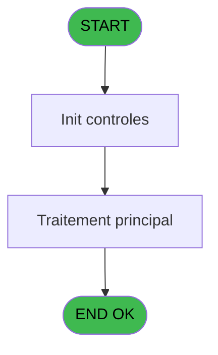
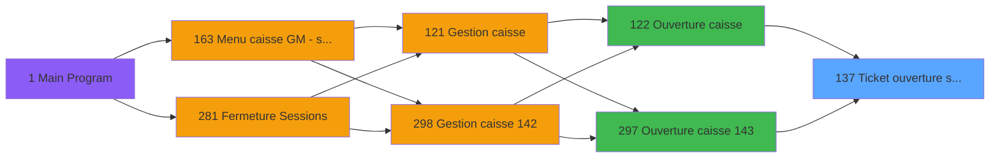
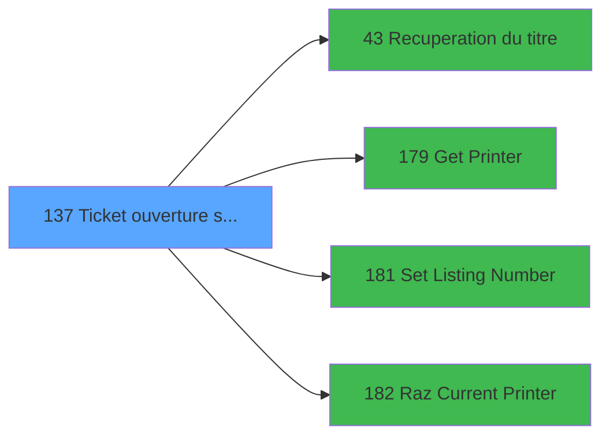

# ADH IDE 137 - Ticket ouverture session

> **Analyse**: Phases 1-4 2026-02-07 03:50 -> 03:50 (30s) | Assemblage 03:50
> **Pipeline**: V7.2 Enrichi
> **Structure**: 4 onglets (Resume | Ecrans | Donnees | Connexions)

<!-- TAB:Resume -->

## 1. FICHE D'IDENTITE

| Attribut | Valeur |
|----------|--------|
| Projet | ADH |
| IDE Position | 137 |
| Nom Programme | Ticket ouverture session |
| Fichier source | `Prg_137.xml` |
| Dossier IDE | Caisse |
| Taches | 23 (0 ecrans visibles) |
| Tables modifiees | 0 |
| Programmes appeles | 4 |

## 2. DESCRIPTION FONCTIONNELLE

**Ticket ouverture session** assure la gestion complete de ce processus, accessible depuis [Ouverture caisse (IDE 122)](ADH-IDE-122.md), [Ouverture caisse 143 (IDE 297)](ADH-IDE-297.md).

Le flux de traitement s'organise en **3 blocs fonctionnels** :

- **Traitement** (14 taches) : traitements metier divers
- **Calcul** (7 taches) : calculs de montants, stocks ou compteurs
- **Impression** (2 taches) : generation de tickets et documents

Detail : phases du traitement

#### Phase 1 : Traitement (14 taches)

- **137** - Tableau recap **[[ECRAN]](#ecran-t1)**
- **137.2.1** - Normal
- **137.2.1.1.1** - Devise en caisse
- **137.2.1.2** - (sans nom)
- **137.2.1.2.1** - Devise en caisse
- **137.2.1.5** - Lecture historique session det
- **137.3.1** - Normal
- **137.3.1.1.1** - Devise en caisse
- **137.3.1.2** - (sans nom)
- **137.3.1.2.1** - Devise en caisse
- **137.3.1.5** - Lecture historique session det
- **137.4** - Existe Carnet Bar
- **137.5** - Existe TAI
- **137.6** - Session

Delegue a : [Recuperation du titre (IDE 43)](ADH-IDE-43.md), [Set Listing Number (IDE 181)](ADH-IDE-181.md)

#### Phase 2 : Calcul (7 taches)

- **137.1** - Lecture date comptable
- **137.2.1.1** - Calcul change
- **137.2.1.3** - Calcul change
- **137.2.1.4** - Calcul change
- **137.3.1.1** - Calcul change
- **137.3.1.3** - Calcul change
- **137.3.1.4** - Calcul change

#### Phase 3 : Impression (2 taches)

- **137.2** - Printer 1
- **137.3** - Printer 9

Delegue a : [Get Printer (IDE 179)](ADH-IDE-179.md), [Set Listing Number (IDE 181)](ADH-IDE-181.md), [Raz Current Printer (IDE 182)](ADH-IDE-182.md)

## 3. BLOCS FONCTIONNELS

### 3.1 Traitement (14 taches)

Traitements internes.

---

#### 137 - Tableau recap [[ECRAN]](#ecran-t1)

**Role** : Tache d'orchestration : point d'entree du programme (14 sous-taches). Coordonne l'enchainement des traitements.
**Ecran** : 640 x 0 DLU (MDI) | [Voir mockup](#ecran-t1)

13 sous-taches directes

| Tache | Nom | Bloc |
|-------|-----|------|
| [137.2.1](#t4) | Normal | Traitement |
| [137.2.1.1.1](#t6) | Devise en caisse | Traitement |
| [137.2.1.2](#t7) | (sans nom) | Traitement |
| [137.2.1.2.1](#t8) | Devise en caisse | Traitement |
| [137.2.1.5](#t11) | Lecture historique session det | Traitement |
| [137.3.1](#t13) | Normal | Traitement |
| [137.3.1.1.1](#t15) | Devise en caisse | Traitement |
| [137.3.1.2](#t16) | (sans nom) | Traitement |
| [137.3.1.2.1](#t17) | Devise en caisse | Traitement |
| [137.3.1.5](#t20) | Lecture historique session det | Traitement |
| [137.4](#t21) | Existe Carnet Bar | Traitement |
| [137.5](#t22) | Existe TAI | Traitement |
| [137.6](#t23) | Session | Traitement |

---

#### 137.2.1 - Normal

**Role** : Traitement : Normal.

---

#### 137.2.1.1.1 - Devise en caisse

**Role** : Traitement : Devise en caisse.
**Variables liees** : E (P0 devise locale), K (W0 caisse depart), M (W0 pièce caisse Rec), N (W0 pièce caisse Dep)

---

#### 137.2.1.2 - (sans nom)

**Role** : Traitement interne.

---

#### 137.2.1.2.1 - Devise en caisse

**Role** : Traitement : Devise en caisse.
**Variables liees** : E (P0 devise locale), K (W0 caisse depart), M (W0 pièce caisse Rec), N (W0 pièce caisse Dep)

---

#### 137.2.1.5 - Lecture historique session det

**Role** : Consultation/chargement : Lecture historique session det.
**Variables liees** : I (P0 session), Z (W0 date debut session), BA (W0 heure debut session)

---

#### 137.3.1 - Normal

**Role** : Traitement : Normal.

---

#### 137.3.1.1.1 - Devise en caisse

**Role** : Traitement : Devise en caisse.
**Variables liees** : E (P0 devise locale), K (W0 caisse depart), M (W0 pièce caisse Rec), N (W0 pièce caisse Dep)

---

#### 137.3.1.2 - (sans nom)

**Role** : Traitement interne.

---

#### 137.3.1.2.1 - Devise en caisse

**Role** : Traitement : Devise en caisse.
**Variables liees** : E (P0 devise locale), K (W0 caisse depart), M (W0 pièce caisse Rec), N (W0 pièce caisse Dep)

---

#### 137.3.1.5 - Lecture historique session det

**Role** : Consultation/chargement : Lecture historique session det.
**Variables liees** : I (P0 session), Z (W0 date debut session), BA (W0 heure debut session)

---

#### 137.4 - Existe Carnet Bar

**Role** : Traitement : Existe Carnet Bar.
**Variables liees** : W (W0 Existe Carnet Bar), X (W0 Existe TAI)

---

#### 137.5 - Existe TAI

**Role** : Traitement : Existe TAI.
**Variables liees** : W (W0 Existe Carnet Bar), X (W0 Existe TAI)

---

#### 137.6 - Session

**Role** : Traitement : Session.
**Variables liees** : I (P0 session), Z (W0 date debut session), BA (W0 heure debut session)

### 3.2 Calcul (7 taches)

Calculs metier : montants, stocks, compteurs.

---

#### 137.1 - Lecture date comptable

**Role** : Traitement : Lecture date comptable.
**Variables liees** : H (P0 date comptable), O (W0 date comptable), Z (W0 date debut session)

---

#### 137.2.1.1 - Calcul change

**Role** : Calcul : Calcul change.
**Variables liees** : T (W0 change), U (W0 frais de change)

---

#### 137.2.1.3 - Calcul change

**Role** : Calcul : Calcul change.
**Variables liees** : T (W0 change), U (W0 frais de change)

---

#### 137.2.1.4 - Calcul change

**Role** : Calcul : Calcul change.
**Variables liees** : T (W0 change), U (W0 frais de change)

---

#### 137.3.1.1 - Calcul change

**Role** : Calcul : Calcul change.
**Variables liees** : T (W0 change), U (W0 frais de change)

---

#### 137.3.1.3 - Calcul change

**Role** : Calcul : Calcul change.
**Variables liees** : T (W0 change), U (W0 frais de change)

---

#### 137.3.1.4 - Calcul change

**Role** : Calcul : Calcul change.
**Variables liees** : T (W0 change), U (W0 frais de change)

### 3.3 Impression (2 taches)

Generation des documents et tickets.

---

#### 137.2 - Printer 1

**Role** : Generation du document : Printer 1.
**Delegue a** : [Get Printer (IDE 179)](ADH-IDE-179.md), [Raz Current Printer (IDE 182)](ADH-IDE-182.md)

---

#### 137.3 - Printer 9

**Role** : Generation du document : Printer 9.
**Delegue a** : [Get Printer (IDE 179)](ADH-IDE-179.md), [Raz Current Printer (IDE 182)](ADH-IDE-182.md)

## 5. REGLES METIER

*(Aucune regle metier identifiee)*

## 6. CONTEXTE

- **Appele par**: [Ouverture caisse (IDE 122)](ADH-IDE-122.md), [Ouverture caisse 143 (IDE 297)](ADH-IDE-297.md)
- **Appelle**: 4 programmes | **Tables**: 8 (W:0 R:6 L:3) | **Taches**: 23 | **Expressions**: 10

<!-- TAB:Ecrans -->

## 8. ECRANS

*(Programme sans ecran visible)*

## 9. NAVIGATION

### 9.3 Structure hierarchique (23 taches)

| Position | Tache | Type | Dimensions | Bloc |
|----------|-------|------|------------|------|
| **137.1** | [**Tableau recap** (137)](#t1) [mockup](#ecran-t1) | MDI | 640x0 | Traitement |
| 137.1.1 | [Normal (137.2.1)](#t4) | MDI | - | |
| 137.1.2 | [Devise en caisse (137.2.1.1.1)](#t6) | MDI | - | |
| 137.1.3 | [(sans nom) (137.2.1.2)](#t7) | MDI | - | |
| 137.1.4 | [Devise en caisse (137.2.1.2.1)](#t8) | MDI | - | |
| 137.1.5 | [Lecture historique session det (137.2.1.5)](#t11) | MDI | - | |
| 137.1.6 | [Normal (137.3.1)](#t13) | MDI | - | |
| 137.1.7 | [Devise en caisse (137.3.1.1.1)](#t15) | MDI | - | |
| 137.1.8 | [(sans nom) (137.3.1.2)](#t16) | MDI | - | |
| 137.1.9 | [Devise en caisse (137.3.1.2.1)](#t17) | MDI | - | |
| 137.1.10 | [Lecture historique session det (137.3.1.5)](#t20) | MDI | - | |
| 137.1.11 | [Existe Carnet Bar (137.4)](#t21) | MDI | - | |
| 137.1.12 | [Existe TAI (137.5)](#t22) | MDI | - | |
| 137.1.13 | [Session (137.6)](#t23) | MDI | - | |
| **137.2** | [**Lecture date comptable** (137.1)](#t2) | MDI | - | Calcul |
| 137.2.1 | [Calcul change (137.2.1.1)](#t5) | MDI | - | |
| 137.2.2 | [Calcul change (137.2.1.3)](#t9) | MDI | - | |
| 137.2.3 | [Calcul change (137.2.1.4)](#t10) | MDI | - | |
| 137.2.4 | [Calcul change (137.3.1.1)](#t14) | MDI | - | |
| 137.2.5 | [Calcul change (137.3.1.3)](#t18) | MDI | - | |
| 137.2.6 | [Calcul change (137.3.1.4)](#t19) | MDI | - | |
| **137.3** | [**Printer 1** (137.2)](#t3) | MDI | - | Impression |
| 137.3.1 | [Printer 9 (137.3)](#t12) | MDI | - | |

### 9.4 Algorigramme

> **Legende**: Vert = START/END OK | Rouge = END KO | Bleu = Decisions
> *Algorigramme auto-genere. Utiliser `/algorigramme` pour une synthese metier detaillee.*

<!-- TAB:Donnees -->

## 10. TABLES

### Tables utilisees (8)

| ID | Nom | Description | Type | R | W | L | Usages |
|----|-----|-------------|------|---|---|---|--------|
| 30 | gm-recherche_____gmr | Index de recherche | DB | R |   |   | 2 |
| 70 | date_comptable___dat |  | DB | R |   |   | 1 |
| 249 | histo_sessions_caisse_detail | Sessions de caisse | DB | R |   |   | 1 |
| 266 | cc_comptable |  | DB | R |   |   | 3 |
| 463 | heure_de_passage |  | DB | R |   | L | 3 |
| 511 | pv_invoicedisplaytmp |  | TMP |   |   | L | 2 |
| 513 | pv_invoiceprintfiliationtmp | Services / filieres | TMP |   |   | L | 4 |
| 693 | devise_in | Devises / taux de change | DB | R |   |   | 6 |

### Colonnes par table (6 / 6 tables avec colonnes identifiees)

Table 30 - gm-recherche_____gmr (R) - 2 usages

| Lettre | Variable | Acces | Type |
|--------|----------|-------|------|
| A | W1 sous total montant | R | Numeric |
| B | W1 total montant | R | Numeric |

Table 70 - date_comptable___dat (R) - 1 usages

| Lettre | Variable | Acces | Type |
|--------|----------|-------|------|
| H | P0 date comptable | R | Date |
| O | W0 date comptable | R | Date |
| Z | W0 date debut session | R | Date |

Table 249 - histo_sessions_caisse_detail (R) - 1 usages

| Lettre | Variable | Acces | Type |
|--------|----------|-------|------|
| J | Edition detaillee | R | Logical |
| K | W0 caisse depart | R | Numeric |
| M | W0 pièce caisse Rec | R | Numeric |
| N | W0 pièce caisse Dep | R | Numeric |

Table 266 - cc_comptable (R) - 3 usages

| Lettre | Variable | Acces | Type |
|--------|----------|-------|------|
| A | W1 cumul quantite | R | Numeric |
| B | W1 cumul montant | R | Numeric |
| C | W1 total montant | R | Numeric |
| D | W1 equivalent | R | Numeric |

Table 463 - heure_de_passage (R/L) - 3 usages

| Lettre | Variable | Acces | Type |
|--------|----------|-------|------|
| BA | W0 heure debut session | R | Time |

Table 693 - devise_in (R) - 6 usages

| Lettre | Variable | Acces | Type |
|--------|----------|-------|------|
| E | P0 devise locale | R | Alpha |

## 11. VARIABLES

### 11.1 Parametres entrants (9)

Variables recues du programme appelant ([Ouverture caisse (IDE 122)](ADH-IDE-122.md)).

| Lettre | Nom | Type | Usage dans |
|--------|-----|------|-----------|
| A | P0 societe | Alpha | - |
| B | P0 nbre decimales | Numeric | - |
| C | P0 nom village | Alpha | - |
| D | P0 masque cumul | Alpha | - |
| E | P0 devise locale | Alpha | - |
| F | P0 Uni/Bilateral | Alpha | - |
| G | P0 village TAI | Alpha | - |
| H | P0 date comptable | Date | - |
| I | P0 session | Numeric | - |

### 11.2 Variables de travail (17)

Variables internes au programme.

| Lettre | Nom | Type | Usage dans |
|--------|-----|------|-----------|
| K | W0 caisse depart | Numeric | - |
| L | W0 apport coffre | Numeric | - |
| M | W0 pièce caisse Rec | Numeric | - |
| N | W0 pièce caisse Dep | Numeric | - |
| O | W0 date comptable | Date | - |
| P | W0 versement | Numeric | - |
| Q | W0 retrait | Numeric | - |
| R | W0 solde cash | Numeric | - |
| S | W0 solde carte | Numeric | - |
| T | W0 change | Numeric | - |
| U | W0 frais de change | Numeric | - |
| V | W0 fin tache | Alpha | 1x calcul interne |
| W | W0 Existe Carnet Bar | Logical | - |
| X | W0 Existe TAI | Logical | - |
| Y | W0 titre | Alpha | 1x calcul interne |
| Z | W0 date debut session | Date | - |
| BA | W0 heure debut session | Time | - |

### 11.3 Autres (1)

Variables diverses.

| Lettre | Nom | Type | Usage dans |
|--------|-----|------|-----------|
| J | Edition detaillee | Logical | - |

Toutes les 27 variables (liste complete)

| Cat | Lettre | Nom Variable | Type |
|-----|--------|--------------|------|
| P0 | **A** | P0 societe | Alpha |
| P0 | **B** | P0 nbre decimales | Numeric |
| P0 | **C** | P0 nom village | Alpha |
| P0 | **D** | P0 masque cumul | Alpha |
| P0 | **E** | P0 devise locale | Alpha |
| P0 | **F** | P0 Uni/Bilateral | Alpha |
| P0 | **G** | P0 village TAI | Alpha |
| P0 | **H** | P0 date comptable | Date |
| P0 | **I** | P0 session | Numeric |
| W0 | **K** | W0 caisse depart | Numeric |
| W0 | **L** | W0 apport coffre | Numeric |
| W0 | **M** | W0 pièce caisse Rec | Numeric |
| W0 | **N** | W0 pièce caisse Dep | Numeric |
| W0 | **O** | W0 date comptable | Date |
| W0 | **P** | W0 versement | Numeric |
| W0 | **Q** | W0 retrait | Numeric |
| W0 | **R** | W0 solde cash | Numeric |
| W0 | **S** | W0 solde carte | Numeric |
| W0 | **T** | W0 change | Numeric |
| W0 | **U** | W0 frais de change | Numeric |
| W0 | **V** | W0 fin tache | Alpha |
| W0 | **W** | W0 Existe Carnet Bar | Logical |
| W0 | **X** | W0 Existe TAI | Logical |
| W0 | **Y** | W0 titre | Alpha |
| W0 | **Z** | W0 date debut session | Date |
| W0 | **BA** | W0 heure debut session | Time |
| Autre | **J** | Edition detaillee | Logical |

## 12. EXPRESSIONS

**10 / 10 expressions decodees (100%)**

### 12.1 Repartition par type

| Type | Expressions | Regles |
|------|-------------|--------|
| CONSTANTE | 3 | 0 |
| DATE | 1 | 0 |
| REFERENCE_VG | 1 | 0 |
| CONDITION | 3 | 0 |
| CAST_LOGIQUE | 1 | 0 |
| STRING | 1 | 0 |

### 12.2 Expressions cles par type

#### CONSTANTE (3 expressions)

| Type | IDE | Expression | Regle |
|------|-----|------------|-------|
| CONSTANTE | 9 | `35` | - |
| CONSTANTE | 5 | `'F'` | - |
| CONSTANTE | 3 | `152` | - |

#### DATE (1 expressions)

| Type | IDE | Expression | Regle |
|------|-----|------------|-------|
| DATE | 1 | `Date ()` | - |

#### REFERENCE_VG (1 expressions)

| Type | IDE | Expression | Regle |
|------|-----|------------|-------|
| REFERENCE_VG | 2 | `VG2` | - |

#### CONDITION (3 expressions)

| Type | IDE | Expression | Regle |
|------|-----|------------|-------|
| CONDITION | 8 | `GetParam ('CURRENTPRINTERNUM')=9` | - |
| CONDITION | 7 | `GetParam ('CURRENTPRINTERNUM')=1` | - |
| CONDITION | 6 | `W0 fin tache [V]='F'` | - |

#### CAST_LOGIQUE (1 expressions)

| Type | IDE | Expression | Regle |
|------|-----|------------|-------|
| CAST_LOGIQUE | 10 | `'TRUE'LOG` | - |

#### STRING (1 expressions)

| Type | IDE | Expression | Regle |
|------|-----|------------|-------|
| STRING | 4 | `Trim (W0 titre [Y])` | - |

<!-- TAB:Connexions -->

## 13. GRAPHE D'APPELS

### 13.1 Chaine depuis Main (Callers)

Main -> ... -> [Ouverture caisse (IDE 122)](ADH-IDE-122.md) -> **Ticket ouverture session (IDE 137)**

Main -> ... -> [Ouverture caisse 143 (IDE 297)](ADH-IDE-297.md) -> **Ticket ouverture session (IDE 137)**

### 13.2 Callers

| IDE | Nom Programme | Nb Appels |
|-----|---------------|-----------|
| [122](ADH-IDE-122.md) | Ouverture caisse | 1 |
| [297](ADH-IDE-297.md) | Ouverture caisse 143 | 1 |

### 13.3 Callees (programmes appeles)

### 13.4 Detail Callees avec contexte

| IDE | Nom Programme | Appels | Contexte |
|-----|---------------|--------|----------|
| [43](ADH-IDE-43.md) | Recuperation du titre | 1 | Recuperation donnees |
| [179](ADH-IDE-179.md) | Get Printer | 1 | Impression ticket/document |
| [181](ADH-IDE-181.md) | Set Listing Number | 1 | Configuration impression |
| [182](ADH-IDE-182.md) | Raz Current Printer | 1 | Impression ticket/document |

## 14. RECOMMANDATIONS MIGRATION

### 14.1 Profil du programme

| Metrique | Valeur | Impact migration |
|----------|--------|-----------------|
| Lignes de logique | 382 | Taille moyenne |
| Expressions | 10 | Peu de logique |
| Tables WRITE | 0 | Impact faible |
| Sous-programmes | 4 | Peu de dependances |
| Ecrans visibles | 0 | Ecran unique ou traitement batch |
| Code desactive | 0% (0 / 382) | Code sain |
| Regles metier | 0 | Pas de regle identifiee |

### 14.2 Plan de migration par bloc

#### Traitement (14 taches: 1 ecran, 13 traitements)

- **Strategie** : Orchestrateur avec 1 ecrans (Razor/React) et 13 traitements backend (services).
- Les ecrans deviennent des composants UI, les traitements invisibles deviennent des services injectables.
- 4 sous-programme(s) a migrer ou a reutiliser depuis les services existants.
- Decomposer les taches en services unitaires testables.

#### Calcul (7 taches: 0 ecran, 7 traitements)

- **Strategie** : Services de calcul purs (Domain Services).
- Migrer la logique de calcul (stock, compteurs, montants)

#### Impression (2 taches: 0 ecran, 2 traitements)

- **Strategie** : Templates HTML -> PDF via wkhtmltopdf ou Puppeteer.
- `PrintService` injectable avec choix imprimante

### 14.3 Dependances critiques

| Dependance | Type | Appels | Impact |
|------------|------|--------|--------|
| [Set Listing Number (IDE 181)](ADH-IDE-181.md) | Sous-programme | 1x | Normale - Configuration impression |
| [Raz Current Printer (IDE 182)](ADH-IDE-182.md) | Sous-programme | 1x | Normale - Impression ticket/document |
| [Recuperation du titre (IDE 43)](ADH-IDE-43.md) | Sous-programme | 1x | Normale - Recuperation donnees |
| [Get Printer (IDE 179)](ADH-IDE-179.md) | Sous-programme | 1x | Normale - Impression ticket/document |

---
*Spec DETAILED generee par Pipeline V7.2 - 2026-02-07 03:50*
