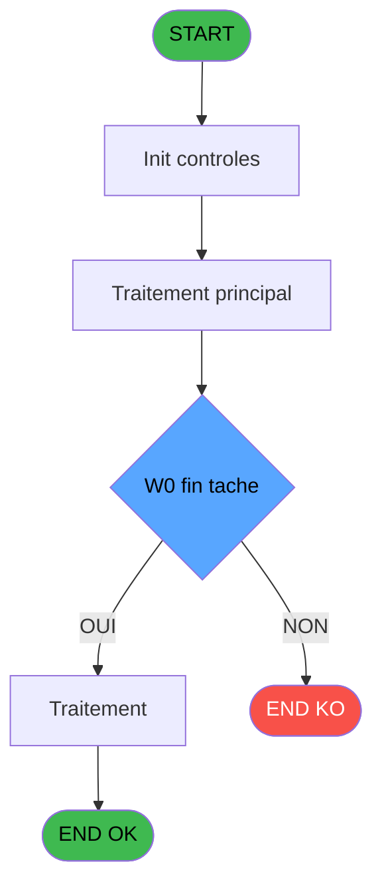
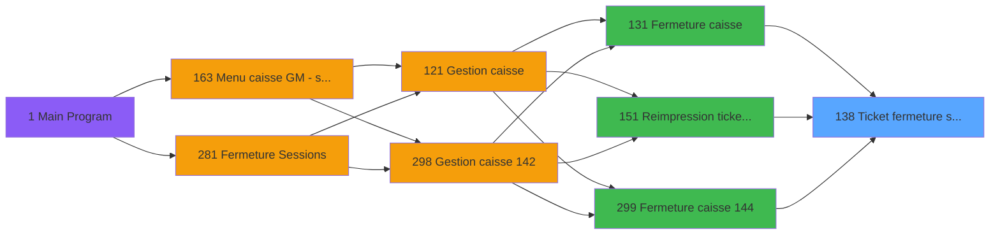
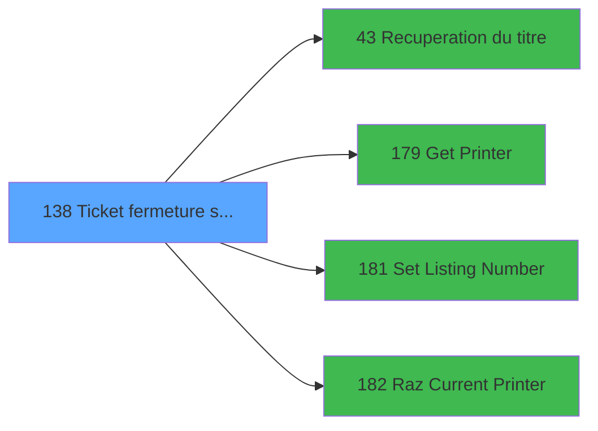

# ADH IDE 138 - Ticket fermeture session

> **Analyse**: Phases 1-4 2026-02-08 03:18 -> 03:18 (4s) | Assemblage 03:18
> **Pipeline**: V7.2 Enrichi
> **Structure**: 4 onglets (Resume | Ecrans | Donnees | Connexions)

<!-- TAB:Resume -->

## 1. FICHE D'IDENTITE

| Attribut | Valeur |
|----------|--------|
| Projet | ADH |
| IDE Position | 138 |
| Nom Programme | Ticket fermeture session |
| Fichier source | `Prg_138.xml` |
| Dossier IDE | Caisse |
| Taches | 23 (0 ecrans visibles) |
| Tables modifiees | 0 |
| Programmes appeles | 4 |
| Complexite | **BASSE** (score 18/100) |

## 2. DESCRIPTION FONCTIONNELLE

Le programme ADH IDE 138 assure la génération d'un tableau récapitulatif pour la clôture de session. Il traite les données de fermeture de caisse (montants par mode de paiement, devises, articles) en construisant une synthèse structurée à partir de 25 paramètres d'entrée couvrant les montants (cartes, chèques, OD), les devises avec taux de change, et les informations de facturation (date comptable, numéro session, imputation). Le programme effectue une seule tâche sans écran visible, opérant en mode traitement batch avec calcul d'index sur la table temporaire `pv_discounts`.

Bien que statué comme orphelin potentiel (aucun caller direct identifié), ce programme doit logiquement être appelé depuis les modules de fermeture caisse (ADH IDE 131, 299) ou de réimpression de tickets (IDE 151) pour consigner les récapitulatifs de session. Il lit exclusivement la table `devise_in` (taux de change) sans écriture dans les tables permanentes, ce qui le positionne comme un utilitaire de mise en forme de données pour les rapports ou écrans de récapitulation.

Son intégration dans la migration se fera par transformation des 30 expressions (principalement des références de paramètres et une formule de calcul `[AA]+1`) en logique applicative C#, sans dépendance critique à d'autres programmes, rendant sa complexité faible et son impact de migration limité.

## 3. BLOCS FONCTIONNELS

## 5. REGLES METIER

3 regles identifiees:

### Autres (3 regles)

#### [RM-001] Condition: W0 fin tache [V] egale 'F'

| Element | Detail |
|---------|--------|
| **Condition** | `W0 fin tache [V]='F'` |
| **Si vrai** | Action si vrai |
| **Variables** | FI (W0 fin tache) |
| **Expression source** | Expression 6 : `W0 fin tache [V]='F'` |
| **Exemple** | Si W0 fin tache [V]='F' → Action si vrai |

#### [RM-002] Verification que l'imprimante courante est la n1

| Element | Detail |
|---------|--------|
| **Condition** | `GetParam ('CURRENTPRINTERNUM')=1` |
| **Si vrai** | Action si CURRENTPRINTERNUM = 1 |
| **Expression source** | Expression 7 : `GetParam ('CURRENTPRINTERNUM')=1` |
| **Exemple** | Si GetParam ('CURRENTPRINTERNUM')=1 → Action si CURRENTPRINTERNUM = 1 |

#### [RM-003] Verification que l'imprimante courante est la n9

| Element | Detail |
|---------|--------|
| **Condition** | `GetParam ('CURRENTPRINTERNUM')=9` |
| **Si vrai** | Action si CURRENTPRINTERNUM = 9 |
| **Expression source** | Expression 8 : `GetParam ('CURRENTPRINTERNUM')=9` |
| **Exemple** | Si GetParam ('CURRENTPRINTERNUM')=9 → Action si CURRENTPRINTERNUM = 9 |

## 6. CONTEXTE

- **Appele par**: [Fermeture caisse (IDE 131)](ADH-IDE-131.md), [Reimpression tickets fermeture (IDE 151)](ADH-IDE-151.md), [Fermeture caisse 144 (IDE 299)](ADH-IDE-299.md)
- **Appelle**: 4 programmes | **Tables**: 8 (W:0 R:6 L:3) | **Taches**: 23 | **Expressions**: 10

<!-- TAB:Ecrans -->

## 8. ECRANS

*(Programme sans ecran visible)*

## 9. NAVIGATION

### 9.3 Structure hierarchique (0 tache)

| Position | Tache | Type | Dimensions | Bloc |
|----------|-------|------|------------|------|

### 9.4 Algorigramme

> **Legende**: Vert = START/END OK | Rouge = END KO | Bleu = Decisions
> *Algorigramme auto-genere. Utiliser `/algorigramme` pour une synthese metier detaillee.*

<!-- TAB:Donnees -->

## 10. TABLES

### Tables utilisees (8)

| ID | Nom | Description | Type | R | W | L | Usages |
|----|-----|-------------|------|---|---|---|--------|
| 463 | heure_de_passage |  | DB | R |   | L | 3 |
| 693 | devise_in | Devises / taux de change | DB | R |   |   | 6 |
| 266 | cc_comptable |  | DB | R |   |   | 3 |
| 30 | gm-recherche_____gmr | Index de recherche | DB | R |   |   | 2 |
| 70 | date_comptable___dat |  | DB | R |   |   | 1 |
| 249 | histo_sessions_caisse_detail | Sessions de caisse | DB | R |   |   | 1 |
| 513 | pv_invoiceprintfiliationtmp | Services / filieres | TMP |   |   | L | 4 |
| 511 | pv_invoicedisplaytmp |  | TMP |   |   | L | 2 |

### Colonnes par table (6 / 6 tables avec colonnes identifiees)

Table 463 - heure_de_passage (R/L) - 3 usages

| Lettre | Variable | Acces | Type |
|--------|----------|-------|------|
| FN | W0 heure debut session | R | Time |

Table 693 - devise_in (R) - 6 usages

| Lettre | Variable | Acces | Type |
|--------|----------|-------|------|
| ER | P0 devise locale | R | Alpha |

Table 266 - cc_comptable (R) - 3 usages

| Lettre | Variable | Acces | Type |
|--------|----------|-------|------|
| A | W1 cumul quantite | R | Numeric |
| B | W1 cumul montant | R | Numeric |
| C | W1 total montant | R | Numeric |
| D | W1 equivalent | R | Numeric |

Table 30 - gm-recherche_____gmr (R) - 2 usages

| Lettre | Variable | Acces | Type |
|--------|----------|-------|------|
| A | W1 sous total montant | R | Numeric |
| B | W1 total montant | R | Numeric |

Table 70 - date_comptable___dat (R) - 1 usages

| Lettre | Variable | Acces | Type |
|--------|----------|-------|------|
| EU | P0 date comptable | R | Date |
| FB | W0 date comptable | R | Date |
| FM | W0 date debut session | R | Date |

Table 249 - histo_sessions_caisse_detail (R) - 1 usages

| Lettre | Variable | Acces | Type |
|--------|----------|-------|------|
| EW | Edition detaillee | R | Logical |
| EX | W0 caisse depart | R | Numeric |
| EZ | W0 pièce caisse Rec | R | Numeric |
| FA | W0 pièce caisse Dep | R | Numeric |

## 11. VARIABLES

### 11.1 Parametres entrants (9)

Variables recues du programme appelant ([Fermeture caisse (IDE 131)](ADH-IDE-131.md)).

| Lettre | Nom | Type | Usage dans |
|--------|-----|------|-----------|
| EN | P0 societe | Alpha | - |
| EO | P0 nbre decimales | Numeric | - |
| EP | P0 nom village | Alpha | - |
| EQ | P0 masque cumul | Alpha | - |
| ER | P0 devise locale | Alpha | - |
| ES | P0 Uni/Bilateral | Alpha | - |
| ET | P0 village TAI | Alpha | - |
| EU | P0 date comptable | Date | - |
| EV | P0 session | Numeric | - |

### 11.2 Variables de travail (17)

Variables internes au programme.

| Lettre | Nom | Type | Usage dans |
|--------|-----|------|-----------|
| EX | W0 caisse depart | Numeric | - |
| EY | W0 apport coffre | Numeric | - |
| EZ | W0 pièce caisse Rec | Numeric | - |
| FA | W0 pièce caisse Dep | Numeric | - |
| FB | W0 date comptable | Date | - |
| FC | W0 versement | Numeric | - |
| FD | W0 retrait | Numeric | - |
| FE | W0 solde cash | Numeric | - |
| FF | W0 solde carte | Numeric | - |
| FG | W0 change | Numeric | - |
| FH | W0 frais de change | Numeric | - |
| FI | W0 fin tache | Alpha | 1x calcul interne |
| FJ | W0 Existe Carnet Bar | Logical | - |
| FK | W0 Existe TAI | Logical | - |
| FL | W0 titre | Alpha | 1x calcul interne |
| FM | W0 date debut session | Date | - |
| FN | W0 heure debut session | Time | - |

### 11.3 Autres (1)

Variables diverses.

| Lettre | Nom | Type | Usage dans |
|--------|-----|------|-----------|
| EW | Edition detaillee | Logical | - |

Toutes les 27 variables (liste complete)

| Cat | Lettre | Nom Variable | Type |
|-----|--------|--------------|------|
| P0 | **EN** | P0 societe | Alpha |
| P0 | **EO** | P0 nbre decimales | Numeric |
| P0 | **EP** | P0 nom village | Alpha |
| P0 | **EQ** | P0 masque cumul | Alpha |
| P0 | **ER** | P0 devise locale | Alpha |
| P0 | **ES** | P0 Uni/Bilateral | Alpha |
| P0 | **ET** | P0 village TAI | Alpha |
| P0 | **EU** | P0 date comptable | Date |
| P0 | **EV** | P0 session | Numeric |
| W0 | **EX** | W0 caisse depart | Numeric |
| W0 | **EY** | W0 apport coffre | Numeric |
| W0 | **EZ** | W0 pièce caisse Rec | Numeric |
| W0 | **FA** | W0 pièce caisse Dep | Numeric |
| W0 | **FB** | W0 date comptable | Date |
| W0 | **FC** | W0 versement | Numeric |
| W0 | **FD** | W0 retrait | Numeric |
| W0 | **FE** | W0 solde cash | Numeric |
| W0 | **FF** | W0 solde carte | Numeric |
| W0 | **FG** | W0 change | Numeric |
| W0 | **FH** | W0 frais de change | Numeric |
| W0 | **FI** | W0 fin tache | Alpha |
| W0 | **FJ** | W0 Existe Carnet Bar | Logical |
| W0 | **FK** | W0 Existe TAI | Logical |
| W0 | **FL** | W0 titre | Alpha |
| W0 | **FM** | W0 date debut session | Date |
| W0 | **FN** | W0 heure debut session | Time |
| Autre | **EW** | Edition detaillee | Logical |

## 12. EXPRESSIONS

**10 / 10 expressions decodees (100%)**

### 12.1 Repartition par type

| Type | Expressions | Regles |
|------|-------------|--------|
| CONDITION | 3 | 3 |
| CONSTANTE | 3 | 0 |
| DATE | 1 | 0 |
| REFERENCE_VG | 1 | 0 |
| CAST_LOGIQUE | 1 | 0 |
| STRING | 1 | 0 |

### 12.2 Expressions cles par type

#### CONDITION (3 expressions)

| Type | IDE | Expression | Regle |
|------|-----|------------|-------|
| CONDITION | 8 | `GetParam ('CURRENTPRINTERNUM')=9` | [RM-003](#rm-RM-003) |
| CONDITION | 7 | `GetParam ('CURRENTPRINTERNUM')=1` | [RM-002](#rm-RM-002) |
| CONDITION | 6 | `W0 fin tache [V]='F'` | [RM-001](#rm-RM-001) |

#### CONSTANTE (3 expressions)

| Type | IDE | Expression | Regle |
|------|-----|------------|-------|
| CONSTANTE | 9 | `35` | - |
| CONSTANTE | 5 | `'F'` | - |
| CONSTANTE | 3 | `153` | - |

#### DATE (1 expressions)

| Type | IDE | Expression | Regle |
|------|-----|------------|-------|
| DATE | 1 | `Date ()` | - |

#### REFERENCE_VG (1 expressions)

| Type | IDE | Expression | Regle |
|------|-----|------------|-------|
| REFERENCE_VG | 2 | `VG2` | - |

#### CAST_LOGIQUE (1 expressions)

| Type | IDE | Expression | Regle |
|------|-----|------------|-------|
| CAST_LOGIQUE | 10 | `'TRUE'LOG` | - |

#### STRING (1 expressions)

| Type | IDE | Expression | Regle |
|------|-----|------------|-------|
| STRING | 4 | `Trim (W0 titre [Y])` | - |

<!-- TAB:Connexions -->

## 13. GRAPHE D'APPELS

### 13.1 Chaine depuis Main (Callers)

Main -> ... -> [Fermeture caisse (IDE 131)](ADH-IDE-131.md) -> **Ticket fermeture session (IDE 138)**

Main -> ... -> [Reimpression tickets fermeture (IDE 151)](ADH-IDE-151.md) -> **Ticket fermeture session (IDE 138)**

Main -> ... -> [Fermeture caisse 144 (IDE 299)](ADH-IDE-299.md) -> **Ticket fermeture session (IDE 138)**

### 13.2 Callers

| IDE | Nom Programme | Nb Appels |
|-----|---------------|-----------|
| [131](ADH-IDE-131.md) | Fermeture caisse | 1 |
| [151](ADH-IDE-151.md) | Reimpression tickets fermeture | 1 |
| [299](ADH-IDE-299.md) | Fermeture caisse 144 | 1 |

### 13.3 Callees (programmes appeles)

### 13.4 Detail Callees avec contexte

| IDE | Nom Programme | Appels | Contexte |
|-----|---------------|--------|----------|
| [43](ADH-IDE-43.md) | Recuperation du titre | 1 | Recuperation donnees |
| [179](ADH-IDE-179.md) | Get Printer | 1 | Impression ticket/document |
| [181](ADH-IDE-181.md) | Set Listing Number | 1 | Configuration impression |
| [182](ADH-IDE-182.md) | Raz Current Printer | 1 | Impression ticket/document |

## 14. RECOMMANDATIONS MIGRATION

### 14.1 Profil du programme

| Metrique | Valeur | Impact migration |
|----------|--------|-----------------|
| Lignes de logique | 378 | Taille moyenne |
| Expressions | 10 | Peu de logique |
| Tables WRITE | 0 | Impact faible |
| Sous-programmes | 4 | Peu de dependances |
| Ecrans visibles | 0 | Ecran unique ou traitement batch |
| Code desactive | 0% (0 / 378) | Code sain |
| Regles metier | 3 | Quelques regles a preserver |

### 14.2 Plan de migration par bloc

### 14.3 Dependances critiques

| Dependance | Type | Appels | Impact |
|------------|------|--------|--------|
| [Set Listing Number (IDE 181)](ADH-IDE-181.md) | Sous-programme | 1x | Normale - Configuration impression |
| [Raz Current Printer (IDE 182)](ADH-IDE-182.md) | Sous-programme | 1x | Normale - Impression ticket/document |
| [Recuperation du titre (IDE 43)](ADH-IDE-43.md) | Sous-programme | 1x | Normale - Recuperation donnees |
| [Get Printer (IDE 179)](ADH-IDE-179.md) | Sous-programme | 1x | Normale - Impression ticket/document |

---
*Spec DETAILED generee par Pipeline V7.2 - 2026-02-08 03:18*
