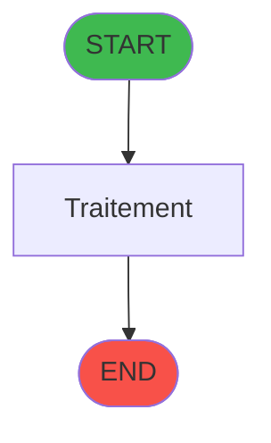
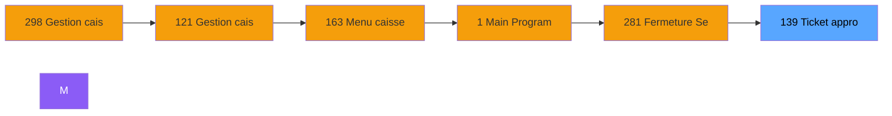
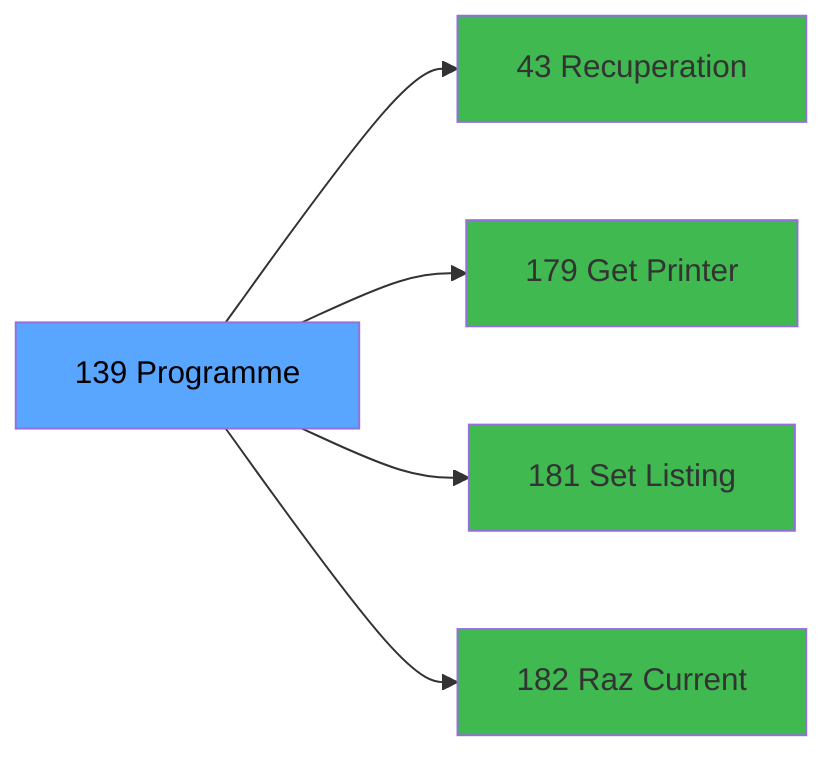

# ADH IDE 139 - Ticket appro remise

> **Version spec**: 3.5
> **Analyse**: 2026-01-27 17:57
> **Source**: `Prg_XXX.xml`

---

<!-- TAB:Fonctionnel -->

## SPECIFICATION FONCTIONNELLE

### 1.1 Objectif metier

| Element | Description |
|---------|-------------|
| **Qui** | Operateur |
| **Quoi** | Ticket appro remise
 |
| **Pourquoi** | A documenter |
| **Declencheur** | A identifier |

### 1.2 Regles metier

| Code | Regle | Condition |
|------|-------|-----------|
| RM-001 | A documenter | - |

### 1.3 Flux utilisateur

1. Demarrage programme
2. Traitement principal
3. Fin programme

### 1.4 Cas d'erreur

| Erreur | Comportement |
|--------|--------------|
| - | A documenter |

---

<!-- TAB:Technique -->

## SPECIFICATION TECHNIQUE

### 2.1 Identification

| Attribut | Valeur |
|----------|--------|
| **Format IDE** | ADH IDE 139 |
| **Description** | Ticket appro remise
 |
| **Module** | ADH |

### 2.2 Tables

| # | Nom logique | Nom physique | Acces | Usage |
|---|-------------|--------------|-------|-------|
| 30 | gm-recherche_____gmr | `cafil008_dat` | R | 2x |
| 44 | change___________chg | `cafil022_dat` | R | 2x |
| 70 | date_comptable___dat | `cafil048_dat` | R | 1x |
| 147 | change_vente_____chg | `cafil125_dat` | L | 2x |
| 196 | gestion_article_session | `caisse_article` | R | 8x |
| 232 | gestion_devise_session | `caisse_devise` | R | 6x |
| 244 | saisie_approvisionnement | `caisse_saisie_appro_dev` | R | 6x |
| 249 | histo_sessions_caisse_detail | `caisse_session_detail` | R | 15x |
| 250 | histo_sessions_caisse_devise | `caisse_session_devise` | R | 2x |
| 251 | histo_sessions_caisse_remise | `caisse_session_remise` | R | 6x |
| 266 | cc_comptable | `cccompta` | R | 3x |
| 463 | heure_de_passage | `verifpool_dat` | L | 2x |
| 463 | heure_de_passage | `verifpool_dat` | R | 1x |
| 505 | pv_comptable | `%club_user%_pv_cafil18_dat` | R | 4x |
| 513 | pv_invoiceprintfiliationtmp | `%club_user%_pv_filiations` | L | 4x |
| 693 | devise_in | `devisein_par` | R | 4x |
### 2.3 Parametres d'entree

| Variable | Nom | Type | Picture |
|----------|-----|------|---------|
| - | Aucun parametre | - | - |
### 2.4 Algorigramme

### 2.5 Expressions cles

| IDE | Expression | Commentaire |
|-----|------------|-------------|
| 1 | `Date ()` | - |
| 2 | `{32768,2}` | - |
| 3 | `155` | - |
| 4 | `Trim ({0,36})` | - |
| 5 | `'F'` | - |
| 6 | `{0,33}='F'` | - |
| 7 | `GetParam ('CURRENTPRINTERNUM')=1` | - |
| 8 | `GetParam ('CURRENTPRINTERNUM')=9` | - |
| 9 | `35` | - |
| 10 | `'TRUE'LOG` | - |

> **Total**: 10 expressions (affichees: 10)
### 2.6 Variables importantes

### 2.7 Statistiques

| Metrique | Valeur |
|----------|--------|
| **Taches** | 71 |
| **Lignes logique** | 1129 |
| **Lignes desactivees** | 0 |
---

<!-- TAB:Cartographie -->

## CARTOGRAPHIE APPLICATIVE

### 3.1 Chaine d'appels depuis Main

### 3.2 Callers directs

| IDE | Programme | Nb appels |
|-----|-----------|-----------|
| 121 | Gestion caisse | 3 |
| 298 | Gestion caisse 142 | 3 |
| 122 | Ouverture caisse | 1 |
| 131 | Fermeture caisse | 1 |
| 151 | Reimpression tickets fermeture | 1 |
| 297 | Ouverture caisse 143 | 1 |
| 299 | Fermeture caisse 144 | 1 |
### 3.3 Callees

| Niv | IDE | Programme | Nb appels |
|-----|-----|-----------|-----------|
| 1 | 43 | Recuperation du titre | 1 |
| 1 | 179 | Get Printer | 1 |
| 1 | 181 | Set Listing Number | 1 |
| 1 | 182 | Raz Current Printer | 1 |
### 3.4 Verification orphelin

| Critere | Resultat |
|---------|----------|
| Callers actifs | A verifier |
| **Conclusion** | A analyser |

---

## HISTORIQUE

| Date | Action | Auteur |
|------|--------|--------|
| 2026-01-27 20:21 | **DATA V2** - Tables reelles, Expressions, Stats, CallChain | Script |
| 2026-01-27 19:47 | **DATA POPULATED** - Tables, Callgraph (10 expr) | Script |
| 2026-01-27 17:57 | **Upgrade V3.5** - TAB markers, Mermaid | Claude |

---

*Specification V3.5 - Format avec TAB markers et Mermaid*
