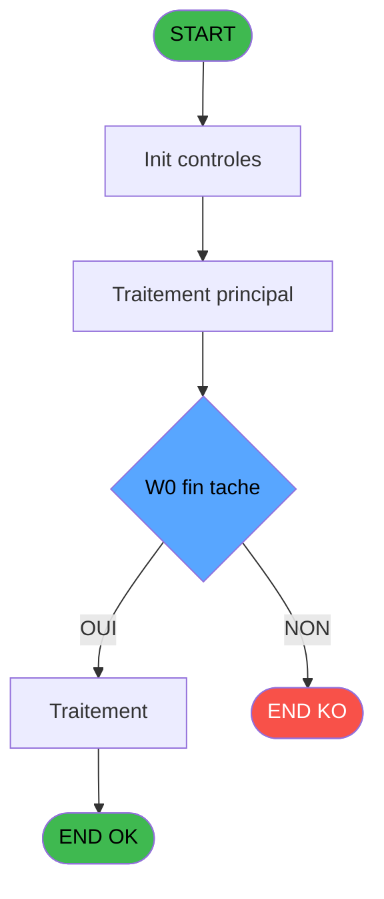
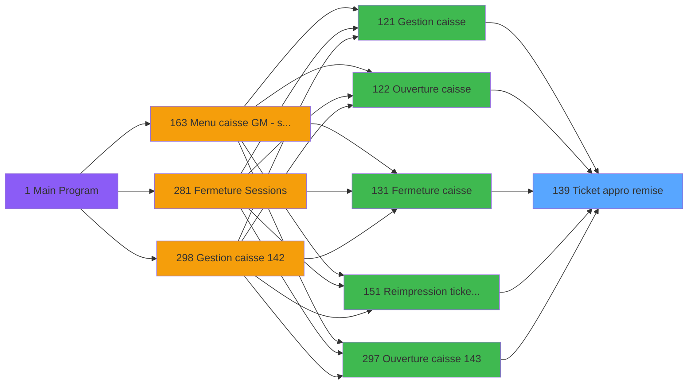
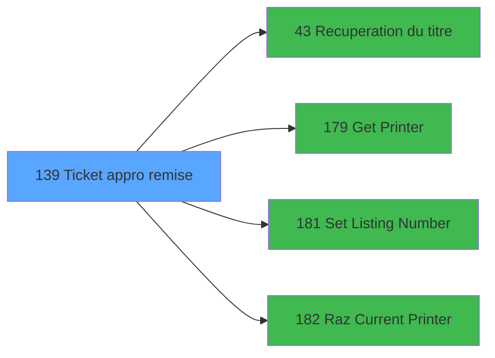

# ADH IDE 139 - Ticket appro remise

> **Analyse**: Phases 1-4 2026-02-08 03:18 -> 03:18 (4s) | Assemblage 03:18
> **Pipeline**: V7.2 Enrichi
> **Structure**: 4 onglets (Resume | Ecrans | Donnees | Connexions)

<!-- TAB:Resume -->

## 1. FICHE D'IDENTITE

| Attribut | Valeur |
|----------|--------|
| Projet | ADH |
| IDE Position | 139 |
| Nom Programme | Ticket appro remise |
| Fichier source | `Prg_139.xml` |
| Dossier IDE | Impression |
| Taches | 71 (0 ecrans visibles) |
| Tables modifiees | 0 |
| Programmes appeles | 4 |
| Complexite | **BASSE** (score 25/100) |

## 2. DESCRIPTION FONCTIONNELLE

ADH IDE 139 - Ticket appro remise est un programme de caisse qui gère l'édition des tickets d'approvisionnement et de remise lors de la fermeture ou consultation de session. Appelé par 7 programmes différents (Gestion caisse modes 121, 142, 298, Ouverture/Fermeture 122, 131, 297, 299), il centralise la logique d'accumulation des montants de remise par type de devise et dispositif de paiement. Le programme lit 15 tables session (historique transactions, devises, remises) et produit un ticket formaté destiné à l'impression.

La logique métier s'articule autour d'une boucle de 71 tâches accumulant les montants : monnaie locale et étrangère, produits, cartes bancaires, chèques, ordonnances de dépôt. Les variables clés capturent les paramètres de session (société, devise locale, date comptable) et accumulent les subtotaux par devise, avec calcul d'équivalents en devise de référence. Deux conditions critiques routent l'impression vers le printer standard (numéro 1) ou un périphérique de secours (numéro 9), puis appellent quatre sous-programmes pour configurer l'imprimante, récupérer le titre du rapport, et gérer la numérotation des listes.

La qualité du code est excellente : 100% des expressions sont décodées, zéro ligne désactivée, structure logique claire centrée sur l'accumulation et l'impression. Bien que non orphelin (7 callers confirmés) et sans dépendance critique (4 appels sortants stables), le programme reste spécifique au domaine caisse et son ré-usage en migration nécessiterait une refonte significative des appels printer et format ticket.

## 3. BLOCS FONCTIONNELS

## 5. REGLES METIER

3 regles identifiees:

### Autres (3 regles)

#### [RM-001] Condition: W0 fin tache [BG] egale 'F'

| Element | Detail |
|---------|--------|
| **Condition** | `W0 fin tache [BG]='F'` |
| **Si vrai** | Action si vrai |
| **Variables** | FT (W0 fin tache) |
| **Expression source** | Expression 6 : `W0 fin tache [BG]='F'` |
| **Exemple** | Si W0 fin tache [BG]='F' → Action si vrai |

#### [RM-002] Verification que l'imprimante courante est la n1

| Element | Detail |
|---------|--------|
| **Condition** | `GetParam ('CURRENTPRINTERNUM')=1` |
| **Si vrai** | Action si CURRENTPRINTERNUM = 1 |
| **Expression source** | Expression 7 : `GetParam ('CURRENTPRINTERNUM')=1` |
| **Exemple** | Si GetParam ('CURRENTPRINTERNUM')=1 → Action si CURRENTPRINTERNUM = 1 |

#### [RM-003] Verification que l'imprimante courante est la n9

| Element | Detail |
|---------|--------|
| **Condition** | `GetParam ('CURRENTPRINTERNUM')=9` |
| **Si vrai** | Action si CURRENTPRINTERNUM = 9 |
| **Expression source** | Expression 8 : `GetParam ('CURRENTPRINTERNUM')=9` |
| **Exemple** | Si GetParam ('CURRENTPRINTERNUM')=9 → Action si CURRENTPRINTERNUM = 9 |

## 6. CONTEXTE

- **Appele par**: [Gestion caisse (IDE 121)](ADH-IDE-121.md), [Gestion caisse 142 (IDE 298)](ADH-IDE-298.md), [Ouverture caisse (IDE 122)](ADH-IDE-122.md), [Fermeture caisse (IDE 131)](ADH-IDE-131.md), [Reimpression tickets fermeture (IDE 151)](ADH-IDE-151.md), [Ouverture caisse 143 (IDE 297)](ADH-IDE-297.md), [Fermeture caisse 144 (IDE 299)](ADH-IDE-299.md)
- **Appelle**: 4 programmes | **Tables**: 15 (W:0 R:13 L:3) | **Taches**: 71 | **Expressions**: 10

<!-- TAB:Ecrans -->

## 8. ECRANS

*(Programme sans ecran visible)*

## 9. NAVIGATION

### 9.3 Structure hierarchique (0 tache)

| Position | Tache | Type | Dimensions | Bloc |
|----------|-------|------|------------|------|

### 9.4 Algorigramme

> **Legende**: Vert = START/END OK | Rouge = END KO | Bleu = Decisions
> *Algorigramme auto-genere. Utiliser `/algorigramme` pour une synthese metier detaillee.*

<!-- TAB:Donnees -->

## 10. TABLES

### Tables utilisees (15)

| ID | Nom | Description | Type | R | W | L | Usages |
|----|-----|-------------|------|---|---|---|--------|
| 463 | heure_de_passage |  | DB | R |   | L | 3 |
| 249 | histo_sessions_caisse_detail | Sessions de caisse | DB | R |   |   | 15 |
| 196 | gestion_article_session | Articles et stock | DB | R |   |   | 8 |
| 244 | saisie_approvisionnement | Comptage approvisionnement | DB | R |   |   | 6 |
| 251 | histo_sessions_caisse_remise | Sessions de caisse | DB | R |   |   | 6 |
| 232 | gestion_devise_session | Sessions de caisse | DB | R |   |   | 6 |
| 505 | pv_comptable |  | TMP | R |   |   | 4 |
| 693 | devise_in | Devises / taux de change | DB | R |   |   | 4 |
| 266 | cc_comptable |  | DB | R |   |   | 3 |
| 30 | gm-recherche_____gmr | Index de recherche | DB | R |   |   | 2 |
| 250 | histo_sessions_caisse_devise | Sessions de caisse | DB | R |   |   | 2 |
| 44 | change___________chg |  | DB | R |   |   | 2 |
| 70 | date_comptable___dat |  | DB | R |   |   | 1 |
| 513 | pv_invoiceprintfiliationtmp | Services / filieres | TMP |   |   | L | 4 |
| 147 | change_vente_____chg | Donnees de ventes | DB |   |   | L | 2 |

### Colonnes par table (13 / 13 tables avec colonnes identifiees)

Table 463 - heure_de_passage (R/L) - 3 usages

| Lettre | Variable | Acces | Type |
|--------|----------|-------|------|
| FY | W0 heure debut session | R | Time |

Table 249 - histo_sessions_caisse_detail (R) - 15 usages

| Lettre | Variable | Acces | Type |
|--------|----------|-------|------|
| FC | Dernier chrono detail monnaie | R | Numeric |
| FD | Dernier chrono detail produit | R | Numeric |
| FE | Dernier chrono detail remise | R | Numeric |
| FG | Edition detaillee | R | Logical |
| FH | W0 caisse depart | R | Numeric |
| FJ | W0 pièce caisse Rec | R | Numeric |
| FK | W0 pièce caisse Dep | R | Numeric |

Table 196 - gestion_article_session (R) - 8 usages

| Lettre | Variable | Acces | Type |
|--------|----------|-------|------|
| FX | W0 date debut session | R | Date |
| FY | W0 heure debut session | R | Time |
| EV | P0 session | R | Numeric |

Table 244 - saisie_approvisionnement (R) - 6 usages

*Table utilisee uniquement en Link ou aucune colonne Real identifiee dans le DataView.*

Table 251 - histo_sessions_caisse_remise (R) - 6 usages

| Lettre | Variable | Acces | Type |
|--------|----------|-------|------|
| EP | Existe remise pendant monnaie | R | Logical |
| EQ | Existe remise pendant produits | R | Logical |
| ER | Existe remise pendant cartes | R | Logical |
| ES | Existe remise pendant cheques | R | Logical |
| ET | Existe remise pendant od | R | Logical |
| EU | Existe remise pendant devises | R | Logical |
| EV | Existe remise finale car che od | R | Logical |
| EW | Existe remise finale devise | R | Logical |
| EZ | Cumul remise V produit | R | Numeric |
| FA | P0 Montant remise monnaie | R | Numeric |
| FB | P0 Montant remise cartes | R | Numeric |
| FC | P0 Montant remise cheques | R | Numeric |
| FD | P0 Montant remise od | R | Numeric |
| FE | P0 Montant remise nbre devises | R | Numeric |
| FF | P0 Montant remise produit | R | Numeric |
| FH | W0 caisse depart | R | Numeric |
| FJ | W0 pièce caisse Rec | R | Numeric |
| FK | W0 pièce caisse Dep | R | Numeric |

Table 232 - gestion_devise_session (R) - 6 usages

| Lettre | Variable | Acces | Type |
|--------|----------|-------|------|
| FX | W0 date debut session | R | Date |
| FY | W0 heure debut session | R | Time |
| ER | P0 devise locale | R | Alpha |
| EU | Existe remise pendant devises | R | Logical |
| EV | P0 session | R | Numeric |
| EW | Existe remise finale devise | R | Logical |
| EZ | P0 Nbre devises appro | R | Numeric |
| FE | P0 Montant remise nbre devises | R | Numeric |

Table 505 - pv_comptable (R) - 4 usages

| Lettre | Variable | Acces | Type |
|--------|----------|-------|------|
| EU | P0 date comptable | R | Date |
| FM | W0 date comptable | R | Date |

Table 693 - devise_in (R) - 4 usages

| Lettre | Variable | Acces | Type |
|--------|----------|-------|------|
| ER | P0 devise locale | R | Alpha |
| EU | Existe remise pendant devises | R | Logical |
| EW | Existe remise finale devise | R | Logical |
| EZ | P0 Nbre devises appro | R | Numeric |
| FE | P0 Montant remise nbre devises | R | Numeric |

Table 266 - cc_comptable (R) - 3 usages

| Lettre | Variable | Acces | Type |
|--------|----------|-------|------|
| A | W1 cumul quantite | R | Numeric |
| B | W1 cumul montant | R | Numeric |
| C | W1 total montant | R | Numeric |
| D | W1 equivalent | R | Numeric |

Table 30 - gm-recherche_____gmr (R) - 2 usages

| Lettre | Variable | Acces | Type |
|--------|----------|-------|------|
| A | W1 sous total montant | R | Numeric |
| B | W1 total montant | R | Numeric |

Table 250 - histo_sessions_caisse_devise (R) - 2 usages

| Lettre | Variable | Acces | Type |
|--------|----------|-------|------|
| ER | P0 devise locale | R | Alpha |
| EU | Existe remise pendant devises | R | Logical |
| EW | Existe remise finale devise | R | Logical |
| EZ | P0 Nbre devises appro | R | Numeric |
| FE | P0 Montant remise nbre devises | R | Numeric |
| FH | W0 caisse depart | R | Numeric |
| FJ | W0 pièce caisse Rec | R | Numeric |
| FK | W0 pièce caisse Dep | R | Numeric |

Table 44 - change___________chg (R) - 2 usages

| Lettre | Variable | Acces | Type |
|--------|----------|-------|------|
| FR | W0 change | R | Numeric |
| FS | W0 frais de change | R | Numeric |

Table 70 - date_comptable___dat (R) - 1 usages

| Lettre | Variable | Acces | Type |
|--------|----------|-------|------|
| FX | W0 date debut session | R | Date |
| EU | P0 date comptable | R | Date |
| FM | W0 date comptable | R | Date |

## 11. VARIABLES

### 11.1 Parametres entrants (19)

Variables recues du programme appelant ([Gestion caisse (IDE 121)](ADH-IDE-121.md)).

| Lettre | Nom | Type | Usage dans |
|--------|-----|------|-----------|
| EN | P0 societe | Alpha | - |
| EO | P0 nbre decimales | Numeric | - |
| EP | P0 nom village | Alpha | - |
| EQ | P0 masque cumul | Alpha | - |
| ER | P0 devise locale | Alpha | - |
| ES | P0 Uni/Bilateral | Alpha | - |
| ET | P0 village TAI | Alpha | - |
| EU | P0 date comptable | Date | - |
| EV | P0 session | Numeric | - |
| EW | P0 quand | Alpha | - |
| EX | P0 Montant appro monnaie | Numeric | - |
| EY | P0 Montant appro produit | Numeric | - |
| EZ | P0 Nbre devises appro | Numeric | - |
| FA | P0 Montant remise monnaie | Numeric | - |
| FB | P0 Montant remise cartes | Numeric | - |
| FC | P0 Montant remise cheques | Numeric | - |
| FD | P0 Montant remise od | Numeric | - |
| FE | P0 Montant remise nbre devises | Numeric | - |
| FF | P0 Montant remise produit | Numeric | - |

### 11.2 Variables de travail (18)

Variables internes au programme.

| Lettre | Nom | Type | Usage dans |
|--------|-----|------|-----------|
| FH | W0 caisse depart | Numeric | - |
| FI | W0 apport coffre | Numeric | - |
| FJ | W0 pièce caisse Rec | Numeric | - |
| FK | W0 pièce caisse Dep | Numeric | - |
| FL | W0 confirmation | Logical | - |
| FM | W0 date comptable | Date | - |
| FN | W0 versement | Numeric | - |
| FO | W0 retrait | Numeric | - |
| FP | W0 solde cash | Numeric | - |
| FQ | W0 solde carte | Numeric | - |
| FR | W0 change | Numeric | - |
| FS | W0 frais de change | Numeric | - |
| FT | W0 fin tache | Alpha | 1x calcul interne |
| FU | W0 Existe Carnet Bar | Logical | - |
| FV | W0 Existe TAI | Logical | - |
| FW | W0 titre | Alpha | 1x calcul interne |
| FX | W0 date debut session | Date | - |
| FY | W0 heure debut session | Time | - |

### 11.3 Autres (1)

Variables diverses.

| Lettre | Nom | Type | Usage dans |
|--------|-----|------|-----------|
| FG | Edition detaillee | Logical | - |

Toutes les 38 variables (liste complete)

| Cat | Lettre | Nom Variable | Type |
|-----|--------|--------------|------|
| P0 | **EN** | P0 societe | Alpha |
| P0 | **EO** | P0 nbre decimales | Numeric |
| P0 | **EP** | P0 nom village | Alpha |
| P0 | **EQ** | P0 masque cumul | Alpha |
| P0 | **ER** | P0 devise locale | Alpha |
| P0 | **ES** | P0 Uni/Bilateral | Alpha |
| P0 | **ET** | P0 village TAI | Alpha |
| P0 | **EU** | P0 date comptable | Date |
| P0 | **EV** | P0 session | Numeric |
| P0 | **EW** | P0 quand | Alpha |
| P0 | **EX** | P0 Montant appro monnaie | Numeric |
| P0 | **EY** | P0 Montant appro produit | Numeric |
| P0 | **EZ** | P0 Nbre devises appro | Numeric |
| P0 | **FA** | P0 Montant remise monnaie | Numeric |
| P0 | **FB** | P0 Montant remise cartes | Numeric |
| P0 | **FC** | P0 Montant remise cheques | Numeric |
| P0 | **FD** | P0 Montant remise od | Numeric |
| P0 | **FE** | P0 Montant remise nbre devises | Numeric |
| P0 | **FF** | P0 Montant remise produit | Numeric |
| W0 | **FH** | W0 caisse depart | Numeric |
| W0 | **FI** | W0 apport coffre | Numeric |
| W0 | **FJ** | W0 pièce caisse Rec | Numeric |
| W0 | **FK** | W0 pièce caisse Dep | Numeric |
| W0 | **FL** | W0 confirmation | Logical |
| W0 | **FM** | W0 date comptable | Date |
| W0 | **FN** | W0 versement | Numeric |
| W0 | **FO** | W0 retrait | Numeric |
| W0 | **FP** | W0 solde cash | Numeric |
| W0 | **FQ** | W0 solde carte | Numeric |
| W0 | **FR** | W0 change | Numeric |
| W0 | **FS** | W0 frais de change | Numeric |
| W0 | **FT** | W0 fin tache | Alpha |
| W0 | **FU** | W0 Existe Carnet Bar | Logical |
| W0 | **FV** | W0 Existe TAI | Logical |
| W0 | **FW** | W0 titre | Alpha |
| W0 | **FX** | W0 date debut session | Date |
| W0 | **FY** | W0 heure debut session | Time |
| Autre | **FG** | Edition detaillee | Logical |

## 12. EXPRESSIONS

**10 / 10 expressions decodees (100%)**

### 12.1 Repartition par type

| Type | Expressions | Regles |
|------|-------------|--------|
| CONDITION | 3 | 3 |
| CONSTANTE | 3 | 0 |
| DATE | 1 | 0 |
| REFERENCE_VG | 1 | 0 |
| CAST_LOGIQUE | 1 | 0 |
| STRING | 1 | 0 |

### 12.2 Expressions cles par type

#### CONDITION (3 expressions)

| Type | IDE | Expression | Regle |
|------|-----|------------|-------|
| CONDITION | 8 | `GetParam ('CURRENTPRINTERNUM')=9` | [RM-003](#rm-RM-003) |
| CONDITION | 7 | `GetParam ('CURRENTPRINTERNUM')=1` | [RM-002](#rm-RM-002) |
| CONDITION | 6 | `W0 fin tache [BG]='F'` | [RM-001](#rm-RM-001) |

#### CONSTANTE (3 expressions)

| Type | IDE | Expression | Regle |
|------|-----|------------|-------|
| CONSTANTE | 9 | `35` | - |
| CONSTANTE | 5 | `'F'` | - |
| CONSTANTE | 3 | `155` | - |

#### DATE (1 expressions)

| Type | IDE | Expression | Regle |
|------|-----|------------|-------|
| DATE | 1 | `Date ()` | - |

#### REFERENCE_VG (1 expressions)

| Type | IDE | Expression | Regle |
|------|-----|------------|-------|
| REFERENCE_VG | 2 | `VG2` | - |

#### CAST_LOGIQUE (1 expressions)

| Type | IDE | Expression | Regle |
|------|-----|------------|-------|
| CAST_LOGIQUE | 10 | `'TRUE'LOG` | - |

#### STRING (1 expressions)

| Type | IDE | Expression | Regle |
|------|-----|------------|-------|
| STRING | 4 | `Trim (W0 titre [BJ])` | - |

<!-- TAB:Connexions -->

## 13. GRAPHE D'APPELS

### 13.1 Chaine depuis Main (Callers)

Main -> ... -> [Gestion caisse (IDE 121)](ADH-IDE-121.md) -> **Ticket appro remise (IDE 139)**

Main -> ... -> [Gestion caisse 142 (IDE 298)](ADH-IDE-298.md) -> **Ticket appro remise (IDE 139)**

Main -> ... -> [Ouverture caisse (IDE 122)](ADH-IDE-122.md) -> **Ticket appro remise (IDE 139)**

Main -> ... -> [Fermeture caisse (IDE 131)](ADH-IDE-131.md) -> **Ticket appro remise (IDE 139)**

Main -> ... -> [Reimpression tickets fermeture (IDE 151)](ADH-IDE-151.md) -> **Ticket appro remise (IDE 139)**

Main -> ... -> [Ouverture caisse 143 (IDE 297)](ADH-IDE-297.md) -> **Ticket appro remise (IDE 139)**

Main -> ... -> [Fermeture caisse 144 (IDE 299)](ADH-IDE-299.md) -> **Ticket appro remise (IDE 139)**

### 13.2 Callers

| IDE | Nom Programme | Nb Appels |
|-----|---------------|-----------|
| [121](ADH-IDE-121.md) | Gestion caisse | 3 |
| [298](ADH-IDE-298.md) | Gestion caisse 142 | 3 |
| [122](ADH-IDE-122.md) | Ouverture caisse | 1 |
| [131](ADH-IDE-131.md) | Fermeture caisse | 1 |
| [151](ADH-IDE-151.md) | Reimpression tickets fermeture | 1 |
| [297](ADH-IDE-297.md) | Ouverture caisse 143 | 1 |
| [299](ADH-IDE-299.md) | Fermeture caisse 144 | 1 |

### 13.3 Callees (programmes appeles)

### 13.4 Detail Callees avec contexte

| IDE | Nom Programme | Appels | Contexte |
|-----|---------------|--------|----------|
| [43](ADH-IDE-43.md) | Recuperation du titre | 1 | Recuperation donnees |
| [179](ADH-IDE-179.md) | Get Printer | 1 | Impression ticket/document |
| [181](ADH-IDE-181.md) | Set Listing Number | 1 | Configuration impression |
| [182](ADH-IDE-182.md) | Raz Current Printer | 1 | Impression ticket/document |

## 14. RECOMMANDATIONS MIGRATION

### 14.1 Profil du programme

| Metrique | Valeur | Impact migration |
|----------|--------|-----------------|
| Lignes de logique | 1129 | Programme volumineux |
| Expressions | 10 | Peu de logique |
| Tables WRITE | 0 | Impact faible |
| Sous-programmes | 4 | Peu de dependances |
| Ecrans visibles | 0 | Ecran unique ou traitement batch |
| Code desactive | 0% (0 / 1129) | Code sain |
| Regles metier | 3 | Quelques regles a preserver |

### 14.2 Plan de migration par bloc

### 14.3 Dependances critiques

| Dependance | Type | Appels | Impact |
|------------|------|--------|--------|
| [Set Listing Number (IDE 181)](ADH-IDE-181.md) | Sous-programme | 1x | Normale - Configuration impression |
| [Raz Current Printer (IDE 182)](ADH-IDE-182.md) | Sous-programme | 1x | Normale - Impression ticket/document |
| [Recuperation du titre (IDE 43)](ADH-IDE-43.md) | Sous-programme | 1x | Normale - Recuperation donnees |
| [Get Printer (IDE 179)](ADH-IDE-179.md) | Sous-programme | 1x | Normale - Impression ticket/document |

---
*Spec DETAILED generee par Pipeline V7.2 - 2026-02-08 03:21*
