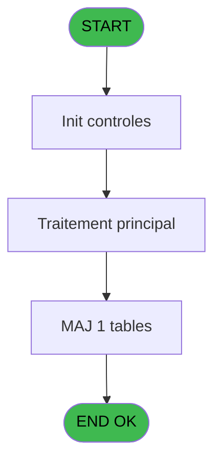
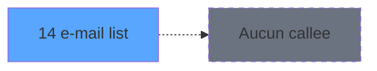

# ADH IDE 14 - e-mail list

> **Analyse**: Phases 1-4 2026-02-07 03:39 -> 01:15 (21h36min) | Assemblage 01:15
> **Pipeline**: V7.2 Enrichi
> **Structure**: 4 onglets (Resume | Ecrans | Donnees | Connexions)

<!-- TAB:Resume -->

## 1. FICHE D'IDENTITE

| Attribut | Valeur |
|----------|--------|
| Projet | ADH |
| IDE Position | 14 |
| Nom Programme | e-mail list |
| Fichier source | `Prg_14.xml` |
| Dossier IDE | General |
| Taches | 1 (1 ecrans visibles) |
| Tables modifiees | 1 |
| Programmes appeles | 0 |
| Complexite | **BASSE** (score 7/100) |

## 2. DESCRIPTION FONCTIONNELLE

# ADH IDE 14 - E-mail List

Programme de gestion et consultation des listes d'e-mails associées aux réservations en cours. Accédé depuis le module Catching stats (IDE 12), il permet de visualiser et mettre à jour les adresses e-mail des clients enregistrées dans la base de données des réservations.

Modifie la table `quadriga_chambre` pour mettre à jour les contacts e-mail. Integre les données de réservation provenant du système Quadriga, permettant une synchronisation des informations de contact entre les systèmes PMS et la gestion interne des adhérents.

Tâche principale : E-mail List - gère l'affichage, la validation et la modification des listes d'e-mails pour les contacts de réservations actives. Expose les données des e-mails via une interface de consultation et permet les mises à jour directes des adresses pour faciliter la communication avec les clients.

## 3. BLOCS FONCTIONNELS

### 3.1 Traitement (1 tache)

Traitements internes.

---

#### 14 - E-mail List [[ECRAN]](#ecran-t1)

**Role** : Traitement : E-mail List.
**Ecran** : 698 x 293 DLU (MDI) | [Voir mockup](#ecran-t1)

## 5. REGLES METIER

*(Aucune regle metier identifiee dans les expressions)*

## 6. CONTEXTE

- **Appele par**: [Catching stats (IDE 12)](ADH-IDE-12.md)
- **Appelle**: 0 programmes | **Tables**: 1 (W:1 R:0 L:0) | **Taches**: 1 | **Expressions**: 0

<!-- TAB:Ecrans -->

## 8. ECRANS

### 8.1 Forms visibles (1 / 1)

| # | Position | Tache | Nom | Type | Largeur | Hauteur | Bloc |
|---|----------|-------|-----|------|---------|---------|------|
| 1 | 14 | 14 | E-mail List | MDI | 698 | 293 | Traitement |

### 8.2 Mockups Ecrans

---

#### 14 - E-mail List
**Tache** : [14](#t1) | **Type** : MDI | **Dimensions** : 698 x 293 DLU
**Bloc** : Traitement | **Titre IDE** : E-mail List

<!-- FORM-DATA:
{
    "width":  698,
    "vFactor":  8,
    "type":  "MDI",
    "hFactor":  4,
    "controls":  [
                     {
                         "x":  9,
                         "type":  "label",
                         "var":  "",
                         "y":  8,
                         "w":  265,
                         "fmt":  "",
                         "name":  "",
                         "h":  15,
                         "color":  "201",
                         "text":  "Express Counter Statistics",
                         "parent":  null
                     },
                     {
                         "x":  36,
                         "type":  "label",
                         "var":  "",
                         "y":  34,
                         "w":  265,
                         "fmt":  "",
                         "name":  "",
                         "h":  15,
                         "color":  "201",
                         "text":  "List of recipients",
                         "parent":  null
                     },
                     {
                         "x":  36,
                         "type":  "table",
                         "var":  "",
                         "name":  "",
                         "titleH":  12,
                         "color":  "110",
                         "w":  633,
                         "y":  55,
                         "fmt":  "",
                         "parent":  null,
                         "text":  "",
                         "rowH":  15,
                         "h":  205,
                         "cols":  [
                                      {
                                          "title":  "Name",
                                          "layer":  1,
                                          "w":  124
                                      },
                                      {
                                          "title":  "First name",
                                          "layer":  2,
                                          "w":  124
                                      },
                                      {
                                          "title":  "Email address",
                                          "layer":  3,
                                          "w":  292
                                      },
                                      {
                                          "title":  "Send ?",
                                          "layer":  4,
                                          "w":  75
                                      }
                                  ],
                         "rows":  4
                     },
                     {
                         "x":  40,
                         "type":  "edit",
                         "var":  "",
                         "y":  70,
                         "w":  116,
                         "fmt":  "",
                         "name":  "",
                         "h":  10,
                         "color":  "110",
                         "text":  "",
                         "parent":  3
                     },
                     {
                         "x":  164,
                         "type":  "edit",
                         "var":  "",
                         "y":  70,
                         "w":  116,
                         "fmt":  "",
                         "name":  "",
                         "h":  10,
                         "color":  "110",
                         "text":  "",
                         "parent":  3
                     },
                     {
                         "x":  288,
                         "type":  "edit",
                         "var":  "",
                         "y":  70,
                         "w":  284,
                         "fmt":  "",
                         "name":  "",
                         "h":  10,
                         "color":  "110",
                         "text":  "",
                         "parent":  3
                     },
                     {
                         "x":  587,
                         "type":  "combobox",
                         "var":  "",
                         "y":  69,
                         "w":  56,
                         "fmt":  "",
                         "name":  "",
                         "h":  12,
                         "color":  "110",
                         "text":  "Yes,No",
                         "parent":  3
                     },
                     {
                         "x":  617,
                         "type":  "button",
                         "var":  "",
                         "y":  274,
                         "w":  79,
                         "fmt":  "Exit",
                         "name":  "",
                         "h":  17,
                         "color":  "",
                         "text":  "",
                         "parent":  null
                     }
                 ],
    "taskId":  "14",
    "height":  293
}
-->

<strong>Champs : 4 champs</strong>

| Pos (x,y) | Nom | Variable | Type |
|-----------|-----|----------|------|
| 40,70 | (sans nom) | - | edit |
| 164,70 | (sans nom) | - | edit |
| 288,70 | (sans nom) | - | edit |
| 587,69 | Yes,No | - | combobox |

<strong>Boutons : 1 boutons</strong>

| Bouton | Pos (x,y) | Action |
|--------|-----------|--------|
| Exit | 617,274 | Quitte le programme |

## 9. NAVIGATION

Ecran unique: **E-mail List**

### 9.3 Structure hierarchique (1 tache)

| Position | Tache | Type | Dimensions | Bloc |
|----------|-------|------|------------|------|
| **14.1** | [**E-mail List** (14)](#t1) [mockup](#ecran-t1) | MDI | 698x293 | Traitement |

### 9.4 Algorigramme

> **Legende**: Vert = START/END OK | Rouge = END KO | Bleu = Decisions
> *Algorigramme auto-genere. Utiliser `/algorigramme` pour une synthese metier detaillee.*

<!-- TAB:Donnees -->

## 10. TABLES

### Tables utilisees (1)

| ID | Nom | Description | Type | R | W | L | Usages |
|----|-----|-------------|------|---|---|---|--------|
| 782 | quadriga_chambre |  | DB |   | **W** |   | 1 |

### Colonnes par table (0 / 1 tables avec colonnes identifiees)

Table 782 - quadriga_chambre (**W**) - 1 usages

*Table utilisee uniquement en Link ou aucune colonne Real identifiee dans le DataView.*

## 11. VARIABLES

*(Programme sans variables locales mappees)*

## 12. EXPRESSIONS

**0 / 0 expressions decodees (0%)**

### 12.1 Repartition par type

| Type | Expressions | Regles |
|------|-------------|--------|

### 12.2 Expressions cles par type

<!-- TAB:Connexions -->

## 13. GRAPHE D'APPELS

### 13.1 Chaine depuis Main (Callers)

Main -> ... -> [Catching stats (IDE 12)](ADH-IDE-12.md) -> **e-mail list (IDE 14)**

### 13.2 Callers

| IDE | Nom Programme | Nb Appels |
|-----|---------------|-----------|
| [12](ADH-IDE-12.md) | Catching stats | 1 |

### 13.3 Callees (programmes appeles)

### 13.4 Detail Callees avec contexte

| IDE | Nom Programme | Appels | Contexte |
|-----|---------------|--------|----------|
| - | (aucun) | - | - |

## 14. RECOMMANDATIONS MIGRATION

### 14.1 Profil du programme

| Metrique | Valeur | Impact migration |
|----------|--------|-----------------|
| Lignes de logique | 5 | Programme compact |
| Expressions | 0 | Peu de logique |
| Tables WRITE | 1 | Impact faible |
| Sous-programmes | 0 | Peu de dependances |
| Ecrans visibles | 1 | Ecran unique ou traitement batch |
| Code desactive | 0% (0 / 5) | Code sain |
| Regles metier | 0 | Pas de regle identifiee |

### 14.2 Plan de migration par bloc

#### Traitement (1 tache: 1 ecran, 0 traitement)

- **Strategie** : 1 composant(s) UI (Razor/React) avec formulaires et validation.
- Decomposer les taches en services unitaires testables.

### 14.3 Dependances critiques

| Dependance | Type | Appels | Impact |
|------------|------|--------|--------|
| quadriga_chambre | Table WRITE (Database) | 1x | Schema + repository |

---
*Spec DETAILED generee par Pipeline V7.2 - 2026-02-08 01:16*
