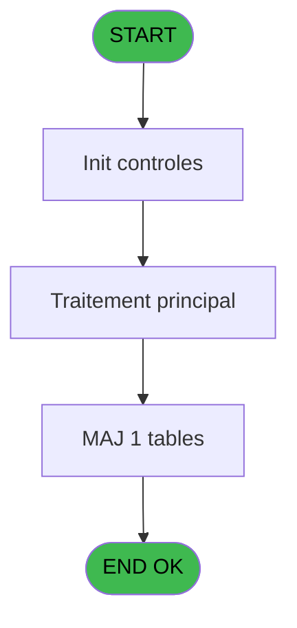
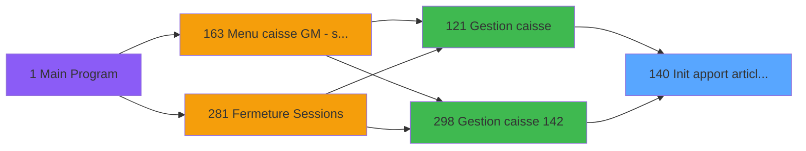

# ADH IDE 140 - Init apport article session WS

> **Analyse**: Phases 1-4 2026-02-08 03:21 -> 03:21 (4s) | Assemblage 03:21
> **Pipeline**: V7.2 Enrichi
> **Structure**: 4 onglets (Resume | Ecrans | Donnees | Connexions)

<!-- TAB:Resume -->

## 1. FICHE D'IDENTITE

| Attribut | Valeur |
|----------|--------|
| Projet | ADH |
| IDE Position | 140 |
| Nom Programme | Init apport article session WS |
| Fichier source | `Prg_140.xml` |
| Dossier IDE | Caisse |
| Taches | 3 (0 ecrans visibles) |
| Tables modifiees | 1 |
| Programmes appeles | 0 |
| Complexite | **BASSE** (score 7/100) |

## 2. DESCRIPTION FONCTIONNELLE

**ADH IDE 140** initialise les articles en apport lors de l'ouverture d'une session de caisse. Ce programme est appelé depuis le flux principal de gestion de caisse (IDE 121/298) et gère la population de la table `gestion_article_session` avec les articles disponibles pour la session courante.

Le programme effectue principalement deux opérations : d'abord, il charge la configuration des articles applicables à la session (filtrés par devise, service, ou autres critères métier), puis il crée les enregistrements initiaux dans `gestion_article_session` pour tracker les mouvements d'articles pendant la session. Cela permet à l'utilisateur de voir quels articles sont disponibles et de saisir les quantités en apport.

Les données insérées servent de base au module de gestion des articles en session, permettant le rapprochement des écarts à la fermeture. Ce programme est essentiel au workflow d'ouverture de caisse puisqu'il prépare l'état initial des stocks avant le début des transactions.

## 3. BLOCS FONCTIONNELS

## 5. REGLES METIER

*(Aucune regle metier identifiee dans les expressions)*

## 6. CONTEXTE

- **Appele par**: [Gestion caisse 142 (IDE 298)](ADH-IDE-298.md), [Gestion caisse (IDE 121)](ADH-IDE-121.md)
- **Appelle**: 0 programmes | **Tables**: 3 (W:1 R:1 L:2) | **Taches**: 3 | **Expressions**: 1

<!-- TAB:Ecrans -->

## 8. ECRANS

*(Programme sans ecran visible)*

## 9. NAVIGATION

### 9.3 Structure hierarchique (0 tache)

| Position | Tache | Type | Dimensions | Bloc |
|----------|-------|------|------------|------|

### 9.4 Algorigramme

> **Legende**: Vert = START/END OK | Rouge = END KO | Bleu = Decisions
> *Algorigramme auto-genere. Utiliser `/algorigramme` pour une synthese metier detaillee.*

<!-- TAB:Donnees -->

## 10. TABLES

### Tables utilisees (3)

| ID | Nom | Description | Type | R | W | L | Usages |
|----|-----|-------------|------|---|---|---|--------|
| 196 | gestion_article_session | Articles et stock | DB |   | **W** | L | 2 |
| 77 | articles_________art | Articles et stock | DB | R |   |   | 1 |
| 197 | articles_en_stock | Articles et stock | DB |   |   | L | 1 |

### Colonnes par table (1 / 2 tables avec colonnes identifiees)

Table 196 - gestion_article_session (**W**/L) - 2 usages

*Table utilisee uniquement en Link ou aucune colonne Real identifiee dans le DataView.*

Table 77 - articles_________art (R) - 1 usages

| Lettre | Variable | Acces | Type |
|--------|----------|-------|------|
| A | ----- OUVERTURE / APPRO | R | Alpha |
| B | ----- PENDANT / APPRO | R | Alpha |
| C | ----- PENDANT / DEPOT | R | Alpha |
| D | ----- FERMETURE / APPRO | R | Alpha |
| E | ----- FERMETURE / DEPOT | R | Alpha |

## 11. VARIABLES

### 11.1 Autres (5)

Variables diverses.

| Lettre | Nom | Type | Usage dans |
|--------|-----|------|-----------|
| EN | ----- OUVERTURE / APPRO | Alpha | - |
| EO | ----- PENDANT / APPRO | Alpha | - |
| EP | ----- PENDANT / DEPOT | Alpha | - |
| EQ | ----- FERMETURE / APPRO | Alpha | - |
| ER | ----- FERMETURE / DEPOT | Alpha | - |

## 12. EXPRESSIONS

**1 / 1 expressions decodees (100%)**

### 12.1 Repartition par type

| Type | Expressions | Regles |
|------|-------------|--------|
| REFERENCE_VG | 1 | 0 |

### 12.2 Expressions cles par type

#### REFERENCE_VG (1 expressions)

| Type | IDE | Expression | Regle |
|------|-----|------------|-------|
| REFERENCE_VG | 1 | `VG1` | - |

<!-- TAB:Connexions -->

## 13. GRAPHE D'APPELS

### 13.1 Chaine depuis Main (Callers)

Main -> ... -> [Gestion caisse 142 (IDE 298)](ADH-IDE-298.md) -> **Init apport article session WS (IDE 140)**

Main -> ... -> [Gestion caisse (IDE 121)](ADH-IDE-121.md) -> **Init apport article session WS (IDE 140)**

### 13.2 Callers

| IDE | Nom Programme | Nb Appels |
|-----|---------------|-----------|
| [298](ADH-IDE-298.md) | Gestion caisse 142 | 2 |
| [121](ADH-IDE-121.md) | Gestion caisse | 1 |

### 13.3 Callees (programmes appeles)

### 13.4 Detail Callees avec contexte

| IDE | Nom Programme | Appels | Contexte |
|-----|---------------|--------|----------|
| - | (aucun) | - | - |

## 14. RECOMMANDATIONS MIGRATION

### 14.1 Profil du programme

| Metrique | Valeur | Impact migration |
|----------|--------|-----------------|
| Lignes de logique | 116 | Programme compact |
| Expressions | 1 | Peu de logique |
| Tables WRITE | 1 | Impact faible |
| Sous-programmes | 0 | Peu de dependances |
| Ecrans visibles | 0 | Ecran unique ou traitement batch |
| Code desactive | 0% (0 / 116) | Code sain |
| Regles metier | 0 | Pas de regle identifiee |

### 14.2 Plan de migration par bloc

### 14.3 Dependances critiques

| Dependance | Type | Appels | Impact |
|------------|------|--------|--------|
| gestion_article_session | Table WRITE (Database) | 1x | Schema + repository |

---
*Spec DETAILED generee par Pipeline V7.2 - 2026-02-08 03:21*
