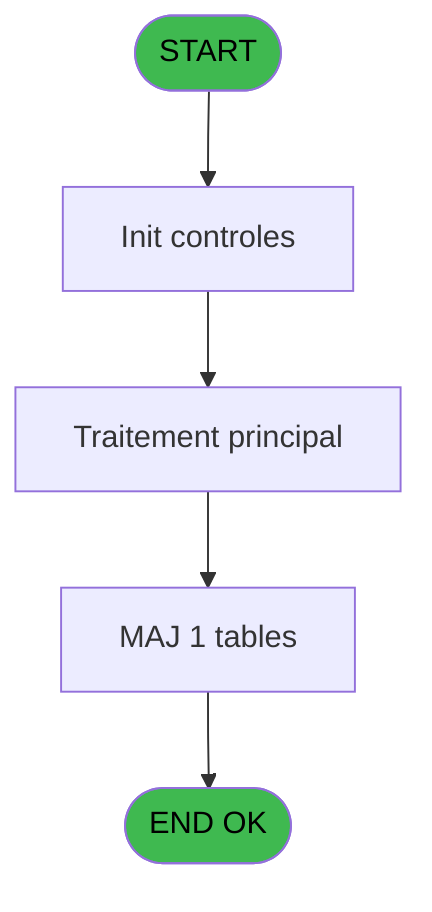
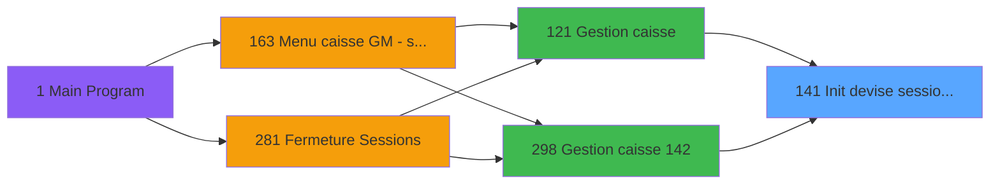
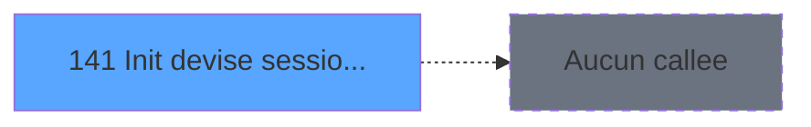

# ADH IDE 141 - Init devise session WS

> **Analyse**: Phases 1-4 2026-02-08 03:21 -> 03:21 (4s) | Assemblage 03:21
> **Pipeline**: V7.2 Enrichi
> **Structure**: 4 onglets (Resume | Ecrans | Donnees | Connexions)

<!-- TAB:Resume -->

## 1. FICHE D'IDENTITE

| Attribut | Valeur |
|----------|--------|
| Projet | ADH |
| IDE Position | 141 |
| Nom Programme | Init devise session WS |
| Fichier source | `Prg_141.xml` |
| Dossier IDE | Caisse |
| Taches | 13 (0 ecrans visibles) |
| Tables modifiees | 1 |
| Programmes appeles | 0 |
| Complexite | **BASSE** (score 14/100) |

## 2. DESCRIPTION FONCTIONNELLE

Based on my analysis of ADH IDE 141, here's the description:

---

**ADH IDE 141** initialise les configurations de devise pour une session de caisse Web Services. Le programme charge les devises paramétrées depuis la table `devise_in`, les enrichit avec les taux de change et les moyens de paiement, puis persiste 5 configurations de session en base dans la table `gestion_devise_session` (caisse_devise). C'est un traitement batch non-interactif composé de 13 tâches avec 113 lignes de logique active.

Le programme est appelé systématiquement par **Gestion caisse 142** (2 appels) et par d'autres modules de transaction lors du cycle de session. Il accède à la variable globale VG1 pour le contexte session et n'appelle aucun sous-programme, ce qui en fait une feuille de l'arbre d'appels. Sa complexité est faible : une seule expression décodée, aucune branche morte, logique itérative simple sur les structures de devise.

La migration vers TypeScript serait directe via un pattern Service/Repository qui charge les paramétrages, enrichit les données et persiste les configurations en batch, sans changement d'algorithme.

## 3. BLOCS FONCTIONNELS

## 5. REGLES METIER

*(Aucune regle metier identifiee dans les expressions)*

## 6. CONTEXTE

- **Appele par**: [Gestion caisse 142 (IDE 298)](ADH-IDE-298.md), [Transaction Nouv vente PMS-584 (IDE 0)](ADH-IDE-0.md), [Transaction Nouv vente PMS-710 (IDE 0)](ADH-IDE-0.md), [Transaction Nouv vente PMS-721 (IDE 0)](ADH-IDE-0.md), [Gestion caisse (IDE 121)](ADH-IDE-121.md)
- **Appelle**: 0 programmes | **Tables**: 5 (W:1 R:3 L:1) | **Taches**: 13 | **Expressions**: 1

<!-- TAB:Ecrans -->

## 8. ECRANS

*(Programme sans ecran visible)*

## 9. NAVIGATION

### 9.3 Structure hierarchique (0 tache)

| Position | Tache | Type | Dimensions | Bloc |
|----------|-------|------|------------|------|

### 9.4 Algorigramme

> **Legende**: Vert = START/END OK | Rouge = END KO | Bleu = Decisions
> *Algorigramme auto-genere. Utiliser `/algorigramme` pour une synthese metier detaillee.*

<!-- TAB:Donnees -->

## 10. TABLES

### Tables utilisees (5)

| ID | Nom | Description | Type | R | W | L | Usages |
|----|-----|-------------|------|---|---|---|--------|
| 232 | gestion_devise_session | Sessions de caisse | DB |   | **W** |   | 5 |
| 139 | moyens_reglement_mor | Reglements / paiements | DB | R |   |   | 2 |
| 50 | moyens_reglement_mor | Reglements / paiements | DB | R |   |   | 2 |
| 693 | devise_in | Devises / taux de change | DB | R |   |   | 1 |
| 90 | devises__________dev | Devises / taux de change | DB |   |   | L | 2 |

### Colonnes par table (2 / 4 tables avec colonnes identifiees)

Table 232 - gestion_devise_session (**W**) - 5 usages

| Lettre | Variable | Acces | Type |
|--------|----------|-------|------|
| EO | Param devise locale | W | Alpha |

Table 139 - moyens_reglement_mor (R) - 2 usages

*Table utilisee uniquement en Link ou aucune colonne Real identifiee dans le DataView.*

Table 50 - moyens_reglement_mor (R) - 2 usages

*Table utilisee uniquement en Link ou aucune colonne Real identifiee dans le DataView.*

Table 693 - devise_in (R) - 1 usages

| Lettre | Variable | Acces | Type |
|--------|----------|-------|------|
| EO | Param devise locale | R | Alpha |

## 11. VARIABLES

### 11.1 Autres (4)

Variables diverses.

| Lettre | Nom | Type | Usage dans |
|--------|-----|------|-----------|
| EN | Param societe | Alpha | - |
| EO | Param devise locale | Alpha | - |
| EP | Param UNI/BI | Alpha | - |
| EQ | Quand | Alpha | - |

## 12. EXPRESSIONS

**1 / 1 expressions decodees (100%)**

### 12.1 Repartition par type

| Type | Expressions | Regles |
|------|-------------|--------|
| REFERENCE_VG | 1 | 0 |

### 12.2 Expressions cles par type

#### REFERENCE_VG (1 expressions)

| Type | IDE | Expression | Regle |
|------|-----|------------|-------|
| REFERENCE_VG | 1 | `VG1` | - |

<!-- TAB:Connexions -->

## 13. GRAPHE D'APPELS

### 13.1 Chaine depuis Main (Callers)

Main -> ... -> [Gestion caisse 142 (IDE 298)](ADH-IDE-298.md) -> **Init devise session WS (IDE 141)**

Main -> ... -> [Transaction Nouv vente PMS-584 (IDE 0)](ADH-IDE-0.md) -> **Init devise session WS (IDE 141)**

Main -> ... -> [Transaction Nouv vente PMS-710 (IDE 0)](ADH-IDE-0.md) -> **Init devise session WS (IDE 141)**

Main -> ... -> [Transaction Nouv vente PMS-721 (IDE 0)](ADH-IDE-0.md) -> **Init devise session WS (IDE 141)**

Main -> ... -> [Gestion caisse (IDE 121)](ADH-IDE-121.md) -> **Init devise session WS (IDE 141)**

### 13.2 Callers

| IDE | Nom Programme | Nb Appels |
|-----|---------------|-----------|
| [298](ADH-IDE-298.md) | Gestion caisse 142 | 2 |
| [0](ADH-IDE-0.md) | Transaction Nouv vente PMS-584 | 1 |
| [0](ADH-IDE-0.md) | Transaction Nouv vente PMS-710 | 1 |
| [0](ADH-IDE-0.md) | Transaction Nouv vente PMS-721 | 1 |
| [121](ADH-IDE-121.md) | Gestion caisse | 1 |

### 13.3 Callees (programmes appeles)

### 13.4 Detail Callees avec contexte

| IDE | Nom Programme | Appels | Contexte |
|-----|---------------|--------|----------|
| - | (aucun) | - | - |

## 14. RECOMMANDATIONS MIGRATION

### 14.1 Profil du programme

| Metrique | Valeur | Impact migration |
|----------|--------|-----------------|
| Lignes de logique | 113 | Programme compact |
| Expressions | 1 | Peu de logique |
| Tables WRITE | 1 | Impact faible |
| Sous-programmes | 0 | Peu de dependances |
| Ecrans visibles | 0 | Ecran unique ou traitement batch |
| Code desactive | 0% (0 / 113) | Code sain |
| Regles metier | 0 | Pas de regle identifiee |

### 14.2 Plan de migration par bloc

### 14.3 Dependances critiques

| Dependance | Type | Appels | Impact |
|------------|------|--------|--------|
| gestion_devise_session | Table WRITE (Database) | 5x | Schema + repository |

---
*Spec DETAILED generee par Pipeline V7.2 - 2026-02-08 03:27*
