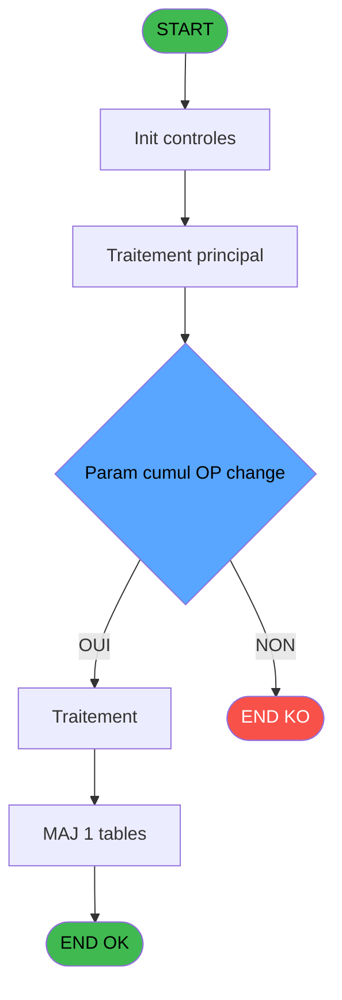
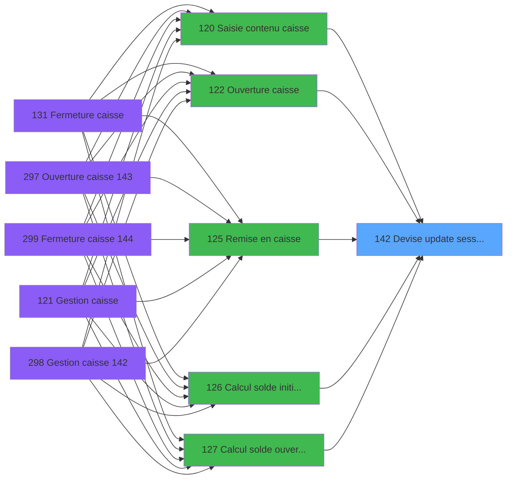
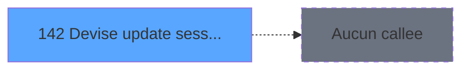

# ADH IDE 142 - Devise update session WS

> **Analyse**: Phases 1-4 2026-02-08 03:27 -> 03:27 (4s) | Assemblage 03:27
> **Pipeline**: V7.2 Enrichi
> **Structure**: 4 onglets (Resume | Ecrans | Donnees | Connexions)

<!-- TAB:Resume -->

## 1. FICHE D'IDENTITE

| Attribut | Valeur |
|----------|--------|
| Projet | ADH |
| IDE Position | 142 |
| Nom Programme | Devise update session WS |
| Fichier source | `Prg_142.xml` |
| Dossier IDE | Caisse |
| Taches | 1 (0 ecrans visibles) |
| Tables modifiees | 1 |
| Programmes appeles | 0 |
| Complexite | **BASSE** (score 7/100) |

## 2. DESCRIPTION FONCTIONNELLE

ADH IDE 142 est un programme utilitaire responsable de la mise à jour de l'enregistrement de session de devise (gestion_devise_session). Il agit comme un point d'accès centralisé pour synchroniser l'état des devises manipulées durant une session de caisse. C'est un programme critique dans le flux de gestion des espèces, appelé à de multiples points du cycle caisse (ouverture, fermeture, contrôle d'écarts, remise en caisse).

Sa position stratégique dans l'architecture montre qu'il encapsule la logique de persistance pour les opérations de devise. Les 11 appelants (de IDE 120 à IDE 299) indiquent que ce programme est invoqué après chaque opération significative affectant le status des devises en session. Cela garantit que la table gestion_devise_session reste toujours synchronisée avec l'état réel de la caisse.

Le programme gère probablement plusieurs cas : initialisation de nouvelle devise en session, mise à jour des montants, modifications de statut (actif/fermé/contrôlé). Sa réutilisation systématique plutôt que des mises à jour directes dans chaque appelant reflète un principe de responsabilité unique bien appliqué — ADH IDE 142 centralise toute la logique métier de persistance devise pour éviter la duplication et les incohérences.

## 3. BLOCS FONCTIONNELS

## 5. REGLES METIER

1 regles identifiees:

### Autres (1 regles)

#### [RM-001] Negation de (Param cumul OP change [F]) (condition inversee)

| Element | Detail |
|---------|--------|
| **Condition** | `NOT (Param cumul OP change [F])` |
| **Si vrai** | Action si vrai |
| **Variables** | ES (Param cumul OP change) |
| **Expression source** | Expression 8 : `NOT (Param cumul OP change [F])` |
| **Exemple** | Si NOT (Param cumul OP change [F]) → Action si vrai |

## 6. CONTEXTE

- **Appele par**: [Controle fermeture caisse WS (IDE 155)](ADH-IDE-155.md), [Fermeture caisse (IDE 131)](ADH-IDE-131.md), [Calcul solde initial WS (IDE 126)](ADH-IDE-126.md), [Gestion caisse 142 (IDE 298)](ADH-IDE-298.md), [Saisie contenu caisse (IDE 120)](ADH-IDE-120.md), [Ouverture caisse (IDE 122)](ADH-IDE-122.md), [Calcul solde ouverture WS (IDE 127)](ADH-IDE-127.md), [Ecart ouverture caisse (IDE 129)](ADH-IDE-129.md), [Ecart fermeture caisse (IDE 130)](ADH-IDE-130.md), [Fermeture caisse 144 (IDE 299)](ADH-IDE-299.md), [Remise en caisse (IDE 125)](ADH-IDE-125.md)
- **Appelle**: 0 programmes | **Tables**: 1 (W:1 R:0 L:0) | **Taches**: 1 | **Expressions**: 9

<!-- TAB:Ecrans -->

## 8. ECRANS

*(Programme sans ecran visible)*

## 9. NAVIGATION

### 9.3 Structure hierarchique (0 tache)

| Position | Tache | Type | Dimensions | Bloc |
|----------|-------|------|------------|------|

### 9.4 Algorigramme

> **Legende**: Vert = START/END OK | Rouge = END KO | Bleu = Decisions
> *Algorigramme auto-genere. Utiliser `/algorigramme` pour une synthese metier detaillee.*

<!-- TAB:Donnees -->

## 10. TABLES

### Tables utilisees (1)

| ID | Nom | Description | Type | R | W | L | Usages |
|----|-----|-------------|------|---|---|---|--------|
| 232 | gestion_devise_session | Sessions de caisse | DB |   | **W** |   | 1 |

### Colonnes par table (1 / 1 tables avec colonnes identifiees)

Table 232 - gestion_devise_session (**W**) - 1 usages

| Lettre | Variable | Acces | Type |
|--------|----------|-------|------|
| A | Param Code devise | W | Alpha |
| B | Param mode paiement | W | Alpha |
| C | Param Quand | W | Alpha |
| D | Param Type | W | Alpha |
| E | Param Quantite | W | Numeric |
| F | Param cumul OP change | W | Logical |

## 11. VARIABLES

### 11.1 Autres (6)

Variables diverses.

| Lettre | Nom | Type | Usage dans |
|--------|-----|------|-----------|
| EN | Param Code devise | Alpha | 1x refs |
| EO | Param mode paiement | Alpha | 1x refs |
| EP | Param Quand | Alpha | 1x refs |
| EQ | Param Type | Alpha | 1x refs |
| ER | Param Quantite | Numeric | 2x refs |
| ES | Param cumul OP change | Logical | 2x refs |

## 12. EXPRESSIONS

**9 / 9 expressions decodees (100%)**

### 12.1 Repartition par type

| Type | Expressions | Regles |
|------|-------------|--------|
| CALCULATION | 1 | 0 |
| NEGATION | 1 | 5 |
| REFERENCE_VG | 1 | 0 |
| OTHER | 6 | 0 |

### 12.2 Expressions cles par type

#### CALCULATION (1 expressions)

| Type | IDE | Expression | Regle |
|------|-----|------------|-------|
| CALCULATION | 7 | `[L]+Param Quantite [E]` | - |

#### NEGATION (1 expressions)

| Type | IDE | Expression | Regle |
|------|-----|------------|-------|
| NEGATION | 8 | `NOT (Param cumul OP change [F])` | [RM-001](#rm-RM-001) |

#### REFERENCE_VG (1 expressions)

| Type | IDE | Expression | Regle |
|------|-----|------------|-------|
| REFERENCE_VG | 1 | `VG1` | - |

#### OTHER (6 expressions)

| Type | IDE | Expression | Regle |
|------|-----|------------|-------|
| OTHER | 5 | `Param Type [D]` | - |
| OTHER | 6 | `Param Quantite [E]` | - |
| OTHER | 9 | `Param cumul OP change [F]` | - |
| OTHER | 2 | `Param Code devise [A]` | - |
| OTHER | 3 | `Param mode paiement [B]` | - |
| ... | | *+1 autres* | |

<!-- TAB:Connexions -->

## 13. GRAPHE D'APPELS

### 13.1 Chaine depuis Main (Callers)

Main -> ... -> [Controle fermeture caisse WS (IDE 155)](ADH-IDE-155.md) -> **Devise update session WS (IDE 142)**

Main -> ... -> [Fermeture caisse (IDE 131)](ADH-IDE-131.md) -> **Devise update session WS (IDE 142)**

Main -> ... -> [Calcul solde initial WS (IDE 126)](ADH-IDE-126.md) -> **Devise update session WS (IDE 142)**

Main -> ... -> [Gestion caisse 142 (IDE 298)](ADH-IDE-298.md) -> **Devise update session WS (IDE 142)**

Main -> ... -> [Saisie contenu caisse (IDE 120)](ADH-IDE-120.md) -> **Devise update session WS (IDE 142)**

Main -> ... -> [Ouverture caisse (IDE 122)](ADH-IDE-122.md) -> **Devise update session WS (IDE 142)**

Main -> ... -> [Calcul solde ouverture WS (IDE 127)](ADH-IDE-127.md) -> **Devise update session WS (IDE 142)**

Main -> ... -> [Ecart ouverture caisse (IDE 129)](ADH-IDE-129.md) -> **Devise update session WS (IDE 142)**

Main -> ... -> [Ecart fermeture caisse (IDE 130)](ADH-IDE-130.md) -> **Devise update session WS (IDE 142)**

Main -> ... -> [Fermeture caisse 144 (IDE 299)](ADH-IDE-299.md) -> **Devise update session WS (IDE 142)**

Main -> ... -> [Remise en caisse (IDE 125)](ADH-IDE-125.md) -> **Devise update session WS (IDE 142)**

### 13.2 Callers

| IDE | Nom Programme | Nb Appels |
|-----|---------------|-----------|
| [155](ADH-IDE-155.md) | Controle fermeture caisse WS | 11 |
| [131](ADH-IDE-131.md) | Fermeture caisse | 5 |
| [126](ADH-IDE-126.md) | Calcul solde initial WS | 4 |
| [298](ADH-IDE-298.md) | Gestion caisse 142 | 4 |
| [120](ADH-IDE-120.md) | Saisie contenu caisse | 2 |
| [122](ADH-IDE-122.md) | Ouverture caisse | 2 |
| [127](ADH-IDE-127.md) | Calcul solde ouverture WS | 2 |
| [129](ADH-IDE-129.md) | Ecart ouverture caisse | 2 |
| [130](ADH-IDE-130.md) | Ecart fermeture caisse | 2 |
| [299](ADH-IDE-299.md) | Fermeture caisse 144 | 2 |
| [125](ADH-IDE-125.md) | Remise en caisse | 1 |

### 13.3 Callees (programmes appeles)

### 13.4 Detail Callees avec contexte

| IDE | Nom Programme | Appels | Contexte |
|-----|---------------|--------|----------|
| - | (aucun) | - | - |

## 14. RECOMMANDATIONS MIGRATION

### 14.1 Profil du programme

| Metrique | Valeur | Impact migration |
|----------|--------|-----------------|
| Lignes de logique | 22 | Programme compact |
| Expressions | 9 | Peu de logique |
| Tables WRITE | 1 | Impact faible |
| Sous-programmes | 0 | Peu de dependances |
| Ecrans visibles | 0 | Ecran unique ou traitement batch |
| Code desactive | 0% (0 / 22) | Code sain |
| Regles metier | 1 | Quelques regles a preserver |

### 14.2 Plan de migration par bloc

### 14.3 Dependances critiques

| Dependance | Type | Appels | Impact |
|------------|------|--------|--------|
| gestion_devise_session | Table WRITE (Database) | 1x | Schema + repository |

---
*Spec DETAILED generee par Pipeline V7.2 - 2026-02-08 03:27*
