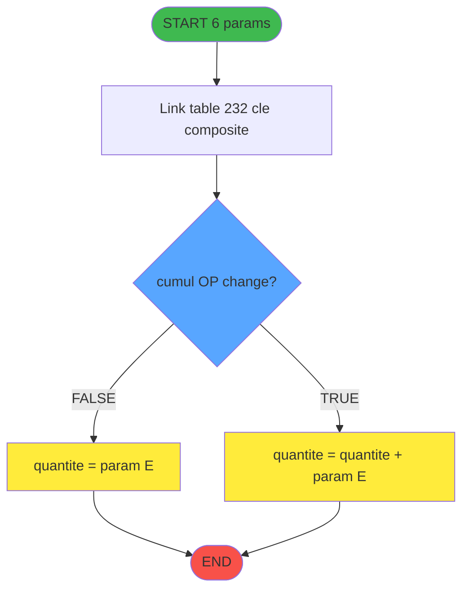
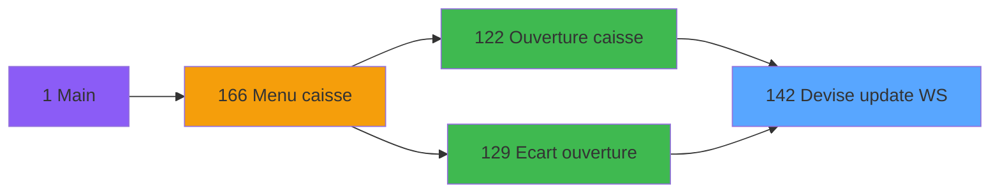
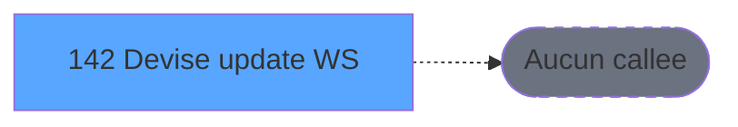

# ADH IDE 142 - Devise update session WS

> **Version spec**: 4.1
> **Analyse**: 2026-02-07 (enrichi)
> **Source**: `D:\Data\Migration\XPA\PMS\ADH\Source\Prg_142.xml`
> **Methode**: APEX + PDCA (Enrichi manuellement)

---

<!-- TAB:Fonctionnel -->

## SPECIFICATION FONCTIONNELLE

### 1.1 Objectif metier

**Devise update session WS** est le **gestionnaire de cumuls devises** qui **met a jour les totaux par devise et mode de paiement dans la session de caisse**.

**Objectif metier** : Maintenir les cumuls de mouvements de caisse par devise lors des operations d'ouverture, de fermeture et de comptage de caisse.

| Element | Description |
|---------|-------------|
| **Qui** | Systeme de caisse (appel automatique) |
| **Quoi** | Mise a jour des cumuls devises dans la session WS |
| **Pourquoi** | Suivre les montants par devise pour le bilan de caisse |
| **Declencheur** | Ouverture caisse, ecart ouverture, operations de change |
| **Resultat** | Enregistrement cumule ou remplace dans table gestion_devise_session |

### 1.2 Regles metier

| Code | Regle | Condition |
|------|-------|-----------|
| RM-001 | **Ecrasement par defaut** | Si `cumul_OP_change = FALSE` → remplace la quantite existante |
| RM-002 | **Cumul pour operations de change** | Si `cumul_OP_change = TRUE` → additionne a la quantite existante |
| RM-003 | **Cle composite d'acces** | Recherche par (code_devise, mode_paiement, quand, type) |
| RM-004 | **Type K pour cumul change** | Les operations de change cumulent dans le type K (initialise depuis type L) |

### 1.3 Flux utilisateur

1. Reception des 6 parametres: code devise, mode paiement, quand, type, quantite, flag cumul
2. Recherche de l'enregistrement existant dans table gestion_devise_session
3. Si `cumul_OP_change = FALSE`: ecrasement de la quantite
4. Si `cumul_OP_change = TRUE`: cumul (quantite existante + nouvelle quantite)
5. Mise a jour de l'enregistrement

### 1.4 Cas d'erreur

| Erreur | Comportement |
|--------|--------------|
| Enregistrement non trouve | Creation implicite (mode Write) |
| Cle invalide | Erreur de link Magic |

### 1.5 Contexte d'appel

| Appelant | Contexte |
|----------|----------|
| **IDE 122 - Ouverture caisse** | Initialisation des devises a l'ouverture |
| **IDE 129 - Ecart ouverture caisse** | Correction des ecarts de devises |
| Autres programmes de caisse | Operations de change, fermeture |

---

<!-- TAB:Technique -->

## SPECIFICATION TECHNIQUE

### 2.1 Identification

| Attribut | Valeur |
|----------|--------|
| **IDE Position** | 142 |
| **Fichier XML** | `Prg_142.xml` |
| **Description** | Devise update session WS |
| **Module** | ADH |
| **Public Name** | (aucun) |
| **Nombre taches** | 1 |
| **Lignes logique** | 22 |
| **Expressions** | 9 |

### 2.2 Tables

| # | Nom logique | Nom physique | Acces | Usage |
|---|-------------|--------------|-------|-------|
| 232 | gestion_devise_session | caisse_devise | WRITE | Cumul devises par session |

**Structure table gestion_devise_session (n232)**:

| Colonne | Type | Description |
|---------|------|-------------|
| utilisateur | U(8) | Identifiant utilisateur/session |
| code_devise | U(3) | Code ISO devise (EUR, USD, etc.) |
| mode_paiement | U(4) | Mode de paiement (ESPE, CART, etc.) |
| quand | U(1) | Moment: O=Ouverture, F=Fermeture |
| type | U(1) | Type cumul: L=Initial, K=Change |
| quantite | N(11) | Montant cumule en devise |

**Index**: caisse_devise_IDX_1 sur (utilisateur, code_devise, mode_paiement, quand, type)

### 2.3 Parametres d'entree (6 parametres)

| Var | Nom | Type | Picture | Description |
|-----|-----|------|---------|-------------|
| A | Param Code devise | Alpha | U3 | Code ISO de la devise |
| B | Param mode paiement | Alpha | U4 | Code mode de paiement |
| C | Param Quand | Alpha | U | O=Ouverture, F=Fermeture |
| D | Param Type | Alpha | U | Type de cumul (L, K) |
| E | Param Quantite | Numeric | N11 | Montant a enregistrer |
| F | Param cumul OP change | Boolean | - | TRUE=cumul, FALSE=ecrase |

### 2.4 Algorigramme



### 2.5 Expressions cles

| Expr | Syntaxe | Decodage | Usage |
|------|---------|----------|-------|
| 7 | `{0,12}+{0,5}` | Variable L + Variable E | Cumul: quantite existante + parametre |
| 8 | `NOT ({0,6})` | NOT Variable F | Condition ecrasement (pas de cumul) |
| 9 | `{0,6}` | Variable F | Condition cumul (operations de change) |

### 2.6 Variables importantes

| Var | Nom | Role |
|-----|-----|------|
| A-D | Params 1-4 | Cle de recherche dans table 232 |
| E | Param Quantite | Valeur a ecrire/cumuler |
| F | Param cumul OP change | Flag: FALSE=ecrase, TRUE=cumule |
| G-L | Colonnes table 232 | Champs lies de gestion_devise_session |

### 2.7 Statistiques

| Metrique | Valeur |
|----------|--------|
| **Taches** | 1 |
| **Lignes logique** | 22 |
| **Expressions** | 9 |
| **Parametres** | 6 |
| **Tables accedees** | 1 |
| **Tables en ecriture** | 1 |
| **Callees niveau 1** | 0 (programme terminal) |

---

<!-- TAB:Cartographie -->

## CARTOGRAPHIE APPLICATIVE

### 3.1 Chaine d'appels depuis Main



### 3.2 Callers directs

| IDE | Programme | Nb appels | Contexte |
|-----|-----------|-----------|----------|
| 122 | Ouverture caisse | 2 | Initialisation devises |
| 129 | Ecart ouverture caisse | 2 | Correction ecarts |

### 3.3 Callees (3 niveaux)



| Niv | IDE | Programme | Nb appels | Status |
|-----|-----|-----------|-----------|--------|
| - | - | TERMINAL | - | Programme feuille |

**Impact**: Programme terminal, aucun callee. Modification sans impact downstream.

### 3.4 Composants ECF utilises

| ECF | IDE | Public Name | Description |
|-----|-----|-------------|-------------|
| - | - | Aucun composant ECF | - |

### 3.5 Verification orphelin

| Critere | Resultat |
|---------|----------|
| Callers actifs | 2 programmes (IDE 122, IDE 129) |
| PublicName | Non defini |
| ECF partage | NON |
| **Conclusion** | **NON ORPHELIN** - Appele depuis ouverture/ecart caisse |

---

## 5. REGLES METIER DETAILLEES

### 5.1 Gestion des devises en session

| Regle | Description | Implementation |
|-------|-------------|----------------|
| **RG-DEV-001** | Chaque devise est identifiee par son code ISO 3 caracteres | Parametre A (code_devise) |
| **RG-DEV-002** | Une devise peut avoir plusieurs modes de paiement | Cle composite (devise + mode_paiement) |
| **RG-DEV-003** | Les cumuls sont segmentes par moment (O/F) | Parametre C (quand) |

### 5.2 Logique de mise a jour

| Scenario | Condition | Action | Expression |
|----------|-----------|--------|------------|
| **Ecrasement** | `cumul_OP_change = FALSE` | `quantite = parametre` | Expr 8: `NOT({0,6})` |
| **Cumul change** | `cumul_OP_change = TRUE` | `quantite += parametre` | Expr 9: `{0,6}` |

### 5.3 Types de cumul

| Type | Signification | Initialisation | Mise a jour |
|------|---------------|----------------|-------------|
| **L** | Initial/Legacy | A l'ouverture | Ecrasement |
| **K** | Change (Kchange) | Copie depuis L | Cumul |

**Regle metier**: Les operations de change cumulent dans le type K pour ne pas perturber le type L qui sert de reference.

### 5.4 Exemple de flux

```
1. Ouverture caisse (IDE 122):
   - Appel 142 avec cumul=FALSE, type=L, quantite=1000 EUR
   - Resultat: L = 1000 EUR (ecrasement)

2. Operation de change pendant session:
   - Appel 142 avec cumul=TRUE, type=K, quantite=50 EUR
   - Resultat: K = K + 50 EUR (cumul)

3. Fermeture caisse:
   - Comparaison L vs K pour detecter les ecarts de change
```

---

## NOTES MIGRATION

### Complexite

| Critere | Score | Detail |
|---------|-------|--------|
| Taches | 1 | Simple |
| Tables | 1 | Ecriture |
| Callees | 0 | Faible couplage |
| **Score global** | **FAIBLE** | - |

### Points d'attention migration

| Point | Solution moderne |
|-------|-----------------|
| Variables globales (VG*) | Service/Repository injection |
| Tables Magic | Entity Framework / Dapper |
| CallTask | Service method calls |
| Forms | React/Angular components |

---

## HISTORIQUE

| Date | Action | Auteur |
|------|--------|--------|
| 2026-01-27 23:06 | **V4.0 APEX/PDCA** - Generation automatique complete | Script |
| 2026-02-07 | **V4.1** - Enrichissement metier: parametres, expressions, regles devises | Claude |

---

*Specification V4.1 - Enrichie avec analyse metier detaillee*

