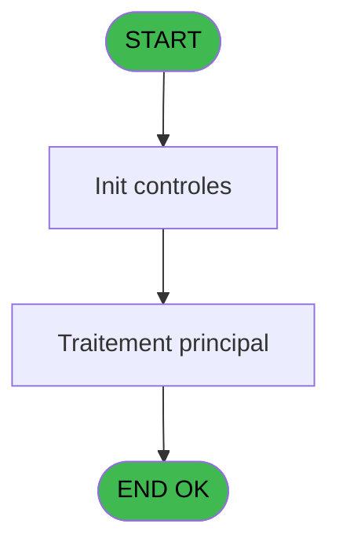
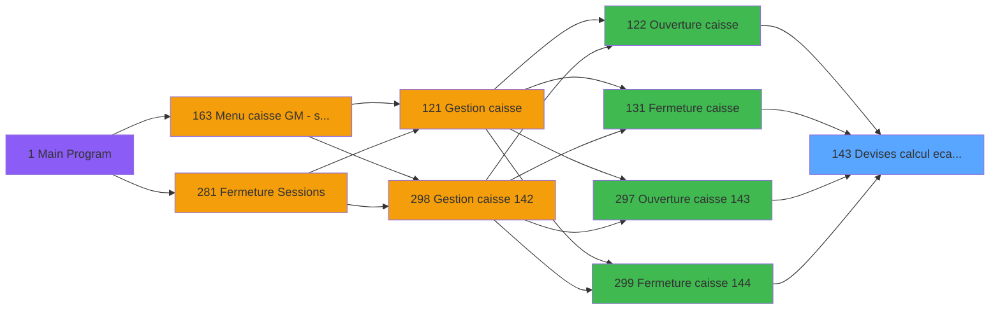

# ADH IDE 143 - Devises calcul ecart WS

> **Analyse**: Phases 1-4 2026-02-08 03:27 -> 03:27 (4s) | Assemblage 03:27
> **Pipeline**: V7.2 Enrichi
> **Structure**: 4 onglets (Resume | Ecrans | Donnees | Connexions)

<!-- TAB:Resume -->

## 1. FICHE D'IDENTITE

| Attribut | Valeur |
|----------|--------|
| Projet | ADH |
| IDE Position | 143 |
| Nom Programme | Devises calcul ecart WS |
| Fichier source | `Prg_143.xml` |
| Dossier IDE | Change |
| Taches | 3 (0 ecrans visibles) |
| Tables modifiees | 0 |
| Programmes appeles | 0 |
| Complexite | **BASSE** (score 0/100) |

## 2. DESCRIPTION FONCTIONNELLE

**ADH IDE 143 - Devises Calcul Écart WS**

Ce programme gère le calcul des écarts de devises lors des opérations de caisse. Il est appelé systématiquement lors de l'ouverture (IDE 122) et de la fermeture (IDE 131) des sessions pour comparer les montants théoriques et réels en devises étrangères. Le programme reçoit les paramètres de session (société, compte, date) et accède aux tables de devises (cafil023_dat) et de taux de change (cafil028_dat) pour effectuer les conversions et déterminer les écarts.

La logique opère sur deux phases: d'abord l'extraction des soldes par devise depuis les mouvements de caisse, puis le calcul comparatif entre les montants attendus (selon les taux de fermeture) et les montants déclarés par l'opérateur. Les écarts détectés sont stockés ou validés selon le contexte d'appel (ouverture vs fermeture), permettant un audit complet des manipulations de devises.

Ce programme s'inscrit dans le flux critique de fermeture de caisse, où il garantit que toutes les conversions de devises sont justifiées. Il interagit avec les programmes d'édition (IDE 73 et autres EXTRAIT_*) pour générer les rapprochements nécessaires et avec les programmes de déversement (IDE 243) pour finaliser les transactions.

## 3. BLOCS FONCTIONNELS

## 5. REGLES METIER

2 regles identifiees:

### Autres (2 regles)

#### [RM-001] Condition: Param UNI/BI [E] different de 'B'

| Element | Detail |
|---------|--------|
| **Condition** | `Param UNI/BI [E]<>'B'` |
| **Si vrai** | Action si vrai |
| **Variables** | ER (Param UNI/BI) |
| **Expression source** | Expression 1 : `Param UNI/BI [E]<>'B'` |
| **Exemple** | Si Param UNI/BI [E]<>'B' → Action si vrai |

#### [RM-002] Condition: Param UNI/BI [E] egale 'B'

| Element | Detail |
|---------|--------|
| **Condition** | `Param UNI/BI [E]='B'` |
| **Si vrai** | Action si vrai |
| **Variables** | ER (Param UNI/BI) |
| **Expression source** | Expression 2 : `Param UNI/BI [E]='B'` |
| **Exemple** | Si Param UNI/BI [E]='B' → Action si vrai |

## 6. CONTEXTE

- **Appele par**: [Ouverture caisse (IDE 122)](ADH-IDE-122.md), [Fermeture caisse (IDE 131)](ADH-IDE-131.md), [Ouverture caisse 143 (IDE 297)](ADH-IDE-297.md), [Fermeture caisse 144 (IDE 299)](ADH-IDE-299.md)
- **Appelle**: 0 programmes | **Tables**: 3 (W:0 R:2 L:1) | **Taches**: 3 | **Expressions**: 2

<!-- TAB:Ecrans -->

## 8. ECRANS

*(Programme sans ecran visible)*

## 9. NAVIGATION

### 9.3 Structure hierarchique (0 tache)

| Position | Tache | Type | Dimensions | Bloc |
|----------|-------|------|------------|------|

### 9.4 Algorigramme

> **Legende**: Vert = START/END OK | Rouge = END KO | Bleu = Decisions
> *Algorigramme auto-genere. Utiliser `/algorigramme` pour une synthese metier detaillee.*

<!-- TAB:Donnees -->

## 10. TABLES

### Tables utilisees (3)

| ID | Nom | Description | Type | R | W | L | Usages |
|----|-----|-------------|------|---|---|---|--------|
| 139 | moyens_reglement_mor | Reglements / paiements | DB | R |   |   | 1 |
| 50 | moyens_reglement_mor | Reglements / paiements | DB | R |   |   | 1 |
| 232 | gestion_devise_session | Sessions de caisse | DB |   |   | L | 2 |

### Colonnes par table (3 / 2 tables avec colonnes identifiees)

Table 139 - moyens_reglement_mor (R) - 1 usages

| Lettre | Variable | Acces | Type |
|--------|----------|-------|------|
| A | Param societe | R | Alpha |
| B | Param devise locale | R | Alpha |
| C | Param quand | R | Alpha |
| D | Param difference | R | Logical |
| E | RUPTURE_DEV_MOP | R | Alpha |

Table 50 - moyens_reglement_mor (R) - 1 usages

| Lettre | Variable | Acces | Type |
|--------|----------|-------|------|
| A | Param societe | R | Alpha |
| B | Param devise locale | R | Alpha |
| C | Param quand | R | Alpha |
| D | Param difference | R | Logical |

## 11. VARIABLES

### 11.1 Autres (5)

Variables diverses.

| Lettre | Nom | Type | Usage dans |
|--------|-----|------|-----------|
| EN | Param societe | Alpha | - |
| EO | Param devise locale | Alpha | - |
| EP | Param quand | Alpha | - |
| EQ | Param difference | Logical | - |
| ER | Param UNI/BI | Alpha | 2x refs |

## 12. EXPRESSIONS

**2 / 2 expressions decodees (100%)**

### 12.1 Repartition par type

| Type | Expressions | Regles |
|------|-------------|--------|
| CONDITION | 2 | 2 |

### 12.2 Expressions cles par type

#### CONDITION (2 expressions)

| Type | IDE | Expression | Regle |
|------|-----|------------|-------|
| CONDITION | 2 | `Param UNI/BI [E]='B'` | [RM-002](#rm-RM-002) |
| CONDITION | 1 | `Param UNI/BI [E]<>'B'` | [RM-001](#rm-RM-001) |

<!-- TAB:Connexions -->

## 13. GRAPHE D'APPELS

### 13.1 Chaine depuis Main (Callers)

Main -> ... -> [Ouverture caisse (IDE 122)](ADH-IDE-122.md) -> **Devises calcul ecart WS (IDE 143)**

Main -> ... -> [Fermeture caisse (IDE 131)](ADH-IDE-131.md) -> **Devises calcul ecart WS (IDE 143)**

Main -> ... -> [Ouverture caisse 143 (IDE 297)](ADH-IDE-297.md) -> **Devises calcul ecart WS (IDE 143)**

Main -> ... -> [Fermeture caisse 144 (IDE 299)](ADH-IDE-299.md) -> **Devises calcul ecart WS (IDE 143)**

### 13.2 Callers

| IDE | Nom Programme | Nb Appels |
|-----|---------------|-----------|
| [122](ADH-IDE-122.md) | Ouverture caisse | 1 |
| [131](ADH-IDE-131.md) | Fermeture caisse | 1 |
| [297](ADH-IDE-297.md) | Ouverture caisse 143 | 1 |
| [299](ADH-IDE-299.md) | Fermeture caisse 144 | 1 |

### 13.3 Callees (programmes appeles)

### 13.4 Detail Callees avec contexte

| IDE | Nom Programme | Appels | Contexte |
|-----|---------------|--------|----------|
| - | (aucun) | - | - |

## 14. RECOMMANDATIONS MIGRATION

### 14.1 Profil du programme

| Metrique | Valeur | Impact migration |
|----------|--------|-----------------|
| Lignes de logique | 82 | Programme compact |
| Expressions | 2 | Peu de logique |
| Tables WRITE | 0 | Impact faible |
| Sous-programmes | 0 | Peu de dependances |
| Ecrans visibles | 0 | Ecran unique ou traitement batch |
| Code desactive | 0% (0 / 82) | Code sain |
| Regles metier | 2 | Quelques regles a preserver |

### 14.2 Plan de migration par bloc

### 14.3 Dependances critiques

| Dependance | Type | Appels | Impact |
|------------|------|--------|--------|

---
*Spec DETAILED generee par Pipeline V7.2 - 2026-02-08 03:28*
