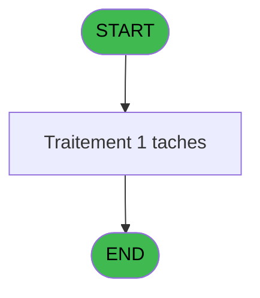

# ADH IDE 144 - Devise update session WS

> **Analyse**: Phases 1-4 2026-02-07 07:12 -> 07:12 (16s) | Assemblage 07:13
> **Pipeline**: V7.2 Enrichi
> **Structure**: 4 onglets (Resume | Ecrans | Donnees | Connexions)

<!-- TAB:Resume -->

## 1. FICHE D'IDENTITE

| Attribut | Valeur |
|----------|--------|
| Projet | ADH |
| IDE Position | 144 |
| Nom Programme | Devise update session WS |
| Fichier source | `Prg_144.xml` |
| Dossier IDE | Gestion |
| Taches | 1 (0 ecrans visibles) |
| Tables modifiees | 1 |
| Programmes appeles | 0 |
| :warning: Statut | **ORPHELIN_POTENTIEL** |

## 2. DESCRIPTION FONCTIONNELLE

**Devise update session WS** assure la gestion complete de ce processus.

**Donnees modifiees** : 1 tables en ecriture (gestion_devise_session).

## 3. BLOCS FONCTIONNELS

## 5. REGLES METIER

*(Aucune regle metier identifiee)*

## 6. CONTEXTE

- **Appele par**: (aucun)
- **Appelle**: 0 programmes | **Tables**: 1 (W:1 R:0 L:0) | **Taches**: 1 | **Expressions**: 9

<!-- TAB:Ecrans -->

## 8. ECRANS

*(Programme sans ecran visible)*

## 9. NAVIGATION

### 9.3 Structure hierarchique (0 tache)

| Position | Tache | Type | Dimensions | Bloc |
|----------|-------|------|------------|------|

### 9.4 Algorigramme

> *algo-data indisponible. Utiliser `/algorigramme` pour generer.*

<!-- TAB:Donnees -->

## 10. TABLES

### Tables utilisees (1)

| ID | Nom | Description | Type | R | W | L | Usages |
|----|-----|-------------|------|---|---|---|--------|
| 232 | gestion_devise_session | Sessions de caisse | DB |   | **W** |   | 1 |

### Colonnes par table (1 / 1 tables avec colonnes identifiees)

Table 232 - gestion_devise_session (**W**) - 1 usages

| Lettre | Variable | Acces | Type |
|--------|----------|-------|------|
| A | Param Code devise | W | Alpha |
| B | Param mode paiement | W | Alpha |
| C | Param Quand | W | Alpha |
| D | Param Type | W | Alpha |
| E | Param Quantite | W | Numeric |
| F | Param cumul OP change | W | Logical |

## 11. VARIABLES

### 11.1 Autres (6)

Variables diverses.

| Lettre | Nom | Type | Usage dans |
|--------|-----|------|-----------|
| A | Param Code devise | Alpha | 1x refs |
| B | Param mode paiement | Alpha | 1x refs |
| C | Param Quand | Alpha | 1x refs |
| D | Param Type | Alpha | 1x refs |
| E | Param Quantite | Numeric | 2x refs |
| F | Param cumul OP change | Logical | 2x refs |

## 12. EXPRESSIONS

**9 / 9 expressions decodees (100%)**

### 12.1 Repartition par type

| Type | Expressions | Regles |
|------|-------------|--------|
| CALCULATION | 1 | 0 |
| REFERENCE_VG | 1 | 0 |
| OTHER | 6 | 0 |
| NEGATION | 1 | 0 |

### 12.2 Expressions cles par type

#### CALCULATION (1 expressions)

| Type | IDE | Expression | Regle |
|------|-----|------------|-------|
| CALCULATION | 7 | `[L]+Param Quantite [E]` | - |

#### REFERENCE_VG (1 expressions)

| Type | IDE | Expression | Regle |
|------|-----|------------|-------|
| REFERENCE_VG | 1 | `VG1` | - |

#### OTHER (6 expressions)

| Type | IDE | Expression | Regle |
|------|-----|------------|-------|
| OTHER | 5 | `Param Type [D]` | - |
| OTHER | 6 | `Param Quantite [E]` | - |
| OTHER | 9 | `Param cumul OP change [F]` | - |
| OTHER | 2 | `Param Code devise [A]` | - |
| OTHER | 3 | `Param mode paiement [B]` | - |
| ... | | *+1 autres* | |

#### NEGATION (1 expressions)

| Type | IDE | Expression | Regle |
|------|-----|------------|-------|
| NEGATION | 8 | `NOT (Param cumul OP change [F])` | - |

<!-- TAB:Connexions -->

## 13. GRAPHE D'APPELS

### 13.1 Chaine depuis Main (Callers)

**Chemin**: (pas de callers directs)

### 13.2 Callers

| IDE | Nom Programme | Nb Appels |
|-----|---------------|-----------|
| - | (aucun) | - |

### 13.3 Callees (programmes appeles)

### 13.4 Detail Callees avec contexte

| IDE | Nom Programme | Appels | Contexte |
|-----|---------------|--------|----------|
| - | (aucun) | - | - |

## 14. RECOMMANDATIONS MIGRATION

### 14.1 Profil du programme

| Metrique | Valeur | Impact migration |
|----------|--------|-----------------|
| Lignes de logique | 22 | Programme compact |
| Expressions | 9 | Peu de logique |
| Tables WRITE | 1 | Impact faible |
| Sous-programmes | 0 | Peu de dependances |
| Ecrans visibles | 0 | Ecran unique ou traitement batch |
| Code desactive | 0% (0 / 22) | Code sain |
| Regles metier | 0 | Pas de regle identifiee |

### 14.2 Plan de migration par bloc

### 14.3 Dependances critiques

| Dependance | Type | Appels | Impact |
|------------|------|--------|--------|
| gestion_devise_session | Table WRITE (Database) | 1x | Schema + repository |

---
*Spec DETAILED generee par Pipeline V7.2 - 2026-02-07 07:13*
