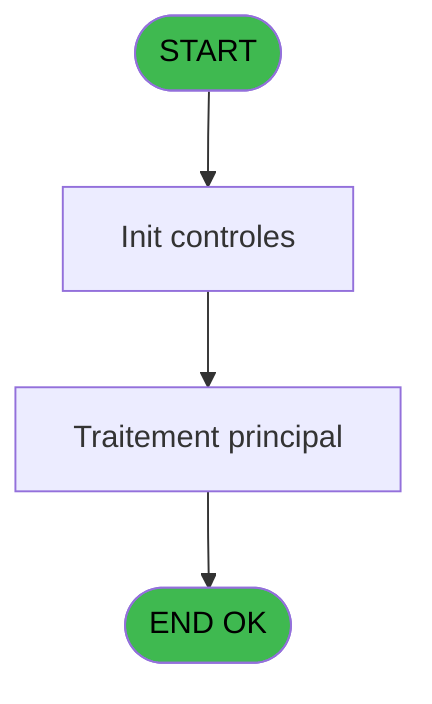
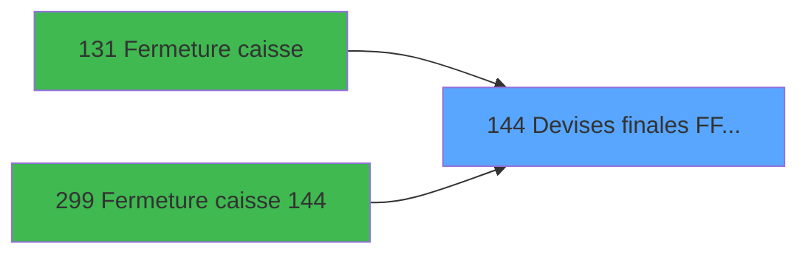

# ADH IDE 144 - Devises finales F/F Nbre WS

> **Analyse**: Phases 1-4 2026-02-08 03:28 -> 03:28 (4s) | Assemblage 03:28
> **Pipeline**: V7.2 Enrichi
> **Structure**: 4 onglets (Resume | Ecrans | Donnees | Connexions)

<!-- TAB:Resume -->

## 1. FICHE D'IDENTITE

| Attribut | Valeur |
|----------|--------|
| Projet | ADH |
| IDE Position | 144 |
| Nom Programme | Devises finales F/F Nbre WS |
| Fichier source | `Prg_144.xml` |
| Dossier IDE | Change |
| Taches | 3 (0 ecrans visibles) |
| Tables modifiees | 0 |
| Programmes appeles | 0 |
| Complexite | **BASSE** (score 0/100) |

## 2. DESCRIPTION FONCTIONNELLE

ADH IDE 144 convertit les devises finales en francs français (F/F) et calcule le nombre de chèques (WS). Ce programme traite les transactions de vente en normalisant les montants dans une devise de référence et en comptabilisant les moyens de paiement par type. Il intervient dans les flux critiques d'impression et de clôture de caisse où la consolidation des devises est essentielle.

Le programme s'intègre fortement dans le circuit de fermeture caisse (appelé depuis IDE 131 et 299), ce qui indique qu'il effectue des calculs de synthèse sur l'ensemble des transactions d'une session. Son utilisation répétée lors de l'impression de tickets (IDE 0) suggère qu'il applique les taux de change en temps réel et met à jour les compteurs de paiements (notamment les chèques) au fur et à mesure des transactions.

Les appels depuis multiple contextes d'IDE 0 (différentes versions de transactions de vente) montrent qu'ADH IDE 144 est une fonction de normalisation réutilisable, probablement appelée systématiquement avant enregistrement ou impression de tout mouvement financier impliquant des devises non-franches.

## 3. BLOCS FONCTIONNELS

## 5. REGLES METIER

2 regles identifiees:

### Autres (2 regles)

#### [RM-001] Condition: Param UNI/BI [D] different de 'B'

| Element | Detail |
|---------|--------|
| **Condition** | `Param UNI/BI [D]<>'B'` |
| **Si vrai** | Action si vrai |
| **Variables** | EQ (Param UNI/BI) |
| **Expression source** | Expression 1 : `Param UNI/BI [D]<>'B'` |
| **Exemple** | Si Param UNI/BI [D]<>'B' → Action si vrai |

#### [RM-002] Condition: Param UNI/BI [D] egale 'B'

| Element | Detail |
|---------|--------|
| **Condition** | `Param UNI/BI [D]='B'` |
| **Si vrai** | Action si vrai |
| **Variables** | EQ (Param UNI/BI) |
| **Expression source** | Expression 2 : `Param UNI/BI [D]='B'` |
| **Exemple** | Si Param UNI/BI [D]='B' → Action si vrai |

## 6. CONTEXTE

- **Appele par**: [ Print ticket vente LEX (IDE 0)](ADH-IDE-0.md), [ Print ticket vente PMS-584 (IDE 0)](ADH-IDE-0.md), [Transaction Nouv vente PMS-584 (IDE 0)](ADH-IDE-0.md), [Transaction Nouv vente PMS-710 (IDE 0)](ADH-IDE-0.md), [Transaction Nouv vente PMS-721 (IDE 0)](ADH-IDE-0.md), [Fermeture caisse (IDE 131)](ADH-IDE-131.md), [Fermeture caisse 144 (IDE 299)](ADH-IDE-299.md)
- **Appelle**: 0 programmes | **Tables**: 4 (W:0 R:2 L:2) | **Taches**: 3 | **Expressions**: 3

<!-- TAB:Ecrans -->

## 8. ECRANS

*(Programme sans ecran visible)*

## 9. NAVIGATION

### 9.3 Structure hierarchique (0 tache)

| Position | Tache | Type | Dimensions | Bloc |
|----------|-------|------|------------|------|

### 9.4 Algorigramme

> **Legende**: Vert = START/END OK | Rouge = END KO | Bleu = Decisions
> *Algorigramme auto-genere. Utiliser `/algorigramme` pour une synthese metier detaillee.*

<!-- TAB:Donnees -->

## 10. TABLES

### Tables utilisees (4)

| ID | Nom | Description | Type | R | W | L | Usages |
|----|-----|-------------|------|---|---|---|--------|
| 67 | tables___________tab |  | DB | R |   |   | 1 |
| 50 | moyens_reglement_mor | Reglements / paiements | DB | R |   |   | 1 |
| 232 | gestion_devise_session | Sessions de caisse | DB |   |   | L | 2 |
| 139 | moyens_reglement_mor | Reglements / paiements | DB |   |   | L | 1 |

### Colonnes par table (3 / 2 tables avec colonnes identifiees)

Table 67 - tables___________tab (R) - 1 usages

| Lettre | Variable | Acces | Type |
|--------|----------|-------|------|
| A | RUPTURE DEV MOP | R | Alpha |
| B | CUM Qte Dev initial | R | Numeric |
| C | CUM Qte Dev final | R | Numeric |

Table 50 - moyens_reglement_mor (R) - 1 usages

| Lettre | Variable | Acces | Type |
|--------|----------|-------|------|
| A | Param societe | R | Alpha |
| B | Param devise locale | R | Alpha |
| C | Param nbre devise finale | R | Numeric |

## 11. VARIABLES

### 11.1 Variables de session (2)

Variables persistantes pendant toute la session.

| Lettre | Nom | Type | Usage dans |
|--------|-----|------|-----------|
| ES | V nbre devise ouverture | Numeric | - |
| ET | V nbre devise fermeture | Numeric | 1x session |

### 11.2 Autres (5)

Variables diverses.

| Lettre | Nom | Type | Usage dans |
|--------|-----|------|-----------|
| EN | Param societe | Alpha | - |
| EO | Param devise locale | Alpha | - |
| EP | Param Nbre devise finale | Numeric | - |
| EQ | Param UNI/BI | Alpha | 2x refs |
| ER | Param Faire Update F/F | Logical | - |

## 12. EXPRESSIONS

**3 / 3 expressions decodees (100%)**

### 12.1 Repartition par type

| Type | Expressions | Regles |
|------|-------------|--------|
| CONDITION | 2 | 2 |
| OTHER | 1 | 0 |

### 12.2 Expressions cles par type

#### CONDITION (2 expressions)

| Type | IDE | Expression | Regle |
|------|-----|------------|-------|
| CONDITION | 2 | `Param UNI/BI [D]='B'` | [RM-002](#rm-RM-002) |
| CONDITION | 1 | `Param UNI/BI [D]<>'B'` | [RM-001](#rm-RM-001) |

#### OTHER (1 expressions)

| Type | IDE | Expression | Regle |
|------|-----|------------|-------|
| OTHER | 3 | `V nbre devise fermeture [G]` | - |

<!-- TAB:Connexions -->

## 13. GRAPHE D'APPELS

### 13.1 Chaine depuis Main (Callers)

Main -> ... -> [ Print ticket vente LEX (IDE 0)](ADH-IDE-0.md) -> **Devises finales F/F Nbre WS (IDE 144)**

Main -> ... -> [ Print ticket vente PMS-584 (IDE 0)](ADH-IDE-0.md) -> **Devises finales F/F Nbre WS (IDE 144)**

Main -> ... -> [Transaction Nouv vente PMS-584 (IDE 0)](ADH-IDE-0.md) -> **Devises finales F/F Nbre WS (IDE 144)**

Main -> ... -> [Transaction Nouv vente PMS-710 (IDE 0)](ADH-IDE-0.md) -> **Devises finales F/F Nbre WS (IDE 144)**

Main -> ... -> [Transaction Nouv vente PMS-721 (IDE 0)](ADH-IDE-0.md) -> **Devises finales F/F Nbre WS (IDE 144)**

Main -> ... -> [Fermeture caisse (IDE 131)](ADH-IDE-131.md) -> **Devises finales F/F Nbre WS (IDE 144)**

Main -> ... -> [Fermeture caisse 144 (IDE 299)](ADH-IDE-299.md) -> **Devises finales F/F Nbre WS (IDE 144)**

### 13.2 Callers

| IDE | Nom Programme | Nb Appels |
|-----|---------------|-----------|
| [0](ADH-IDE-0.md) |  Print ticket vente LEX | 5 |
| [0](ADH-IDE-0.md) |  Print ticket vente PMS-584 | 5 |
| [0](ADH-IDE-0.md) | Transaction Nouv vente PMS-584 | 4 |
| [0](ADH-IDE-0.md) | Transaction Nouv vente PMS-710 | 4 |
| [0](ADH-IDE-0.md) | Transaction Nouv vente PMS-721 | 4 |
| [131](ADH-IDE-131.md) | Fermeture caisse | 4 |
| [299](ADH-IDE-299.md) | Fermeture caisse 144 | 3 |

### 13.3 Callees (programmes appeles)

### 13.4 Detail Callees avec contexte

| IDE | Nom Programme | Appels | Contexte |
|-----|---------------|--------|----------|
| - | (aucun) | - | - |

## 14. RECOMMANDATIONS MIGRATION

### 14.1 Profil du programme

| Metrique | Valeur | Impact migration |
|----------|--------|-----------------|
| Lignes de logique | 131 | Programme compact |
| Expressions | 3 | Peu de logique |
| Tables WRITE | 0 | Impact faible |
| Sous-programmes | 0 | Peu de dependances |
| Ecrans visibles | 0 | Ecran unique ou traitement batch |
| Code desactive | 0% (0 / 131) | Code sain |
| Regles metier | 2 | Quelques regles a preserver |

### 14.2 Plan de migration par bloc

### 14.3 Dependances critiques

| Dependance | Type | Appels | Impact |
|------------|------|--------|--------|

---
*Spec DETAILED generee par Pipeline V7.2 - 2026-02-08 03:28*
