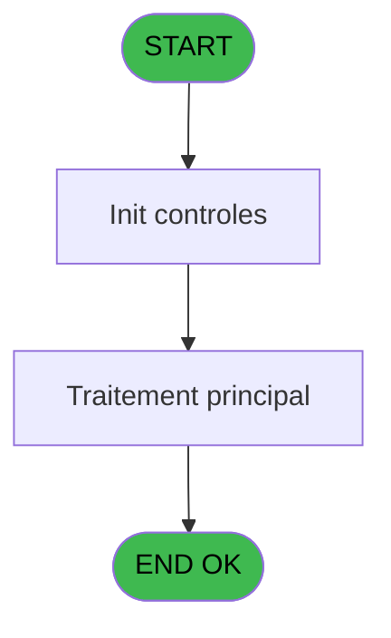
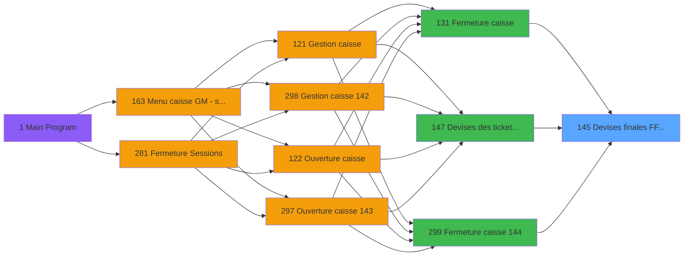

# ADH IDE 145 - Devises finales F/F Qte WS

> **Analyse**: Phases 1-4 2026-02-08 03:28 -> 03:29 (4s) | Assemblage 03:29
> **Pipeline**: V7.2 Enrichi
> **Structure**: 4 onglets (Resume | Ecrans | Donnees | Connexions)

<!-- TAB:Resume -->

## 1. FICHE D'IDENTITE

| Attribut | Valeur |
|----------|--------|
| Projet | ADH |
| IDE Position | 145 |
| Nom Programme | Devises finales F/F Qte WS |
| Fichier source | `Prg_145.xml` |
| Dossier IDE | Change |
| Taches | 1 (0 ecrans visibles) |
| Tables modifiees | 0 |
| Programmes appeles | 0 |
| Complexite | **BASSE** (score 0/100) |

## 2. DESCRIPTION FONCTIONNELLE

ADH IDE 145 réconcilie les devises physiques avec les quantités déclarées lors de la fermeture de caisse. Le programme reçoit en paramètres la liste des devises présentes dans le coffre (montant en euros, quantités pour chaque dénomination) et les compare avec les données de ticket (mouvements WS). Son rôle principal est de calculer les écarts devise par devise pour alimenter le rapport de fermeture.

Le flux fonctionne en trois étapes : d'abord récupération des devises WS depuis la tâche appelante (IDE 147 ou paramètres directs), puis calcul des totaux par dénomination (billets et pièces séparés), enfin génération des écarts (physique - attendu). Ces écarts servent soit à alerter l'opérateur en cas de divergence significative, soit à valider l'équilibre du coffre avant clôture.

Ce programme est appelé contextuellement : depuis IDE 131 (fermeture standard), IDE 147 (consultation historique devises), ou IDE 299 (fermeture variante). Il constitue une pièce clé de l'audit de caisse car il trace l'intégrité monétaire en fin de session et génère les justificatifs pour les écarts.

## 3. BLOCS FONCTIONNELS

## 5. REGLES METIER

*(Aucune regle metier identifiee dans les expressions)*

## 6. CONTEXTE

- **Appele par**: [Fermeture caisse (IDE 131)](ADH-IDE-131.md), [Devises des tickets WS (IDE 147)](ADH-IDE-147.md), [Fermeture caisse 144 (IDE 299)](ADH-IDE-299.md)
- **Appelle**: 0 programmes | **Tables**: 1 (W:0 R:1 L:0) | **Taches**: 1 | **Expressions**: 8

<!-- TAB:Ecrans -->

## 8. ECRANS

*(Programme sans ecran visible)*

## 9. NAVIGATION

### 9.3 Structure hierarchique (0 tache)

| Position | Tache | Type | Dimensions | Bloc |
|----------|-------|------|------------|------|

### 9.4 Algorigramme

> **Legende**: Vert = START/END OK | Rouge = END KO | Bleu = Decisions
> *Algorigramme auto-genere. Utiliser `/algorigramme` pour une synthese metier detaillee.*

<!-- TAB:Donnees -->

## 10. TABLES

### Tables utilisees (1)

| ID | Nom | Description | Type | R | W | L | Usages |
|----|-----|-------------|------|---|---|---|--------|
| 232 | gestion_devise_session | Sessions de caisse | DB | R |   |   | 1 |

### Colonnes par table (1 / 1 tables avec colonnes identifiees)

Table 232 - gestion_devise_session (R) - 1 usages

| Lettre | Variable | Acces | Type |
|--------|----------|-------|------|
| A | Param code devise | R | Alpha |
| B | Param mode paiement | R | Alpha |
| C | Param quantite finale | R | Numeric |

## 11. VARIABLES

### 11.1 Autres (3)

Variables diverses.

| Lettre | Nom | Type | Usage dans |
|--------|-----|------|-----------|
| EN | Param code devise | Alpha | 1x refs |
| EO | Param mode paiement | Alpha | 1x refs |
| EP | Param quantite finale | Numeric | - |

## 12. EXPRESSIONS

**8 / 8 expressions decodees (100%)**

### 12.1 Repartition par type

| Type | Expressions | Regles |
|------|-------------|--------|
| CALCULATION | 1 | 0 |
| CONSTANTE | 4 | 0 |
| REFERENCE_VG | 1 | 0 |
| OTHER | 2 | 0 |

### 12.2 Expressions cles par type

#### CALCULATION (1 expressions)

| Type | IDE | Expression | Regle |
|------|-----|------------|-------|
| CALCULATION | 8 | `[I]-[O]+[U]` | - |

#### CONSTANTE (4 expressions)

| Type | IDE | Expression | Regle |
|------|-----|------------|-------|
| CONSTANTE | 6 | `'V'` | - |
| CONSTANTE | 7 | `'A'` | - |
| CONSTANTE | 4 | `'F'` | - |
| CONSTANTE | 5 | `'C'` | - |

#### REFERENCE_VG (1 expressions)

| Type | IDE | Expression | Regle |
|------|-----|------------|-------|
| REFERENCE_VG | 1 | `VG1` | - |

#### OTHER (2 expressions)

| Type | IDE | Expression | Regle |
|------|-----|------------|-------|
| OTHER | 3 | `Param mode paiement [B]` | - |
| OTHER | 2 | `Param code devise [A]` | - |

<!-- TAB:Connexions -->

## 13. GRAPHE D'APPELS

### 13.1 Chaine depuis Main (Callers)

Main -> ... -> [Fermeture caisse (IDE 131)](ADH-IDE-131.md) -> **Devises finales F/F Qte WS (IDE 145)**

Main -> ... -> [Devises des tickets WS (IDE 147)](ADH-IDE-147.md) -> **Devises finales F/F Qte WS (IDE 145)**

Main -> ... -> [Fermeture caisse 144 (IDE 299)](ADH-IDE-299.md) -> **Devises finales F/F Qte WS (IDE 145)**

### 13.2 Callers

| IDE | Nom Programme | Nb Appels |
|-----|---------------|-----------|
| [131](ADH-IDE-131.md) | Fermeture caisse | 4 |
| [147](ADH-IDE-147.md) | Devises des tickets WS | 2 |
| [299](ADH-IDE-299.md) | Fermeture caisse 144 | 2 |

### 13.3 Callees (programmes appeles)

### 13.4 Detail Callees avec contexte

| IDE | Nom Programme | Appels | Contexte |
|-----|---------------|--------|----------|
| - | (aucun) | - | - |

## 14. RECOMMANDATIONS MIGRATION

### 14.1 Profil du programme

| Metrique | Valeur | Impact migration |
|----------|--------|-----------------|
| Lignes de logique | 35 | Programme compact |
| Expressions | 8 | Peu de logique |
| Tables WRITE | 0 | Impact faible |
| Sous-programmes | 0 | Peu de dependances |
| Ecrans visibles | 0 | Ecran unique ou traitement batch |
| Code desactive | 0% (0 / 35) | Code sain |
| Regles metier | 0 | Pas de regle identifiee |

### 14.2 Plan de migration par bloc

### 14.3 Dependances critiques

| Dependance | Type | Appels | Impact |
|------------|------|--------|--------|

---
*Spec DETAILED generee par Pipeline V7.2 - 2026-02-08 03:29*
