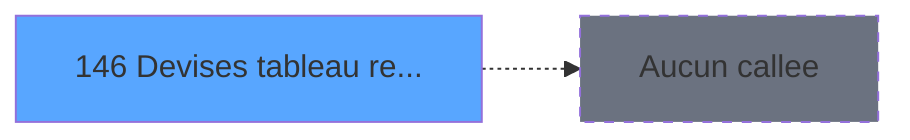

# ADH IDE 146 - Devises tableau recap WS

> **Analyse**: Phases 1-4 2026-02-08 03:29 -> 03:29 (4s) | Assemblage 03:29
> **Pipeline**: V7.2 Enrichi
> **Structure**: 4 onglets (Resume | Ecrans | Donnees | Connexions)

<!-- TAB:Resume -->

## 1. FICHE D'IDENTITE

| Attribut | Valeur |
|----------|--------|
| Projet | ADH |
| IDE Position | 146 |
| Nom Programme | Devises tableau recap WS |
| Fichier source | `Prg_146.xml` |
| Dossier IDE | Change |
| Taches | 5 (0 ecrans visibles) |
| Tables modifiees | 1 |
| Programmes appeles | 0 |
| Complexite | **BASSE** (score 7/100) |

## 2. DESCRIPTION FONCTIONNELLE

ADH IDE 146 - Devises tableau recap WS est un programme utilitaire appelé lors de la fermeture de caisse (ADH IDE 131 et ADH IDE 299). Son rôle principal est de générer un tableau récapitulatif des devises avant la finalisation de la session de caisse.

Le programme modifie la table `pv_invoiceprintfiliationtmp`, utilisée comme espace de travail temporaire pour stocker les données de synthèse des devises. Il consolide les informations de change et les montants par devise pour présentation à l'opérateur avant la clôture définitive.

C'est un programme de support métier qui prépare les données de reporting devises, facilitant la vérification et la validation des écarts de trésorerie avant fermeture de caisse.

## 3. BLOCS FONCTIONNELS

## 5. REGLES METIER

*(Aucune regle metier identifiee dans les expressions)*

## 6. CONTEXTE

- **Appele par**: [Fermeture caisse (IDE 131)](ADH-IDE-131.md), [Fermeture caisse 144 (IDE 299)](ADH-IDE-299.md)
- **Appelle**: 0 programmes | **Tables**: 3 (W:1 R:2 L:0) | **Taches**: 5 | **Expressions**: 1

<!-- TAB:Ecrans -->

## 8. ECRANS

*(Programme sans ecran visible)*

## 9. NAVIGATION

### 9.3 Structure hierarchique (0 tache)

| Position | Tache | Type | Dimensions | Bloc |
|----------|-------|------|------------|------|

### 9.4 Algorigramme

> **Legende**: Vert = START/END OK | Rouge = END KO | Bleu = Decisions
> *Algorigramme auto-genere. Utiliser `/algorigramme` pour une synthese metier detaillee.*

<!-- TAB:Donnees -->

## 10. TABLES

### Tables utilisees (3)

| ID | Nom | Description | Type | R | W | L | Usages |
|----|-----|-------------|------|---|---|---|--------|
| 513 | pv_invoiceprintfiliationtmp | Services / filieres | TMP |   | **W** |   | 2 |
| 232 | gestion_devise_session | Sessions de caisse | DB | R |   |   | 1 |
| 250 | histo_sessions_caisse_devise | Sessions de caisse | DB | R |   |   | 1 |

### Colonnes par table (1 / 3 tables avec colonnes identifiees)

Table 513 - pv_invoiceprintfiliationtmp (**W**) - 2 usages

*Table utilisee uniquement en Link ou aucune colonne Real identifiee dans le DataView.*

Table 232 - gestion_devise_session (R) - 1 usages

| Lettre | Variable | Acces | Type |
|--------|----------|-------|------|
| EN | Param N° session | R | Numeric |

Table 250 - histo_sessions_caisse_devise (R) - 1 usages

*Table utilisee uniquement en Link ou aucune colonne Real identifiee dans le DataView.*

## 11. VARIABLES

*(Programme sans variables locales mappees)*

## 12. EXPRESSIONS

**1 / 1 expressions decodees (100%)**

### 12.1 Repartition par type

| Type | Expressions | Regles |
|------|-------------|--------|
| OTHER | 1 | 0 |

### 12.2 Expressions cles par type

#### OTHER (1 expressions)

| Type | IDE | Expression | Regle |
|------|-----|------------|-------|
| OTHER | 1 | `DbDel ('{513,4}'DSOURCE,'')` | - |

<!-- TAB:Connexions -->

## 13. GRAPHE D'APPELS

### 13.1 Chaine depuis Main (Callers)

Main -> ... -> [Fermeture caisse (IDE 131)](ADH-IDE-131.md) -> **Devises tableau recap WS (IDE 146)**

Main -> ... -> [Fermeture caisse 144 (IDE 299)](ADH-IDE-299.md) -> **Devises tableau recap WS (IDE 146)**

### 13.2 Callers

| IDE | Nom Programme | Nb Appels |
|-----|---------------|-----------|
| [131](ADH-IDE-131.md) | Fermeture caisse | 2 |
| [299](ADH-IDE-299.md) | Fermeture caisse 144 | 2 |

### 13.3 Callees (programmes appeles)

### 13.4 Detail Callees avec contexte

| IDE | Nom Programme | Appels | Contexte |
|-----|---------------|--------|----------|
| - | (aucun) | - | - |

## 14. RECOMMANDATIONS MIGRATION

### 14.1 Profil du programme

| Metrique | Valeur | Impact migration |
|----------|--------|-----------------|
| Lignes de logique | 53 | Programme compact |
| Expressions | 1 | Peu de logique |
| Tables WRITE | 1 | Impact faible |
| Sous-programmes | 0 | Peu de dependances |
| Ecrans visibles | 0 | Ecran unique ou traitement batch |
| Code desactive | 0% (0 / 53) | Code sain |
| Regles metier | 0 | Pas de regle identifiee |

### 14.2 Plan de migration par bloc

### 14.3 Dependances critiques

| Dependance | Type | Appels | Impact |
|------------|------|--------|--------|
| pv_invoiceprintfiliationtmp | Table WRITE (Temp) | 2x | Schema + repository |

---
*Spec DETAILED generee par Pipeline V7.2 - 2026-02-08 03:30*
