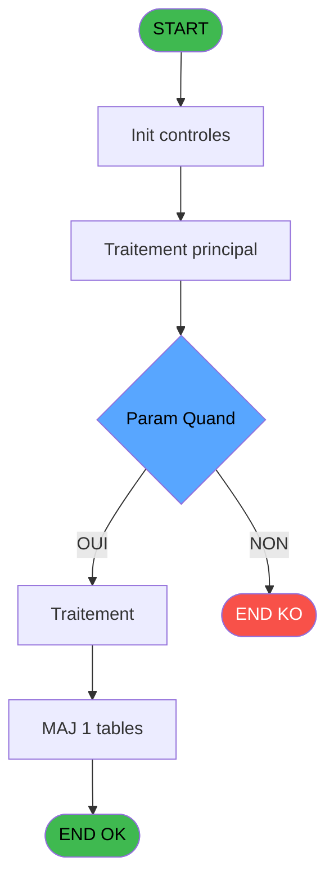
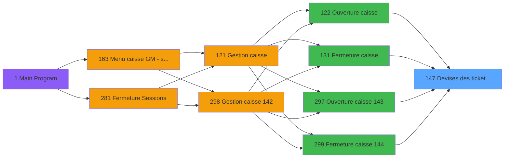
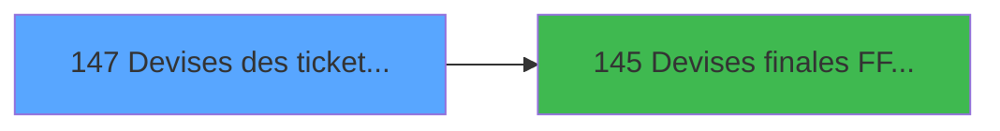

# ADH IDE 147 - Devises des tickets WS

> **Analyse**: Phases 1-4 2026-02-07 03:50 -> 03:30 (23h39min) | Assemblage 03:30
> **Pipeline**: V7.2 Enrichi
> **Structure**: 4 onglets (Resume | Ecrans | Donnees | Connexions)

<!-- TAB:Resume -->

## 1. FICHE D'IDENTITE

| Attribut | Valeur |
|----------|--------|
| Projet | ADH |
| IDE Position | 147 |
| Nom Programme | Devises des tickets WS |
| Fichier source | `Prg_147.xml` |
| Dossier IDE | Change |
| Taches | 14 (0 ecrans visibles) |
| Tables modifiees | 1 |
| Programmes appeles | 1 |
| Complexite | **BASSE** (score 19/100) |

## 2. DESCRIPTION FONCTIONNELLE

## ADH IDE 147 - Devises des tickets WS

Programme d'agrégation des devises utilisées lors des transactions sur terminaux de paiement (WebService). Il consolide les mouvements de change effectués pendant une session de caisse, en distinguant les tickets d'ouverture et de fermeture. Chaque ticket enregistre la devise de session utilisée et génère un enregistrement dans la table temporaire `pv_invoiceprintfiliationtmp` pour traçabilité.

Le flux traite deux scénarios : d'abord les devises collectées lors de l'ouverture de session (tâche "Ticket ouverture"), puis celles de la fermeture (tâche "Ticket fermeture"). Pour chaque ticket, le programme applique la devise de session en cours et appelle ADH IDE 145 pour calculer les équivalents finaux. Cette structure permet de rapprocher précisément les mouvements de change avec les tickets de paiement correspondants.

Ce programme est appelé massivement par les trois points d'entrée de gestion de caisse (ouverture IDE 122/297, fermeture IDE 131/299), garantissant que chaque opération de caisse dispose d'un audit complet des devises. Le rôle critique dans la fermeture de caisse en fait un élément clé pour la réconciliation des écarts de change.

## 3. BLOCS FONCTIONNELS

### 3.1 Impression (3 taches)

Generation des documents et tickets.

---

#### 147 - Devises des tickets WS

**Role** : Generation du document : Devises des tickets WS.
**Delegue a** : [Devises finales F/F Qte WS (IDE 145)](ADH-IDE-145.md)

---

#### 147.1 - Ticket ouverture

**Role** : Generation du document : Ticket ouverture.

---

#### 147.2 - Ticket fermeture

**Role** : Generation du document : Ticket fermeture.

### 3.2 Traitement (8 taches)

Traitements internes.

---

#### 147.1.1 - Avec devise session

**Role** : Traitement : Avec devise session.
**Variables liees** : EO (Param devise locale), EP (Param N° session), ES (Quantite devise)
**Delegue a** : [Devises finales F/F Qte WS (IDE 145)](ADH-IDE-145.md)

---

#### 147.2.1 - Avec devise session

**Role** : Traitement : Avec devise session.
**Variables liees** : EO (Param devise locale), EP (Param N° session), ES (Quantite devise)
**Delegue a** : [Devises finales F/F Qte WS (IDE 145)](ADH-IDE-145.md)

---

#### 147.2.2 - Avec histo devise

**Role** : Traitement : Avec histo devise.
**Variables liees** : EO (Param devise locale), ES (Quantite devise)
**Delegue a** : [Devises finales F/F Qte WS (IDE 145)](ADH-IDE-145.md)

---

#### 147.2.3 - Solde fermeture

**Role** : Consultation/chargement : Solde fermeture.
**Delegue a** : [Devises finales F/F Qte WS (IDE 145)](ADH-IDE-145.md)

---

#### 147.2.3.1 - Solde fermeture

**Role** : Consultation/chargement : Solde fermeture.
**Delegue a** : [Devises finales F/F Qte WS (IDE 145)](ADH-IDE-145.md)

---

#### 147.2.3.1.1 - Total solde final

**Role** : Consultation/chargement : Total solde final.
**Delegue a** : [Devises finales F/F Qte WS (IDE 145)](ADH-IDE-145.md)

---

#### 147.2.3.2 - Solde fermeture

**Role** : Consultation/chargement : Solde fermeture.
**Delegue a** : [Devises finales F/F Qte WS (IDE 145)](ADH-IDE-145.md)

---

#### 147.2.3.2.1 - Total solde final

**Role** : Consultation/chargement : Total solde final.
**Delegue a** : [Devises finales F/F Qte WS (IDE 145)](ADH-IDE-145.md)

### 3.3 Creation (3 taches)

Insertion de nouveaux enregistrements en base.

---

#### 147.1.1.1 - Creation

**Role** : Creation d'enregistrement : Creation.

---

#### 147.2.1.1 - Creation

**Role** : Creation d'enregistrement : Creation.

---

#### 147.2.2.1 - creation

**Role** : Creation d'enregistrement : creation.

## 5. REGLES METIER

2 regles identifiees:

### Autres (2 regles)

#### [RM-001] Condition: Param Quand [D] egale 'O'

| Element | Detail |
|---------|--------|
| **Condition** | `Param Quand [D]='O'` |
| **Si vrai** | Action si vrai |
| **Variables** | EQ (Param Quand) |
| **Expression source** | Expression 1 : `Param Quand [D]='O'` |
| **Exemple** | Si Param Quand [D]='O' → Action si vrai |

#### [RM-002] Condition: Param Quand [D] egale 'F'

| Element | Detail |
|---------|--------|
| **Condition** | `Param Quand [D]='F'` |
| **Si vrai** | Action si vrai |
| **Variables** | EQ (Param Quand) |
| **Expression source** | Expression 2 : `Param Quand [D]='F'` |
| **Exemple** | Si Param Quand [D]='F' → Action si vrai |

## 6. CONTEXTE

- **Appele par**: [Fermeture caisse (IDE 131)](ADH-IDE-131.md), [Fermeture caisse 144 (IDE 299)](ADH-IDE-299.md), [Ouverture caisse (IDE 122)](ADH-IDE-122.md), [Ouverture caisse 143 (IDE 297)](ADH-IDE-297.md)
- **Appelle**: 1 programmes | **Tables**: 5 (W:1 R:4 L:4) | **Taches**: 14 | **Expressions**: 3

<!-- TAB:Ecrans -->

## 8. ECRANS

*(Programme sans ecran visible)*

## 9. NAVIGATION

### 9.3 Structure hierarchique (14 taches)

| Position | Tache | Type | Dimensions | Bloc |
|----------|-------|------|------------|------|
| **147.1** | [**Devises des tickets WS** (147)](#t1) | MDI | - | Impression |
| 147.1.1 | [Ticket ouverture (147.1)](#t2) | MDI | - | |
| 147.1.2 | [Ticket fermeture (147.2)](#t5) | MDI | - | |
| **147.2** | [**Avec devise session** (147.1.1)](#t3) | MDI | - | Traitement |
| 147.2.1 | [Avec devise session (147.2.1)](#t6) | MDI | - | |
| 147.2.2 | [Avec histo devise (147.2.2)](#t8) | MDI | - | |
| 147.2.3 | [Solde fermeture (147.2.3)](#t10) | MDI | - | |
| 147.2.4 | [Solde fermeture (147.2.3.1)](#t11) | MDI | - | |
| 147.2.5 | [Total solde final (147.2.3.1.1)](#t12) | MDI | - | |
| 147.2.6 | [Solde fermeture (147.2.3.2)](#t13) | MDI | - | |
| 147.2.7 | [Total solde final (147.2.3.2.1)](#t14) | MDI | - | |
| **147.3** | [**Creation** (147.1.1.1)](#t4) | MDI | - | Creation |
| 147.3.1 | [Creation (147.2.1.1)](#t7) | MDI | - | |
| 147.3.2 | [creation (147.2.2.1)](#t9) | MDI | - | |

### 9.4 Algorigramme

> **Legende**: Vert = START/END OK | Rouge = END KO | Bleu = Decisions
> *Algorigramme auto-genere. Utiliser `/algorigramme` pour une synthese metier detaillee.*

<!-- TAB:Donnees -->

## 10. TABLES

### Tables utilisees (5)

| ID | Nom | Description | Type | R | W | L | Usages |
|----|-----|-------------|------|---|---|---|--------|
| 513 | pv_invoiceprintfiliationtmp | Services / filieres | TMP |   | **W** | L | 6 |
| 232 | gestion_devise_session | Sessions de caisse | DB | R |   | L | 3 |
| 139 | moyens_reglement_mor | Reglements / paiements | DB | R |   | L | 2 |
| 250 | histo_sessions_caisse_devise | Sessions de caisse | DB | R |   | L | 2 |
| 50 | moyens_reglement_mor | Reglements / paiements | DB | R |   |   | 2 |

### Colonnes par table (2 / 5 tables avec colonnes identifiees)

Table 513 - pv_invoiceprintfiliationtmp (**W**/L) - 6 usages

*Table utilisee uniquement en Link ou aucune colonne Real identifiee dans le DataView.*

Table 232 - gestion_devise_session (R/L) - 3 usages

| Lettre | Variable | Acces | Type |
|--------|----------|-------|------|
| EO | Param devise locale | R | Alpha |
| EP | Param N° session | R | Numeric |
| ES | Quantite devise | R | Numeric |

Table 139 - moyens_reglement_mor (R/L) - 2 usages

*Table utilisee uniquement en Link ou aucune colonne Real identifiee dans le DataView.*

Table 250 - histo_sessions_caisse_devise (R/L) - 2 usages

| Lettre | Variable | Acces | Type |
|--------|----------|-------|------|
| EO | Param devise locale | R | Alpha |
| ES | Quantite devise | R | Numeric |

Table 50 - moyens_reglement_mor (R) - 2 usages

*Table utilisee uniquement en Link ou aucune colonne Real identifiee dans le DataView.*

## 11. VARIABLES

### 11.1 Autres (6)

Variables diverses.

| Lettre | Nom | Type | Usage dans |
|--------|-----|------|-----------|
| EN | Param societe | Alpha | - |
| EO | Param devise locale | Alpha | - |
| EP | Param N° session | Numeric | - |
| EQ | Param Quand | Alpha | 2x refs |
| ER | Param UNI/BI | Alpha | - |
| ES | Quantite devise | Numeric | - |

## 12. EXPRESSIONS

**3 / 3 expressions decodees (100%)**

### 12.1 Repartition par type

| Type | Expressions | Regles |
|------|-------------|--------|
| CONDITION | 2 | 2 |
| OTHER | 1 | 0 |

### 12.2 Expressions cles par type

#### CONDITION (2 expressions)

| Type | IDE | Expression | Regle |
|------|-----|------------|-------|
| CONDITION | 2 | `Param Quand [D]='F'` | [RM-002](#rm-RM-002) |
| CONDITION | 1 | `Param Quand [D]='O'` | [RM-001](#rm-RM-001) |

#### OTHER (1 expressions)

| Type | IDE | Expression | Regle |
|------|-----|------------|-------|
| OTHER | 3 | `DbDel ('{513,4}'DSOURCE,'')` | - |

<!-- TAB:Connexions -->

## 13. GRAPHE D'APPELS

### 13.1 Chaine depuis Main (Callers)

Main -> ... -> [Fermeture caisse (IDE 131)](ADH-IDE-131.md) -> **Devises des tickets WS (IDE 147)**

Main -> ... -> [Fermeture caisse 144 (IDE 299)](ADH-IDE-299.md) -> **Devises des tickets WS (IDE 147)**

Main -> ... -> [Ouverture caisse (IDE 122)](ADH-IDE-122.md) -> **Devises des tickets WS (IDE 147)**

Main -> ... -> [Ouverture caisse 143 (IDE 297)](ADH-IDE-297.md) -> **Devises des tickets WS (IDE 147)**

### 13.2 Callers

| IDE | Nom Programme | Nb Appels |
|-----|---------------|-----------|
| [131](ADH-IDE-131.md) | Fermeture caisse | 2 |
| [299](ADH-IDE-299.md) | Fermeture caisse 144 | 2 |
| [122](ADH-IDE-122.md) | Ouverture caisse | 1 |
| [297](ADH-IDE-297.md) | Ouverture caisse 143 | 1 |

### 13.3 Callees (programmes appeles)

### 13.4 Detail Callees avec contexte

| IDE | Nom Programme | Appels | Contexte |
|-----|---------------|--------|----------|
| [145](ADH-IDE-145.md) | Devises finales F/F Qte WS | 2 | Sous-programme |

## 14. RECOMMANDATIONS MIGRATION

### 14.1 Profil du programme

| Metrique | Valeur | Impact migration |
|----------|--------|-----------------|
| Lignes de logique | 149 | Programme compact |
| Expressions | 3 | Peu de logique |
| Tables WRITE | 1 | Impact faible |
| Sous-programmes | 1 | Peu de dependances |
| Ecrans visibles | 0 | Ecran unique ou traitement batch |
| Code desactive | 0% (0 / 149) | Code sain |
| Regles metier | 2 | Quelques regles a preserver |

### 14.2 Plan de migration par bloc

#### Impression (3 taches: 0 ecran, 3 traitements)

- **Strategie** : Templates HTML -> PDF via wkhtmltopdf ou Puppeteer.
- `PrintService` injectable avec choix imprimante

#### Traitement (8 taches: 0 ecran, 8 traitements)

- **Strategie** : 8 service(s) backend injectable(s) (Domain Services).
- 1 sous-programme(s) a migrer ou a reutiliser depuis les services existants.
- Decomposer les taches en services unitaires testables.

#### Creation (3 taches: 0 ecran, 3 traitements)

- **Strategie** : Repository pattern avec Entity Framework Core.
- Insertion via `IRepository<T>.CreateAsync()`

### 14.3 Dependances critiques

| Dependance | Type | Appels | Impact |
|------------|------|--------|--------|
| pv_invoiceprintfiliationtmp | Table WRITE (Temp) | 5x | Schema + repository |
| [Devises finales F/F Qte WS (IDE 145)](ADH-IDE-145.md) | Sous-programme | 2x | Haute - Sous-programme |

---
*Spec DETAILED generee par Pipeline V7.2 - 2026-02-08 03:30*
