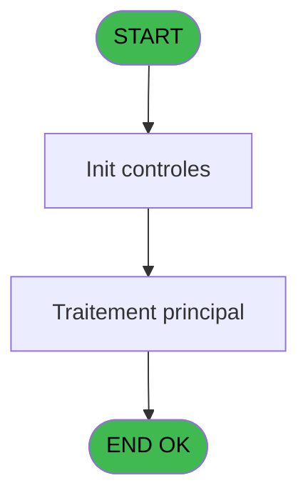
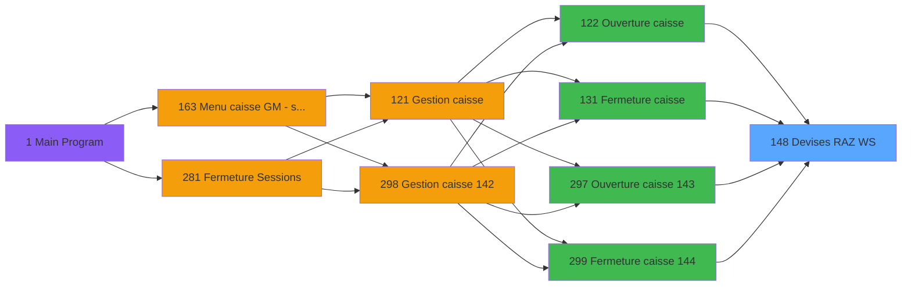

# ADH IDE 148 - Devises RAZ WS

> **Analyse**: Phases 1-4 2026-02-07 03:50 -> 03:50 (29s) | Assemblage 03:50
> **Pipeline**: V7.2 Enrichi
> **Structure**: 4 onglets (Resume | Ecrans | Donnees | Connexions)

<!-- TAB:Resume -->

## 1. FICHE D'IDENTITE

| Attribut | Valeur |
|----------|--------|
| Projet | ADH |
| IDE Position | 148 |
| Nom Programme | Devises RAZ WS |
| Fichier source | `Prg_148.xml` |
| Dossier IDE | Change |
| Taches | 3 (0 ecrans visibles) |
| Tables modifiees | 0 |
| Programmes appeles | 0 |

## 2. DESCRIPTION FONCTIONNELLE

**Devises RAZ WS** assure la gestion complete de ce processus, accessible depuis [Ouverture caisse (IDE 122)](ADH-IDE-122.md), [Fermeture caisse (IDE 131)](ADH-IDE-131.md), [Ouverture caisse 143 (IDE 297)](ADH-IDE-297.md), [Fermeture caisse 144 (IDE 299)](ADH-IDE-299.md).

Le flux de traitement s'organise en **1 blocs fonctionnels** :

- **Initialisation** (3 taches) : reinitialisation d'etats et de variables de travail

## 3. BLOCS FONCTIONNELS

### 3.1 Initialisation (3 taches)

Reinitialisation d'etats et variables de travail.

---

#### 148 - Devises RAZ WS

**Role** : Reinitialisation : Devises RAZ WS.

---

#### 148.1 - Devises RAZ WS

**Role** : Reinitialisation : Devises RAZ WS.

---

#### 148.2 - Devises RAZ WS

**Role** : Reinitialisation : Devises RAZ WS.

## 5. REGLES METIER

*(Aucune regle metier identifiee)*

## 6. CONTEXTE

- **Appele par**: [Ouverture caisse (IDE 122)](ADH-IDE-122.md), [Fermeture caisse (IDE 131)](ADH-IDE-131.md), [Ouverture caisse 143 (IDE 297)](ADH-IDE-297.md), [Fermeture caisse 144 (IDE 299)](ADH-IDE-299.md)
- **Appelle**: 0 programmes | **Tables**: 3 (W:0 R:2 L:1) | **Taches**: 3 | **Expressions**: 2

<!-- TAB:Ecrans -->

## 8. ECRANS

*(Programme sans ecran visible)*

## 9. NAVIGATION

### 9.3 Structure hierarchique (3 taches)

| Position | Tache | Type | Dimensions | Bloc |
|----------|-------|------|------------|------|
| **148.1** | [**Devises RAZ WS** (148)](#t1) | MDI | - | Initialisation |
| 148.1.1 | [Devises RAZ WS (148.1)](#t2) | MDI | - | |
| 148.1.2 | [Devises RAZ WS (148.2)](#t3) | MDI | - | |

### 9.4 Algorigramme

> **Legende**: Vert = START/END OK | Rouge = END KO | Bleu = Decisions
> *Algorigramme auto-genere. Utiliser `/algorigramme` pour une synthese metier detaillee.*

<!-- TAB:Donnees -->

## 10. TABLES

### Tables utilisees (3)

| ID | Nom | Description | Type | R | W | L | Usages |
|----|-----|-------------|------|---|---|---|--------|
| 50 | moyens_reglement_mor | Reglements / paiements | DB | R |   |   | 1 |
| 139 | moyens_reglement_mor | Reglements / paiements | DB | R |   |   | 1 |
| 232 | gestion_devise_session | Sessions de caisse | DB |   |   | L | 2 |

### Colonnes par table (3 / 2 tables avec colonnes identifiees)

Table 50 - moyens_reglement_mor (R) - 1 usages

| Lettre | Variable | Acces | Type |
|--------|----------|-------|------|
| A | Param societe | R | Alpha |
| B | Param devise locale | R | Alpha |
| C | Param quand | R | Alpha |
| D | Param Type | R | Alpha |

Table 139 - moyens_reglement_mor (R) - 1 usages

| Lettre | Variable | Acces | Type |
|--------|----------|-------|------|
| A | Param societe | R | Alpha |
| B | Param devise locale | R | Alpha |
| C | Param quand | R | Alpha |
| D | Param Type | R | Alpha |
| E | RUPTURE_DEV_MOP | R | Alpha |

## 11. VARIABLES

### 11.1 Autres (5)

Variables diverses.

| Lettre | Nom | Type | Usage dans |
|--------|-----|------|-----------|
| A | Param societe | Alpha | - |
| B | Param devise locale | Alpha | - |
| C | Param quand | Alpha | - |
| D | Param type | Alpha | - |
| E | Param UNI/BI | Alpha | 2x refs |

## 12. EXPRESSIONS

**2 / 2 expressions decodees (100%)**

### 12.1 Repartition par type

| Type | Expressions | Regles |
|------|-------------|--------|
| CONDITION | 2 | 0 |

### 12.2 Expressions cles par type

#### CONDITION (2 expressions)

| Type | IDE | Expression | Regle |
|------|-----|------------|-------|
| CONDITION | 2 | `Param UNI/BI [E]='B'` | - |
| CONDITION | 1 | `Param UNI/BI [E]<>'B'` | - |

<!-- TAB:Connexions -->

## 13. GRAPHE D'APPELS

### 13.1 Chaine depuis Main (Callers)

Main -> ... -> [Ouverture caisse (IDE 122)](ADH-IDE-122.md) -> **Devises RAZ WS (IDE 148)**

Main -> ... -> [Fermeture caisse (IDE 131)](ADH-IDE-131.md) -> **Devises RAZ WS (IDE 148)**

Main -> ... -> [Ouverture caisse 143 (IDE 297)](ADH-IDE-297.md) -> **Devises RAZ WS (IDE 148)**

Main -> ... -> [Fermeture caisse 144 (IDE 299)](ADH-IDE-299.md) -> **Devises RAZ WS (IDE 148)**

### 13.2 Callers

| IDE | Nom Programme | Nb Appels |
|-----|---------------|-----------|
| [122](ADH-IDE-122.md) | Ouverture caisse | 3 |
| [131](ADH-IDE-131.md) | Fermeture caisse | 2 |
| [297](ADH-IDE-297.md) | Ouverture caisse 143 | 2 |
| [299](ADH-IDE-299.md) | Fermeture caisse 144 | 2 |

### 13.3 Callees (programmes appeles)

### 13.4 Detail Callees avec contexte

| IDE | Nom Programme | Appels | Contexte |
|-----|---------------|--------|----------|
| - | (aucun) | - | - |

## 14. RECOMMANDATIONS MIGRATION

### 14.1 Profil du programme

| Metrique | Valeur | Impact migration |
|----------|--------|-----------------|
| Lignes de logique | 58 | Programme compact |
| Expressions | 2 | Peu de logique |
| Tables WRITE | 0 | Impact faible |
| Sous-programmes | 0 | Peu de dependances |
| Ecrans visibles | 0 | Ecran unique ou traitement batch |
| Code desactive | 0% (0 / 58) | Code sain |
| Regles metier | 0 | Pas de regle identifiee |

### 14.2 Plan de migration par bloc

#### Initialisation (3 taches: 0 ecran, 3 traitements)

- **Strategie** : Constructeur/methode `InitAsync()` dans l'orchestrateur.

### 14.3 Dependances critiques

| Dependance | Type | Appels | Impact |
|------------|------|--------|--------|

---
*Spec DETAILED generee par Pipeline V7.2 - 2026-02-07 03:50*
