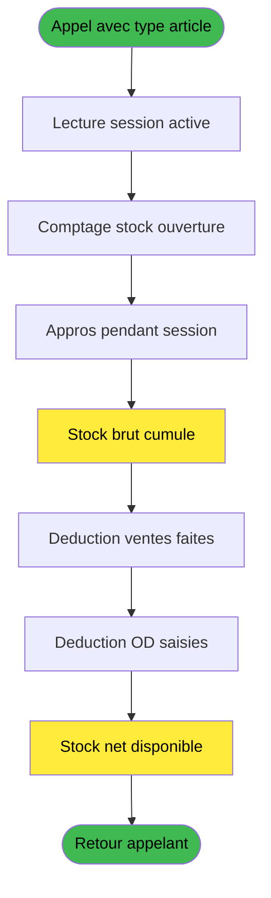
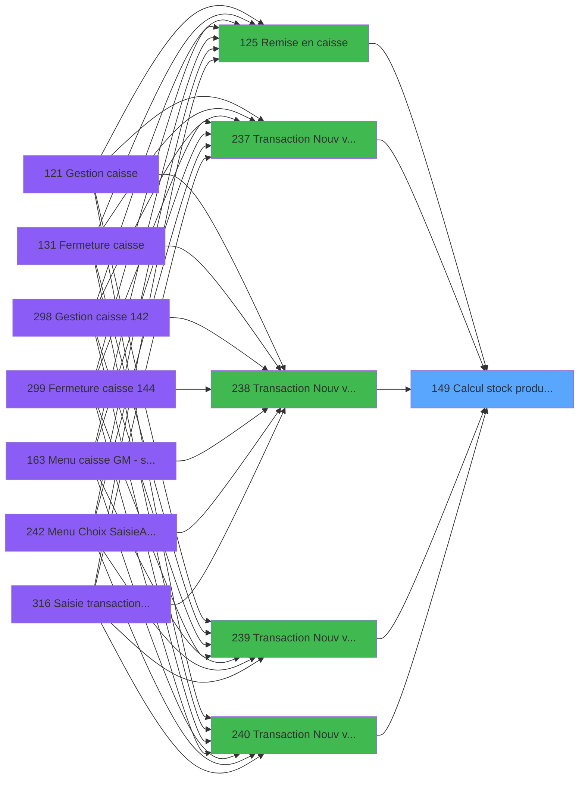

# ADH IDE 149 - Calcul stock produit WS

> **Analyse**: Phases 1-4 2026-02-23 18:22 -> 18:22 (1s) | Assemblage 13:02
> **Pipeline**: V7.2 Enrichi
> **Structure**: 4 onglets (Resume | Ecrans | Donnees | Connexions)

<!-- TAB:Resume -->

## 1. FICHE D'IDENTITE

| Attribut | Valeur |
|----------|--------|
| Projet | ADH |
| IDE Position | 149 |
| Nom Programme | Calcul stock produit WS |
| Fichier source | `Prg_149.xml` |
| Dossier IDE | General |
| Taches | 6 (0 ecrans visibles) |
| Tables modifiees | 0 |
| Programmes appeles | 0 |
| Complexite | **BASSE** (score 7/100) |

## 2. DESCRIPTION FONCTIONNELLE

**Calcul stock produit WS** calcule le stock net disponible des produits Wellness & Services (Gift Pass, Resort Credit, services) en combinant 3 sources de donnees (session active, comptage ouverture, approvisionnements) et en soustrayant les ventes et ordres de depot deja realises. Programme sans ecran (6 taches), appele par 9 programmes de transaction de vente ([IDE 237](ADH-IDE-237.md), [IDE 238](ADH-IDE-238.md), [IDE 239](ADH-IDE-239.md), [IDE 240](ADH-IDE-240.md), [IDE 300](ADH-IDE-300.md), [IDE 307](ADH-IDE-307.md), [IDE 310](ADH-IDE-310.md), [IDE 316](ADH-IDE-316.md)) et de caisse ([IDE 125](ADH-IDE-125.md)).

### Lecture du contexte transactionnel

La tache racine (149.1) recoit en parametre le type d'article (variable EQ) et lance la lecture de la session active. La sous-tache 149.2 interroge la table histo_sessions_caisse (caisse_session) pour obtenir la session en cours, la date de debut (ES) et l'heure de debut (ET). Ces informations servent de filtre pour toutes les requetes suivantes.

2 taches : 149.1, 149.2

- **149.1** - Calcul stock produit WS (racine, parametre EQ)
- **149.2** - Lecture session (lit histo_sessions_caisse)

### Calcul du stock initial et approvisionnements

Le stock initial est calcule par comptage des articles approvisionnes a l'ouverture de la session (149.3, lit comptage_caisse_histo et histo_sessions_caisse_detail). Les approvisionnements additionnels effectues pendant la session sont comptabilises separement (149.4, lit comptable________cte et histo_sessions_caisse_article en LINK). La somme des deux constitue le stock brut disponible.

2 taches : 149.3, 149.4

- **149.3** - Comptage ouverture (lit comptage_caisse_histo, histo_sessions_caisse_detail)
- **149.4** - Appro remise pendant (lit comptable________cte, LINK histo_sessions_caisse_article)

### Deduction des mouvements sortants

Les ventes deja realisees pendant la session (149.5, lit vente/caisse_vente) et les ordres de depot deja saisis (149.6) sont soustraits du stock brut. Le resultat est le stock net disponible pour la prochaine transaction, evitant les depassements d'inventaire et assurant la tracabilite des mouvements au niveau local et consolide.

2 taches : 149.5, 149.6

- **149.5** - Ventes deja faites (lit vente/caisse_vente)
- **149.6** - OD deja faites (ordres de depot)

## 3. BLOCS FONCTIONNELS

### 3.1 Calcul (2 taches)

Calculs metier : montants, stocks, compteurs.

---

#### T1 - Calcul stock produit WS

**Role** : Calcul : Calcul stock produit WS.
**Variables liees** : EQ (Param stock article)

---

#### T3 - comptage ouverture

**Role** : Traitement : comptage ouverture.

### 3.2 Traitement (3 taches)

Traitements internes.

---

#### T2 - Lecture session

**Role** : Traitement : Lecture session.
**Variables liees** : ER (Session), ES (Date debut session), ET (Heure debut session)

---

#### T4 - appro remise pendant

**Role** : Calcul fidelite/avantage : appro remise pendant.

---

#### T6 - od deja faites

**Role** : Traitement : od deja faites.

### 3.3 Saisie (1 tache)

Ce bloc traite la saisie des donnees de la transaction.

---

#### T5 - Ventes deja faites

**Role** : Saisie des donnees : Ventes deja faites.

## 5. REGLES METIER

*(Aucune regle metier identifiee dans les expressions)*

## 6. CONTEXTE

- **Appele par**: [Remise en caisse (IDE 125)](ADH-IDE-125.md), [Transaction Nouv vente avec GP (IDE 237)](ADH-IDE-237.md), [Transaction Nouv vente PMS-584 (IDE 238)](ADH-IDE-238.md), [Transaction Nouv vente PMS-721 (IDE 239)](ADH-IDE-239.md), [Transaction Nouv vente PMS-710 (IDE 240)](ADH-IDE-240.md), [Saisie transaction 154 N.U (IDE 300)](ADH-IDE-300.md), [Saisie transaction 154  N.U (IDE 307)](ADH-IDE-307.md), [Saisie transaction Nouv vente (IDE 310)](ADH-IDE-310.md), [Saisie transaction Nouv vente (IDE 316)](ADH-IDE-316.md)
- **Appelle**: 0 programmes | **Tables**: 6 (W:0 R:5 L:1) | **Taches**: 6 | **Expressions**: 1

<!-- TAB:Ecrans -->

## 8. ECRANS

*(Programme sans ecran visible)*

## 9. NAVIGATION

### 9.3 Structure hierarchique (6 taches)

| Position | Tache | Type | Dimensions | Bloc |
|----------|-------|------|------------|------|
| **149.1** | [**Calcul stock produit WS** (T1)](#t1) | MDI | - | Calcul |
| 149.1.1 | [comptage ouverture (T3)](#t3) | MDI | - | |
| **149.2** | [**Lecture session** (T2)](#t2) | MDI | - | Traitement |
| 149.2.1 | [appro remise pendant (T4)](#t4) | MDI | - | |
| 149.2.2 | [od deja faites (T6)](#t6) | MDI | - | |
| **149.3** | [**Ventes deja faites** (T5)](#t5) | MDI | - | Saisie |

### 9.4 Algorigramme

> **Legende**: Vert = START/END OK | Jaune = Flux stock WS | Bleu = Decisions

| Noeud | Source | Justification |
|-------|--------|---------------|
| LSESS | Tache 149.2 | Lecture histo_sessions_caisse pour contexte transactionnel |
| CPTOUV | Tache 149.3 | Comptage articles approvisionnes a ouverture session |
| APPRO | Tache 149.4 | Approvisionnements additionnels pendant session |
| CALCBRUT | Taches 149.3 + 149.4 | Somme stock initial + appros = stock brut |
| VENTES | Tache 149.5 | Soustraction ventes Gift Pass/Resort Credit realisees |
| OD | Tache 149.6 | Soustraction ordres de depot saisis |
| STOCKNET | Expression 1 | Resultat net : brut - ventes - OD = stock disponible |

<!-- TAB:Donnees -->

## 10. TABLES

### Tables utilisees (6)

| ID | Nom | Description | Type | R | W | L | Usages |
|----|-----|-------------|------|---|---|---|--------|
| 222 | comptage_caisse_histo | Sessions de caisse | DB | R |   |   | 1 |
| 263 | vente | Donnees de ventes | DB | R |   |   | 1 |
| 249 | histo_sessions_caisse_detail | Sessions de caisse | DB | R |   |   | 1 |
| 40 | comptable________cte |  | DB | R |   |   | 1 |
| 246 | histo_sessions_caisse | Sessions de caisse | DB | R |   |   | 1 |
| 247 | histo_sessions_caisse_article | Articles et stock | DB |   |   | L | 1 |

### Colonnes par table (5 / 5 tables avec colonnes identifiees)

Table 222 - comptage_caisse_histo (R) - 1 usages

| Lettre | Variable | Acces | Type |
|--------|----------|-------|------|
| EN | DernierChronoHisto | R | Numeric |

Table 263 - vente (R) - 1 usages

*Table utilisee uniquement en Link ou aucune colonne Real identifiee dans le DataView.*

Table 249 - histo_sessions_caisse_detail (R) - 1 usages

| Lettre | Variable | Acces | Type |
|--------|----------|-------|------|
| EN | DernierChronoHisto | R | Numeric |

Table 40 - comptable________cte (R) - 1 usages

| Lettre | Variable | Acces | Type |
|--------|----------|-------|------|
| EO | Param date comptable | R | Date |

Table 246 - histo_sessions_caisse (R) - 1 usages

| Lettre | Variable | Acces | Type |
|--------|----------|-------|------|
| EN | DernierChronoHisto | R | Numeric |

## 11. VARIABLES

### 11.1 Autres (7)

Variables diverses.

| Lettre | Nom | Type | Usage dans |
|--------|-----|------|-----------|
| EN | Param societe | Alpha | - |
| EO | Param date comptable | Date | - |
| EP | Param Numero article | Numeric | - |
| EQ | Param stock article | Numeric | - |
| ER | Session | Numeric | - |
| ES | Date debut session | Date | - |
| ET | Heure debut session | Time | - |

## 12. EXPRESSIONS

**1 / 1 expressions decodees (100%)**

### 12.1 Repartition par type

| Type | Expressions | Regles |
|------|-------------|--------|
| CONSTANTE | 1 | 0 |

### 12.2 Expressions cles par type

#### CONSTANTE (1 expressions)

| Type | IDE | Expression | Regle |
|------|-----|------------|-------|
| CONSTANTE | 1 | `0` | - |

<!-- TAB:Connexions -->

## 13. GRAPHE D'APPELS

### 13.1 Chaine depuis Main (Callers)

Main -> ... -> [Remise en caisse (IDE 125)](ADH-IDE-125.md) -> **Calcul stock produit WS (IDE 149)**

Main -> ... -> [Transaction Nouv vente avec GP (IDE 237)](ADH-IDE-237.md) -> **Calcul stock produit WS (IDE 149)**

Main -> ... -> [Transaction Nouv vente PMS-584 (IDE 238)](ADH-IDE-238.md) -> **Calcul stock produit WS (IDE 149)**

Main -> ... -> [Transaction Nouv vente PMS-721 (IDE 239)](ADH-IDE-239.md) -> **Calcul stock produit WS (IDE 149)**

Main -> ... -> [Transaction Nouv vente PMS-710 (IDE 240)](ADH-IDE-240.md) -> **Calcul stock produit WS (IDE 149)**

Main -> ... -> [Saisie transaction 154 N.U (IDE 300)](ADH-IDE-300.md) -> **Calcul stock produit WS (IDE 149)**

Main -> ... -> [Saisie transaction 154  N.U (IDE 307)](ADH-IDE-307.md) -> **Calcul stock produit WS (IDE 149)**

Main -> ... -> [Saisie transaction Nouv vente (IDE 310)](ADH-IDE-310.md) -> **Calcul stock produit WS (IDE 149)**

Main -> ... -> [Saisie transaction Nouv vente (IDE 316)](ADH-IDE-316.md) -> **Calcul stock produit WS (IDE 149)**

### 13.2 Callers

| IDE | Nom Programme | Nb Appels |
|-----|---------------|-----------|
| [125](ADH-IDE-125.md) | Remise en caisse | 1 |
| [237](ADH-IDE-237.md) | Transaction Nouv vente avec GP | 1 |
| [238](ADH-IDE-238.md) | Transaction Nouv vente PMS-584 | 1 |
| [239](ADH-IDE-239.md) | Transaction Nouv vente PMS-721 | 1 |
| [240](ADH-IDE-240.md) | Transaction Nouv vente PMS-710 | 1 |
| [300](ADH-IDE-300.md) | Saisie transaction 154 N.U | 1 |
| [307](ADH-IDE-307.md) | Saisie transaction 154  N.U | 1 |
| [310](ADH-IDE-310.md) | Saisie transaction Nouv vente | 1 |
| [316](ADH-IDE-316.md) | Saisie transaction Nouv vente | 1 |

### 13.3 Callees (programmes appeles)

### 13.4 Detail Callees avec contexte

| IDE | Nom Programme | Appels | Contexte |
|-----|---------------|--------|----------|
| - | (aucun) | - | - |

## 14. RECOMMANDATIONS MIGRATION

### 14.1 Profil du programme

| Metrique | Valeur | Impact migration |
|----------|--------|-----------------|
| Lignes de logique | 88 | Programme compact |
| Expressions | 1 | Peu de logique |
| Tables WRITE | 0 | Impact faible |
| Sous-programmes | 0 | Peu de dependances |
| Ecrans visibles | 0 | Ecran unique ou traitement batch |
| Code desactive | 0% (0 / 88) | Code sain |
| Regles metier | 0 | Pas de regle identifiee |

### 14.2 Plan de migration par bloc

#### Calcul (2 taches: 0 ecran, 2 traitements)

- **Strategie** : Services de calcul purs (Domain Services).
- Migrer la logique de calcul (stock, compteurs, montants)

#### Traitement (3 taches: 0 ecran, 3 traitements)

- **Strategie** : 3 service(s) backend injectable(s) (Domain Services).
- Decomposer les taches en services unitaires testables.

#### Saisie (1 tache: 0 ecran, 1 traitement)

- **Strategie** : Formulaire React/Blazor avec validation Zod/FluentValidation.
- Validation temps reel cote client + serveur

### 14.3 Dependances critiques

| Dependance | Type | Appels | Impact |
|------------|------|--------|--------|

---
*Spec DETAILED generee par Pipeline V7.2 - 2026-02-25 13:02*
