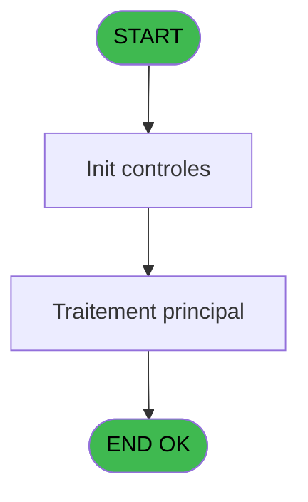
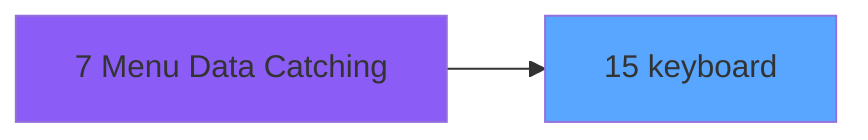
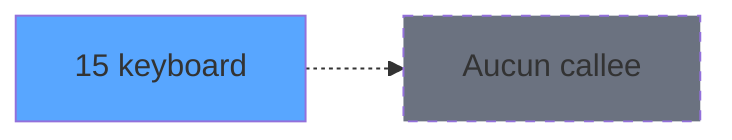

# ADH IDE 15 - keyboard

> **Analyse**: Phases 1-4 2026-02-07 03:39 -> 01:16 (21h36min) | Assemblage 01:16
> **Pipeline**: V7.2 Enrichi
> **Structure**: 4 onglets (Resume | Ecrans | Donnees | Connexions)

<!-- TAB:Resume -->

## 1. FICHE D'IDENTITE

| Attribut | Valeur |
|----------|--------|
| Projet | ADH |
| IDE Position | 15 |
| Nom Programme | keyboard |
| Fichier source | `Prg_15.xml` |
| Dossier IDE | General |
| Taches | 2 (1 ecrans visibles) |
| Tables modifiees | 0 |
| Programmes appeles | 0 |
| Complexite | **BASSE** (score 0/100) |

## 2. DESCRIPTION FONCTIONNELLE

**ADH IDE 15 est un programme ultra-compact de saisie ou validation de données relatives à la gestion des e-mails.** Constitué d'une seule tâche avec seulement 5 lignes de logique, il opère comme un traitement très ciblé sans écran visible, probablement déclenché en arrière-plan pour des opérations batch. Le programme accède uniquement à la table `quadriga_chambre` en mode écriture, indiquant un rôle limité à la mise à jour de données liées aux chambres.

**Complètement isolé du reste du système**, ADH IDE 15 n'est appelé par aucun autre programme et n'effectue aucun appel externe, ce qui suggère un statut orphelin ou une intégration indirecte/cross-projet non détectée. Avec zéro variable locale, zéro condition complexe et une complexité minimale (score 7/100), ce programme représente un candidate idéal pour suppression ou audit de pertinence.

## 3. BLOCS FONCTIONNELS

### 3.1 Traitement (2 taches)

Traitements internes.

---

#### 15 - Keyboard ENG [[ECRAN]](#ecran-t1)

**Role** : Traitement : Keyboard ENG.
**Ecran** : 680 x 356 DLU (MDI) | [Voir mockup](#ecran-t1)
**Variables liees** : EP (v.keyboard control name prev)

---

#### 15.1 - Keyboard [[ECRAN]](#ecran-t2)

**Role** : Traitement : Keyboard.
**Ecran** : 199 x 80 DLU (MDI) | [Voir mockup](#ecran-t2)
**Variables liees** : EP (v.keyboard control name prev)

## 5. REGLES METIER

1 regles identifiees:

### Autres (1 regles)

#### [RM-001] Si GetParam ('LANGUAGE')='SPA' alors 3 sinon IF (GetParam ('LANGUAGE')='FRE',2,1))

| Element | Detail |
|---------|--------|
| **Condition** | `GetParam ('LANGUAGE')='SPA'` |
| **Si vrai** | 3 |
| **Si faux** | IF (GetParam ('LANGUAGE')='FRE',2,1)) |
| **Expression source** | Expression 1 : `IF (GetParam ('LANGUAGE')='SPA',3,IF (GetParam ('LANGUAGE')=` |
| **Exemple** | Si GetParam ('LANGUAGE')='SPA' → 3. Sinon → IF (GetParam ('LANGUAGE')='FRE',2,1)) |

## 6. CONTEXTE

- **Appele par**: [Menu Data Catching (IDE 7)](ADH-IDE-7.md)
- **Appelle**: 0 programmes | **Tables**: 0 (W:0 R:0 L:0) | **Taches**: 2 | **Expressions**: 4

<!-- TAB:Ecrans -->

## 8. ECRANS

### 8.1 Forms visibles (1 / 2)

| # | Position | Tache | Nom | Type | Largeur | Hauteur | Bloc |
|---|----------|-------|-----|------|---------|---------|------|
| 1 | 15 | 15 | Keyboard ENG | MDI | 680 | 356 | Traitement |

### 8.2 Mockups Ecrans

---

#### 15 - Keyboard ENG
**Tache** : [15](#t1) | **Type** : MDI | **Dimensions** : 680 x 356 DLU
**Bloc** : Traitement | **Titre IDE** : Keyboard ENG

<!-- FORM-DATA:
{
    "width":  680,
    "vFactor":  8,
    "type":  "MDI",
    "hFactor":  4,
    "controls":  [
                     {
                         "x":  3,
                         "type":  "label",
                         "var":  "",
                         "y":  3,
                         "w":  674,
                         "fmt":  "",
                         "name":  "",
                         "h":  39,
                         "color":  "200",
                         "text":  "",
                         "parent":  null
                     },
                     {
                         "x":  21,
                         "type":  "label",
                         "var":  "",
                         "y":  13,
                         "w":  512,
                         "fmt":  "",
                         "name":  "",
                         "h":  14,
                         "color":  "205",
                         "text":  "Please enter your information with the use of the keyboard. Then click \"Continue\"",
                         "parent":  1
                     },
                     {
                         "x":  142,
                         "type":  "edit",
                         "var":  "",
                         "y":  46,
                         "w":  397,
                         "fmt":  "",
                         "name":  "",
                         "h":  19,
                         "color":  "201",
                         "text":  "",
                         "parent":  null
                     },
                     {
                         "x":  142,
                         "type":  "edit",
                         "var":  "",
                         "y":  66,
                         "w":  397,
                         "fmt":  "",
                         "name":  "",
                         "h":  19,
                         "color":  "204",
                         "text":  "",
                         "parent":  null
                     },
                     {
                         "x":  503,
                         "type":  "button",
                         "var":  "",
                         "y":  314,
                         "w":  83,
                         "fmt":  "Continue",
                         "name":  "",
                         "h":  28,
                         "color":  "110",
                         "text":  "",
                         "parent":  null
                     },
                     {
                         "x":  22,
                         "type":  "button",
                         "var":  "",
                         "y":  98,
                         "w":  52,
                         "fmt":  "-",
                         "name":  "*-",
                         "h":  40,
                         "color":  "",
                         "text":  "",
                         "parent":  null
                     },
                     {
                         "x":  74,
                         "type":  "button",
                         "var":  "",
                         "y":  98,
                         "w":  52,
                         "fmt":  "_",
                         "name":  "*_",
                         "h":  40,
                         "color":  "",
                         "text":  "",
                         "parent":  null
                     },
                     {
                         "x":  126,
                         "type":  "button",
                         "var":  "",
                         "y":  98,
                         "w":  52,
                         "fmt":  ".",
                         "name":  "*.",
                         "h":  40,
                         "color":  "",
                         "text":  "",
                         "parent":  null
                     },
                     {
                         "x":  178,
                         "type":  "button",
                         "var":  "",
                         "y":  98,
                         "w":  52,
                         "fmt":  "/",
                         "name":  "*/",
                         "h":  40,
                         "color":  "",
                         "text":  "",
                         "parent":  null
                     },
                     {
                         "x":  230,
                         "type":  "button",
                         "var":  "",
                         "y":  98,
                         "w":  52,
                         "fmt":  "@",
                         "name":  "*@",
                         "h":  40,
                         "color":  "",
                         "text":  "",
                         "parent":  null
                     },
                     {
                         "x":  282,
                         "type":  "button",
                         "var":  "",
                         "y":  98,
                         "w":  104,
                         "fmt":  "Clear",
                         "name":  "+CLEAR",
                         "h":  40,
                         "color":  "",
                         "text":  "",
                         "parent":  null
                     },
                     {
                         "x":  386,
                         "type":  "button",
                         "var":  "",
                         "y":  98,
                         "w":  104,
                         "fmt":  "Backspace",
                         "name":  "+BACKSPACE",
                         "h":  40,
                         "color":  "",
                         "text":  "",
                         "parent":  null
                     },
                     {
                         "x":  506,
                         "type":  "button",
                         "var":  "",
                         "y":  98,
                         "w":  52,
                         "fmt":  "1",
                         "name":  "*1",
                         "h":  40,
                         "color":  "",
                         "text":  "",
                         "parent":  null
                     },
                     {
                         "x":  558,
                         "type":  "button",
                         "var":  "",
                         "y":  98,
                         "w":  52,
                         "fmt":  "2",
                         "name":  "*2",
                         "h":  40,
                         "color":  "",
                         "text":  "",
                         "parent":  null
                     },
                     {
                         "x":  610,
                         "type":  "button",
                         "var":  "",
                         "y":  98,
                         "w":  52,
                         "fmt":  "3",
                         "name":  "*3",
                         "h":  40,
                         "color":  "",
                         "text":  "",
                         "parent":  null
                     },
                     {
                         "x":  22,
                         "type":  "button",
                         "var":  "",
                         "y":  138,
                         "w":  52,
                         "fmt":  "A",
                         "name":  "*A",
                         "h":  40,
                         "color":  "",
                         "text":  "",
                         "parent":  null
                     },
                     {
                         "x":  74,
                         "type":  "button",
                         "var":  "",
                         "y":  138,
                         "w":  52,
                         "fmt":  "B",
                         "name":  "*B",
                         "h":  40,
                         "color":  "",
                         "text":  "",
                         "parent":  null
                     },
                     {
                         "x":  126,
                         "type":  "button",
                         "var":  "",
                         "y":  138,
                         "w":  52,
                         "fmt":  "C",
                         "name":  "*C",
                         "h":  40,
                         "color":  "",
                         "text":  "",
                         "parent":  null
                     },
                     {
                         "x":  178,
                         "type":  "button",
                         "var":  "",
                         "y":  138,
                         "w":  52,
                         "fmt":  "D",
                         "name":  "*D",
                         "h":  40,
                         "color":  "",
                         "text":  "",
                         "parent":  null
                     },
                     {
                         "x":  230,
                         "type":  "button",
                         "var":  "",
                         "y":  138,
                         "w":  52,
                         "fmt":  "E",
                         "name":  "*E",
                         "h":  40,
                         "color":  "",
                         "text":  "",
                         "parent":  null
                     },
                     {
                         "x":  282,
                         "type":  "button",
                         "var":  "",
                         "y":  138,
                         "w":  52,
                         "fmt":  "F",
                         "name":  "*F",
                         "h":  40,
                         "color":  "",
                         "text":  "",
                         "parent":  null
                     },
                     {
                         "x":  334,
                         "type":  "button",
                         "var":  "",
                         "y":  138,
                         "w":  52,
                         "fmt":  "G",
                         "name":  "*G",
                         "h":  40,
                         "color":  "",
                         "text":  "",
                         "parent":  null
                     },
                     {
                         "x":  386,
                         "type":  "button",
                         "var":  "",
                         "y":  138,
                         "w":  52,
                         "fmt":  "H",
                         "name":  "*H",
                         "h":  40,
                         "color":  "",
                         "text":  "",
                         "parent":  null
                     },
                     {
                         "x":  438,
                         "type":  "button",
                         "var":  "",
                         "y":  138,
                         "w":  52,
                         "fmt":  "I",
                         "name":  "*I",
                         "h":  40,
                         "color":  "",
                         "text":  "",
                         "parent":  null
                     },
                     {
                         "x":  506,
                         "type":  "button",
                         "var":  "",
                         "y":  138,
                         "w":  52,
                         "fmt":  "4",
                         "name":  "*4",
                         "h":  40,
                         "color":  "",
                         "text":  "",
                         "parent":  null
                     },
                     {
                         "x":  558,
                         "type":  "button",
                         "var":  "",
                         "y":  138,
                         "w":  52,
                         "fmt":  "5",
                         "name":  "*5",
                         "h":  40,
                         "color":  "",
                         "text":  "",
                         "parent":  null
                     },
                     {
                         "x":  610,
                         "type":  "button",
                         "var":  "",
                         "y":  138,
                         "w":  52,
                         "fmt":  "6",
                         "name":  "*6",
                         "h":  40,
                         "color":  "",
                         "text":  "",
                         "parent":  null
                     },
                     {
                         "x":  22,
                         "type":  "button",
                         "var":  "",
                         "y":  178,
                         "w":  52,
                         "fmt":  "J",
                         "name":  "*J",
                         "h":  40,
                         "color":  "",
                         "text":  "",
                         "parent":  null
                     },
                     {
                         "x":  74,
                         "type":  "button",
                         "var":  "",
                         "y":  178,
                         "w":  52,
                         "fmt":  "K",
                         "name":  "*K",
                         "h":  40,
                         "color":  "",
                         "text":  "",
                         "parent":  null
                     },
                     {
                         "x":  126,
                         "type":  "button",
                         "var":  "",
                         "y":  178,
                         "w":  52,
                         "fmt":  "L",
                         "name":  "*L",
                         "h":  40,
                         "color":  "",
                         "text":  "",
                         "parent":  null
                     },
                     {
                         "x":  178,
                         "type":  "button",
                         "var":  "",
                         "y":  178,
                         "w":  52,
                         "fmt":  "M",
                         "name":  "*M",
                         "h":  40,
                         "color":  "",
                         "text":  "",
                         "parent":  null
                     },
                     {
                         "x":  230,
                         "type":  "button",
                         "var":  "",
                         "y":  178,
                         "w":  52,
                         "fmt":  "N",
                         "name":  "*N",
                         "h":  40,
                         "color":  "",
                         "text":  "",
                         "parent":  null
                     },
                     {
                         "x":  282,
                         "type":  "button",
                         "var":  "",
                         "y":  178,
                         "w":  52,
                         "fmt":  "O",
                         "name":  "*O",
                         "h":  40,
                         "color":  "",
                         "text":  "",
                         "parent":  null
                     },
                     {
                         "x":  334,
                         "type":  "button",
                         "var":  "",
                         "y":  178,
                         "w":  52,
                         "fmt":  "P",
                         "name":  "*P",
                         "h":  40,
                         "color":  "",
                         "text":  "",
                         "parent":  null
                     },
                     {
                         "x":  386,
                         "type":  "button",
                         "var":  "",
                         "y":  178,
                         "w":  52,
                         "fmt":  "Q",
                         "name":  "*Q",
                         "h":  40,
                         "color":  "",
                         "text":  "",
                         "parent":  null
                     },
                     {
                         "x":  438,
                         "type":  "button",
                         "var":  "",
                         "y":  178,
                         "w":  52,
                         "fmt":  "R",
                         "name":  "*R",
                         "h":  40,
                         "color":  "",
                         "text":  "",
                         "parent":  null
                     },
                     {
                         "x":  506,
                         "type":  "button",
                         "var":  "",
                         "y":  178,
                         "w":  52,
                         "fmt":  "7",
                         "name":  "*7",
                         "h":  40,
                         "color":  "",
                         "text":  "",
                         "parent":  null
                     },
                     {
                         "x":  558,
                         "type":  "button",
                         "var":  "",
                         "y":  178,
                         "w":  52,
                         "fmt":  "8",
                         "name":  "*8",
                         "h":  40,
                         "color":  "",
                         "text":  "",
                         "parent":  null
                     },
                     {
                         "x":  610,
                         "type":  "button",
                         "var":  "",
                         "y":  178,
                         "w":  52,
                         "fmt":  "9",
                         "name":  "*9",
                         "h":  40,
                         "color":  "",
                         "text":  "",
                         "parent":  null
                     },
                     {
                         "x":  22,
                         "type":  "button",
                         "var":  "",
                         "y":  218,
                         "w":  52,
                         "fmt":  "S",
                         "name":  "*S",
                         "h":  40,
                         "color":  "",
                         "text":  "",
                         "parent":  null
                     },
                     {
                         "x":  74,
                         "type":  "button",
                         "var":  "",
                         "y":  218,
                         "w":  52,
                         "fmt":  "T",
                         "name":  "*T",
                         "h":  40,
                         "color":  "",
                         "text":  "",
                         "parent":  null
                     },
                     {
                         "x":  126,
                         "type":  "button",
                         "var":  "",
                         "y":  218,
                         "w":  52,
                         "fmt":  "U",
                         "name":  "*U",
                         "h":  40,
                         "color":  "",
                         "text":  "",
                         "parent":  null
                     },
                     {
                         "x":  178,
                         "type":  "button",
                         "var":  "",
                         "y":  218,
                         "w":  52,
                         "fmt":  "V",
                         "name":  "*V",
                         "h":  40,
                         "color":  "",
                         "text":  "",
                         "parent":  null
                     },
                     {
                         "x":  230,
                         "type":  "button",
                         "var":  "",
                         "y":  218,
                         "w":  52,
                         "fmt":  "W",
                         "name":  "*W",
                         "h":  40,
                         "color":  "",
                         "text":  "",
                         "parent":  null
                     },
                     {
                         "x":  282,
                         "type":  "button",
                         "var":  "",
                         "y":  218,
                         "w":  52,
                         "fmt":  "X",
                         "name":  "*X",
                         "h":  40,
                         "color":  "",
                         "text":  "",
                         "parent":  null
                     },
                     {
                         "x":  334,
                         "type":  "button",
                         "var":  "",
                         "y":  218,
                         "w":  52,
                         "fmt":  "Y",
                         "name":  "*Y",
                         "h":  40,
                         "color":  "",
                         "text":  "",
                         "parent":  null
                     },
                     {
                         "x":  386,
                         "type":  "button",
                         "var":  "",
                         "y":  218,
                         "w":  52,
                         "fmt":  "Z",
                         "name":  "*Z",
                         "h":  40,
                         "color":  "",
                         "text":  "",
                         "parent":  null
                     },
                     {
                         "x":  558,
                         "type":  "button",
                         "var":  "",
                         "y":  218,
                         "w":  52,
                         "fmt":  "0",
                         "name":  "*0",
                         "h":  40,
                         "color":  "",
                         "text":  "",
                         "parent":  null
                     },
                     {
                         "x":  22,
                         "type":  "button",
                         "var":  "",
                         "y":  258,
                         "w":  416,
                         "fmt":  "Space",
                         "name":  "+SPACE",
                         "h":  40,
                         "color":  "",
                         "text":  "",
                         "parent":  null
                     },
                     {
                         "x":  95,
                         "type":  "button",
                         "var":  "",
                         "y":  314,
                         "w":  83,
                         "fmt":  "Cancel",
                         "name":  "",
                         "h":  28,
                         "color":  "110",
                         "text":  "",
                         "parent":  null
                     }
                 ],
    "taskId":  "15",
    "height":  356
}
-->

<strong>Champs : 2 champs</strong>

| Pos (x,y) | Nom | Variable | Type |
|-----------|-----|----------|------|
| 142,46 | (sans nom) | - | edit |
| 142,66 | (sans nom) | - | edit |

<strong>Boutons : 46 boutons</strong>

| Bouton | Pos (x,y) | Action |
|--------|-----------|--------|
| Continue | 503,314 | Bouton fonctionnel |
| - | 22,98 | Bouton fonctionnel |
| _ | 74,98 | Bouton fonctionnel |
| . | 126,98 | Bouton fonctionnel |
| / | 178,98 | Bouton fonctionnel |
| @ | 230,98 | Bouton fonctionnel |
| Clear | 282,98 | Bouton fonctionnel |
| Backspace | 386,98 | Bouton fonctionnel |
| 1 | 506,98 | Bouton fonctionnel |
| 2 | 558,98 | Bouton fonctionnel |
| 3 | 610,98 | Bouton fonctionnel |
| A | 22,138 | Bouton fonctionnel |
| B | 74,138 | Bouton fonctionnel |
| C | 126,138 | Bouton fonctionnel |
| D | 178,138 | Bouton fonctionnel |
| E | 230,138 | Bouton fonctionnel |
| F | 282,138 | Bouton fonctionnel |
| G | 334,138 | Bouton fonctionnel |
| H | 386,138 | Bouton fonctionnel |
| I | 438,138 | Bouton fonctionnel |
| 4 | 506,138 | Bouton fonctionnel |
| 5 | 558,138 | Bouton fonctionnel |
| 6 | 610,138 | Bouton fonctionnel |
| J | 22,178 | Bouton fonctionnel |
| K | 74,178 | Bouton fonctionnel |
| L | 126,178 | Bouton fonctionnel |
| M | 178,178 | Bouton fonctionnel |
| N | 230,178 | Bouton fonctionnel |
| O | 282,178 | Bouton fonctionnel |
| P | 334,178 | Bouton fonctionnel |
| Q | 386,178 | Bouton fonctionnel |
| R | 438,178 | Bouton fonctionnel |
| 7 | 506,178 | Bouton fonctionnel |
| 8 | 558,178 | Bouton fonctionnel |
| 9 | 610,178 | Bouton fonctionnel |
| S | 22,218 | Bouton fonctionnel |
| T | 74,218 | Bouton fonctionnel |
| U | 126,218 | Bouton fonctionnel |
| V | 178,218 | Bouton fonctionnel |
| W | 230,218 | Bouton fonctionnel |
| X | 282,218 | Bouton fonctionnel |
| Y | 334,218 | Bouton fonctionnel |
| Z | 386,218 | Bouton fonctionnel |
| 0 | 558,218 | Bouton fonctionnel |
| Space | 22,258 | Bouton fonctionnel |
| Cancel | 95,314 | Annule et retour au menu |

## 9. NAVIGATION

Ecran unique: **Keyboard ENG**

### 9.3 Structure hierarchique (2 taches)

| Position | Tache | Type | Dimensions | Bloc |
|----------|-------|------|------------|------|
| **15.1** | [**Keyboard ENG** (15)](#t1) [mockup](#ecran-t1) | MDI | 680x356 | Traitement |
| 15.1.1 | [Keyboard (15.1)](#t2) [mockup](#ecran-t2) | MDI | 199x80 | |

### 9.4 Algorigramme

> **Legende**: Vert = START/END OK | Rouge = END KO | Bleu = Decisions
> *Algorigramme auto-genere. Utiliser `/algorigramme` pour une synthese metier detaillee.*

<!-- TAB:Donnees -->

## 10. TABLES

### Tables utilisees (0)

| ID | Nom | Description | Type | R | W | L | Usages |
|----|-----|-------------|------|---|---|---|--------|

### Colonnes par table (0 / 0 tables avec colonnes identifiees)

## 11. VARIABLES

### 11.1 Parametres entrants (1)

Variables recues du programme appelant ([Menu Data Catching (IDE 7)](ADH-IDE-7.md)).

| Lettre | Nom | Type | Usage dans |
|--------|-----|------|-----------|
| EN | p.chain | Alpha | 1x parametre entrant |

### 11.2 Variables de session (3)

Variables persistantes pendant toute la session.

| Lettre | Nom | Type | Usage dans |
|--------|-----|------|-----------|
| EO | v.contol name | Alpha | - |
| EP | v.keyboard control name prev | Alpha | - |
| EQ | v.chaine | Alpha | 1x session |

### 11.3 Autres (1)

Variables diverses.

| Lettre | Nom | Type | Usage dans |
|--------|-----|------|-----------|
| ER | btn valid | Alpha | - |

## 12. EXPRESSIONS

**4 / 4 expressions decodees (100%)**

### 12.1 Repartition par type

| Type | Expressions | Regles |
|------|-------------|--------|
| CONDITION | 1 | 5 |
| OTHER | 3 | 0 |

### 12.2 Expressions cles par type

#### CONDITION (1 expressions)

| Type | IDE | Expression | Regle |
|------|-----|------------|-------|
| CONDITION | 1 | `IF (GetParam ('LANGUAGE')='SPA',3,IF (GetParam ('LANGUAGE')='FRE',2,1))` | [RM-001](#rm-RM-001) |

#### OTHER (3 expressions)

| Type | IDE | Expression | Regle |
|------|-----|------------|-------|
| OTHER | 4 | `v.chaine [D]` | - |
| OTHER | 3 | `p.chain [A]` | - |
| OTHER | 2 | `LastClicked ()` | - |

<!-- TAB:Connexions -->

## 13. GRAPHE D'APPELS

### 13.1 Chaine depuis Main (Callers)

Main -> ... -> [Menu Data Catching (IDE 7)](ADH-IDE-7.md) -> **keyboard (IDE 15)**

### 13.2 Callers

| IDE | Nom Programme | Nb Appels |
|-----|---------------|-----------|
| [7](ADH-IDE-7.md) | Menu Data Catching | 6 |

### 13.3 Callees (programmes appeles)

### 13.4 Detail Callees avec contexte

| IDE | Nom Programme | Appels | Contexte |
|-----|---------------|--------|----------|
| - | (aucun) | - | - |

## 14. RECOMMANDATIONS MIGRATION

### 14.1 Profil du programme

| Metrique | Valeur | Impact migration |
|----------|--------|-----------------|
| Lignes de logique | 18 | Programme compact |
| Expressions | 4 | Peu de logique |
| Tables WRITE | 0 | Impact faible |
| Sous-programmes | 0 | Peu de dependances |
| Ecrans visibles | 1 | Ecran unique ou traitement batch |
| Code desactive | 0% (0 / 18) | Code sain |
| Regles metier | 1 | Quelques regles a preserver |

### 14.2 Plan de migration par bloc

#### Traitement (2 taches: 2 ecrans, 0 traitement)

- **Strategie** : 2 composant(s) UI (Razor/React) avec formulaires et validation.
- Decomposer les taches en services unitaires testables.

### 14.3 Dependances critiques

| Dependance | Type | Appels | Impact |
|------------|------|--------|--------|

---
*Spec DETAILED generee par Pipeline V7.2 - 2026-02-08 01:18*
