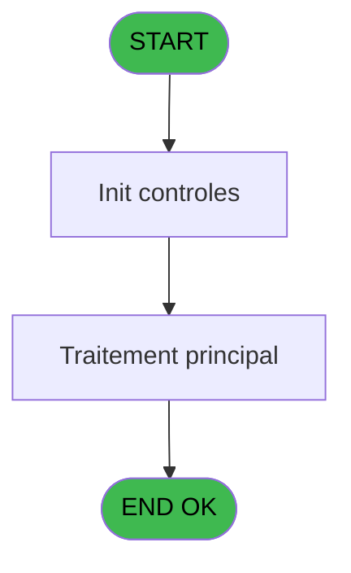
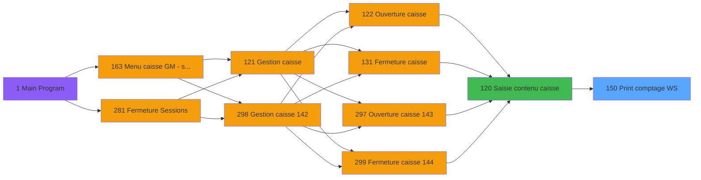
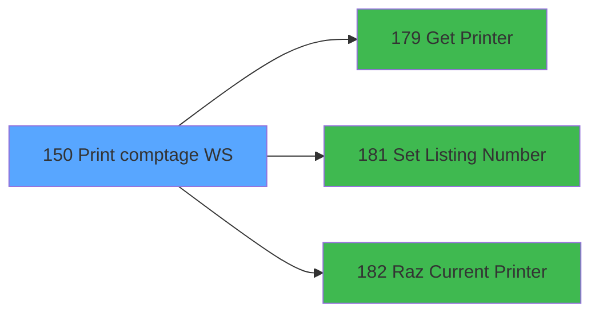

# ADH IDE 150 - Print comptage WS

> **Analyse**: Phases 1-4 2026-02-07 03:50 -> 03:33 (23h42min) | Assemblage 03:33
> **Pipeline**: V7.2 Enrichi
> **Structure**: 4 onglets (Resume | Ecrans | Donnees | Connexions)

<!-- TAB:Resume -->

## 1. FICHE D'IDENTITE

| Attribut | Valeur |
|----------|--------|
| Projet | ADH |
| IDE Position | 150 |
| Nom Programme | Print comptage WS |
| Fichier source | `Prg_150.xml` |
| Dossier IDE | Impression |
| Taches | 11 (1 ecrans visibles) |
| Tables modifiees | 0 |
| Programmes appeles | 3 |
| Complexite | **BASSE** (score 12/100) |

## 2. DESCRIPTION FONCTIONNELLE

ADH IDE 150 est un utilitaire de **finalisation de devises** (35 lignes, une seule tâche) qui calcule les totaux finaux par devise en appliquant une formule mathématique simple (`[I]-[O]+[U]`) sur des paramètres de session. Le programme fonctionne en lecture seule sur la table 232 (`gestion_devise_session`) – il ne modifie aucune donnée persistante. Il reçoit ses données d'entrée via des variables (code devise, mode paiement, quantité finale) stockées dans la table de session, ce qui en fait une fonction de calcul pur déclenchée par la couche WebService (WS) lors des workflows de clôture de caisse.

Le programme opère en isolation totale sans appels externes ni conditions logiques – il exécute inconditionnellement sa formule de réconciliation de caisse (`Final = Initial - Outflow + Adjustments`) pour chaque devise traitée. La présence de quatre constantes littérales (codes 'V', 'A', 'F', 'C') et une référence à la variable globale VG1 indique un codage catégorique des types de devise. Son rôle dans la chaîne d'IDE 120 (Saisie contenu caisse) est de servir de **calculatrice en lecture seule** – il alimente les résultats de calcul vers IDE 142 (Devise update session WS) qui persiste ensuite les changements d'état.

⚠️ **Important**: Il existe une **discordance de nommage** – ADH IDE 120 référence IDE 150 comme "Print comptage WS" (impression), mais la spécification actuelle décrit une **finalisation numérique de devises**, non un programme d'impression. Vérifiez si la vraie "impression de comptage" est **VIL IDE 104** ou s'il s'agit d'une synchronisation manquée entre l'arborescence Magic et les spécifications générées.

## 3. BLOCS FONCTIONNELS

### 3.1 Traitement (9 taches)

Traitements internes.

---

#### 150 - Veuillez patienter ... [[ECRAN]](#ecran-t1)

**Role** : Tache d'orchestration : point d'entree du programme (9 sous-taches). Coordonne l'enchainement des traitements.
**Ecran** : 422 x 56 DLU (MDI) | [Voir mockup](#ecran-t1)

8 sous-taches directes

| Tache | Nom | Bloc |
|-------|-----|------|
| [150.1.1](#t3) | Veuillez patienter ... **[[ECRAN]](#ecran-t3)** | Traitement |
| [150.1.1.1](#t4) | CARTES | Traitement |
| [150.1.1.2](#t5) | OD et DEV | Traitement |
| [150.1.1.2.1](#t6) | Detail devise | Traitement |
| [150.2.1](#t8) | Veuillez patienter ... **[[ECRAN]](#ecran-t8)** | Traitement |
| [150.2.1.1](#t9) | CARTES | Traitement |
| [150.2.1.2](#t10) | OD et DEV | Traitement |
| [150.2.1.2.1](#t11) | Detail devise | Traitement |

**Delegue a** : [Set Listing Number (IDE 181)](ADH-IDE-181.md)

---

#### 150.1.1 - Veuillez patienter ... [[ECRAN]](#ecran-t3)

**Role** : Traitement : Veuillez patienter ....
**Ecran** : 424 x 56 DLU (MDI) | [Voir mockup](#ecran-t3)
**Delegue a** : [Set Listing Number (IDE 181)](ADH-IDE-181.md)

---

#### 150.1.1.1 - CARTES

**Role** : Traitement : CARTES.
**Delegue a** : [Set Listing Number (IDE 181)](ADH-IDE-181.md)

---

#### 150.1.1.2 - OD et DEV

**Role** : Traitement : OD et DEV.
**Delegue a** : [Set Listing Number (IDE 181)](ADH-IDE-181.md)

---

#### 150.1.1.2.1 - Detail devise

**Role** : Traitement : Detail devise.
**Variables liees** : EO (Param Devise locale)
**Delegue a** : [Set Listing Number (IDE 181)](ADH-IDE-181.md)

---

#### 150.2.1 - Veuillez patienter ... [[ECRAN]](#ecran-t8)

**Role** : Traitement : Veuillez patienter ....
**Ecran** : 424 x 56 DLU (MDI) | [Voir mockup](#ecran-t8)
**Delegue a** : [Set Listing Number (IDE 181)](ADH-IDE-181.md)

---

#### 150.2.1.1 - CARTES

**Role** : Traitement : CARTES.
**Delegue a** : [Set Listing Number (IDE 181)](ADH-IDE-181.md)

---

#### 150.2.1.2 - OD et DEV

**Role** : Traitement : OD et DEV.
**Delegue a** : [Set Listing Number (IDE 181)](ADH-IDE-181.md)

---

#### 150.2.1.2.1 - Detail devise

**Role** : Traitement : Detail devise.
**Variables liees** : EO (Param Devise locale)
**Delegue a** : [Set Listing Number (IDE 181)](ADH-IDE-181.md)

### 3.2 Impression (2 taches)

Generation des documents et tickets.

---

#### 150.1 - Printer 9 [[ECRAN]](#ecran-t2)

**Role** : Generation du document : Printer 9.
**Ecran** : 424 x 56 DLU (MDI) | [Voir mockup](#ecran-t2)
**Delegue a** : [Get Printer (IDE 179)](ADH-IDE-179.md), [Raz Current Printer (IDE 182)](ADH-IDE-182.md)

---

#### 150.2 - Printer 9 [[ECRAN]](#ecran-t7)

**Role** : Generation du document : Printer 9.
**Ecran** : 424 x 56 DLU (MDI) | [Voir mockup](#ecran-t7)
**Delegue a** : [Get Printer (IDE 179)](ADH-IDE-179.md), [Raz Current Printer (IDE 182)](ADH-IDE-182.md)

## 5. REGLES METIER

2 regles identifiees:

### Impression (2 regles)

#### [RM-001] Verification que l'imprimante courante est la n1

| Element | Detail |
|---------|--------|
| **Condition** | `GetParam ('CURRENTPRINTERNUM')=1` |
| **Si vrai** | Action si CURRENTPRINTERNUM = 1 |
| **Expression source** | Expression 4 : `GetParam ('CURRENTPRINTERNUM')=1` |
| **Exemple** | Si GetParam ('CURRENTPRINTERNUM')=1 → Action si CURRENTPRINTERNUM = 1 |
| **Impact** | [150.1 - Printer 9](#t2) |

#### [RM-002] Verification que l'imprimante courante est la n9

| Element | Detail |
|---------|--------|
| **Condition** | `GetParam ('CURRENTPRINTERNUM')=9` |
| **Si vrai** | Action si CURRENTPRINTERNUM = 9 |
| **Expression source** | Expression 5 : `GetParam ('CURRENTPRINTERNUM')=9` |
| **Exemple** | Si GetParam ('CURRENTPRINTERNUM')=9 → Action si CURRENTPRINTERNUM = 9 |
| **Impact** | [150.1 - Printer 9](#t2) |

## 6. CONTEXTE

- **Appele par**: [Saisie contenu caisse (IDE 120)](ADH-IDE-120.md)
- **Appelle**: 3 programmes | **Tables**: 4 (W:0 R:4 L:0) | **Taches**: 11 | **Expressions**: 6

<!-- TAB:Ecrans -->

## 8. ECRANS

### 8.1 Forms visibles (1 / 11)

| # | Position | Tache | Nom | Type | Largeur | Hauteur | Bloc |
|---|----------|-------|-----|------|---------|---------|------|
| 1 | 150 | 150 | Veuillez patienter ... | MDI | 422 | 56 | Traitement |

### 8.2 Mockups Ecrans

---

#### 150 - Veuillez patienter ...
**Tache** : [150](#t1) | **Type** : MDI | **Dimensions** : 422 x 56 DLU
**Bloc** : Traitement | **Titre IDE** : Veuillez patienter ...

<!-- FORM-DATA:
{
    "width":  422,
    "vFactor":  8,
    "type":  "MDI",
    "hFactor":  8,
    "controls":  [
                     {
                         "x":  0,
                         "type":  "label",
                         "var":  "",
                         "y":  0,
                         "w":  423,
                         "fmt":  "",
                         "name":  "",
                         "h":  29,
                         "color":  "",
                         "text":  "",
                         "parent":  null
                     },
                     {
                         "x":  120,
                         "type":  "label",
                         "var":  "",
                         "y":  10,
                         "w":  221,
                         "fmt":  "",
                         "name":  "",
                         "h":  8,
                         "color":  "7",
                         "text":  "Impression en cours ...",
                         "parent":  null
                     },
                     {
                         "x":  0,
                         "type":  "label",
                         "var":  "",
                         "y":  29,
                         "w":  423,
                         "fmt":  "",
                         "name":  "",
                         "h":  27,
                         "color":  "",
                         "text":  "",
                         "parent":  null
                     },
                     {
                         "x":  114,
                         "type":  "label",
                         "var":  "",
                         "y":  38,
                         "w":  203,
                         "fmt":  "",
                         "name":  "",
                         "h":  8,
                         "color":  "",
                         "text":  "Edition reçu change",
                         "parent":  null
                     },
                     {
                         "x":  4,
                         "type":  "image",
                         "var":  "",
                         "y":  2,
                         "w":  72,
                         "fmt":  "",
                         "name":  "",
                         "h":  25,
                         "color":  "",
                         "text":  "",
                         "parent":  null
                     }
                 ],
    "taskId":  "150",
    "height":  56
}
-->

## 9. NAVIGATION

Ecran unique: **Veuillez patienter ...**

### 9.3 Structure hierarchique (11 taches)

| Position | Tache | Type | Dimensions | Bloc |
|----------|-------|------|------------|------|
| **150.1** | [**Veuillez patienter ...** (150)](#t1) [mockup](#ecran-t1) | MDI | 422x56 | Traitement |
| 150.1.1 | [Veuillez patienter ... (150.1.1)](#t3) [mockup](#ecran-t3) | MDI | 424x56 | |
| 150.1.2 | [CARTES (150.1.1.1)](#t4) | MDI | - | |
| 150.1.3 | [OD et DEV (150.1.1.2)](#t5) | MDI | - | |
| 150.1.4 | [Detail devise (150.1.1.2.1)](#t6) | MDI | - | |
| 150.1.5 | [Veuillez patienter ... (150.2.1)](#t8) [mockup](#ecran-t8) | MDI | 424x56 | |
| 150.1.6 | [CARTES (150.2.1.1)](#t9) | MDI | - | |
| 150.1.7 | [OD et DEV (150.2.1.2)](#t10) | MDI | - | |
| 150.1.8 | [Detail devise (150.2.1.2.1)](#t11) | MDI | - | |
| **150.2** | [**Printer 9** (150.1)](#t2) [mockup](#ecran-t2) | MDI | 424x56 | Impression |
| 150.2.1 | [Printer 9 (150.2)](#t7) [mockup](#ecran-t7) | MDI | 424x56 | |

### 9.4 Algorigramme

> **Legende**: Vert = START/END OK | Rouge = END KO | Bleu = Decisions
> *Algorigramme auto-genere. Utiliser `/algorigramme` pour une synthese metier detaillee.*

<!-- TAB:Donnees -->

## 10. TABLES

### Tables utilisees (4)

| ID | Nom | Description | Type | R | W | L | Usages |
|----|-----|-------------|------|---|---|---|--------|
| 491 | soldes_par_mop |  | TMP | R |   |   | 4 |
| 492 | edition_tableau_recap |  | DB | R |   |   | 2 |
| 493 | edition_ticket |  | TMP | R |   |   | 2 |
| 69 | initialisation___ini |  | DB | R |   |   | 1 |

### Colonnes par table (1 / 4 tables avec colonnes identifiees)

Table 491 - soldes_par_mop (R) - 4 usages

*Table utilisee uniquement en Link ou aucune colonne Real identifiee dans le DataView.*

Table 492 - edition_tableau_recap (R) - 2 usages

*Table utilisee uniquement en Link ou aucune colonne Real identifiee dans le DataView.*

Table 493 - edition_ticket (R) - 2 usages

*Table utilisee uniquement en Link ou aucune colonne Real identifiee dans le DataView.*

Table 69 - initialisation___ini (R) - 1 usages

| Lettre | Variable | Acces | Type |
|--------|----------|-------|------|
| A | Param societe | R | Alpha |
| B | Param Devise locale | R | Alpha |
| C | Param Masque | R | Alpha |
| D | Param quand | R | Alpha |
| E | Param chrono session | R | Numeric |
| F | W0 en-tête ? | R | Alpha |
| G | W0 fin tâche | R | Alpha |
| H | W0 copies | R | Numeric |

## 11. VARIABLES

### 11.1 Variables de travail (3)

Variables internes au programme.

| Lettre | Nom | Type | Usage dans |
|--------|-----|------|-----------|
| ES | W0 en-tête ? | Alpha | - |
| ET | W0 fin tâche | Alpha | - |
| EU | W0 copies | Numeric | - |

### 11.2 Autres (5)

Variables diverses.

| Lettre | Nom | Type | Usage dans |
|--------|-----|------|-----------|
| EN | Param societe | Alpha | - |
| EO | Param Devise locale | Alpha | - |
| EP | Param Masque | Alpha | - |
| EQ | Param quand | Alpha | - |
| ER | Param chrono session | Numeric | - |

## 12. EXPRESSIONS

**6 / 6 expressions decodees (100%)**

### 12.1 Repartition par type

| Type | Expressions | Regles |
|------|-------------|--------|
| CONDITION | 2 | 2 |
| CONSTANTE | 1 | 0 |
| OTHER | 2 | 0 |
| CAST_LOGIQUE | 1 | 0 |

### 12.2 Expressions cles par type

#### CONDITION (2 expressions)

| Type | IDE | Expression | Regle |
|------|-----|------------|-------|
| CONDITION | 5 | `GetParam ('CURRENTPRINTERNUM')=9` | [RM-002](#rm-RM-002) |
| CONDITION | 4 | `GetParam ('CURRENTPRINTERNUM')=1` | [RM-001](#rm-RM-001) |

#### CONSTANTE (1 expressions)

| Type | IDE | Expression | Regle |
|------|-----|------------|-------|
| CONSTANTE | 1 | `35` | - |

#### OTHER (2 expressions)

| Type | IDE | Expression | Regle |
|------|-----|------------|-------|
| OTHER | 3 | `SetCrsr (1)` | - |
| OTHER | 2 | `SetCrsr (2)` | - |

#### CAST_LOGIQUE (1 expressions)

| Type | IDE | Expression | Regle |
|------|-----|------------|-------|
| CAST_LOGIQUE | 6 | `'TRUE'LOG` | - |

<!-- TAB:Connexions -->

## 13. GRAPHE D'APPELS

### 13.1 Chaine depuis Main (Callers)

Main -> ... -> [Saisie contenu caisse (IDE 120)](ADH-IDE-120.md) -> **Print comptage WS (IDE 150)**

### 13.2 Callers

| IDE | Nom Programme | Nb Appels |
|-----|---------------|-----------|
| [120](ADH-IDE-120.md) | Saisie contenu caisse | 1 |

### 13.3 Callees (programmes appeles)

### 13.4 Detail Callees avec contexte

| IDE | Nom Programme | Appels | Contexte |
|-----|---------------|--------|----------|
| [179](ADH-IDE-179.md) | Get Printer | 1 | Impression ticket/document |
| [181](ADH-IDE-181.md) | Set Listing Number | 1 | Configuration impression |
| [182](ADH-IDE-182.md) | Raz Current Printer | 1 | Impression ticket/document |

## 14. RECOMMANDATIONS MIGRATION

### 14.1 Profil du programme

| Metrique | Valeur | Impact migration |
|----------|--------|-----------------|
| Lignes de logique | 103 | Programme compact |
| Expressions | 6 | Peu de logique |
| Tables WRITE | 0 | Impact faible |
| Sous-programmes | 3 | Peu de dependances |
| Ecrans visibles | 1 | Ecran unique ou traitement batch |
| Code desactive | 0% (0 / 103) | Code sain |
| Regles metier | 2 | Quelques regles a preserver |

### 14.2 Plan de migration par bloc

#### Traitement (9 taches: 3 ecrans, 6 traitements)

- **Strategie** : Orchestrateur avec 3 ecrans (Razor/React) et 6 traitements backend (services).
- Les ecrans deviennent des composants UI, les traitements invisibles deviennent des services injectables.
- 3 sous-programme(s) a migrer ou a reutiliser depuis les services existants.
- Decomposer les taches en services unitaires testables.

#### Impression (2 taches: 2 ecrans, 0 traitement)

- **Strategie** : Templates HTML -> PDF via wkhtmltopdf ou Puppeteer.
- `PrintService` injectable avec choix imprimante

### 14.3 Dependances critiques

| Dependance | Type | Appels | Impact |
|------------|------|--------|--------|
| [Raz Current Printer (IDE 182)](ADH-IDE-182.md) | Sous-programme | 1x | Normale - Impression ticket/document |
| [Set Listing Number (IDE 181)](ADH-IDE-181.md) | Sous-programme | 1x | Normale - Configuration impression |
| [Get Printer (IDE 179)](ADH-IDE-179.md) | Sous-programme | 1x | Normale - Impression ticket/document |

---
*Spec DETAILED generee par Pipeline V7.2 - 2026-02-08 03:35*
