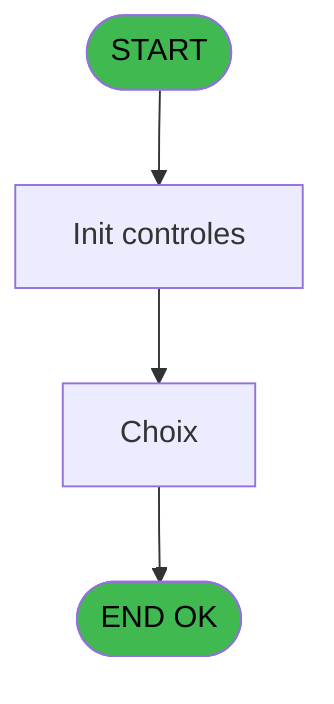
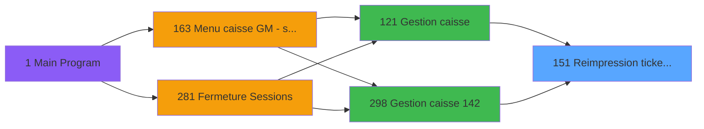
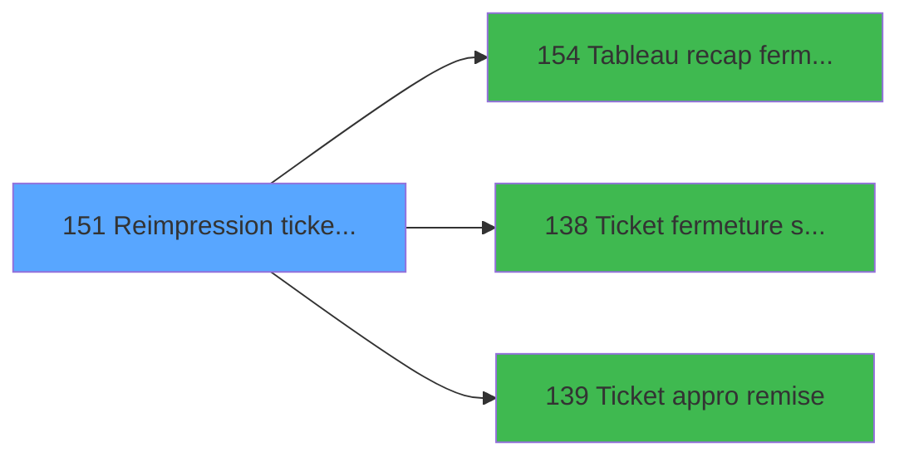

# ADH IDE 151 - Reimpression tickets fermeture

> **Analyse**: Phases 1-4 2026-02-07 03:50 -> 03:51 (27s) | Assemblage 03:51
> **Pipeline**: V7.2 Enrichi
> **Structure**: 4 onglets (Resume | Ecrans | Donnees | Connexions)

<!-- TAB:Resume -->

## 1. FICHE D'IDENTITE

| Attribut | Valeur |
|----------|--------|
| Projet | ADH |
| IDE Position | 151 |
| Nom Programme | Reimpression tickets fermeture |
| Fichier source | `Prg_151.xml` |
| Dossier IDE | Impression |
| Taches | 5 (1 ecrans visibles) |
| Tables modifiees | 0 |
| Programmes appeles | 3 |

## 2. DESCRIPTION FONCTIONNELLE

**Reimpression tickets fermeture** assure la gestion complete de ce processus, accessible depuis [Gestion caisse (IDE 121)](ADH-IDE-121.md), [Gestion caisse 142 (IDE 298)](ADH-IDE-298.md).

Le flux de traitement s'organise en **3 blocs fonctionnels** :

- **Traitement** (2 taches) : traitements metier divers
- **Impression** (2 taches) : generation de tickets et documents
- **Consultation** (1 tache) : ecrans de recherche, selection et consultation

Detail : phases du traitement

#### Phase 1 : Impression (2 taches)

- **151** - Reimpression tickets fermeture
- **151.4** - imprimer

Delegue a : [Ticket fermeture session (IDE 138)](ADH-IDE-138.md), [Ticket appro remise (IDE 139)](ADH-IDE-139.md)

#### Phase 2 : Traitement (2 taches)

- **151.1** - Dernière session
- **151.2** - parametres

Delegue a : [Tableau recap fermeture (IDE 154)](ADH-IDE-154.md)

#### Phase 3 : Consultation (1 tache)

- **151.3** - Choix **[[ECRAN]](#ecran-t4)**

## 3. BLOCS FONCTIONNELS

### 3.1 Impression (2 taches)

Generation des documents et tickets.

---

#### 151 - Reimpression tickets fermeture

**Role** : Generation du document : Reimpression tickets fermeture.
**Variables liees** : U (P2 montant ecart fermeture)
**Delegue a** : [Ticket fermeture session (IDE 138)](ADH-IDE-138.md), [Ticket appro remise (IDE 139)](ADH-IDE-139.md)

---

#### 151.4 - imprimer

**Role** : Configuration/parametrage : imprimer.
**Delegue a** : [Ticket fermeture session (IDE 138)](ADH-IDE-138.md), [Ticket appro remise (IDE 139)](ADH-IDE-139.md)

### 3.2 Traitement (2 taches)

Traitements internes.

---

#### 151.1 - Dernière session

**Role** : Traitement : Dernière session.
**Variables liees** : I (P0 session), W (date fin session)
**Delegue a** : [Tableau recap fermeture (IDE 154)](ADH-IDE-154.md)

---

#### 151.2 - parametres

**Role** : Traitement : parametres.
**Delegue a** : [Tableau recap fermeture (IDE 154)](ADH-IDE-154.md)

### 3.3 Consultation (1 tache)

Ecrans de recherche et consultation.

---

#### 151.3 - Choix [[ECRAN]](#ecran-t4)

**Role** : Selection par l'operateur : Choix.
**Ecran** : 595 x 151 DLU (MDI) | [Voir mockup](#ecran-t4)

## 5. REGLES METIER

*(Aucune regle metier identifiee)*

## 6. CONTEXTE

- **Appele par**: [Gestion caisse (IDE 121)](ADH-IDE-121.md), [Gestion caisse 142 (IDE 298)](ADH-IDE-298.md)
- **Appelle**: 3 programmes | **Tables**: 2 (W:0 R:2 L:0) | **Taches**: 5 | **Expressions**: 6

<!-- TAB:Ecrans -->

## 8. ECRANS

### 8.1 Forms visibles (1 / 5)

| # | Position | Tache | Nom | Type | Largeur | Hauteur | Bloc |
|---|----------|-------|-----|------|---------|---------|------|
| 1 | 151.3 | 151.3 | Choix | MDI | 595 | 151 | Consultation |

### 8.2 Mockups Ecrans

---

#### 151.3 - Choix
**Tache** : [151.3](#t4) | **Type** : MDI | **Dimensions** : 595 x 151 DLU
**Bloc** : Consultation | **Titre IDE** : Choix

<!-- FORM-DATA:
{
    "width":  595,
    "vFactor":  8,
    "type":  "MDI",
    "hFactor":  8,
    "controls":  [
                     {
                         "x":  0,
                         "type":  "label",
                         "var":  "",
                         "y":  0,
                         "w":  595,
                         "fmt":  "",
                         "name":  "",
                         "h":  21,
                         "color":  "",
                         "text":  "",
                         "parent":  null
                     },
                     {
                         "x":  142,
                         "type":  "label",
                         "var":  "",
                         "y":  51,
                         "w":  311,
                         "fmt":  "",
                         "name":  "",
                         "h":  49,
                         "color":  "",
                         "text":  "",
                         "parent":  null
                     },
                     {
                         "x":  0,
                         "type":  "label",
                         "var":  "",
                         "y":  127,
                         "w":  595,
                         "fmt":  "",
                         "name":  "",
                         "h":  24,
                         "color":  "",
                         "text":  "",
                         "parent":  null
                     },
                     {
                         "x":  153,
                         "type":  "checkbox",
                         "var":  "",
                         "y":  54,
                         "w":  280,
                         "fmt":  "",
                         "name":  "",
                         "h":  12,
                         "color":  "",
                         "text":  "ticket récapitulatif des opérations",
                         "parent":  4
                     },
                     {
                         "x":  235,
                         "type":  "radio",
                         "var":  "",
                         "y":  67,
                         "w":  107,
                         "fmt":  "",
                         "name":  "",
                         "h":  31,
                         "color":  "",
                         "text":  "Détaillée,Globale",
                         "parent":  4
                     },
                     {
                         "x":  327,
                         "type":  "edit",
                         "var":  "",
                         "y":  6,
                         "w":  259,
                         "fmt":  "WWW DD MMM YYYYT",
                         "name":  "",
                         "h":  8,
                         "color":  "",
                         "text":  "",
                         "parent":  null
                     },
                     {
                         "x":  7,
                         "type":  "button",
                         "var":  "",
                         "y":  130,
                         "w":  200,
                         "fmt":  "\u0026Quitter",
                         "name":  "",
                         "h":  18,
                         "color":  "",
                         "text":  "",
                         "parent":  null
                     },
                     {
                         "x":  386,
                         "type":  "button",
                         "var":  "",
                         "y":  130,
                         "w":  200,
                         "fmt":  "\u0026Imprimer",
                         "name":  "",
                         "h":  18,
                         "color":  "",
                         "text":  "",
                         "parent":  null
                     },
                     {
                         "x":  7,
                         "type":  "edit",
                         "var":  "",
                         "y":  6,
                         "w":  248,
                         "fmt":  "30",
                         "name":  "",
                         "h":  8,
                         "color":  "",
                         "text":  "",
                         "parent":  null
                     }
                 ],
    "taskId":  "151.3",
    "height":  151
}
-->

<strong>Champs : 3 champs</strong>

| Pos (x,y) | Nom | Variable | Type |
|-----------|-----|----------|------|
| 153,54 | ticket récapitulatif des opérations | - | checkbox |
| 327,6 | WWW DD MMM YYYYT | - | edit |
| 7,6 | 30 | - | edit |

<strong>Boutons : 2 boutons</strong>

| Bouton | Pos (x,y) | Action |
|--------|-----------|--------|
| Quitter | 7,130 | Quitte le programme |
| Imprimer | 386,130 | Lance l'impression |

## 9. NAVIGATION

Ecran unique: **Choix**

### 9.3 Structure hierarchique (5 taches)

| Position | Tache | Type | Dimensions | Bloc |
|----------|-------|------|------------|------|
| **151.1** | [**Reimpression tickets fermeture** (151)](#t1) | MDI | - | Impression |
| 151.1.1 | [imprimer (151.4)](#t5) | MDI | - | |
| **151.2** | [**Dernière session** (151.1)](#t2) | MDI | - | Traitement |
| 151.2.1 | [parametres (151.2)](#t3) | MDI | - | |
| **151.3** | [**Choix** (151.3)](#t4) [mockup](#ecran-t4) | MDI | 595x151 | Consultation |

### 9.4 Algorigramme

> **Legende**: Vert = START/END OK | Rouge = END KO | Bleu = Decisions
> *Algorigramme auto-genere. Utiliser `/algorigramme` pour une synthese metier detaillee.*

<!-- TAB:Donnees -->

## 10. TABLES

### Tables utilisees (2)

| ID | Nom | Description | Type | R | W | L | Usages |
|----|-----|-------------|------|---|---|---|--------|
| 246 | histo_sessions_caisse | Sessions de caisse | DB | R |   |   | 1 |
| 249 | histo_sessions_caisse_detail | Sessions de caisse | DB | R |   |   | 1 |

### Colonnes par table (1 / 2 tables avec colonnes identifiees)

Table 246 - histo_sessions_caisse (R) - 1 usages

*Table utilisee uniquement en Link ou aucune colonne Real identifiee dans le DataView.*

Table 249 - histo_sessions_caisse_detail (R) - 1 usages

| Lettre | Variable | Acces | Type |
|--------|----------|-------|------|
| F | Recap globale/detaillee | R | Alpha |

## 11. VARIABLES

### 11.1 Parametres entrants (9)

Variables recues du programme appelant ([Gestion caisse (IDE 121)](ADH-IDE-121.md)).

| Lettre | Nom | Type | Usage dans |
|--------|-----|------|-----------|
| A | P0 societe | Alpha | - |
| B | P0 nbre decimales | Numeric | - |
| C | P0 nom village | Alpha | - |
| D | P0 masque cumul | Alpha | - |
| E | P0 devise locale | Alpha | - |
| F | P0 uni/bi | Alpha | - |
| G | P0 village tai | Alpha | - |
| H | P0 date comptable | Date | - |
| I | P0 session | Numeric | - |

### 11.2 Autres (15)

Variables diverses.

| Lettre | Nom | Type | Usage dans |
|--------|-----|------|-----------|
| J | P1 quand | Alpha | - |
| K | P1 montant appro monnaie | Numeric | - |
| L | P1 montant appro produit | Numeric | - |
| M | P1 montant remise monnaie | Numeric | - |
| N | P1 montant remise cartes | Numeric | - |
| O | P1 montant remise chèques | Numeric | - |
| P | P1 montant remise od | Numeric | - |
| Q | P1 remise nbre devises | Numeric | - |
| R | P1 montant remise produits | Numeric | - |
| S | P2 montant appro monnaie final | Numeric | - |
| T | P2 montant remise monnaie final | Numeric | - |
| U | P2 montant ecart fermeture | Numeric | - |
| V | erreur | Logical | 1x refs |
| W | date fin session | Date | [151.1](#t2) |
| X | date comptable | Date | 1x refs |

Toutes les 24 variables (liste complete)

| Cat | Lettre | Nom Variable | Type |
|-----|--------|--------------|------|
| P0 | **A** | P0 societe | Alpha |
| P0 | **B** | P0 nbre decimales | Numeric |
| P0 | **C** | P0 nom village | Alpha |
| P0 | **D** | P0 masque cumul | Alpha |
| P0 | **E** | P0 devise locale | Alpha |
| P0 | **F** | P0 uni/bi | Alpha |
| P0 | **G** | P0 village tai | Alpha |
| P0 | **H** | P0 date comptable | Date |
| P0 | **I** | P0 session | Numeric |
| Autre | **J** | P1 quand | Alpha |
| Autre | **K** | P1 montant appro monnaie | Numeric |
| Autre | **L** | P1 montant appro produit | Numeric |
| Autre | **M** | P1 montant remise monnaie | Numeric |
| Autre | **N** | P1 montant remise cartes | Numeric |
| Autre | **O** | P1 montant remise chèques | Numeric |
| Autre | **P** | P1 montant remise od | Numeric |
| Autre | **Q** | P1 remise nbre devises | Numeric |
| Autre | **R** | P1 montant remise produits | Numeric |
| Autre | **S** | P2 montant appro monnaie final | Numeric |
| Autre | **T** | P2 montant remise monnaie final | Numeric |
| Autre | **U** | P2 montant ecart fermeture | Numeric |
| Autre | **V** | erreur | Logical |
| Autre | **W** | date fin session | Date |
| Autre | **X** | date comptable | Date |

## 12. EXPRESSIONS

**6 / 6 expressions decodees (100%)**

### 12.1 Repartition par type

| Type | Expressions | Regles |
|------|-------------|--------|
| CONDITION | 2 | 0 |
| CONSTANTE | 1 | 0 |
| CAST_LOGIQUE | 2 | 0 |
| NEGATION | 1 | 0 |

### 12.2 Expressions cles par type

#### CONDITION (2 expressions)

| Type | IDE | Expression | Regle |
|------|-----|------------|-------|
| CONDITION | 5 | `date comptable [X]<>'00/00/0000'DATE` | - |
| CONDITION | 4 | `date fin session [W]='00/00/0000'DATE` | - |

#### CONSTANTE (1 expressions)

| Type | IDE | Expression | Regle |
|------|-----|------------|-------|
| CONSTANTE | 1 | `'F'` | - |

#### CAST_LOGIQUE (2 expressions)

| Type | IDE | Expression | Regle |
|------|-----|------------|-------|
| CAST_LOGIQUE | 3 | `'TRUE'LOG` | - |
| CAST_LOGIQUE | 2 | `'FALSE'LOG` | - |

#### NEGATION (1 expressions)

| Type | IDE | Expression | Regle |
|------|-----|------------|-------|
| NEGATION | 6 | `NOT (erreur [V])` | - |

<!-- TAB:Connexions -->

## 13. GRAPHE D'APPELS

### 13.1 Chaine depuis Main (Callers)

Main -> ... -> [Gestion caisse (IDE 121)](ADH-IDE-121.md) -> **Reimpression tickets fermeture (IDE 151)**

Main -> ... -> [Gestion caisse 142 (IDE 298)](ADH-IDE-298.md) -> **Reimpression tickets fermeture (IDE 151)**

### 13.2 Callers

| IDE | Nom Programme | Nb Appels |
|-----|---------------|-----------|
| [121](ADH-IDE-121.md) | Gestion caisse | 1 |
| [298](ADH-IDE-298.md) | Gestion caisse 142 | 1 |

### 13.3 Callees (programmes appeles)

### 13.4 Detail Callees avec contexte

| IDE | Nom Programme | Appels | Contexte |
|-----|---------------|--------|----------|
| [154](ADH-IDE-154.md) | Tableau recap fermeture | 2 | Fermeture session |
| [138](ADH-IDE-138.md) | Ticket fermeture session | 1 | Impression ticket/document |
| [139](ADH-IDE-139.md) | Ticket appro remise | 1 | Impression ticket/document |

## 14. RECOMMANDATIONS MIGRATION

### 14.1 Profil du programme

| Metrique | Valeur | Impact migration |
|----------|--------|-----------------|
| Lignes de logique | 152 | Programme compact |
| Expressions | 6 | Peu de logique |
| Tables WRITE | 0 | Impact faible |
| Sous-programmes | 3 | Peu de dependances |
| Ecrans visibles | 1 | Ecran unique ou traitement batch |
| Code desactive | 0% (0 / 152) | Code sain |
| Regles metier | 0 | Pas de regle identifiee |

### 14.2 Plan de migration par bloc

#### Impression (2 taches: 0 ecran, 2 traitements)

- **Strategie** : Templates HTML -> PDF via wkhtmltopdf ou Puppeteer.
- `PrintService` injectable avec choix imprimante

#### Traitement (2 taches: 0 ecran, 2 traitements)

- **Strategie** : 2 service(s) backend injectable(s) (Domain Services).
- 3 sous-programme(s) a migrer ou a reutiliser depuis les services existants.
- Decomposer les taches en services unitaires testables.

#### Consultation (1 tache: 1 ecran, 0 traitement)

- **Strategie** : Composants de recherche/selection en modales.
- 1 ecran : Choix

### 14.3 Dependances critiques

| Dependance | Type | Appels | Impact |
|------------|------|--------|--------|
| [Tableau recap fermeture (IDE 154)](ADH-IDE-154.md) | Sous-programme | 2x | Haute - Fermeture session |
| [Ticket appro remise (IDE 139)](ADH-IDE-139.md) | Sous-programme | 1x | Normale - Impression ticket/document |
| [Ticket fermeture session (IDE 138)](ADH-IDE-138.md) | Sous-programme | 1x | Normale - Impression ticket/document |

---
*Spec DETAILED generee par Pipeline V7.2 - 2026-02-07 03:51*
