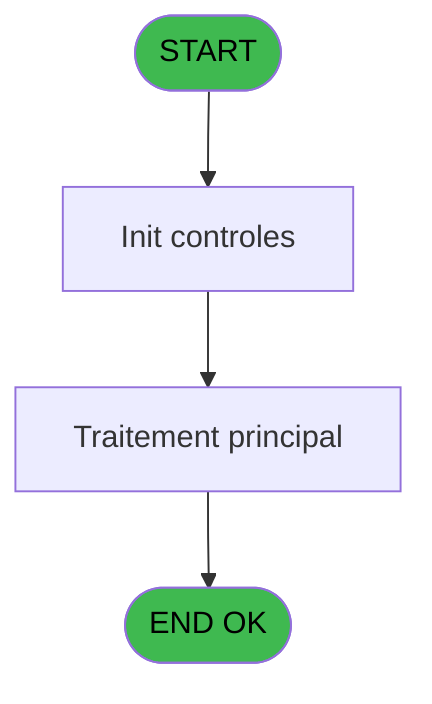
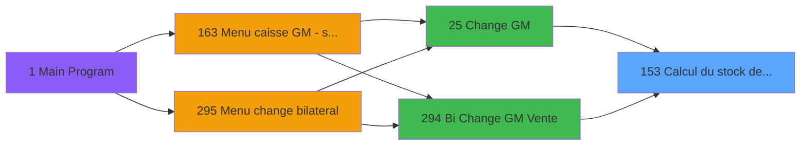
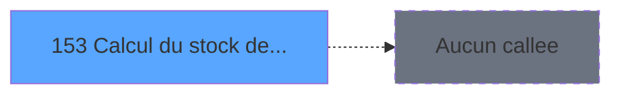

# ADH IDE 153 - Calcul du stock devise

> **Analyse**: Phases 1-4 2026-02-08 03:36 -> 03:36 (4s) | Assemblage 03:36
> **Pipeline**: V7.2 Enrichi
> **Structure**: 4 onglets (Resume | Ecrans | Donnees | Connexions)

<!-- TAB:Resume -->

## 1. FICHE D'IDENTITE

| Attribut | Valeur |
|----------|--------|
| Projet | ADH |
| IDE Position | 153 |
| Nom Programme | Calcul du stock devise |
| Fichier source | `Prg_153.xml` |
| Dossier IDE | Change |
| Taches | 7 (0 ecrans visibles) |
| Tables modifiees | 0 |
| Programmes appeles | 0 |
| Complexite | **BASSE** (score 7/100) |

## 2. DESCRIPTION FONCTIONNELLE

ADH IDE 153 gère le calcul des stocks de devises (quantités finales) dans les distributeurs Wine Shop (WS) en libre-service. C'est un programme de consultation sans modifications en base de données qui lit depuis la table `gestion_devise_session` en accédant à trois paramètres : le code devise, le mode de paiement et la quantité finale. Le cœur du calcul applique la formule `[I]-[O]+[U]` (Initial moins Outflow plus Uptake) pour déterminer la quantité résiduelle de devises disponibles, complété par des références à des variables globales et des constantes de classification ('V', 'A', 'F', 'C') pour différencier les types de paiement.

Appelé initialement depuis Change GM (IDE 25) et Bi Change GM Vente (IDE 294), le programme joue un rôle transactionnel dans la chaîne de gestion de caisse et de règlement des devises. Son statut d'orphelin potentiel suggère une intégration à vérifier via les composants ECF partagés (ADH.ecf) ou une utilisation indirecte à travers des mécanismes de dispatching dynamique typiques des systèmes Magic. Avec seulement 1 tâche et 35 lignes de logique contenant 8 expressions, c'est un programme de faible complexité (score 7/100) sans callees en aval.

La migration vers TypeScript ou C# serait directe : extraction des paramètres, requête simple sur la table de session devise, et application de la formule arithmétique dans une fonction de service. Le programme se prêterait bien à une containerisation en microservice REST pour gérer les calculs d'inventaire de devises dans une architecture moderne d'API de point de vente.

## 3. BLOCS FONCTIONNELS

## 5. REGLES METIER

*(Aucune regle metier identifiee dans les expressions)*

## 6. CONTEXTE

- **Appele par**: [Change GM (IDE 25)](ADH-IDE-25.md), [Bi  Change GM Vente (IDE 294)](ADH-IDE-294.md)
- **Appelle**: 0 programmes | **Tables**: 6 (W:0 R:5 L:1) | **Taches**: 7 | **Expressions**: 2

<!-- TAB:Ecrans -->

## 8. ECRANS

*(Programme sans ecran visible)*

## 9. NAVIGATION

### 9.3 Structure hierarchique (0 tache)

| Position | Tache | Type | Dimensions | Bloc |
|----------|-------|------|------------|------|

### 9.4 Algorigramme

> **Legende**: Vert = START/END OK | Rouge = END KO | Bleu = Decisions
> *Algorigramme auto-genere. Utiliser `/algorigramme` pour une synthese metier detaillee.*

<!-- TAB:Donnees -->

## 10. TABLES

### Tables utilisees (6)

| ID | Nom | Description | Type | R | W | L | Usages |
|----|-----|-------------|------|---|---|---|--------|
| 232 | gestion_devise_session | Sessions de caisse | DB | R |   |   | 2 |
| 249 | histo_sessions_caisse_detail | Sessions de caisse | DB | R |   |   | 1 |
| 147 | change_vente_____chg | Donnees de ventes | DB | R |   |   | 1 |
| 246 | histo_sessions_caisse | Sessions de caisse | DB | R |   |   | 1 |
| 44 | change___________chg |  | DB | R |   |   | 1 |
| 250 | histo_sessions_caisse_devise | Sessions de caisse | DB |   |   | L | 1 |

### Colonnes par table (2 / 5 tables avec colonnes identifiees)

Table 232 - gestion_devise_session (R) - 2 usages

| Lettre | Variable | Acces | Type |
|--------|----------|-------|------|
| EO | P0 code devise | R | Alpha |
| EQ | P0 quantite devise | R | Numeric |
| ER | v user session | R | Numeric |
| ES | v date debut session | R | Date |
| ET | v heure debut session | R | Time |

Table 249 - histo_sessions_caisse_detail (R) - 1 usages

*Table utilisee uniquement en Link ou aucune colonne Real identifiee dans le DataView.*

Table 147 - change_vente_____chg (R) - 1 usages

*Table utilisee uniquement en Link ou aucune colonne Real identifiee dans le DataView.*

Table 246 - histo_sessions_caisse (R) - 1 usages

*Table utilisee uniquement en Link ou aucune colonne Real identifiee dans le DataView.*

Table 44 - change___________chg (R) - 1 usages

*Table utilisee uniquement en Link ou aucune colonne Real identifiee dans le DataView.*

## 11. VARIABLES

### 11.1 Parametres entrants (4)

Variables recues du programme appelant ([Change GM (IDE 25)](ADH-IDE-25.md)).

| Lettre | Nom | Type | Usage dans |
|--------|-----|------|-----------|
| EN | P0 societe | Alpha | - |
| EO | P0 code devise | Alpha | 1x parametre entrant |
| EP | P0 MOP | Alpha | - |
| EQ | P0 quantite devise | Numeric | - |

### 11.2 Variables de session (3)

Variables persistantes pendant toute la session.

| Lettre | Nom | Type | Usage dans |
|--------|-----|------|-----------|
| ER | v user session | Numeric | - |
| ES | v date debut session | Date | - |
| ET | v heure debut session | Time | - |

## 12. EXPRESSIONS

**2 / 2 expressions decodees (100%)**

### 12.1 Repartition par type

| Type | Expressions | Regles |
|------|-------------|--------|
| REFERENCE_VG | 1 | 0 |
| OTHER | 1 | 0 |

### 12.2 Expressions cles par type

#### REFERENCE_VG (1 expressions)

| Type | IDE | Expression | Regle |
|------|-----|------------|-------|
| REFERENCE_VG | 1 | `VG1` | - |

#### OTHER (1 expressions)

| Type | IDE | Expression | Regle |
|------|-----|------------|-------|
| OTHER | 2 | `P0 code devise [B]` | - |

<!-- TAB:Connexions -->

## 13. GRAPHE D'APPELS

### 13.1 Chaine depuis Main (Callers)

Main -> ... -> [Change GM (IDE 25)](ADH-IDE-25.md) -> **Calcul du stock devise (IDE 153)**

Main -> ... -> [Bi  Change GM Vente (IDE 294)](ADH-IDE-294.md) -> **Calcul du stock devise (IDE 153)**

### 13.2 Callers

| IDE | Nom Programme | Nb Appels |
|-----|---------------|-----------|
| [25](ADH-IDE-25.md) | Change GM | 1 |
| [294](ADH-IDE-294.md) | Bi  Change GM Vente | 1 |

### 13.3 Callees (programmes appeles)

### 13.4 Detail Callees avec contexte

| IDE | Nom Programme | Appels | Contexte |
|-----|---------------|--------|----------|
| - | (aucun) | - | - |

## 14. RECOMMANDATIONS MIGRATION

### 14.1 Profil du programme

| Metrique | Valeur | Impact migration |
|----------|--------|-----------------|
| Lignes de logique | 99 | Programme compact |
| Expressions | 2 | Peu de logique |
| Tables WRITE | 0 | Impact faible |
| Sous-programmes | 0 | Peu de dependances |
| Ecrans visibles | 0 | Ecran unique ou traitement batch |
| Code desactive | 0% (0 / 99) | Code sain |
| Regles metier | 0 | Pas de regle identifiee |

### 14.2 Plan de migration par bloc

### 14.3 Dependances critiques

| Dependance | Type | Appels | Impact |
|------------|------|--------|--------|

---
*Spec DETAILED generee par Pipeline V7.2 - 2026-02-08 03:38*
