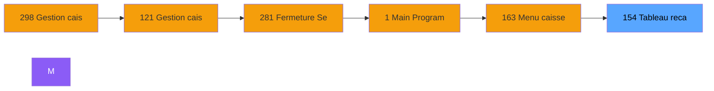
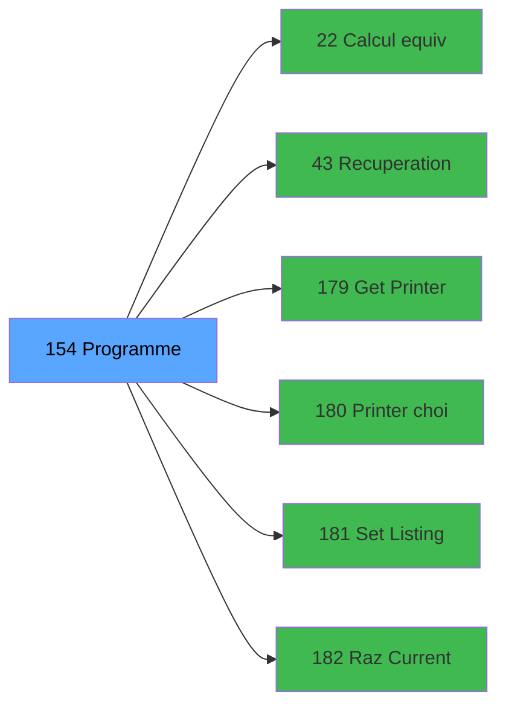

# ADH IDE 154 - Tableau recap fermeture

> **Version spec**: 3.5
> **Analyse**: 2026-01-27 17:57
> **Source**: `Prg_XXX.xml`

---

<!-- TAB:Fonctionnel -->

## SPECIFICATION FONCTIONNELLE

### 1.1 Objectif metier

| Element | Description |
|---------|-------------|
| **Qui** | Operateur |
| **Quoi** | Tableau recap fermeture
 |
| **Pourquoi** | A documenter |
| **Declencheur** | A identifier |

### 1.2 Regles metier

| Code | Regle | Condition |
|------|-------|-----------|
| RM-001 | A documenter | - |

### 1.3 Flux utilisateur

1. Demarrage programme
2. Traitement principal
3. Fin programme

### 1.4 Cas d'erreur

| Erreur | Comportement |
|--------|--------------|
| - | A documenter |

---

<!-- TAB:Technique -->

## SPECIFICATION TECHNIQUE

### 2.1 Identification

| Attribut | Valeur |
|----------|--------|
| **Format IDE** | ADH IDE 154 |
| **Description** | Tableau recap fermeture
 |
| **Module** | ADH |

### 2.2 Tables

| # | Nom logique | Nom physique | Acces | Usage |
|---|-------------|--------------|-------|-------|
| 30 | gm-recherche_____gmr | `cafil008_dat` | R | 2x |
| 31 | gm-complet_______gmc | `cafil009_dat` | R | 6x |
| 44 | change___________chg | `cafil022_dat` | L | 4x |
| 50 | moyens_reglement_mor | `cafil028_dat` | R | 2x |
| 67 | tables___________tab | `cafil045_dat` | L | 2x |
| 67 | tables___________tab | `cafil045_dat` | R | 4x |
| 70 | date_comptable___dat | `cafil048_dat` | R | 1x |
| 77 | articles_________art | `cafil055_dat` | R | 2x |
| 139 | moyens_reglement_mor | `cafil117_dat` | L | 2x |
| 147 | change_vente_____chg | `cafil125_dat` | L | 2x |
| 196 | gestion_article_session | `caisse_article` | R | 8x |
| 197 | articles_en_stock | `caisse_artstock` | L | 2x |
| 222 | comptage_caisse_histo | `caisse_compcais_histo2` | R | 4x |
| 232 | gestion_devise_session | `caisse_devise` | L | 6x |
| 232 | gestion_devise_session | `caisse_devise` | R | 2x |
| 247 | histo_sessions_caisse_article | `caisse_session_article` | L | 4x |
| 247 | histo_sessions_caisse_article | `caisse_session_article` | R | 6x |
| 249 | histo_sessions_caisse_detail | `caisse_session_detail` | R | 9x |
| 251 | histo_sessions_caisse_remise | `caisse_session_remise` | R | 4x |
| 266 | cc_comptable | `cccompta` | R | 3x |
| 324 | frais_change___fchg | `fraissurchange_dat` | L | 6x |
| 463 | heure_de_passage | `verifpool_dat` | L | 2x |
| 463 | heure_de_passage | `verifpool_dat` | R | 1x |
| 474 | comptage_caisse_devise | `%club_user%_caisse_compcais_devise` | L | 2x |
| 487 | saisie_remise_en_caisse | `%club_user%_caisse_remise` | L | 6x |
| 487 | saisie_remise_en_caisse | `%club_user%_caisse_remise` | R | 2x |
| 487 | saisie_remise_en_caisse | `%club_user%_caisse_remise` | **W** | 8x |
| 505 | pv_comptable | `%club_user%_pv_cafil18_dat` | R | 4x |
| 510 | pv_discounts | `%club_user%_pv_disctmp_dat` | L | 4x |
| 510 | pv_discounts | `%club_user%_pv_disctmp_dat` | R | 6x |
| 510 | pv_discounts | `%club_user%_pv_disctmp_dat` | **W** | 2x |
| 693 | devise_in | `devisein_par` | L | 2x |
| 693 | devise_in | `devisein_par` | R | 4x |
### 2.3 Parametres d'entree

| Variable | Nom | Type | Picture |
|----------|-----|------|---------|
| - | Aucun parametre | - | - |
### 2.4 Algorigramme

### 2.5 Expressions cles

| IDE | Expression | Commentaire |
|-----|------------|-------------|
| 1 | `Date ()` | - |
| 2 | `{32768,2}` | - |
| 3 | `151` | - |
| 4 | `Trim ({0,37})` | - |
| 5 | `'F'` | - |
| 6 | `{0,34}='F'` | - |
| 7 | `'a'` | - |
| 8 | `GetParam ('CURRENTPRINTERNUM')=1` | - |
| 9 | `GetParam ('CURRENTPRINTERNUM')=9` | - |
| 10 | `35` | - |
| 11 | `'TRUE'LOG` | - |
| 12 | `IF ({0,13}='D','TRUE'LOG,'FALSE'LOG)` | - |
| 13 | `{0,13}<>''` | - |

> **Total**: 13 expressions (affichees: 13)
### 2.6 Variables importantes

### 2.7 Statistiques

| Metrique | Valeur |
|----------|--------|
| **Taches** | 93 |
| **Lignes logique** | 1934 |
| **Lignes desactivees** | 0 |
---

<!-- TAB:Cartographie -->

## CARTOGRAPHIE APPLICATIVE

### 3.1 Chaine d'appels depuis Main

### 3.2 Callers directs

| IDE | Programme | Nb appels |
|-----|-----------|-----------|
| 131 | Fermeture caisse | 2 |
| 151 | Reimpression tickets fermeture | 2 |
| 299 | Fermeture caisse 144 | 2 |
### 3.3 Callees

| Niv | IDE | Programme | Nb appels |
|-----|-----|-----------|-----------|
| 1 | 22 | Calcul equivalent | 6 |
| 1 | 43 | Recuperation du titre | 1 |
| 1 | 179 | Get Printer | 1 |
| 1 | 180 | Printer choice | 1 |
| 1 | 181 | Set Listing Number | 1 |
| 1 | 182 | Raz Current Printer | 1 |
### 3.4 Verification orphelin

| Critere | Resultat |
|---------|----------|
| Callers actifs | A verifier |
| **Conclusion** | A analyser |

---

## HISTORIQUE

| Date | Action | Auteur |
|------|--------|--------|
| 2026-01-27 20:21 | **DATA V2** - Tables reelles, Expressions, Stats, CallChain | Script |
| 2026-01-27 19:47 | **DATA POPULATED** - Tables, Callgraph (13 expr) | Script |
| 2026-01-27 17:57 | **Upgrade V3.5** - TAB markers, Mermaid | Claude |

---

*Specification V3.5 - Format avec TAB markers et Mermaid*
