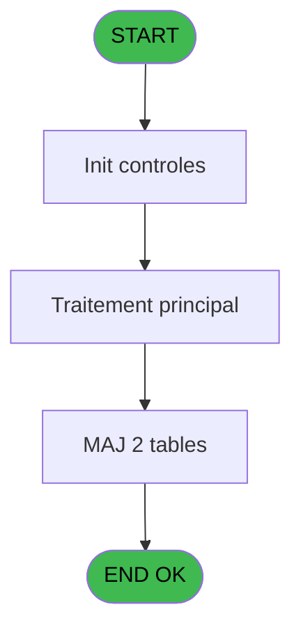
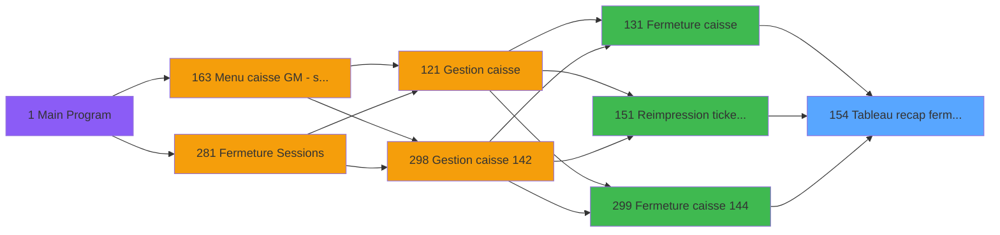
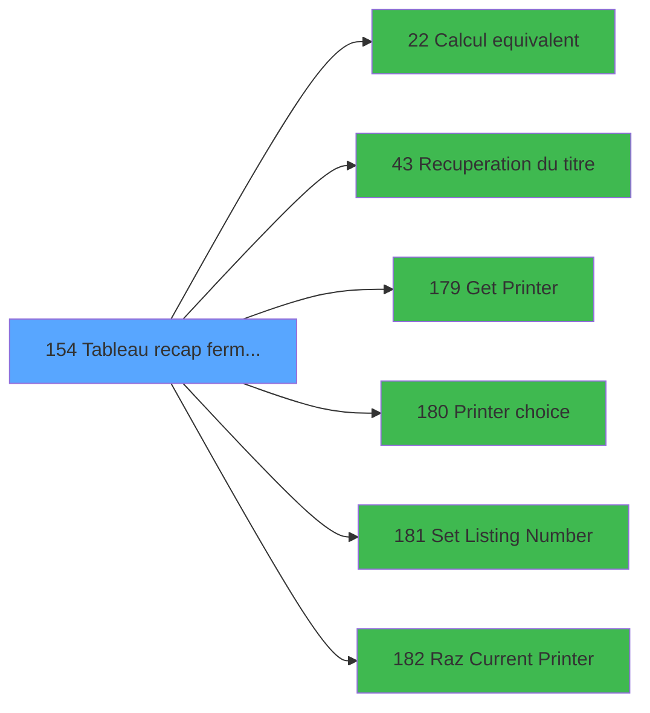

# ADH IDE 154 - Tableau recap fermeture

> **Analyse**: Phases 1-4 2026-02-08 03:38 -> 03:38 (4s) | Assemblage 03:38
> **Pipeline**: V7.2 Enrichi
> **Structure**: 4 onglets (Resume | Ecrans | Donnees | Connexions)

<!-- TAB:Resume -->

## 1. FICHE D'IDENTITE

| Attribut | Valeur |
|----------|--------|
| Projet | ADH |
| IDE Position | 154 |
| Nom Programme | Tableau recap fermeture |
| Fichier source | `Prg_154.xml` |
| Dossier IDE | General |
| Taches | 93 (0 ecrans visibles) |
| Tables modifiees | 2 |
| Programmes appeles | 6 |
| Complexite | **BASSE** (score 37/100) |

## 2. DESCRIPTION FONCTIONNELLE

ADH IDE 154 génère un tableau récapitulatif détaillé de la fermeture de caisse, affichant l'ensemble des mouvements financiers effectués durant la session. Ce programme consolide les données de caisse en colonnes organisées (montants par devise, écarts détectés, totaux cumulés) et prépare le document pour validation avant clôture définitive. Il utilise les calculs d'équivalents de change via IDE 22 pour harmoniser les montants en devise de base.

Le flux d'impression est centralisé : le programme récupère le titre de la session (IDE 43), sélectionne l'imprimante active via IDE 180, configure le numéro de listing (IDE 181) et initialise les paramètres d'impression (IDE 182). Ces appels séquentiels garantissent que le bon périphérique et le bon format sont utilisés avant génération du rapport.

Les données saisies durant la fermeture (remises, ajustements, discounts) sont persistées dans les tables `saisie_remise_en_caisse` et `pv_discounts`. Le tableau récapitulatif sert à la fois de document d'audit interne et de justificatif pour les opérations de clôture ultérieures, validant ainsi l'intégrité financière de la session avant archivage.

## 3. BLOCS FONCTIONNELS

## 5. REGLES METIER

5 regles identifiees:

### Autres (5 regles)

#### [RM-001] Condition: W0 fin tache [BH] egale 'F'

| Element | Detail |
|---------|--------|
| **Condition** | `W0 fin tache [BH]='F'` |
| **Si vrai** | Action si vrai |
| **Variables** | FU (W0 fin tache) |
| **Expression source** | Expression 6 : `W0 fin tache [BH]='F'` |
| **Exemple** | Si W0 fin tache [BH]='F' → Action si vrai |

#### [RM-002] Verification que l'imprimante courante est la n1

| Element | Detail |
|---------|--------|
| **Condition** | `GetParam ('CURRENTPRINTERNUM')=1` |
| **Si vrai** | Action si CURRENTPRINTERNUM = 1 |
| **Expression source** | Expression 8 : `GetParam ('CURRENTPRINTERNUM')=1` |
| **Exemple** | Si GetParam ('CURRENTPRINTERNUM')=1 → Action si CURRENTPRINTERNUM = 1 |

#### [RM-003] Verification que l'imprimante courante est la n9

| Element | Detail |
|---------|--------|
| **Condition** | `GetParam ('CURRENTPRINTERNUM')=9` |
| **Si vrai** | Action si CURRENTPRINTERNUM = 9 |
| **Expression source** | Expression 9 : `GetParam ('CURRENTPRINTERNUM')=9` |
| **Exemple** | Si GetParam ('CURRENTPRINTERNUM')=9 → Action si CURRENTPRINTERNUM = 9 |

#### [RM-004] Condition toujours vraie (flag actif)

| Element | Detail |
|---------|--------|
| **Condition** | `P0 reimpression D/G [M]='D'` |
| **Si vrai** | 'TRUE'LOG |
| **Si faux** | 'FALSE'LOG) |
| **Variables** | EZ (P0 reimpression D/G) |
| **Expression source** | Expression 12 : `IF (P0 reimpression D/G [M]='D','TRUE'LOG,'FALSE'LOG)` |
| **Exemple** | Si P0 reimpression D/G [M]='D' → 'TRUE'LOG. Sinon → 'FALSE'LOG) |

#### [RM-005] Condition: P0 reimpression D/G [M] different de

| Element | Detail |
|---------|--------|
| **Condition** | `P0 reimpression D/G [M]<>''` |
| **Si vrai** | Action si vrai |
| **Variables** | EZ (P0 reimpression D/G) |
| **Expression source** | Expression 13 : `P0 reimpression D/G [M]<>''` |
| **Exemple** | Si P0 reimpression D/G [M]<>'' → Action si vrai |

## 6. CONTEXTE

- **Appele par**: [Fermeture caisse (IDE 131)](ADH-IDE-131.md), [Reimpression tickets fermeture (IDE 151)](ADH-IDE-151.md), [Fermeture caisse 144 (IDE 299)](ADH-IDE-299.md)
- **Appelle**: 6 programmes | **Tables**: 24 (W:2 R:18 L:13) | **Taches**: 93 | **Expressions**: 13

<!-- TAB:Ecrans -->

## 8. ECRANS

*(Programme sans ecran visible)*

## 9. NAVIGATION

### 9.3 Structure hierarchique (0 tache)

| Position | Tache | Type | Dimensions | Bloc |
|----------|-------|------|------------|------|

### 9.4 Algorigramme

> **Legende**: Vert = START/END OK | Rouge = END KO | Bleu = Decisions
> *Algorigramme auto-genere. Utiliser `/algorigramme` pour une synthese metier detaillee.*

<!-- TAB:Donnees -->

## 10. TABLES

### Tables utilisees (24)

| ID | Nom | Description | Type | R | W | L | Usages |
|----|-----|-------------|------|---|---|---|--------|
| 487 | saisie_remise_en_caisse | Sessions de caisse | TMP | R | **W** | L | 16 |
| 510 | pv_discounts |  | TMP | R | **W** | L | 12 |
| 247 | histo_sessions_caisse_article | Articles et stock | DB | R |   | L | 10 |
| 232 | gestion_devise_session | Sessions de caisse | DB | R |   | L | 8 |
| 67 | tables___________tab |  | DB | R |   | L | 6 |
| 693 | devise_in | Devises / taux de change | DB | R |   | L | 6 |
| 463 | heure_de_passage |  | DB | R |   | L | 3 |
| 249 | histo_sessions_caisse_detail | Sessions de caisse | DB | R |   |   | 9 |
| 196 | gestion_article_session | Articles et stock | DB | R |   |   | 8 |
| 31 | gm-complet_______gmc |  | DB | R |   |   | 6 |
| 505 | pv_comptable |  | TMP | R |   |   | 4 |
| 222 | comptage_caisse_histo | Sessions de caisse | DB | R |   |   | 4 |
| 251 | histo_sessions_caisse_remise | Sessions de caisse | DB | R |   |   | 4 |
| 266 | cc_comptable |  | DB | R |   |   | 3 |
| 77 | articles_________art | Articles et stock | DB | R |   |   | 2 |
| 30 | gm-recherche_____gmr | Index de recherche | DB | R |   |   | 2 |
| 50 | moyens_reglement_mor | Reglements / paiements | DB | R |   |   | 2 |
| 70 | date_comptable___dat |  | DB | R |   |   | 1 |
| 324 | frais_change___fchg |  | DB |   |   | L | 6 |
| 44 | change___________chg |  | DB |   |   | L | 4 |
| 147 | change_vente_____chg | Donnees de ventes | DB |   |   | L | 2 |
| 139 | moyens_reglement_mor | Reglements / paiements | DB |   |   | L | 2 |
| 197 | articles_en_stock | Articles et stock | DB |   |   | L | 2 |
| 474 | comptage_caisse_devise | Sessions de caisse | TMP |   |   | L | 2 |

### Colonnes par table (22 / 18 tables avec colonnes identifiees)

Table 487 - saisie_remise_en_caisse (R/**W**/L) - 16 usages

| Lettre | Variable | Acces | Type |
|--------|----------|-------|------|
| EW | Detail produit remise edite | W | Logical |
| EX | P0 montant remise monnaie final | W | Numeric |
| EY | Detail remise finale edite | W | Logical |

Table 510 - pv_discounts (R/**W**/L) - 12 usages

*Table utilisee uniquement en Link ou aucune colonne Real identifiee dans le DataView.*

Table 247 - histo_sessions_caisse_article (R/L) - 10 usages

| Lettre | Variable | Acces | Type |
|--------|----------|-------|------|
| EN | DernierChronoHisto | R | Numeric |
| EQ | Total articles | R | Numeric |

Table 232 - gestion_devise_session (R/L) - 8 usages

| Lettre | Variable | Acces | Type |
|--------|----------|-------|------|
| EN | Nbre devise ouverture | R | Numeric |
| EO | Nbre devise fermeture | R | Numeric |
| FO | P0 nbre devises calcule | R | Numeric |
| FY | W0 date debut session | R | Date |
| FZ | W0 heure debut session | R | Time |
| ER | P0 devise locale | R | Alpha |
| EV | P0 session | R | Numeric |
| FH | P0 nbre devises compte | R | Numeric |

Table 67 - tables___________tab (R/L) - 6 usages

| Lettre | Variable | Acces | Type |
|--------|----------|-------|------|
| A | RUPTURE DEV MOP | R | Alpha |
| B | CUM Qte Dev initial | R | Numeric |
| C | CUM Qte Dev final | R | Numeric |

Table 693 - devise_in (R/L) - 6 usages

| Lettre | Variable | Acces | Type |
|--------|----------|-------|------|
| A | EXISTE | R | Logical |
| B | Total general | R | Numeric |
| C | Total monnaie | R | Numeric |
| D | Total articles | R | Numeric |
| E | Total cartes | R | Numeric |
| F | Total chèques | R | Numeric |
| G | Total od | R | Numeric |
| H | cumul type avant detail | R | Numeric |
| I | Detail produit appro edite | R | Logical |
| J | Detail produit remise edite | R | Logical |
| K | Detail remise pendant edite | R | Logical |
| L | Detail remise finale edite | R | Logical |
| M | Detail change edite | R | Logical |
| N | dernier chrono appro type B | R | Numeric |
| O | Ecart ouverture | R | Numeric |

Table 463 - heure_de_passage (R/L) - 3 usages

| Lettre | Variable | Acces | Type |
|--------|----------|-------|------|
| FZ | W0 heure debut session | R | Time |

Table 249 - histo_sessions_caisse_detail (R) - 9 usages

| Lettre | Variable | Acces | Type |
|--------|----------|-------|------|
| EN | DernierChronoHisto | R | Numeric |
| FP | Edition detaillee | R | Logical |
| EU | cumul type avant detail | R | Numeric |
| EV | Detail produit appro edite | R | Logical |
| EW | Detail produit remise edite | R | Logical |
| EX | Detail remise pendant edite | R | Logical |
| EY | Detail remise finale edite | R | Logical |
| EZ | Detail change edite | R | Logical |

Table 196 - gestion_article_session (R) - 8 usages

| Lettre | Variable | Acces | Type |
|--------|----------|-------|------|
| FY | W0 date debut session | R | Date |
| FZ | W0 heure debut session | R | Time |
| EQ | Total articles | R | Numeric |
| EV | P0 session | R | Numeric |

Table 31 - gm-complet_______gmc (R) - 6 usages

| Lettre | Variable | Acces | Type |
|--------|----------|-------|------|
| A | W1 quantite | R | Numeric |
| B | W1 equivalent | R | Numeric |
| C | W1 nbre | R | Numeric |

Table 505 - pv_comptable (R) - 4 usages

| Lettre | Variable | Acces | Type |
|--------|----------|-------|------|
| FR | W0 date comptable | R | Date |
| EU | P0 date comptable | R | Date |

Table 222 - comptage_caisse_histo (R) - 4 usages

| Lettre | Variable | Acces | Type |
|--------|----------|-------|------|
| EN | DernierChronoHisto | R | Numeric |

Table 251 - histo_sessions_caisse_remise (R) - 4 usages

| Lettre | Variable | Acces | Type |
|--------|----------|-------|------|
| EN | DernierChronoHisto | R | Numeric |
| EW | Detail produit remise edite | R | Logical |
| EX | P0 montant remise monnaie final | R | Numeric |
| EY | Detail remise finale edite | R | Logical |

Table 266 - cc_comptable (R) - 3 usages

| Lettre | Variable | Acces | Type |
|--------|----------|-------|------|
| A | W1 cumul quantite | R | Numeric |
| B | W1 cumul montant | R | Numeric |
| C | W1 total montant | R | Numeric |
| D | W1 equivalent | R | Numeric |

Table 77 - articles_________art (R) - 2 usages

| Lettre | Variable | Acces | Type |
|--------|----------|-------|------|
| EQ | Total articles | R | Numeric |

Table 30 - gm-recherche_____gmr (R) - 2 usages

| Lettre | Variable | Acces | Type |
|--------|----------|-------|------|
| A | W1 sous total montant | R | Numeric |
| B | W1 total montant | R | Numeric |

Table 50 - moyens_reglement_mor (R) - 2 usages

| Lettre | Variable | Acces | Type |
|--------|----------|-------|------|
| A | RUPTURE DEV MOP | R | Alpha |
| B | CUM Qte Dev initial | R | Numeric |
| C | CUM Qte Dev final | R | Numeric |

Table 70 - date_comptable___dat (R) - 1 usages

| Lettre | Variable | Acces | Type |
|--------|----------|-------|------|
| FR | W0 date comptable | R | Date |
| FY | W0 date debut session | R | Date |
| EU | P0 date comptable | R | Date |

## 11. VARIABLES

### 11.1 Parametres entrants (28)

Variables recues du programme appelant ([Fermeture caisse (IDE 131)](ADH-IDE-131.md)).

| Lettre | Nom | Type | Usage dans |
|--------|-----|------|-----------|
| EN | P0 societe | Alpha | - |
| EO | P0 nbre decimales | Numeric | - |
| EP | P0 nom village | Alpha | - |
| EQ | P0 masque cumul | Alpha | - |
| ER | P0 devise locale | Alpha | - |
| ES | P0 Uni/Bilateral | Alpha | - |
| ET | P0 village TAI | Alpha | - |
| EU | P0 date comptable | Date | - |
| EV | P0 session | Numeric | - |
| EW | P0 montant apport coffre final | Numeric | - |
| EX | P0 montant remise monnaie final | Numeric | - |
| EY | P0 montant ecart fermeture | Numeric | - |
| EZ | P0 reimpression D/G | Alpha | 2x parametre entrant |
| FA | P0 editer recap dans ecart | Logical | - |
| FB | P0 montant compte total | Numeric | - |
| FC | P0 montant compte monnaie | Numeric | - |
| FD | P0 montant compte produit | Numeric | - |
| FE | P0 montant compte carte | Numeric | - |
| FF | P0 montant compte cheque | Numeric | - |
| FG | P0 montant compte od | Numeric | - |
| FH | P0 nbre devises compte | Numeric | - |
| FI | P0 montant calcule total | Numeric | - |
| FJ | P0 montant calcule monnaie | Numeric | - |
| FK | P0 montant calcule produit | Numeric | - |
| FL | P0 montant calcule carte | Numeric | - |
| FM | P0 montant calcule cheque | Numeric | - |
| FN | P0 montant calcule od | Numeric | - |
| FO | P0 nbre devises calcule | Numeric | - |

### 11.2 Variables de travail (10)

Variables internes au programme.

| Lettre | Nom | Type | Usage dans |
|--------|-----|------|-----------|
| FQ | W0 confirmation | Logical | - |
| FR | W0 date comptable | Date | - |
| FS | W0 change | Numeric | - |
| FT | W0 frais de change | Numeric | - |
| FU | W0 fin tache | Alpha | 1x calcul interne |
| FV | W0 Existe Carnet Bar | Logical | - |
| FW | W0 Existe TAI | Logical | - |
| FX | W0 titre | Alpha | 1x calcul interne |
| FY | W0 date debut session | Date | - |
| FZ | W0 heure debut session | Time | - |

### 11.3 Autres (1)

Variables diverses.

| Lettre | Nom | Type | Usage dans |
|--------|-----|------|-----------|
| FP | Edition detaillee | Logical | - |

Toutes les 39 variables (liste complete)

| Cat | Lettre | Nom Variable | Type |
|-----|--------|--------------|------|
| P0 | **EN** | P0 societe | Alpha |
| P0 | **EO** | P0 nbre decimales | Numeric |
| P0 | **EP** | P0 nom village | Alpha |
| P0 | **EQ** | P0 masque cumul | Alpha |
| P0 | **ER** | P0 devise locale | Alpha |
| P0 | **ES** | P0 Uni/Bilateral | Alpha |
| P0 | **ET** | P0 village TAI | Alpha |
| P0 | **EU** | P0 date comptable | Date |
| P0 | **EV** | P0 session | Numeric |
| P0 | **EW** | P0 montant apport coffre final | Numeric |
| P0 | **EX** | P0 montant remise monnaie final | Numeric |
| P0 | **EY** | P0 montant ecart fermeture | Numeric |
| P0 | **EZ** | P0 reimpression D/G | Alpha |
| P0 | **FA** | P0 editer recap dans ecart | Logical |
| P0 | **FB** | P0 montant compte total | Numeric |
| P0 | **FC** | P0 montant compte monnaie | Numeric |
| P0 | **FD** | P0 montant compte produit | Numeric |
| P0 | **FE** | P0 montant compte carte | Numeric |
| P0 | **FF** | P0 montant compte cheque | Numeric |
| P0 | **FG** | P0 montant compte od | Numeric |
| P0 | **FH** | P0 nbre devises compte | Numeric |
| P0 | **FI** | P0 montant calcule total | Numeric |
| P0 | **FJ** | P0 montant calcule monnaie | Numeric |
| P0 | **FK** | P0 montant calcule produit | Numeric |
| P0 | **FL** | P0 montant calcule carte | Numeric |
| P0 | **FM** | P0 montant calcule cheque | Numeric |
| P0 | **FN** | P0 montant calcule od | Numeric |
| P0 | **FO** | P0 nbre devises calcule | Numeric |
| W0 | **FQ** | W0 confirmation | Logical |
| W0 | **FR** | W0 date comptable | Date |
| W0 | **FS** | W0 change | Numeric |
| W0 | **FT** | W0 frais de change | Numeric |
| W0 | **FU** | W0 fin tache | Alpha |
| W0 | **FV** | W0 Existe Carnet Bar | Logical |
| W0 | **FW** | W0 Existe TAI | Logical |
| W0 | **FX** | W0 titre | Alpha |
| W0 | **FY** | W0 date debut session | Date |
| W0 | **FZ** | W0 heure debut session | Time |
| Autre | **FP** | Edition detaillee | Logical |

## 12. EXPRESSIONS

**13 / 13 expressions decodees (100%)**

### 12.1 Repartition par type

| Type | Expressions | Regles |
|------|-------------|--------|
| CONDITION | 4 | 4 |
| CAST_LOGIQUE | 2 | 5 |
| CONSTANTE | 4 | 0 |
| DATE | 1 | 0 |
| REFERENCE_VG | 1 | 0 |
| STRING | 1 | 0 |

### 12.2 Expressions cles par type

#### CONDITION (4 expressions)

| Type | IDE | Expression | Regle |
|------|-----|------------|-------|
| CONDITION | 9 | `GetParam ('CURRENTPRINTERNUM')=9` | [RM-003](#rm-RM-003) |
| CONDITION | 13 | `P0 reimpression D/G [M]<>''` | [RM-005](#rm-RM-005) |
| CONDITION | 6 | `W0 fin tache [BH]='F'` | [RM-001](#rm-RM-001) |
| CONDITION | 8 | `GetParam ('CURRENTPRINTERNUM')=1` | [RM-002](#rm-RM-002) |

#### CAST_LOGIQUE (2 expressions)

| Type | IDE | Expression | Regle |
|------|-----|------------|-------|
| CAST_LOGIQUE | 12 | `IF (P0 reimpression D/G [M]='D','TRUE'LOG,'FALSE'LOG)` | [RM-004](#rm-RM-004) |
| CAST_LOGIQUE | 11 | `'TRUE'LOG` | - |

#### CONSTANTE (4 expressions)

| Type | IDE | Expression | Regle |
|------|-----|------------|-------|
| CONSTANTE | 7 | `'a'` | - |
| CONSTANTE | 10 | `35` | - |
| CONSTANTE | 3 | `151` | - |
| CONSTANTE | 5 | `'F'` | - |

#### DATE (1 expressions)

| Type | IDE | Expression | Regle |
|------|-----|------------|-------|
| DATE | 1 | `Date ()` | - |

#### REFERENCE_VG (1 expressions)

| Type | IDE | Expression | Regle |
|------|-----|------------|-------|
| REFERENCE_VG | 2 | `VG2` | - |

#### STRING (1 expressions)

| Type | IDE | Expression | Regle |
|------|-----|------------|-------|
| STRING | 4 | `Trim (W0 titre [BK])` | - |

<!-- TAB:Connexions -->

## 13. GRAPHE D'APPELS

### 13.1 Chaine depuis Main (Callers)

Main -> ... -> [Fermeture caisse (IDE 131)](ADH-IDE-131.md) -> **Tableau recap fermeture (IDE 154)**

Main -> ... -> [Reimpression tickets fermeture (IDE 151)](ADH-IDE-151.md) -> **Tableau recap fermeture (IDE 154)**

Main -> ... -> [Fermeture caisse 144 (IDE 299)](ADH-IDE-299.md) -> **Tableau recap fermeture (IDE 154)**

### 13.2 Callers

| IDE | Nom Programme | Nb Appels |
|-----|---------------|-----------|
| [131](ADH-IDE-131.md) | Fermeture caisse | 2 |
| [151](ADH-IDE-151.md) | Reimpression tickets fermeture | 2 |
| [299](ADH-IDE-299.md) | Fermeture caisse 144 | 2 |

### 13.3 Callees (programmes appeles)

### 13.4 Detail Callees avec contexte

| IDE | Nom Programme | Appels | Contexte |
|-----|---------------|--------|----------|
| [22](ADH-IDE-22.md) | Calcul equivalent | 6 | Calcul de donnees |
| [43](ADH-IDE-43.md) | Recuperation du titre | 1 | Recuperation donnees |
| [179](ADH-IDE-179.md) | Get Printer | 1 | Impression ticket/document |
| [180](ADH-IDE-180.md) | Printer choice | 1 | Impression ticket/document |
| [181](ADH-IDE-181.md) | Set Listing Number | 1 | Configuration impression |
| [182](ADH-IDE-182.md) | Raz Current Printer | 1 | Impression ticket/document |

## 14. RECOMMANDATIONS MIGRATION

### 14.1 Profil du programme

| Metrique | Valeur | Impact migration |
|----------|--------|-----------------|
| Lignes de logique | 1934 | Programme volumineux |
| Expressions | 13 | Peu de logique |
| Tables WRITE | 2 | Impact faible |
| Sous-programmes | 6 | Dependances moderees |
| Ecrans visibles | 0 | Ecran unique ou traitement batch |
| Code desactive | 0% (0 / 1934) | Code sain |
| Regles metier | 5 | Quelques regles a preserver |

### 14.2 Plan de migration par bloc

### 14.3 Dependances critiques

| Dependance | Type | Appels | Impact |
|------------|------|--------|--------|
| saisie_remise_en_caisse | Table WRITE (Temp) | 8x | Schema + repository |
| pv_discounts | Table WRITE (Temp) | 2x | Schema + repository |
| [Calcul equivalent (IDE 22)](ADH-IDE-22.md) | Sous-programme | 6x | **CRITIQUE** - Calcul de donnees |
| [Set Listing Number (IDE 181)](ADH-IDE-181.md) | Sous-programme | 1x | Normale - Configuration impression |
| [Raz Current Printer (IDE 182)](ADH-IDE-182.md) | Sous-programme | 1x | Normale - Impression ticket/document |
| [Printer choice (IDE 180)](ADH-IDE-180.md) | Sous-programme | 1x | Normale - Impression ticket/document |
| [Recuperation du titre (IDE 43)](ADH-IDE-43.md) | Sous-programme | 1x | Normale - Recuperation donnees |
| [Get Printer (IDE 179)](ADH-IDE-179.md) | Sous-programme | 1x | Normale - Impression ticket/document |

---
*Spec DETAILED generee par Pipeline V7.2 - 2026-02-08 03:39*
