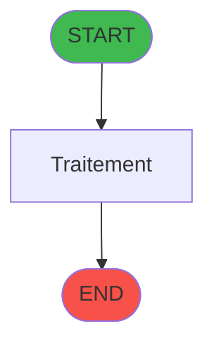
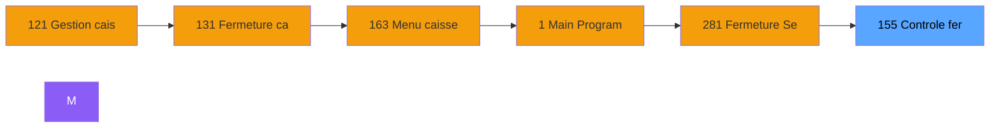
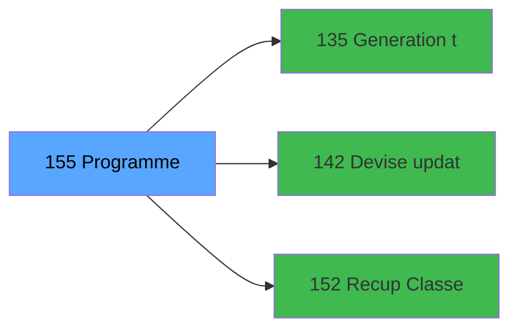

# ADH IDE 155 - Controle fermeture caisse WS

> **Version spec**: 3.5
> **Analyse**: 2026-01-27 17:57
> **Source**: `Prg_XXX.xml`

---

<!-- TAB:Fonctionnel -->

## SPECIFICATION FONCTIONNELLE

### 1.1 Objectif metier

| Element | Description |
|---------|-------------|
| **Qui** | Operateur |
| **Quoi** | Controle fermeture caisse WS
 |
| **Pourquoi** | A documenter |
| **Declencheur** | A identifier |

### 1.2 Regles metier

| Code | Regle | Condition |
|------|-------|-----------|
| RM-001 | A documenter | - |

### 1.3 Flux utilisateur

1. Demarrage programme
2. Traitement principal
3. Fin programme

### 1.4 Cas d'erreur

| Erreur | Comportement |
|--------|--------------|
| - | A documenter |

---

<!-- TAB:Technique -->

## SPECIFICATION TECHNIQUE

### 2.1 Identification

| Attribut | Valeur |
|----------|--------|
| **Format IDE** | ADH IDE 155 |
| **Description** | Controle fermeture caisse WS
 |
| **Module** | ADH |

### 2.2 Tables

| # | Nom logique | Nom physique | Acces | Usage |
|---|-------------|--------------|-------|-------|
| 31 | gm-complet_______gmc | `cafil009_dat` | R | 4x |
| 40 | comptable________cte | `cafil018_dat` | L | 3x |
| 44 | change___________chg | `cafil022_dat` | R | 1x |
| 77 | articles_________art | `cafil055_dat` | L | 2x |
| 90 | devises__________dev | `cafil068_dat` | R | 4x |
| 147 | change_vente_____chg | `cafil125_dat` | R | 1x |
| 197 | articles_en_stock | `caisse_artstock` | L | 2x |
| 232 | gestion_devise_session | `caisse_devise` | R | 5x |
| 232 | gestion_devise_session | `caisse_devise` | **W** | 2x |
| 241 | pointage_appro_remise | `caisse_pointage_apprem` | L | 8x |
| 241 | pointage_appro_remise | `caisse_pointage_apprem` | R | 2x |
| 241 | pointage_appro_remise | `caisse_pointage_apprem` | **W** | 8x |
| 242 | pointage_article | `caisse_pointage_article` | L | 4x |
| 242 | pointage_article | `caisse_pointage_article` | R | 4x |
| 242 | pointage_article | `caisse_pointage_article` | **W** | 10x |
| 243 | pointage_devise | `caisse_pointage_devise` | L | 12x |
| 243 | pointage_devise | `caisse_pointage_devise` | R | 4x |
| 243 | pointage_devise | `caisse_pointage_devise` | **W** | 6x |
| 246 | histo_sessions_caisse | `caisse_session` | R | 18x |
| 246 | histo_sessions_caisse | `caisse_session` | **W** | 1x |
| 247 | histo_sessions_caisse_article | `caisse_session_article` | L | 2x |
| 248 | sessions_coffre2 | `caisse_session_coffre2` | L | 5x |
| 249 | histo_sessions_caisse_detail | `caisse_session_detail` | L | 2x |
| 249 | histo_sessions_caisse_detail | `caisse_session_detail` | R | 23x |
| 250 | histo_sessions_caisse_devise | `caisse_session_devise` | L | 2x |
| 250 | histo_sessions_caisse_devise | `caisse_session_devise` | R | 9x |
| 251 | histo_sessions_caisse_remise | `caisse_session_remise` | R | 1x |
| 263 | vente | `caisse_vente` | L | 1x |
| 505 | pv_comptable | `%club_user%_pv_cafil18_dat` | L | 1x |
| 505 | pv_comptable | `%club_user%_pv_cafil18_dat` | **W** | 5x |
| 510 | pv_discounts | `%club_user%_pv_disctmp_dat` | **W** | 1x |
| 697 | droits_applications | `droits` | R | 1x |
### 2.3 Parametres d'entree

| Variable | Nom | Type | Picture |
|----------|-----|------|---------|
| - | Aucun parametre | - | - |
### 2.4 Algorigramme

### 2.5 Expressions cles

| IDE | Expression | Commentaire |
|-----|------------|-------------|
| 1 | `{0,15}='B'` | - |
| 2 | `{0,22}='O' AND ({0,18} AND NOT {0,19} OR {0,43}...` | - |
| 3 | `{0,1}='K'` | - |
| 4 | `{0,1}='T'` | - |
| 5 | `{0,8}` | - |
| 6 | `{0,9}` | - |
| 7 | `{0,10}` | - |
| 8 | `{32768,1}` | - |
| 9 | `{0,7}` | - |
| 10 | `'I'` | - |
| 11 | `'O'` | - |
| 12 | `IF({32768,78}, Val({0,41}, '3')={0,16}, {0,42}=...` | - |
| 13 | `NOT {32768,78}` | - |
| 14 | `{32768,78}` | - |

> **Total**: 14 expressions (affichees: 14)
### 2.6 Variables importantes

### 2.7 Statistiques

| Metrique | Valeur |
|----------|--------|
| **Taches** | 147 |
| **Lignes logique** | 3366 |
| **Lignes desactivees** | 0 |
---

<!-- TAB:Cartographie -->

## CARTOGRAPHIE APPLICATIVE

### 3.1 Chaine d'appels depuis Main

### 3.2 Callers directs

| IDE | Programme | Nb appels |
|-----|-----------|-----------|
| 131 | Fermeture caisse | 3 |
| 298 | Gestion caisse 142 | 3 |
| 299 | Fermeture caisse 144 | 3 |
| 121 | Gestion caisse | 2 |
### 3.3 Callees

| Niv | IDE | Programme | Nb appels |
|-----|-----|-----------|-----------|
| 1 | 135 | Generation tableau recap WS | 13 |
| 1 | 142 | Devise update session WS | 11 |
| 1 | 152 | Recup Classe et Lib du MOP | 3 |
### 3.4 Verification orphelin

| Critere | Resultat |
|---------|----------|
| Callers actifs | A verifier |
| **Conclusion** | A analyser |

---

## HISTORIQUE

| Date | Action | Auteur |
|------|--------|--------|
| 2026-01-27 20:21 | **DATA V2** - Tables reelles, Expressions, Stats, CallChain | Script |
| 2026-01-27 19:47 | **DATA POPULATED** - Tables, Callgraph (14 expr) | Script |
| 2026-01-27 17:57 | **Upgrade V3.5** - TAB markers, Mermaid | Claude |

---

*Specification V3.5 - Format avec TAB markers et Mermaid*
