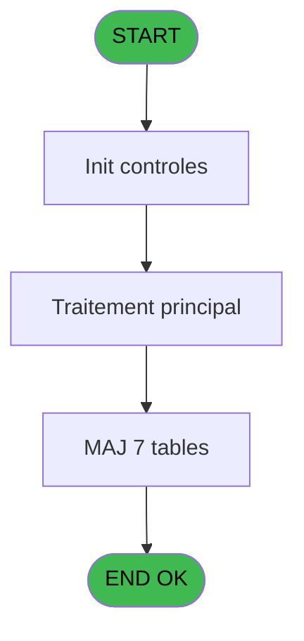
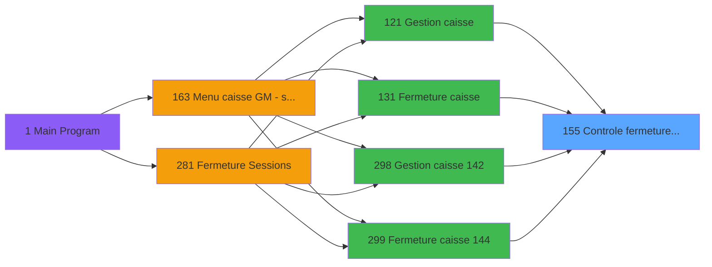
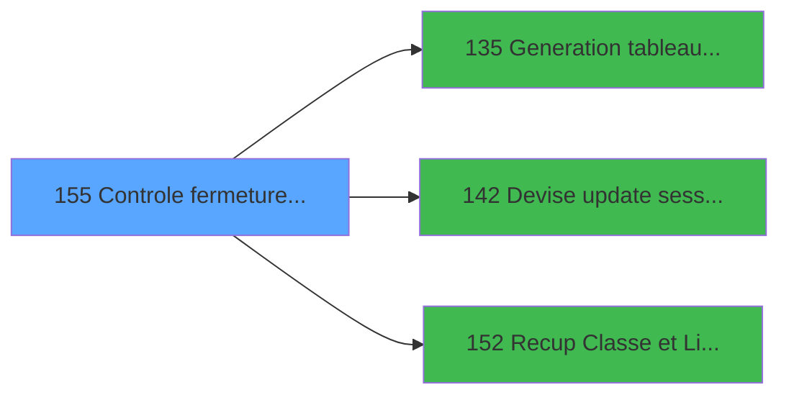

# ADH IDE 155 - Controle fermeture caisse WS

> **Analyse**: Phases 1-4 2026-02-08 03:39 -> 03:39 (4s) | Assemblage 03:39
> **Pipeline**: V7.2 Enrichi
> **Structure**: 4 onglets (Resume | Ecrans | Donnees | Connexions)

<!-- TAB:Resume -->

## 1. FICHE D'IDENTITE

| Attribut | Valeur |
|----------|--------|
| Projet | ADH |
| IDE Position | 155 |
| Nom Programme | Controle fermeture caisse WS |
| Fichier source | `Prg_155.xml` |
| Dossier IDE | Caisse |
| Taches | 147 (0 ecrans visibles) |
| Tables modifiees | 7 |
| Programmes appeles | 3 |
| Complexite | **MOYENNE** (score 45/100) |

## 2. DESCRIPTION FONCTIONNELLE

ADH IDE 155 effectue le contrôle de fermeture de la caisse en validant l'intégrité des données de session. Le programme reçoit les paramètres de fermeture (devise, montants, écarts) et vérifie la cohérence entre les déclarations des opérateurs et les mouvements enregistrés. Il appelle le programme IDE 135 pour générer le tableau récapitulatif des ventes, puis IDE 142 pour mettre à jour les devises de session avec les soldes finaux déclarés.

Le programme gère les écarts détectés lors de la fermeture en calculant les différences entre comptage physique et soldes attendus. Il utilise IDE 152 pour récupérer les classes de moyens de paiement et leurs libellés, afin de présenter un détail complet des écarts par type de paiement. Ces vérifications permettent de détecter les erreurs de saisie ou les mouvements non enregistrés avant de finaliser la session.

Une fois les contrôles validés, ADH IDE 155 met à jour les tables de fermeture (histo_sessions_caisse, pv_comptable, pv_discounts) et enregistre les pointages finaux (pointage_devise, pointage_article, pointage_appro_remise). Le programme produit également un historique complet de la session pour traçabilité, incluant tous les écarts détectés et les corrections appliquées.

## 3. BLOCS FONCTIONNELS

## 5. REGLES METIER

6 regles identifiees:

### Autres (6 regles)

#### [RM-001] Condition: Param UNI/BI [O] egale 'B'

| Element | Detail |
|---------|--------|
| **Condition** | `Param UNI/BI [O]='B'` |
| **Si vrai** | Action si vrai |
| **Variables** | FB (Param UNI/BI) |
| **Expression source** | Expression 1 : `Param UNI/BI [O]='B'` |
| **Exemple** | Si Param UNI/BI [O]='B' → Action si vrai |

#### [RM-002] Condition composite: V parametre 2 caisses [V]='O' AND (p.i.Host courant coffr... [R] AND NOT Param session ouverte ... [S] OR [BQ] AND Param session ouverte ... [S])

| Element | Detail |
|---------|--------|
| **Condition** | `V parametre 2 caisses [V]='O' AND (p.i.Host courant coffr... [R] AND NOT Param session ouverte ... [S] OR [BQ] AND Param session ouverte ... [S])` |
| **Si vrai** | Action si vrai |
| **Variables** | FI (V parametre 2 caisses) |
| **Expression source** | Expression 2 : `V parametre 2 caisses [V]='O' AND (p.i.Host courant coffr...` |
| **Exemple** | Si V parametre 2 caisses [V]='O' AND (p.i.Host courant coffr... [R] AND NOT Param session ouverte ... [S] OR [BQ] AND Param session ouverte ... [S]) → Action si vrai |

#### [RM-003] Condition: Param K/T [A] egale 'K'

| Element | Detail |
|---------|--------|
| **Condition** | `Param K/T [A]='K'` |
| **Si vrai** | Action si vrai |
| **Variables** | EN (Param K/T) |
| **Expression source** | Expression 3 : `Param K/T [A]='K'` |
| **Exemple** | Si Param K/T [A]='K' → Action si vrai |

#### [RM-004] Condition: Param K/T [A] egale 'T'

| Element | Detail |
|---------|--------|
| **Condition** | `Param K/T [A]='T'` |
| **Si vrai** | Action si vrai |
| **Variables** | EN (Param K/T) |
| **Expression source** | Expression 4 : `Param K/T [A]='T'` |
| **Exemple** | Si Param K/T [A]='T' → Action si vrai |

#### [RM-005] Si VG78 alors Val([BO] sinon '3')=p.i.Terminal coffre2 [P], [BP]=p.i.Hostname coffre2 [Q])

| Element | Detail |
|---------|--------|
| **Condition** | `VG78` |
| **Si vrai** | Val([BO] |
| **Si faux** | '3')=p.i.Terminal coffre2 [P], [BP]=p.i.Hostname coffre2 [Q]) |
| **Variables** | FC (p.i.Terminal coffre2), FD (p.i.Hostname coffre2) |
| **Expression source** | Expression 12 : `IF(VG78, Val([BO], '3')=p.i.Terminal coffre2 [P], [BP]=p.i.H` |
| **Exemple** | Si VG78 → Val([BO] |

#### [RM-006] Negation de VG78 (condition inversee)

| Element | Detail |
|---------|--------|
| **Condition** | `NOT VG78` |
| **Si vrai** | Action si vrai |
| **Expression source** | Expression 13 : `NOT VG78` |
| **Exemple** | Si NOT VG78 → Action si vrai |

## 6. CONTEXTE

- **Appele par**: [Fermeture caisse (IDE 131)](ADH-IDE-131.md), [Gestion caisse 142 (IDE 298)](ADH-IDE-298.md), [Fermeture caisse 144 (IDE 299)](ADH-IDE-299.md), [Gestion caisse (IDE 121)](ADH-IDE-121.md)
- **Appelle**: 3 programmes | **Tables**: 21 (W:7 R:13 L:12) | **Taches**: 147 | **Expressions**: 14

<!-- TAB:Ecrans -->

## 8. ECRANS

*(Programme sans ecran visible)*

## 9. NAVIGATION

### 9.3 Structure hierarchique (0 tache)

| Position | Tache | Type | Dimensions | Bloc |
|----------|-------|------|------------|------|

### 9.4 Algorigramme

> **Legende**: Vert = START/END OK | Rouge = END KO | Bleu = Decisions
> *Algorigramme auto-genere. Utiliser `/algorigramme` pour une synthese metier detaillee.*

<!-- TAB:Donnees -->

## 10. TABLES

### Tables utilisees (21)

| ID | Nom | Description | Type | R | W | L | Usages |
|----|-----|-------------|------|---|---|---|--------|
| 243 | pointage_devise | Devises / taux de change | DB | R | **W** | L | 22 |
| 242 | pointage_article | Articles et stock | DB | R | **W** | L | 18 |
| 241 | pointage_appro_remise |  | DB | R | **W** | L | 18 |
| 246 | histo_sessions_caisse | Sessions de caisse | DB | R | **W** |   | 19 |
| 232 | gestion_devise_session | Sessions de caisse | DB | R | **W** |   | 7 |
| 505 | pv_comptable |  | TMP |   | **W** | L | 6 |
| 510 | pv_discounts |  | TMP |   | **W** |   | 1 |
| 249 | histo_sessions_caisse_detail | Sessions de caisse | DB | R |   | L | 25 |
| 250 | histo_sessions_caisse_devise | Sessions de caisse | DB | R |   | L | 11 |
| 90 | devises__________dev | Devises / taux de change | DB | R |   |   | 4 |
| 31 | gm-complet_______gmc |  | DB | R |   |   | 4 |
| 251 | histo_sessions_caisse_remise | Sessions de caisse | DB | R |   |   | 1 |
| 44 | change___________chg |  | DB | R |   |   | 1 |
| 147 | change_vente_____chg | Donnees de ventes | DB | R |   |   | 1 |
| 697 | droits_applications | Droits operateur | DB | R |   |   | 1 |
| 248 | sessions_coffre2 | Sessions de caisse | DB |   |   | L | 5 |
| 40 | comptable________cte |  | DB |   |   | L | 3 |
| 247 | histo_sessions_caisse_article | Articles et stock | DB |   |   | L | 2 |
| 197 | articles_en_stock | Articles et stock | DB |   |   | L | 2 |
| 77 | articles_________art | Articles et stock | DB |   |   | L | 2 |
| 263 | vente | Donnees de ventes | DB |   |   | L | 1 |

### Colonnes par table (15 / 15 tables avec colonnes identifiees)

Table 243 - pointage_devise (R/**W**/L) - 22 usages

| Lettre | Variable | Acces | Type |
|--------|----------|-------|------|
| EN | Fin pointage | W | Logical |
| EO | devises_pointees | W | Logical |
| EP | Param devise locale | W | Alpha |
| FA | Param nbre devise | W | Numeric |

Table 242 - pointage_article (R/**W**/L) - 18 usages

| Lettre | Variable | Acces | Type |
|--------|----------|-------|------|
| EN | Existe article stock | W | Logical |
| EO | Existe article stock | W | Logical |

Table 241 - pointage_appro_remise (R/**W**/L) - 18 usages

| Lettre | Variable | Acces | Type |
|--------|----------|-------|------|
| A | total old ne pas virer | W | Numeric |
| B | devises_pointees | W | Logical |
| C | produits_pointes | W | Logical |

Table 246 - histo_sessions_caisse (R/**W**) - 19 usages

| Lettre | Variable | Acces | Type |
|--------|----------|-------|------|
| A | est une caisse reception | W | Logical |
| B | terminal de la caisse lue | W | Alpha |

Table 232 - gestion_devise_session (R/**W**) - 7 usages

| Lettre | Variable | Acces | Type |
|--------|----------|-------|------|
| EN | existe une devise pointee | W | Logical |
| EO | devises_pointees | W | Logical |
| FO | DateHeureLastSessionCoffre2 | W | Numeric |
| FP | DateComptaLastSessionCoffre2 | W | Date |
| FQ | DateDebLastSessionManu | W | Date |
| FR | HeureDebLastSessionManu | W | Time |
| FS | LastSessionManu Trouvee | W | Logical |
| FT | ChronoLast SessionManu | W | Numeric |
| FU | DateHeureLastSessionManuC2 | W | Numeric |
| FV | DateComptaLastSessionManuC2 | W | Date |
| EP | Param devise locale | W | Alpha |
| ET | Param chrono session | W | Numeric |
| FA | Param nbre devise | W | Numeric |
| FF | Param session ouverte VIL ? | W | Logical |
| FG | Date debut session | W | Date |
| FH | Time debut session | W | Time |

Table 505 - pv_comptable (**W**/L) - 6 usages

| Lettre | Variable | Acces | Type |
|--------|----------|-------|------|
| EQ | Param date comptable | W | Date |

Table 510 - pv_discounts (**W**) - 1 usages

*Table utilisee uniquement en Link ou aucune colonne Real identifiee dans le DataView.*

Table 249 - histo_sessions_caisse_detail (R/L) - 25 usages

| Lettre | Variable | Acces | Type |
|--------|----------|-------|------|
| A | Param K/T | R | Alpha |
| B | Param societe | R | Alpha |
| C | Param devise locale | R | Alpha |
| D | Param date comptable | R | Date |
| E | Param masque montant | R | Alpha |
| F | Param nombre decimale | R | Numeric |
| G | Param chrono session | R | Numeric |
| H | Param montant | R | Numeric |
| I | Param montant monnaie | R | Numeric |
| J | Param montant produits | R | Numeric |
| K | Param montant cartes | R | Numeric |
| L | Param montant cheques | R | Numeric |
| M | Param montant od | R | Numeric |
| N | Param nbre devise | R | Numeric |
| O | Param UNI/BI | R | Alpha |
| P | p.i.Terminal coffre2 | R | Numeric |
| Q | p.i.Hostname coffre2 | R | Unicode |
| R | p.i.Host courant coffre2 ? | R | Logical |
| S | Param session ouverte VIL ? | R | Logical |
| T | Date debut session | R | Date |
| U | Time debut session | R | Time |
| V | V parametre 2 caisses | R | Alpha |
| W | v montant inter | R | Numeric |
| X | v montant monnaie inter | R | Numeric |
| Y | v montant produit inter | R | Numeric |
| Z | v total monnaie | R | Numeric |
| BA | v total produit | R | Numeric |
| BB | DateHeureLastSessionCoffre2 | R | Numeric |
| BC | DateComptaLastSessionCoffre2 | R | Date |
| BD | DateDebLastSessionManu | R | Date |
| BE | HeureDebLastSessionManu | R | Time |
| BF | LastSessionManu Trouvee | R | Logical |
| BG | ChronoLast SessionManu | R | Numeric |
| BH | DateHeureLastSessionManuC2 | R | Numeric |
| BI | DateComptaLastSessionManuC2 | R | Date |
| BJ | v.Caisse COFFRE 2 ? | R | Logical |

Table 250 - histo_sessions_caisse_devise (R/L) - 11 usages

| Lettre | Variable | Acces | Type |
|--------|----------|-------|------|
| EN | v.Caisse a coffre 2 ? | R | Logical |
| EO | v.Caisse coffre 2 c ? | R | Logical |
| FW | v.Caisse COFFRE 2 ? | R | Logical |
| EP | Param devise locale | R | Alpha |
| FA | Param nbre devise | R | Numeric |
| FI | V parametre 2 caisses | R | Alpha |

Table 90 - devises__________dev (R) - 4 usages

| Lettre | Variable | Acces | Type |
|--------|----------|-------|------|
| EO | devises_pointees | R | Logical |

Table 31 - gm-complet_______gmc (R) - 4 usages

| Lettre | Variable | Acces | Type |
|--------|----------|-------|------|
| A | Existe article stock | R | Logical |
| B | Existe article stock | R | Logical |

Table 251 - histo_sessions_caisse_remise (R) - 1 usages

| Lettre | Variable | Acces | Type |
|--------|----------|-------|------|
| EN | v.Caisse a coffre 2 ? | R | Logical |
| EO | v.Caisse coffre 2 c ? | R | Logical |
| FW | v.Caisse COFFRE 2 ? | R | Logical |
| FI | V parametre 2 caisses | R | Alpha |

Table 44 - change___________chg (R) - 1 usages

*Table utilisee uniquement en Link ou aucune colonne Real identifiee dans le DataView.*

Table 147 - change_vente_____chg (R) - 1 usages

*Table utilisee uniquement en Link ou aucune colonne Real identifiee dans le DataView.*

Table 697 - droits_applications (R) - 1 usages

*Table utilisee uniquement en Link ou aucune colonne Real identifiee dans le DataView.*

## 11. VARIABLES

### 11.1 Parametres entrants (3)

Variables recues du programme appelant ([Fermeture caisse (IDE 131)](ADH-IDE-131.md)).

| Lettre | Nom | Type | Usage dans |
|--------|-----|------|-----------|
| FC | p.i.Terminal coffre2 | Numeric | 1x parametre entrant |
| FD | p.i.Hostname coffre2 | Unicode | 1x parametre entrant |
| FE | p.i.Host courant coffre2 ? | Logical | - |

### 11.2 Variables de session (7)

Variables persistantes pendant toute la session.

| Lettre | Nom | Type | Usage dans |
|--------|-----|------|-----------|
| FI | V parametre 2 caisses | Alpha | 1x session |
| FJ | v montant inter | Numeric | - |
| FK | v montant monnaie inter | Numeric | - |
| FL | v montant produit inter | Numeric | - |
| FM | v total monnaie | Numeric | - |
| FN | v total produit | Numeric | - |
| FW | v.Caisse COFFRE 2 ? | Logical | - |

### 11.3 Autres (26)

Variables diverses.

| Lettre | Nom | Type | Usage dans |
|--------|-----|------|-----------|
| EN | Param K/T | Alpha | 2x refs |
| EO | Param societe | Alpha | - |
| EP | Param devise locale | Alpha | - |
| EQ | Param date comptable | Date | - |
| ER | Param masque montant | Alpha | - |
| ES | Param nombre decimale | Numeric | - |
| ET | Param chrono session | Numeric | 1x refs |
| EU | Param montant | Numeric | 3x refs |
| EV | Param montant monnaie | Numeric | 1x refs |
| EW | Param montant produits | Numeric | 1x refs |
| EX | Param montant cartes | Numeric | - |
| EY | Param montant cheques | Numeric | - |
| EZ | Param montant od | Numeric | - |
| FA | Param nbre devise | Numeric | - |
| FB | Param UNI/BI | Alpha | 1x refs |
| FF | Param session ouverte VIL ? | Logical | - |
| FG | Date debut session | Date | - |
| FH | Time debut session | Time | - |
| FO | DateHeureLastSessionCoffre2 | Numeric | - |
| FP | DateComptaLastSessionCoffre2 | Date | - |
| FQ | DateDebLastSessionManu | Date | - |
| FR | HeureDebLastSessionManu | Time | - |
| FS | LastSessionManu Trouvee | Logical | - |
| FT | ChronoLast SessionManu | Numeric | - |
| FU | DateHeureLastSessionManuC2 | Numeric | - |
| FV | DateComptaLastSessionManuC2 | Date | - |

Toutes les 36 variables (liste complete)

| Cat | Lettre | Nom Variable | Type |
|-----|--------|--------------|------|
| P0 | **FC** | p.i.Terminal coffre2 | Numeric |
| P0 | **FD** | p.i.Hostname coffre2 | Unicode |
| P0 | **FE** | p.i.Host courant coffre2 ? | Logical |
| V. | **FI** | V parametre 2 caisses | Alpha |
| V. | **FJ** | v montant inter | Numeric |
| V. | **FK** | v montant monnaie inter | Numeric |
| V. | **FL** | v montant produit inter | Numeric |
| V. | **FM** | v total monnaie | Numeric |
| V. | **FN** | v total produit | Numeric |
| V. | **FW** | v.Caisse COFFRE 2 ? | Logical |
| Autre | **EN** | Param K/T | Alpha |
| Autre | **EO** | Param societe | Alpha |
| Autre | **EP** | Param devise locale | Alpha |
| Autre | **EQ** | Param date comptable | Date |
| Autre | **ER** | Param masque montant | Alpha |
| Autre | **ES** | Param nombre decimale | Numeric |
| Autre | **ET** | Param chrono session | Numeric |
| Autre | **EU** | Param montant | Numeric |
| Autre | **EV** | Param montant monnaie | Numeric |
| Autre | **EW** | Param montant produits | Numeric |
| Autre | **EX** | Param montant cartes | Numeric |
| Autre | **EY** | Param montant cheques | Numeric |
| Autre | **EZ** | Param montant od | Numeric |
| Autre | **FA** | Param nbre devise | Numeric |
| Autre | **FB** | Param UNI/BI | Alpha |
| Autre | **FF** | Param session ouverte VIL ? | Logical |
| Autre | **FG** | Date debut session | Date |
| Autre | **FH** | Time debut session | Time |
| Autre | **FO** | DateHeureLastSessionCoffre2 | Numeric |
| Autre | **FP** | DateComptaLastSessionCoffre2 | Date |
| Autre | **FQ** | DateDebLastSessionManu | Date |
| Autre | **FR** | HeureDebLastSessionManu | Time |
| Autre | **FS** | LastSessionManu Trouvee | Logical |
| Autre | **FT** | ChronoLast SessionManu | Numeric |
| Autre | **FU** | DateHeureLastSessionManuC2 | Numeric |
| Autre | **FV** | DateComptaLastSessionManuC2 | Date |

## 12. EXPRESSIONS

**14 / 14 expressions decodees (100%)**

### 12.1 Repartition par type

| Type | Expressions | Regles |
|------|-------------|--------|
| CONDITION | 5 | 5 |
| NEGATION | 1 | 5 |
| CONSTANTE | 2 | 0 |
| OTHER | 4 | 0 |
| REFERENCE_VG | 2 | 0 |

### 12.2 Expressions cles par type

#### CONDITION (5 expressions)

| Type | IDE | Expression | Regle |
|------|-----|------------|-------|
| CONDITION | 4 | `Param K/T [A]='T'` | [RM-004](#rm-RM-004) |
| CONDITION | 12 | `IF(VG78, Val([BO], '3')=p.i.Terminal coffre2 [P], [BP]=p.i.Hostname coffre2 [Q])` | [RM-005](#rm-RM-005) |
| CONDITION | 3 | `Param K/T [A]='K'` | [RM-003](#rm-RM-003) |
| CONDITION | 1 | `Param UNI/BI [O]='B'` | [RM-001](#rm-RM-001) |
| CONDITION | 2 | `V parametre 2 caisses [V]='O' AND (p.i.Host courant coffr... [R] AND NOT Param session ouverte ... [S] OR [BQ] AND Param session ouverte ... [S])` | [RM-002](#rm-RM-002) |

#### NEGATION (1 expressions)

| Type | IDE | Expression | Regle |
|------|-----|------------|-------|
| NEGATION | 13 | `NOT VG78` | [RM-006](#rm-RM-006) |

#### CONSTANTE (2 expressions)

| Type | IDE | Expression | Regle |
|------|-----|------------|-------|
| CONSTANTE | 11 | `'O'` | - |
| CONSTANTE | 10 | `'I'` | - |

#### OTHER (4 expressions)

| Type | IDE | Expression | Regle |
|------|-----|------------|-------|
| OTHER | 7 | `Param montant produits [J]` | - |
| OTHER | 9 | `Param chrono session [G]` | - |
| OTHER | 5 | `Param montant [H]` | - |
| OTHER | 6 | `Param montant monnaie [I]` | - |

#### REFERENCE_VG (2 expressions)

| Type | IDE | Expression | Regle |
|------|-----|------------|-------|
| REFERENCE_VG | 14 | `VG78` | - |
| REFERENCE_VG | 8 | `VG1` | - |

<!-- TAB:Connexions -->

## 13. GRAPHE D'APPELS

### 13.1 Chaine depuis Main (Callers)

Main -> ... -> [Fermeture caisse (IDE 131)](ADH-IDE-131.md) -> **Controle fermeture caisse WS (IDE 155)**

Main -> ... -> [Gestion caisse 142 (IDE 298)](ADH-IDE-298.md) -> **Controle fermeture caisse WS (IDE 155)**

Main -> ... -> [Fermeture caisse 144 (IDE 299)](ADH-IDE-299.md) -> **Controle fermeture caisse WS (IDE 155)**

Main -> ... -> [Gestion caisse (IDE 121)](ADH-IDE-121.md) -> **Controle fermeture caisse WS (IDE 155)**

### 13.2 Callers

| IDE | Nom Programme | Nb Appels |
|-----|---------------|-----------|
| [131](ADH-IDE-131.md) | Fermeture caisse | 3 |
| [298](ADH-IDE-298.md) | Gestion caisse 142 | 3 |
| [299](ADH-IDE-299.md) | Fermeture caisse 144 | 3 |
| [121](ADH-IDE-121.md) | Gestion caisse | 2 |

### 13.3 Callees (programmes appeles)

### 13.4 Detail Callees avec contexte

| IDE | Nom Programme | Appels | Contexte |
|-----|---------------|--------|----------|
| [135](ADH-IDE-135.md) | Generation tableau recap WS | 13 | Sous-programme |
| [142](ADH-IDE-142.md) | Devise update session WS | 11 | Mise a jour donnees |
| [152](ADH-IDE-152.md) | Recup Classe et Lib du MOP | 3 | Recuperation donnees |

## 14. RECOMMANDATIONS MIGRATION

### 14.1 Profil du programme

| Metrique | Valeur | Impact migration |
|----------|--------|-----------------|
| Lignes de logique | 3366 | Programme volumineux |
| Expressions | 14 | Peu de logique |
| Tables WRITE | 7 | Fort impact donnees |
| Sous-programmes | 3 | Peu de dependances |
| Ecrans visibles | 0 | Ecran unique ou traitement batch |
| Code desactive | 0% (1 / 3366) | Code sain |
| Regles metier | 6 | Quelques regles a preserver |

### 14.2 Plan de migration par bloc

### 14.3 Dependances critiques

| Dependance | Type | Appels | Impact |
|------------|------|--------|--------|
| gestion_devise_session | Table WRITE (Database) | 2x | Schema + repository |
| pointage_appro_remise | Table WRITE (Database) | 8x | Schema + repository |
| pointage_article | Table WRITE (Database) | 10x | Schema + repository |
| pointage_devise | Table WRITE (Database) | 6x | Schema + repository |
| histo_sessions_caisse | Table WRITE (Database) | 1x | Schema + repository |
| pv_comptable | Table WRITE (Temp) | 5x | Schema + repository |
| pv_discounts | Table WRITE (Temp) | 1x | Schema + repository |
| [Generation tableau recap WS (IDE 135)](ADH-IDE-135.md) | Sous-programme | 13x | **CRITIQUE** - Sous-programme |
| [Devise update session WS (IDE 142)](ADH-IDE-142.md) | Sous-programme | 11x | **CRITIQUE** - Mise a jour donnees |
| [Recup Classe et Lib du MOP (IDE 152)](ADH-IDE-152.md) | Sous-programme | 3x | **CRITIQUE** - Recuperation donnees |

---
*Spec DETAILED generee par Pipeline V7.2 - 2026-02-08 03:39*
