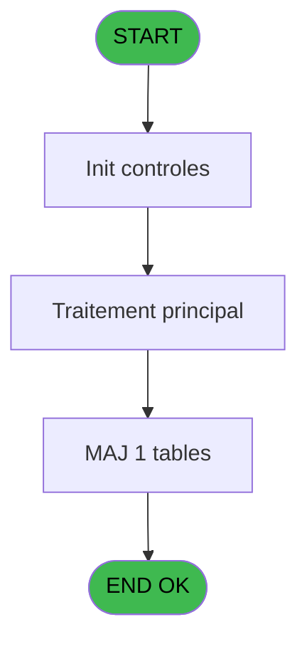
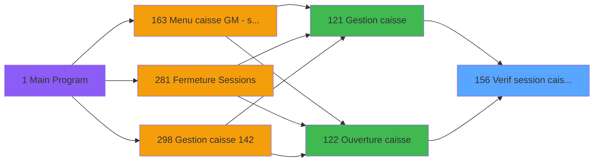
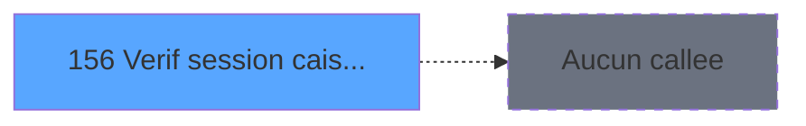

# ADH IDE 156 - Verif session caisse ouverte2

> **Analyse**: Phases 1-4 2026-02-08 03:39 -> 03:39 (4s) | Assemblage 03:39
> **Pipeline**: V7.2 Enrichi
> **Structure**: 4 onglets (Resume | Ecrans | Donnees | Connexions)

<!-- TAB:Resume -->

## 1. FICHE D'IDENTITE

| Attribut | Valeur |
|----------|--------|
| Projet | ADH |
| IDE Position | 156 |
| Nom Programme | Verif session caisse ouverte2 |
| Fichier source | `Prg_156.xml` |
| Dossier IDE | Caisse |
| Taches | 1 (0 ecrans visibles) |
| Tables modifiees | 1 |
| Programmes appeles | 0 |
| Complexite | **BASSE** (score 7/100) |

## 2. DESCRIPTION FONCTIONNELLE

ADH IDE 156 effectue une vérification du statut des sessions de caisse existantes avant d'en ouvrir une nouvelle. Le programme interroge la table `histo_sessions_caisse_detail` pour déterminer si une session est actuellement ouverte pour la caisse et la devise spécifiées. Cette vérification est critique pour éviter les doubles ouvertures et garantir l'intégrité des données de comptabilité.

Le flux d'exécution consulte les enregistrements de session les plus récents, validant notamment le timestamp d'ouverture et l'absence de fermeture antérieure. Si une session active est détectée, le programme retourne un indicateur d'erreur qui bloque l'ouverture d'une nouvelle session dans ADH IDE 122. Cette logique prévient les conflits de concurrence où deux opérateurs tenteraient simultanément d'ouvrir la même caisse.

Les données manipulées concernent les sessions comptables (numéro session, dates, devises, statuts). Le programme s'inscrit dans la chaîne de gestion de caisse en tant que validateur préalable, intervenant après le menu principal (ADH IDE 121) et en amont de la création effective de session (ADH IDE 122). Les modifications apportées à `histo_sessions_caisse_detail` reflètent les mises à jour de statut de session lors de la validation.

## 3. BLOCS FONCTIONNELS

## 5. REGLES METIER

1 regles identifiees:

### Autres (1 regles)

#### [RM-001] Condition composite: NOT([V]) OR [U]

| Element | Detail |
|---------|--------|
| **Condition** | `NOT([V]) OR [U]` |
| **Si vrai** | Action si vrai |
| **Expression source** | Expression 8 : `NOT([V]) OR [U]` |
| **Exemple** | Si NOT([V]) OR [U] → Action si vrai |

## 6. CONTEXTE

- **Appele par**: [Gestion caisse (IDE 121)](ADH-IDE-121.md), [Ouverture caisse (IDE 122)](ADH-IDE-122.md)
- **Appelle**: 0 programmes | **Tables**: 1 (W:1 R:0 L:0) | **Taches**: 1 | **Expressions**: 9

<!-- TAB:Ecrans -->

## 8. ECRANS

*(Programme sans ecran visible)*

## 9. NAVIGATION

### 9.3 Structure hierarchique (0 tache)

| Position | Tache | Type | Dimensions | Bloc |
|----------|-------|------|------------|------|

### 9.4 Algorigramme

> **Legende**: Vert = START/END OK | Rouge = END KO | Bleu = Decisions
> *Algorigramme auto-genere. Utiliser `/algorigramme` pour une synthese metier detaillee.*

<!-- TAB:Donnees -->

## 10. TABLES

### Tables utilisees (1)

| ID | Nom | Description | Type | R | W | L | Usages |
|----|-----|-------------|------|---|---|---|--------|
| 249 | histo_sessions_caisse_detail | Sessions de caisse | DB |   | **W** |   | 1 |

### Colonnes par table (1 / 1 tables avec colonnes identifiees)

Table 249 - histo_sessions_caisse_detail (**W**) - 1 usages

| Lettre | Variable | Acces | Type |
|--------|----------|-------|------|
| A | Pi.terminal | W | Numeric |
| B | Po.Ouverture caisse possible? | W | Logical |
| C | e.Caisse ouverte aujourd'hui? | W | Logical |
| D | e.Caisse fermée? | W | Logical |

## 11. VARIABLES

### 11.1 Parametres entrants (2)

Variables recues du programme appelant ([Gestion caisse (IDE 121)](ADH-IDE-121.md)).

| Lettre | Nom | Type | Usage dans |
|--------|-----|------|-----------|
| EN | Pi.terminal | Numeric | 1x parametre entrant |
| EO | Po.Ouverture caisse possible? | Logical | - |

### 11.2 Autres (2)

Variables diverses.

| Lettre | Nom | Type | Usage dans |
|--------|-----|------|-----------|
| EP | e.Caisse ouverte aujourd'hui? | Logical | - |
| EQ | e.Caisse fermée? | Logical | - |

## 12. EXPRESSIONS

**9 / 9 expressions decodees (100%)**

### 12.1 Repartition par type

| Type | Expressions | Regles |
|------|-------------|--------|
| CONDITION | 1 | 5 |
| CONSTANTE | 3 | 0 |
| DATE | 1 | 0 |
| OTHER | 1 | 0 |
| CAST_LOGIQUE | 1 | 0 |
| FORMAT | 1 | 0 |
| STRING | 1 | 0 |

### 12.2 Expressions cles par type

#### CONDITION (1 expressions)

| Type | IDE | Expression | Regle |
|------|-----|------------|-------|
| CONDITION | 8 | `NOT([V]) OR [U]` | [RM-001](#rm-RM-001) |

#### CONSTANTE (3 expressions)

| Type | IDE | Expression | Regle |
|------|-----|------------|-------|
| CONSTANTE | 3 | `'F'` | - |
| CONSTANTE | 2 | `'O'` | - |
| CONSTANTE | 1 | `'I'` | - |

#### DATE (1 expressions)

| Type | IDE | Expression | Regle |
|------|-----|------------|-------|
| DATE | 5 | `Date()` | - |

#### OTHER (1 expressions)

| Type | IDE | Expression | Regle |
|------|-----|------------|-------|
| OTHER | 7 | `Po.Ouverture caisse po... [B]` | - |

#### CAST_LOGIQUE (1 expressions)

| Type | IDE | Expression | Regle |
|------|-----|------------|-------|
| CAST_LOGIQUE | 9 | `'TRUE'LOG` | - |

#### FORMAT (1 expressions)

| Type | IDE | Expression | Regle |
|------|-----|------------|-------|
| FORMAT | 4 | `Str([G],'3P0')` | - |

#### STRING (1 expressions)

| Type | IDE | Expression | Regle |
|------|-----|------------|-------|
| STRING | 6 | `Trim(Pi.terminal [A])` | - |

<!-- TAB:Connexions -->

## 13. GRAPHE D'APPELS

### 13.1 Chaine depuis Main (Callers)

Main -> ... -> [Gestion caisse (IDE 121)](ADH-IDE-121.md) -> **Verif session caisse ouverte2 (IDE 156)**

Main -> ... -> [Ouverture caisse (IDE 122)](ADH-IDE-122.md) -> **Verif session caisse ouverte2 (IDE 156)**

### 13.2 Callers

| IDE | Nom Programme | Nb Appels |
|-----|---------------|-----------|
| [121](ADH-IDE-121.md) | Gestion caisse | 1 |
| [122](ADH-IDE-122.md) | Ouverture caisse | 1 |

### 13.3 Callees (programmes appeles)

### 13.4 Detail Callees avec contexte

| IDE | Nom Programme | Appels | Contexte |
|-----|---------------|--------|----------|
| - | (aucun) | - | - |

## 14. RECOMMANDATIONS MIGRATION

### 14.1 Profil du programme

| Metrique | Valeur | Impact migration |
|----------|--------|-----------------|
| Lignes de logique | 28 | Programme compact |
| Expressions | 9 | Peu de logique |
| Tables WRITE | 1 | Impact faible |
| Sous-programmes | 0 | Peu de dependances |
| Ecrans visibles | 0 | Ecran unique ou traitement batch |
| Code desactive | 0% (0 / 28) | Code sain |
| Regles metier | 1 | Quelques regles a preserver |

### 14.2 Plan de migration par bloc

### 14.3 Dependances critiques

| Dependance | Type | Appels | Impact |
|------------|------|--------|--------|
| histo_sessions_caisse_detail | Table WRITE (Database) | 1x | Schema + repository |

---
*Spec DETAILED generee par Pipeline V7.2 - 2026-02-08 03:40*
