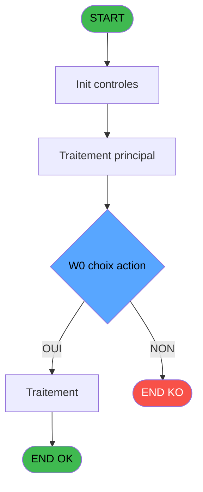
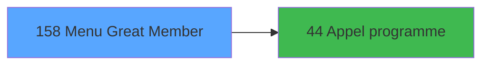

# ADH IDE 158 - Menu Great Member

> **Analyse**: Phases 1-4 2026-02-07 07:18 -> 03:42 (20h23min) | Assemblage 03:42
> **Pipeline**: V7.2 Enrichi
> **Structure**: 4 onglets (Resume | Ecrans | Donnees | Connexions)

<!-- TAB:Resume -->

## 1. FICHE D'IDENTITE

| Attribut | Valeur |
|----------|--------|
| Projet | ADH |
| IDE Position | 158 |
| Nom Programme | Menu Great Member |
| Fichier source | `Prg_158.xml` |
| Dossier IDE | Navigation |
| Taches | 1 (0 ecrans visibles) |
| Tables modifiees | 0 |
| Programmes appeles | 1 |
| Complexite | **BASSE** (score 5/100) |

## 2. DESCRIPTION FONCTIONNELLE

# ADH IDE 158 - Menu Great Member

**Menu de selection pour les operations sur les membres Great (comptes membres du programme Great Member).** Ce programme est un point de passage intermediaire dans la chaine Menu caisse GM (IDE 163). Il affiche une liste de membres Great disponibles (probablement filtres ou recherches) et permet a l'operateur de selectionner un compte pour effectuer des operations specifiques au programme Great.

**Structure simple de menu** : Le programme reçoit des parametres de contexte (societe, compte, filiation) et propose un ensemble limite de sous-operations via des CallTask vers IDE 44 (Appel programme). Cette architecture hierarchique (Menu principal → Menu GM → Menu Great Member → Appel Programme) permet de decomposer la navigation complexe de la caisse en etapes logiques.

**Operations possibles** : Une fois un membre Great selectionne, l'operateur peut declencher diverses actions (consultation, modification, operations specifiques au programme Great Member) en appelant IDE 44, qui agit comme dispatcher fonctionnel vers les vrais programmes de traitement metier.

## 3. BLOCS FONCTIONNELS

## 5. REGLES METIER

2 regles identifiees:

### Autres (2 regles)

#### [RM-001] Condition: W0 choix action [G] egale '1'

| Element | Detail |
|---------|--------|
| **Condition** | `W0 choix action [G]='1'` |
| **Si vrai** | Action si vrai |
| **Variables** | ET (W0 choix action) |
| **Expression source** | Expression 4 : `W0 choix action [G]='1'` |
| **Exemple** | Si W0 choix action [G]='1' → Action si vrai |

#### [RM-002] Condition: W0 choix action [G] egale '2'

| Element | Detail |
|---------|--------|
| **Condition** | `W0 choix action [G]='2'` |
| **Si vrai** | Action si vrai |
| **Variables** | ET (W0 choix action) |
| **Expression source** | Expression 9 : `W0 choix action [G]='2'` |
| **Exemple** | Si W0 choix action [G]='2' → Action si vrai |

## 6. CONTEXTE

- **Appele par**: [Menu caisse GM - scroll (IDE 163)](ADH-IDE-163.md)
- **Appelle**: 1 programmes | **Tables**: 0 (W:0 R:0 L:0) | **Taches**: 1 | **Expressions**: 10

<!-- TAB:Ecrans -->

## 8. ECRANS

*(Programme sans ecran visible)*

## 9. NAVIGATION

### 9.3 Structure hierarchique (0 tache)

| Position | Tache | Type | Dimensions | Bloc |
|----------|-------|------|------------|------|

### 9.4 Algorigramme

> **Legende**: Vert = START/END OK | Rouge = END KO | Bleu = Decisions
> *Algorigramme auto-genere. Utiliser `/algorigramme` pour une synthese metier detaillee.*

<!-- TAB:Donnees -->

## 10. TABLES

### Tables utilisees (0)

| ID | Nom | Description | Type | R | W | L | Usages |
|----|-----|-------------|------|---|---|---|--------|

### Colonnes par table (0 / 0 tables avec colonnes identifiees)

## 11. VARIABLES

### 11.1 Parametres entrants (6)

Variables recues du programme appelant ([Menu caisse GM - scroll (IDE 163)](ADH-IDE-163.md)).

| Lettre | Nom | Type | Usage dans |
|--------|-----|------|-----------|
| EN | P. Societe | Alpha | - |
| EO | P. Code GM | Numeric | - |
| EP | P. Filiation | Numeric | - |
| EQ | P. Masque montant | Alpha | 1x parametre entrant |
| ER | P. devise locale | Alpha | - |
| ES | P. nom village | Alpha | - |

### 11.2 Variables de session (1)

Variables persistantes pendant toute la session.

| Lettre | Nom | Type | Usage dans |
|--------|-----|------|-----------|
| EU | v.fin | Logical | 1x session |

### 11.3 Variables de travail (1)

Variables internes au programme.

| Lettre | Nom | Type | Usage dans |
|--------|-----|------|-----------|
| ET | W0 choix action | Alpha | 2x calcul interne |

## 12. EXPRESSIONS

**10 / 10 expressions decodees (100%)**

### 12.1 Repartition par type

| Type | Expressions | Regles |
|------|-------------|--------|
| CALCULATION | 1 | 0 |
| CONDITION | 2 | 2 |
| CONSTANTE | 3 | 0 |
| DATE | 1 | 0 |
| REFERENCE_VG | 1 | 0 |
| OTHER | 1 | 0 |
| CAST_LOGIQUE | 1 | 0 |

### 12.2 Expressions cles par type

#### CALCULATION (1 expressions)

| Type | IDE | Expression | Regle |
|------|-----|------------|-------|
| CALCULATION | 8 | `Left (Trim (P. Masque montant [D]),Len (Trim (P. Masque montant [D]))-1)` | - |

#### CONDITION (2 expressions)

| Type | IDE | Expression | Regle |
|------|-----|------------|-------|
| CONDITION | 9 | `W0 choix action [G]='2'` | [RM-002](#rm-RM-002) |
| CONDITION | 4 | `W0 choix action [G]='1'` | [RM-001](#rm-RM-001) |

#### CONSTANTE (3 expressions)

| Type | IDE | Expression | Regle |
|------|-----|------------|-------|
| CONSTANTE | 10 | `'A'` | - |
| CONSTANTE | 7 | `'99'` | - |
| CONSTANTE | 3 | `''` | - |

#### DATE (1 expressions)

| Type | IDE | Expression | Regle |
|------|-----|------------|-------|
| DATE | 1 | `Date ()` | - |

#### REFERENCE_VG (1 expressions)

| Type | IDE | Expression | Regle |
|------|-----|------------|-------|
| REFERENCE_VG | 2 | `VG2` | - |

#### OTHER (1 expressions)

| Type | IDE | Expression | Regle |
|------|-----|------------|-------|
| OTHER | 5 | `v.fin [H]` | - |

#### CAST_LOGIQUE (1 expressions)

| Type | IDE | Expression | Regle |
|------|-----|------------|-------|
| CAST_LOGIQUE | 6 | `'TRUE'LOG` | - |

<!-- TAB:Connexions -->

## 13. GRAPHE D'APPELS

### 13.1 Chaine depuis Main (Callers)

Main -> ... -> [Menu caisse GM - scroll (IDE 163)](ADH-IDE-163.md) -> **Menu Great Member (IDE 158)**

### 13.2 Callers

| IDE | Nom Programme | Nb Appels |
|-----|---------------|-----------|
| [163](ADH-IDE-163.md) | Menu caisse GM - scroll | 1 |

### 13.3 Callees (programmes appeles)

### 13.4 Detail Callees avec contexte

| IDE | Nom Programme | Appels | Contexte |
|-----|---------------|--------|----------|
| [44](ADH-IDE-44.md) | Appel programme | 1 | Sous-programme |

## 14. RECOMMANDATIONS MIGRATION

### 14.1 Profil du programme

| Metrique | Valeur | Impact migration |
|----------|--------|-----------------|
| Lignes de logique | 35 | Programme compact |
| Expressions | 10 | Peu de logique |
| Tables WRITE | 0 | Impact faible |
| Sous-programmes | 1 | Peu de dependances |
| Ecrans visibles | 0 | Ecran unique ou traitement batch |
| Code desactive | 0% (0 / 35) | Code sain |
| Regles metier | 2 | Quelques regles a preserver |

### 14.2 Plan de migration par bloc

### 14.3 Dependances critiques

| Dependance | Type | Appels | Impact |
|------------|------|--------|--------|
| [Appel programme (IDE 44)](ADH-IDE-44.md) | Sous-programme | 1x | Normale - Sous-programme |

---
*Spec DETAILED generee par Pipeline V7.2 - 2026-02-08 03:42*
