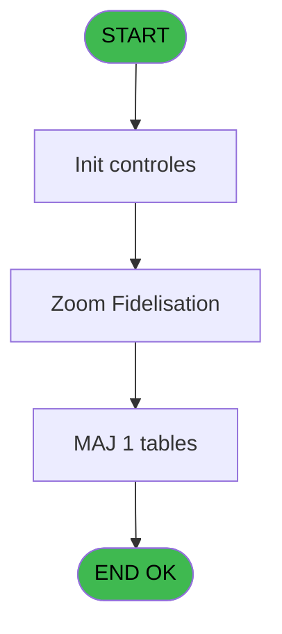
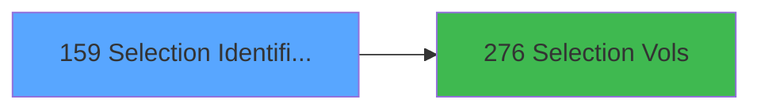

# ADH IDE 159 - Selection Identification

> **Analyse**: Phases 1-4 2026-02-08 03:42 -> 03:42 (4s) | Assemblage 03:42
> **Pipeline**: V7.2 Enrichi
> **Structure**: 4 onglets (Resume | Ecrans | Donnees | Connexions)

<!-- TAB:Resume -->

## 1. FICHE D'IDENTITE

| Attribut | Valeur |
|----------|--------|
| Projet | ADH |
| IDE Position | 159 |
| Nom Programme | Selection Identification |
| Fichier source | `Prg_159.xml` |
| Dossier IDE | Consultation |
| Taches | 5 (0 ecrans visibles) |
| Tables modifiees | 1 |
| Programmes appeles | 1 |
| Complexite | **BASSE** (score 12/100) |
| Statut | **ORPHELIN_POTENTIEL** |

## 2. DESCRIPTION FONCTIONNELLE

# ADH IDE 159 - Selection Identification

**Objectif metier:** Programme de selection et d'identification des services (vols, sejours) pour les operations de caisse. Utilisé lors de l'ouverture de session ou des consultations de compte pour identifier rapidement le contexte de facturation d'un membre.

**Flux principal:** L'operateur selectione un service dans une liste (vols, sejours, activites, etc.). Le programme valide l'identification du service, construit une liste temporaire des elements pertinents (numero vol, date arrivee, etc.) et la stocke dans la table `tempo_liste_service` pour utilisation par les programmes en aval (notamment le programme 276 Selection Vols). La validation verifie que le service est actif et associe au compte du membre.

**Interactions clés:** Le programme appelle directement le programme ADH IDE 276 (Selection Vols) pour affiner la selection une fois le service identifie. Cette cascade permet une identification progressive du contexte avant les operations de caisse proprement dites (ventes, extraits, garanties). Les donnees temporaires stockees servent de contexte partage pour les operations suivantes dans la session.

## 3. BLOCS FONCTIONNELS

## 5. REGLES METIER

4 regles identifiees:

### Autres (4 regles)

#### [RM-001] Condition: VG20 superieur a 1

| Element | Detail |
|---------|--------|
| **Condition** | `VG20>1` |
| **Si vrai** | Action si vrai |
| **Expression source** | Expression 16 : `VG20>1` |
| **Exemple** | Si VG20>1 → Action si vrai |

#### [RM-002] Condition: v.Type Liste [A] egale 'S'

| Element | Detail |
|---------|--------|
| **Condition** | `v.Type Liste [A]='S'` |
| **Si vrai** | Action si vrai |
| **Variables** | EN (v.Type Liste) |
| **Expression source** | Expression 17 : `v.Type Liste [A]='S'` |
| **Exemple** | Si v.Type Liste [A]='S' → Action si vrai |

#### [RM-003] Condition: Trim(v.Fidelisation [G]) egale 'C'

| Element | Detail |
|---------|--------|
| **Condition** | `Trim(v.Fidelisation [G])='C'` |
| **Si vrai** | Action si vrai |
| **Variables** | ET (v.Fidelisation) |
| **Expression source** | Expression 21 : `Trim(v.Fidelisation [G])='C'` |
| **Exemple** | Si Trim(v.Fidelisation [G])='C' → Action si vrai |

#### [RM-004] Si v.Categorie [C]=MlsTrans('Toutes') alors '' sinon v.Categorie [C])

| Element | Detail |
|---------|--------|
| **Condition** | `v.Categorie [C]=MlsTrans('Toutes')` |
| **Si vrai** | '' |
| **Si faux** | v.Categorie [C]) |
| **Variables** | EP (v.Categorie) |
| **Expression source** | Expression 26 : `IF(v.Categorie [C]=MlsTrans('Toutes'),'',v.Categorie [C])` |
| **Exemple** | Si v.Categorie [C]=MlsTrans('Toutes') → ''. Sinon → v.Categorie [C]) |

## 6. CONTEXTE

- **Appele par**: (aucun)
- **Appelle**: 1 programmes | **Tables**: 2 (W:1 R:0 L:1) | **Taches**: 5 | **Expressions**: 26

<!-- TAB:Ecrans -->

## 8. ECRANS

*(Programme sans ecran visible)*

## 9. NAVIGATION

### 9.3 Structure hierarchique (0 tache)

| Position | Tache | Type | Dimensions | Bloc |
|----------|-------|------|------------|------|

### 9.4 Algorigramme

> **Legende**: Vert = START/END OK | Rouge = END KO | Bleu = Decisions
> *Algorigramme auto-genere. Utiliser `/algorigramme` pour une synthese metier detaillee.*

<!-- TAB:Donnees -->

## 10. TABLES

### Tables utilisees (2)

| ID | Nom | Description | Type | R | W | L | Usages |
|----|-----|-------------|------|---|---|---|--------|
| 602 | tempo_liste_service | Table temporaire ecran | TMP |   | **W** |   | 4 |
| 844 | stat_vendeur |  | TMP |   |   | L | 1 |

### Colonnes par table (1 / 1 tables avec colonnes identifiees)

Table 602 - tempo_liste_service (**W**) - 4 usages

| Lettre | Variable | Acces | Type |
|--------|----------|-------|------|
| EN | v.Type Liste | W | Alpha |

## 11. VARIABLES

### 11.1 Variables de session (8)

Variables persistantes pendant toute la session.

| Lettre | Nom | Type | Usage dans |
|--------|-----|------|-----------|
| EN | v.Type Liste | Alpha | 1x session |
| EO | v.Date | Date | 3x session |
| EP | v.Categorie | Alpha | 1x session |
| EQ | v.Seminaire | Alpha | - |
| ER | v.Lieu Sejour | Alpha | - |
| ES | v.Tri | Alpha | 1x session |
| ET | v.Fidelisation | Alpha | 2x session |
| EY | v.SB Visible | Logical | 1x session |

### 11.2 Autres (6)

Variables diverses.

| Lettre | Nom | Type | Usage dans |
|--------|-----|------|-----------|
| EU | Nb Fid | Numeric | - |
| EV | Total | Numeric | - |
| EW | Nb Select | Numeric | - |
| EX | Bt Lancer | Alpha | - |
| EZ | CHG_REASON_v.Fidelisation | Numeric | - |
| FA | CHG_PRV_v.Fidelisation | Alpha | - |

## 12. EXPRESSIONS

**26 / 26 expressions decodees (100%)**

### 12.1 Repartition par type

| Type | Expressions | Regles |
|------|-------------|--------|
| CONDITION | 4 | 4 |
| CONSTANTE | 8 | 0 |
| DATE | 1 | 0 |
| FORMAT | 2 | 0 |
| OTHER | 8 | 0 |
| CAST_LOGIQUE | 2 | 0 |
| REFERENCE_VG | 1 | 0 |

### 12.2 Expressions cles par type

#### CONDITION (4 expressions)

| Type | IDE | Expression | Regle |
|------|-----|------------|-------|
| CONDITION | 21 | `Trim(v.Fidelisation [G])='C'` | [RM-003](#rm-RM-003) |
| CONDITION | 26 | `IF(v.Categorie [C]=MlsTrans('Toutes'),'',v.Categorie [C])` | [RM-004](#rm-RM-004) |
| CONDITION | 16 | `VG20>1` | [RM-001](#rm-RM-001) |
| CONDITION | 17 | `v.Type Liste [A]='S'` | [RM-002](#rm-RM-002) |

#### CONSTANTE (8 expressions)

| Type | IDE | Expression | Regle |
|------|-----|------------|-------|
| CONSTANTE | 10 | `'M'` | - |
| CONSTANTE | 9 | `'A'` | - |
| CONSTANTE | 15 | `'SB_LISTE_GM'` | - |
| CONSTANTE | 11 | `0` | - |
| CONSTANTE | 2 | `'1'` | - |
| ... | | *+3 autres* | |

#### DATE (1 expressions)

| Type | IDE | Expression | Regle |
|------|-----|------------|-------|
| DATE | 3 | `Date()` | - |

#### FORMAT (2 expressions)

| Type | IDE | Expression | Regle |
|------|-----|------------|-------|
| FORMAT | 25 | `'Tri : '&v.Tri [F]&' Date : '&DStr(v.Date [B],'DD/MM/YYYY')` | - |
| FORMAT | 14 | `DStr(v.Date [B],'YYYYMMDD')` | - |

#### OTHER (8 expressions)

| Type | IDE | Expression | Regle |
|------|-----|------------|-------|
| OTHER | 22 | `v.Fidelisation [G]` | - |
| OTHER | 20 | `CtrlGoto('SB_LISTE_GM',0,0)` | - |
| OTHER | 24 | `DbDel('{612,4}'DSOURCE,'')` | - |
| OTHER | 23 | `DbDel('{602,4}'DSOURCE,'')` | - |
| OTHER | 7 | `v.Date [B]` | - |
| ... | | *+3 autres* | |

#### CAST_LOGIQUE (2 expressions)

| Type | IDE | Expression | Regle |
|------|-----|------------|-------|
| CAST_LOGIQUE | 18 | `'FALSE'LOG` | - |
| CAST_LOGIQUE | 12 | `'TRUE'LOG` | - |

#### REFERENCE_VG (1 expressions)

| Type | IDE | Expression | Regle |
|------|-----|------------|-------|
| REFERENCE_VG | 13 | `VG21` | - |

### 12.3 Toutes les expressions (26)

Voir les 26 expressions

#### CONDITION (4)

| IDE | Expression Decodee |
|-----|-------------------|
| 16 | `VG20>1` |
| 17 | `v.Type Liste [A]='S'` |
| 21 | `Trim(v.Fidelisation [G])='C'` |
| 26 | `IF(v.Categorie [C]=MlsTrans('Toutes'),'',v.Categorie [C])` |

#### CONSTANTE (8)

| IDE | Expression Decodee |
|-----|-------------------|
| 1 | `'N'` |
| 2 | `'1'` |
| 5 | `'T'` |
| 6 | `'C'` |
| 9 | `'A'` |
| 10 | `'M'` |
| 11 | `0` |
| 15 | `'SB_LISTE_GM'` |

#### DATE (1)

| IDE | Expression Decodee |
|-----|-------------------|
| 3 | `Date()` |

#### FORMAT (2)

| IDE | Expression Decodee |
|-----|-------------------|
| 14 | `DStr(v.Date [B],'YYYYMMDD')` |
| 25 | `'Tri : '&v.Tri [F]&' Date : '&DStr(v.Date [B],'DD/MM/YYYY')` |

#### OTHER (8)

| IDE | Expression Decodee |
|-----|-------------------|
| 4 | `MlsTrans('Toutes')` |
| 7 | `v.Date [B]` |
| 8 | `ASCIIChr(33)` |
| 19 | `v.SB Visible [L]` |
| 20 | `CtrlGoto('SB_LISTE_GM',0,0)` |
| 22 | `v.Fidelisation [G]` |
| 23 | `DbDel('{602,4}'DSOURCE,'')` |
| 24 | `DbDel('{612,4}'DSOURCE,'')` |

#### CAST_LOGIQUE (2)

| IDE | Expression Decodee |
|-----|-------------------|
| 12 | `'TRUE'LOG` |
| 18 | `'FALSE'LOG` |

#### REFERENCE_VG (1)

| IDE | Expression Decodee |
|-----|-------------------|
| 13 | `VG21` |

<!-- TAB:Connexions -->

## 13. GRAPHE D'APPELS

### 13.1 Chaine depuis Main (Callers)

**Chemin**: (pas de callers directs)

### 13.2 Callers

| IDE | Nom Programme | Nb Appels |
|-----|---------------|-----------|
| - | (aucun) | - |

### 13.3 Callees (programmes appeles)

### 13.4 Detail Callees avec contexte

| IDE | Nom Programme | Appels | Contexte |
|-----|---------------|--------|----------|
| [276](ADH-IDE-276.md) | Selection Vols | 2 | Selection/consultation |

## 14. RECOMMANDATIONS MIGRATION

### 14.1 Profil du programme

| Metrique | Valeur | Impact migration |
|----------|--------|-----------------|
| Lignes de logique | 73 | Programme compact |
| Expressions | 26 | Peu de logique |
| Tables WRITE | 1 | Impact faible |
| Sous-programmes | 1 | Peu de dependances |
| Ecrans visibles | 0 | Ecran unique ou traitement batch |
| Code desactive | 2.7% (2 / 73) | Code sain |
| Regles metier | 4 | Quelques regles a preserver |

### 14.2 Plan de migration par bloc

### 14.3 Dependances critiques

| Dependance | Type | Appels | Impact |
|------------|------|--------|--------|
| tempo_liste_service | Table WRITE (Temp) | 4x | Schema + repository |
| [Selection Vols (IDE 276)](ADH-IDE-276.md) | Sous-programme | 2x | Haute - Selection/consultation |

---
*Spec DETAILED generee par Pipeline V7.2 - 2026-02-08 03:43*
