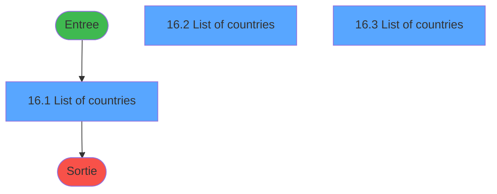
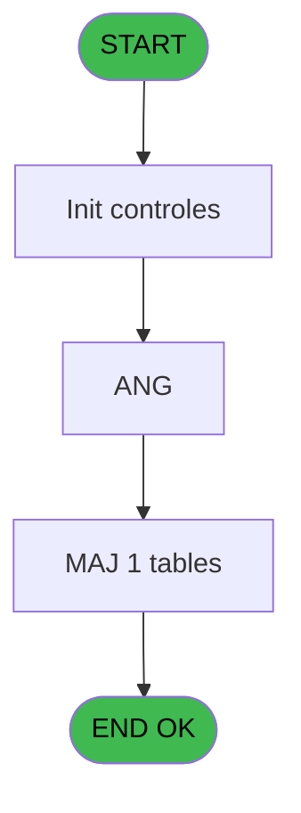
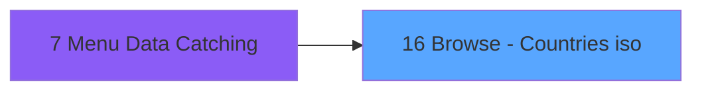
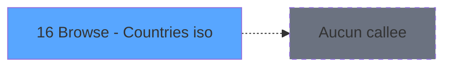

# ADH IDE 16 - Browse - Countries iso

> **Analyse**: Phases 1-4 2026-02-07 03:39 -> 03:39 (27s) | Assemblage 03:39
> **Pipeline**: V7.2 Enrichi
> **Structure**: 4 onglets (Resume | Ecrans | Donnees | Connexions)

<!-- TAB:Resume -->

## 1. FICHE D'IDENTITE

| Attribut | Valeur |
|----------|--------|
| Projet | ADH |
| IDE Position | 16 |
| Nom Programme | Browse - Countries iso |
| Fichier source | `Prg_16.xml` |
| Dossier IDE | General |
| Taches | 4 (3 ecrans visibles) |
| Tables modifiees | 1 |
| Programmes appeles | 0 |

## 2. DESCRIPTION FONCTIONNELLE

**Browse - Countries iso** assure la gestion complete de ce processus, accessible depuis [Menu Data Catching (IDE 7)](ADH-IDE-7.md).

Le flux de traitement s'organise en **1 blocs fonctionnels** :

- **Traitement** (4 taches) : traitements metier divers

**Donnees modifiees** : 1 tables en ecriture (type_repas_nenc_vill).

Detail : phases du traitement

#### Phase 1 : Traitement (4 taches)

- **16** - Browse - Countries iso **[[ECRAN]](#ecran-t1)**
- **16.1** - List of countries **[[ECRAN]](#ecran-t2)**
- **16.2** - List of countries **[[ECRAN]](#ecran-t3)**
- **16.3** - List of countries **[[ECRAN]](#ecran-t4)**

#### Tables impactees

| Table | Operations | Role metier |
|-------|-----------|-------------|
| type_repas_nenc_vill | **W** (3 usages) |  |

## 3. BLOCS FONCTIONNELS

### 3.1 Traitement (4 taches)

Traitements internes.

---

#### 16 - Browse - Countries iso [[ECRAN]](#ecran-t1)

**Role** : Traitement : Browse - Countries iso.
**Ecran** : 537 x 331 DLU (MDI) | [Voir mockup](#ecran-t1)

3 sous-taches directes

| Tache | Nom | Bloc |
|-------|-----|------|
| [16.1](#t2) | List of countries **[[ECRAN]](#ecran-t2)** | Traitement |
| [16.2](#t3) | List of countries **[[ECRAN]](#ecran-t3)** | Traitement |
| [16.3](#t4) | List of countries **[[ECRAN]](#ecran-t4)** | Traitement |

---

#### 16.1 - List of countries [[ECRAN]](#ecran-t2)

**Role** : Traitement : List of countries.
**Ecran** : 537 x 331 DLU (MDI) | [Voir mockup](#ecran-t2)

---

#### 16.2 - List of countries [[ECRAN]](#ecran-t3)

**Role** : Traitement : List of countries.
**Ecran** : 537 x 331 DLU (MDI) | [Voir mockup](#ecran-t3)

---

#### 16.3 - List of countries [[ECRAN]](#ecran-t4)

**Role** : Traitement : List of countries.
**Ecran** : 537 x 331 DLU (MDI) | [Voir mockup](#ecran-t4)

## 5. REGLES METIER

*(Aucune regle metier identifiee)*

## 6. CONTEXTE

- **Appele par**: [Menu Data Catching (IDE 7)](ADH-IDE-7.md)
- **Appelle**: 0 programmes | **Tables**: 1 (W:1 R:0 L:0) | **Taches**: 4 | **Expressions**: 3

<!-- TAB:Ecrans -->

## 8. ECRANS

### 8.1 Forms visibles (3 / 4)

| # | Position | Tache | Nom | Type | Largeur | Hauteur | Bloc |
|---|----------|-------|-----|------|---------|---------|------|
| 1 | 16.1 | 16.1 | List of countries | MDI | 537 | 331 | Traitement |
| 2 | 16.2 | 16.2 | List of countries | MDI | 537 | 331 | Traitement |
| 3 | 16.3 | 16.3 | List of countries | MDI | 537 | 331 | Traitement |

### 8.2 Mockups Ecrans

---

#### 16.1 - List of countries
**Tache** : [16.1](#t2) | **Type** : MDI | **Dimensions** : 537 x 331 DLU
**Bloc** : Traitement | **Titre IDE** : List of countries

<!-- FORM-DATA:
{
    "width":  537,
    "vFactor":  8,
    "type":  "MDI",
    "hFactor":  4,
    "controls":  [
                     {
                         "x":  2,
                         "type":  "label",
                         "var":  "",
                         "y":  1,
                         "w":  532,
                         "fmt":  "",
                         "name":  "",
                         "h":  39,
                         "color":  "200",
                         "text":  "",
                         "parent":  null
                     },
                     {
                         "x":  21,
                         "type":  "label",
                         "var":  "",
                         "y":  13,
                         "w":  512,
                         "fmt":  "",
                         "name":  "",
                         "h":  14,
                         "color":  "205",
                         "text":  "Please choose your country of residence from the list and click \"Select\"",
                         "parent":  1
                     },
                     {
                         "x":  59,
                         "type":  "label",
                         "var":  "",
                         "y":  48,
                         "w":  117,
                         "fmt":  "",
                         "name":  "",
                         "h":  13,
                         "color":  "201",
                         "text":  "Countries",
                         "parent":  null
                     },
                     {
                         "x":  78,
                         "type":  "table",
                         "var":  "",
                         "name":  "",
                         "titleH":  12,
                         "color":  "110",
                         "w":  323,
                         "y":  64,
                         "fmt":  "",
                         "parent":  null,
                         "text":  "",
                         "rowH":  19,
                         "h":  209,
                         "cols":  [
                                      {
                                          "title":  "",
                                          "layer":  1,
                                          "w":  309
                                      }
                                  ],
                         "rows":  1
                     },
                     {
                         "x":  90,
                         "type":  "edit",
                         "var":  "",
                         "y":  67,
                         "w":  293,
                         "fmt":  "",
                         "name":  "",
                         "h":  12,
                         "color":  "205",
                         "text":  "",
                         "parent":  7
                     },
                     {
                         "x":  401,
                         "type":  "button",
                         "var":  "",
                         "y":  63,
                         "w":  60,
                         "fmt":  "ñ",
                         "name":  "",
                         "h":  106,
                         "color":  "110",
                         "text":  "",
                         "parent":  null
                     },
                     {
                         "x":  473,
                         "type":  "button",
                         "var":  "",
                         "y":  63,
                         "w":  60,
                         "fmt":  "Ù",
                         "name":  "",
                         "h":  106,
                         "color":  "110",
                         "text":  "",
                         "parent":  null
                     },
                     {
                         "x":  401,
                         "type":  "button",
                         "var":  "",
                         "y":  170,
                         "w":  60,
                         "fmt":  "ò",
                         "name":  "",
                         "h":  102,
                         "color":  "110",
                         "text":  "",
                         "parent":  null
                     },
                     {
                         "x":  473,
                         "type":  "button",
                         "var":  "",
                         "y":  170,
                         "w":  60,
                         "fmt":  "Ú",
                         "name":  "",
                         "h":  102,
                         "color":  "110",
                         "text":  "",
                         "parent":  null
                     },
                     {
                         "x":  41,
                         "type":  "button",
                         "var":  "",
                         "y":  296,
                         "w":  93,
                         "fmt":  "Exit",
                         "name":  "",
                         "h":  29,
                         "color":  "110",
                         "text":  "",
                         "parent":  null
                     },
                     {
                         "x":  402,
                         "type":  "button",
                         "var":  "",
                         "y":  296,
                         "w":  93,
                         "fmt":  "Select",
                         "name":  "",
                         "h":  29,
                         "color":  "110",
                         "text":  "",
                         "parent":  null
                     },
                     {
                         "x":  96,
                         "type":  "image",
                         "var":  "",
                         "y":  63,
                         "w":  311,
                         "fmt":  "",
                         "name":  "",
                         "h":  234,
                         "color":  "6",
                         "text":  "",
                         "parent":  null
                     }
                 ],
    "taskId":  "16.1",
    "height":  331
}
-->

<strong>Champs : 1 champs</strong>

| Pos (x,y) | Nom | Variable | Type |
|-----------|-----|----------|------|
| 90,67 | (sans nom) | - | edit |

<strong>Boutons : 6 boutons</strong>

| Bouton | Pos (x,y) | Action |
|--------|-----------|--------|
| ñ | 401,63 | Bouton fonctionnel |
| Ù | 473,63 | Bouton fonctionnel |
| ò | 401,170 | Bouton fonctionnel |
| Ú | 473,170 | Bouton fonctionnel |
| Exit | 41,296 | Quitte le programme |
| Select | 402,296 | Ouvre la selection |

---

#### 16.2 - List of countries
**Tache** : [16.2](#t3) | **Type** : MDI | **Dimensions** : 537 x 331 DLU
**Bloc** : Traitement | **Titre IDE** : List of countries

<!-- FORM-DATA:
{
    "width":  537,
    "vFactor":  8,
    "type":  "MDI",
    "hFactor":  4,
    "controls":  [
                     {
                         "x":  2,
                         "type":  "label",
                         "var":  "",
                         "y":  1,
                         "w":  532,
                         "fmt":  "",
                         "name":  "",
                         "h":  39,
                         "color":  "200",
                         "text":  "",
                         "parent":  null
                     },
                     {
                         "x":  16,
                         "type":  "label",
                         "var":  "",
                         "y":  13,
                         "w":  516,
                         "fmt":  "",
                         "name":  "",
                         "h":  14,
                         "color":  "205",
                         "text":  "Veuillez s\u0027il vous plait, choisir, votre pays de résidence dans la liste, et appuyer sur \"Select\"",
                         "parent":  1
                     },
                     {
                         "x":  59,
                         "type":  "label",
                         "var":  "",
                         "y":  48,
                         "w":  117,
                         "fmt":  "",
                         "name":  "",
                         "h":  13,
                         "color":  "201",
                         "text":  "Pays",
                         "parent":  null
                     },
                     {
                         "x":  78,
                         "type":  "table",
                         "var":  "",
                         "name":  "",
                         "titleH":  12,
                         "color":  "205",
                         "w":  323,
                         "y":  64,
                         "fmt":  "",
                         "parent":  null,
                         "text":  "",
                         "rowH":  19,
                         "h":  209,
                         "cols":  [
                                      {
                                          "title":  "",
                                          "layer":  1,
                                          "w":  309
                                      }
                                  ],
                         "rows":  1
                     },
                     {
                         "x":  90,
                         "type":  "edit",
                         "var":  "",
                         "y":  67,
                         "w":  293,
                         "fmt":  "U30",
                         "name":  "",
                         "h":  12,
                         "color":  "205",
                         "text":  "",
                         "parent":  7
                     },
                     {
                         "x":  401,
                         "type":  "button",
                         "var":  "",
                         "y":  63,
                         "w":  60,
                         "fmt":  "ñ",
                         "name":  "",
                         "h":  106,
                         "color":  "110",
                         "text":  "",
                         "parent":  null
                     },
                     {
                         "x":  473,
                         "type":  "button",
                         "var":  "",
                         "y":  63,
                         "w":  60,
                         "fmt":  "Ù",
                         "name":  "",
                         "h":  106,
                         "color":  "110",
                         "text":  "",
                         "parent":  null
                     },
                     {
                         "x":  401,
                         "type":  "button",
                         "var":  "",
                         "y":  170,
                         "w":  60,
                         "fmt":  "ò",
                         "name":  "",
                         "h":  102,
                         "color":  "110",
                         "text":  "",
                         "parent":  null
                     },
                     {
                         "x":  473,
                         "type":  "button",
                         "var":  "",
                         "y":  170,
                         "w":  60,
                         "fmt":  "Ú",
                         "name":  "",
                         "h":  102,
                         "color":  "110",
                         "text":  "",
                         "parent":  null
                     },
                     {
                         "x":  41,
                         "type":  "button",
                         "var":  "",
                         "y":  296,
                         "w":  93,
                         "fmt":  "Retour",
                         "name":  "",
                         "h":  29,
                         "color":  "110",
                         "text":  "",
                         "parent":  null
                     },
                     {
                         "x":  402,
                         "type":  "button",
                         "var":  "",
                         "y":  296,
                         "w":  93,
                         "fmt":  "Selectionner",
                         "name":  "",
                         "h":  29,
                         "color":  "110",
                         "text":  "",
                         "parent":  null
                     },
                     {
                         "x":  96,
                         "type":  "image",
                         "var":  "",
                         "y":  63,
                         "w":  311,
                         "fmt":  "",
                         "name":  "",
                         "h":  234,
                         "color":  "6",
                         "text":  "",
                         "parent":  null
                     }
                 ],
    "taskId":  "16.2",
    "height":  331
}
-->

<strong>Champs : 1 champs</strong>

| Pos (x,y) | Nom | Variable | Type |
|-----------|-----|----------|------|
| 90,67 | U30 | - | edit |

<strong>Boutons : 6 boutons</strong>

| Bouton | Pos (x,y) | Action |
|--------|-----------|--------|
| ñ | 401,63 | Bouton fonctionnel |
| Ù | 473,63 | Bouton fonctionnel |
| ò | 401,170 | Bouton fonctionnel |
| Ú | 473,170 | Bouton fonctionnel |
| Retour | 41,296 | Annule et retour au menu |
| Selectionner | 402,296 | Ouvre la selection |

---

#### 16.3 - List of countries
**Tache** : [16.3](#t4) | **Type** : MDI | **Dimensions** : 537 x 331 DLU
**Bloc** : Traitement | **Titre IDE** : List of countries

<!-- FORM-DATA:
{
    "width":  537,
    "vFactor":  8,
    "type":  "MDI",
    "hFactor":  4,
    "controls":  [
                     {
                         "x":  2,
                         "type":  "label",
                         "var":  "",
                         "y":  1,
                         "w":  532,
                         "fmt":  "",
                         "name":  "",
                         "h":  39,
                         "color":  "200",
                         "text":  "",
                         "parent":  null
                     },
                     {
                         "x":  16,
                         "type":  "label",
                         "var":  "",
                         "y":  13,
                         "w":  516,
                         "fmt":  "",
                         "name":  "",
                         "h":  14,
                         "color":  "205",
                         "text":  "Veuillez s\u0027il vous plait, choisir, votre pays de résidence dans la liste, et appuyer sur \"Select\"",
                         "parent":  1
                     },
                     {
                         "x":  59,
                         "type":  "label",
                         "var":  "",
                         "y":  48,
                         "w":  117,
                         "fmt":  "",
                         "name":  "",
                         "h":  13,
                         "color":  "201",
                         "text":  "Pays",
                         "parent":  null
                     },
                     {
                         "x":  78,
                         "type":  "table",
                         "var":  "",
                         "name":  "",
                         "titleH":  12,
                         "color":  "205",
                         "w":  323,
                         "y":  64,
                         "fmt":  "",
                         "parent":  null,
                         "text":  "",
                         "rowH":  19,
                         "h":  209,
                         "cols":  [
                                      {
                                          "title":  "",
                                          "layer":  1,
                                          "w":  309
                                      }
                                  ],
                         "rows":  1
                     },
                     {
                         "x":  90,
                         "type":  "edit",
                         "var":  "",
                         "y":  67,
                         "w":  293,
                         "fmt":  "U30",
                         "name":  "",
                         "h":  12,
                         "color":  "205",
                         "text":  "",
                         "parent":  7
                     },
                     {
                         "x":  401,
                         "type":  "button",
                         "var":  "",
                         "y":  63,
                         "w":  60,
                         "fmt":  "ñ",
                         "name":  "",
                         "h":  106,
                         "color":  "110",
                         "text":  "",
                         "parent":  null
                     },
                     {
                         "x":  473,
                         "type":  "button",
                         "var":  "",
                         "y":  63,
                         "w":  60,
                         "fmt":  "Ù",
                         "name":  "",
                         "h":  106,
                         "color":  "110",
                         "text":  "",
                         "parent":  null
                     },
                     {
                         "x":  401,
                         "type":  "button",
                         "var":  "",
                         "y":  170,
                         "w":  60,
                         "fmt":  "ò",
                         "name":  "",
                         "h":  102,
                         "color":  "110",
                         "text":  "",
                         "parent":  null
                     },
                     {
                         "x":  473,
                         "type":  "button",
                         "var":  "",
                         "y":  170,
                         "w":  60,
                         "fmt":  "Ú",
                         "name":  "",
                         "h":  102,
                         "color":  "110",
                         "text":  "",
                         "parent":  null
                     },
                     {
                         "x":  41,
                         "type":  "button",
                         "var":  "",
                         "y":  296,
                         "w":  93,
                         "fmt":  "Retour",
                         "name":  "",
                         "h":  29,
                         "color":  "110",
                         "text":  "",
                         "parent":  null
                     },
                     {
                         "x":  402,
                         "type":  "button",
                         "var":  "",
                         "y":  296,
                         "w":  93,
                         "fmt":  "Selectionner",
                         "name":  "",
                         "h":  29,
                         "color":  "110",
                         "text":  "",
                         "parent":  null
                     },
                     {
                         "x":  96,
                         "type":  "image",
                         "var":  "",
                         "y":  63,
                         "w":  311,
                         "fmt":  "",
                         "name":  "",
                         "h":  234,
                         "color":  "6",
                         "text":  "",
                         "parent":  null
                     }
                 ],
    "taskId":  "16.3",
    "height":  331
}
-->

<strong>Champs : 1 champs</strong>

| Pos (x,y) | Nom | Variable | Type |
|-----------|-----|----------|------|
| 90,67 | U30 | - | edit |

<strong>Boutons : 6 boutons</strong>

| Bouton | Pos (x,y) | Action |
|--------|-----------|--------|
| ñ | 401,63 | Bouton fonctionnel |
| Ù | 473,63 | Bouton fonctionnel |
| ò | 401,170 | Bouton fonctionnel |
| Ú | 473,170 | Bouton fonctionnel |
| Retour | 41,296 | Annule et retour au menu |
| Selectionner | 402,296 | Ouvre la selection |

## 9. NAVIGATION

### 9.1 Enchainement des ecrans

**Detail par enchainement :**

| Depuis | Action | Vers | Retour |
|--------|--------|------|--------|

### 9.3 Structure hierarchique (4 taches)

| Position | Tache | Type | Dimensions | Bloc |
|----------|-------|------|------------|------|
| **16.1** | [**Browse - Countries iso** (16)](#t1) [mockup](#ecran-t1) | MDI | 537x331 | Traitement |
| 16.1.1 | [List of countries (16.1)](#t2) [mockup](#ecran-t2) | MDI | 537x331 | |
| 16.1.2 | [List of countries (16.2)](#t3) [mockup](#ecran-t3) | MDI | 537x331 | |
| 16.1.3 | [List of countries (16.3)](#t4) [mockup](#ecran-t4) | MDI | 537x331 | |

### 9.4 Algorigramme

> **Legende**: Vert = START/END OK | Rouge = END KO | Bleu = Decisions
> *Algorigramme auto-genere. Utiliser `/algorigramme` pour une synthese metier detaillee.*

<!-- TAB:Donnees -->

## 10. TABLES

### Tables utilisees (1)

| ID | Nom | Description | Type | R | W | L | Usages |
|----|-----|-------------|------|---|---|---|--------|
| 784 | type_repas_nenc_vill |  | DB |   | **W** |   | 3 |

### Colonnes par table (0 / 1 tables avec colonnes identifiees)

Table 784 - type_repas_nenc_vill (**W**) - 3 usages

*Table utilisee uniquement en Link ou aucune colonne Real identifiee dans le DataView.*

## 11. VARIABLES

### 11.1 Autres (2)

Variables diverses.

| Lettre | Nom | Type | Usage dans |
|--------|-----|------|-----------|
| A | PARAM LANGUAGE | Alpha | - |
| B | PARAM COUNTRY CODE ISO | Alpha | - |

## 12. EXPRESSIONS

**3 / 3 expressions decodees (100%)**

### 12.1 Repartition par type

| Type | Expressions | Regles |
|------|-------------|--------|
| CONDITION | 3 | 0 |

### 12.2 Expressions cles par type

#### CONDITION (3 expressions)

| Type | IDE | Expression | Regle |
|------|-----|------------|-------|
| CONDITION | 3 | `GetParam ('LANGUAGE')='SPA'` | - |
| CONDITION | 2 | `GetParam ('LANGUAGE')='FRE'` | - |
| CONDITION | 1 | `GetParam ('LANGUAGE')<>'FRE'` | - |

<!-- TAB:Connexions -->

## 13. GRAPHE D'APPELS

### 13.1 Chaine depuis Main (Callers)

Main -> ... -> [Menu Data Catching (IDE 7)](ADH-IDE-7.md) -> **Browse - Countries iso (IDE 16)**

### 13.2 Callers

| IDE | Nom Programme | Nb Appels |
|-----|---------------|-----------|
| [7](ADH-IDE-7.md) | Menu Data Catching | 1 |

### 13.3 Callees (programmes appeles)

### 13.4 Detail Callees avec contexte

| IDE | Nom Programme | Appels | Contexte |
|-----|---------------|--------|----------|
| - | (aucun) | - | - |

## 14. RECOMMANDATIONS MIGRATION

### 14.1 Profil du programme

| Metrique | Valeur | Impact migration |
|----------|--------|-----------------|
| Lignes de logique | 43 | Programme compact |
| Expressions | 3 | Peu de logique |
| Tables WRITE | 1 | Impact faible |
| Sous-programmes | 0 | Peu de dependances |
| Ecrans visibles | 3 | Quelques ecrans |
| Code desactive | 0% (0 / 43) | Code sain |
| Regles metier | 0 | Pas de regle identifiee |

### 14.2 Plan de migration par bloc

#### Traitement (4 taches: 4 ecrans, 0 traitement)

- **Strategie** : 4 composant(s) UI (Razor/React) avec formulaires et validation.
- Decomposer les taches en services unitaires testables.

### 14.3 Dependances critiques

| Dependance | Type | Appels | Impact |
|------------|------|--------|--------|
| type_repas_nenc_vill | Table WRITE (Database) | 3x | Schema + repository |

---
*Spec DETAILED generee par Pipeline V7.2 - 2026-02-07 03:39*
