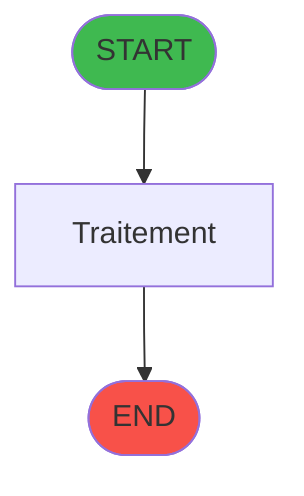
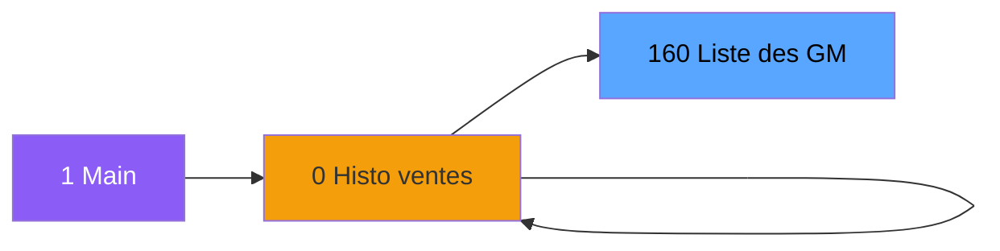

# ADH IDE 160 - Liste des GM

> **Version spec**: 3.5
> **Analyse**: 2026-01-27 17:57
> **Source**: `Prg_XXX.xml`

---

<!-- TAB:Fonctionnel -->

## SPECIFICATION FONCTIONNELLE

### 1.1 Objectif metier

| Element | Description |
|---------|-------------|
| **Qui** | Operateur |
| **Quoi** | Liste des GM
 |
| **Pourquoi** | A documenter |
| **Declencheur** | A identifier |

### 1.2 Regles metier

| Code | Regle | Condition |
|------|-------|-----------|
| RM-001 | A documenter | - |

### 1.3 Flux utilisateur

1. Demarrage programme
2. Traitement principal
3. Fin programme

### 1.4 Cas d'erreur

| Erreur | Comportement |
|--------|--------------|
| - | A documenter |

---

<!-- TAB:Technique -->

## SPECIFICATION TECHNIQUE

### 2.1 Identification

| Attribut | Valeur |
|----------|--------|
| **Format IDE** | ADH IDE 160 |
| **Description** | Liste des GM
 |
| **Module** | ADH |

### 2.2 Tables

| # | Nom logique | Nom physique | Acces | Usage |
|---|-------------|--------------|-------|-------|
| 30 | gm-recherche_____gmr | `cafil008_dat` | R | 1x |
| 47 | compte_gm________cgm | `cafil025_dat` | L | 1x |
| 312 | ez_card | `ezcard` | L | 1x |
| 312 | ez_card | `ezcard` | **W** | 1x |
| 612 | tempo_present_excel | `%club_user%tmp_prex_dat` | L | 1x |
| 844 | stat_vendeur | `%club_user%_stat_vendeur` | L | 1x |
### 2.3 Parametres d'entree

| Variable | Nom | Type | Picture |
|----------|-----|------|---------|
| - | Aucun parametre | - | - |
### 2.4 Algorigramme

### 2.5 Expressions cles

| IDE | Expression | Commentaire |
|-----|------------|-------------|
| 1 | `{0,9}<>'---' AND Trim({0,6})<>''` | - |
| 2 | `{0,9}='---' OR Trim({0,6})=''` | - |
| 3 | `{0,1}` | - |
| 4 | `Val(MID({0,8},3,10),'10')` | - |
| 5 | `Val(Left({0,8},2),'2')` | - |
| 6 | `{0,29}` | - |
| 7 | `CallProg('{160,-1}'PROG,{0,25},{0,29},{0,30})` | - |
| 8 | `{0,34}` | - |
| 9 | `{0,33}='O'` | - |
| 10 | `Trim({0,34})<>''` | - |
| 11 | `{0,35} AND ({0,37}*1000+{0,38}<>{0,29}*1000+{0,...` | - |
| 12 | `{0,46}` | - |
| 13 | `Trim({0,46})<>'' AND Trim({0,46})<>Trim({0,34})` | - |
| 14 | `1` | - |
| 15 | `Trim({0,46})='' AND Trim({0,34})<>''` | - |
| 16 | `{0,47}=1` | - |
| 17 | `{0,47}<>1` | - |
| 18 | `{32768,11}` | - |
| 19 | `{0,21}` | - |
| 20 | `Str({0,47},'#')` | - |

> **Total**: 26 expressions (affichees: 20)
### 2.6 Variables importantes

### 2.7 Statistiques

| Metrique | Valeur |
|----------|--------|
| **Taches** | 2 |
| **Lignes logique** | 112 |
| **Lignes desactivees** | 0 |
---

<!-- TAB:Cartographie -->

## CARTOGRAPHIE APPLICATIVE

### 3.1 Chaine d'appels depuis Main

### 3.2 Callers directs

| IDE | Programme | Nb appels |
|-----|-----------|-----------|
| 0 | Garantie sur compte PMS-584 | 2 |
| 0 | VAD validés à imprimer | 1 |
### 3.3 Callees

| Niv | IDE | Programme | Nb appels |
|-----|-----|-----------|-----------|
| - | - | Programme terminal | - |
### 3.4 Verification orphelin

| Critere | Resultat |
|---------|----------|
| Callers actifs | A verifier |
| **Conclusion** | A analyser |

---

## HISTORIQUE

| Date | Action | Auteur |
|------|--------|--------|
| 2026-01-27 20:21 | **DATA V2** - Tables reelles, Expressions, Stats, CallChain | Script |
| 2026-01-27 19:47 | **DATA POPULATED** - Tables, Callgraph (26 expr) | Script |
| 2026-01-27 17:57 | **Upgrade V3.5** - TAB markers, Mermaid | Claude |

---

*Specification V3.5 - Format avec TAB markers et Mermaid*
