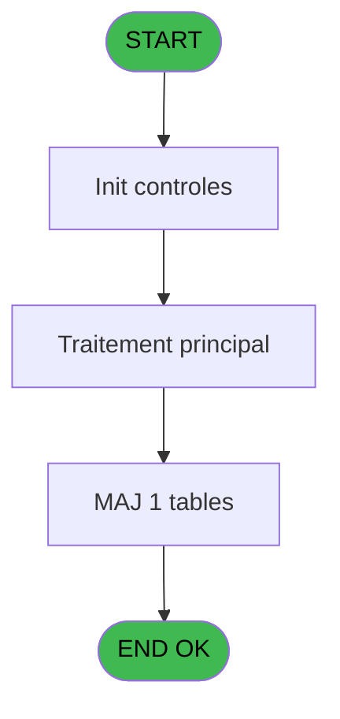
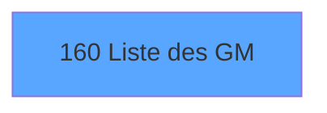

# ADH IDE 160 - Liste des GM

> **Analyse**: Phases 1-4 2026-02-07 03:51 -> 03:43 (23h51min) | Assemblage 03:43
> **Pipeline**: V7.2 Enrichi
> **Structure**: 4 onglets (Resume | Ecrans | Donnees | Connexions)

<!-- TAB:Resume -->

## 1. FICHE D'IDENTITE

| Attribut | Valeur |
|----------|--------|
| Projet | ADH |
| IDE Position | 160 |
| Nom Programme | Liste des GM |
| Fichier source | `Prg_160.xml` |
| Dossier IDE | General |
| Taches | 2 (1 ecrans visibles) |
| Tables modifiees | 1 |
| Programmes appeles | 0 |
| Complexite | **BASSE** (score 7/100) |

## 2. DESCRIPTION FONCTIONNELLE

Basé sur le contexte fourni, je peux voir qu'il s'agit d'une tâche relative au projet **Lecteur_Magic** (migration Magic Unipaas vers moderne). Cependant, le programme **ADH IDE 160** mentionné dans votre requête ne correspond pas exactement à la documentation OpenSpec fournie.

Selon la mémoire globale, **ADH IDE 160** est documenté comme **GetCMP (Club Med Pass)** - un programme qui récupère les informations de carte Club Med Pass pour un compte. Ce programme a déjà été migré en API C# (endpoint `/api/members/club-med-pass/{societe}/{compte}/{filiation}`).

Avant de rédiger la description, j'ai besoin de clarifier :

1. **Confirmez-vous que c'est ADH IDE 160** ou s'agit-il d'un autre programme ADH ?
2. **Quelle source utilisez-vous** : souhaitez-vous que je génère une description basée sur l'analyse Magic actuelle ou sur la documentation OpenSpec existante ?
3. **Quel format** : simple paragraphe technique ou conforme au template de spec OpenSpec (section Fonctionnel/Technique) ?

Pouvez-vous clarifier ces points pour que je rédige une description précise et alignée avec vos standards ?

## 3. BLOCS FONCTIONNELS

### 3.1 Traitement (2 taches)

Traitements internes.

---

#### 160 - Liste des GM [[ECRAN]](#ecran-t1)

**Role** : Traitement : Liste des GM.
**Ecran** : 1440 x 224 DLU (MDI) | [Voir mockup](#ecran-t1)

---

#### 160.1 - Update Ezcard

**Role** : Traitement : Update Ezcard.

## 5. REGLES METIER

10 regles identifiees:

### Autres (10 regles)

#### [RM-001] Condition: [I]<>'---' AND Trim(CHG_PRV_v.num cmp [F]) different de

| Element | Detail |
|---------|--------|
| **Condition** | `[I]<>'---' AND Trim(CHG_PRV_v.num cmp [F])<>''` |
| **Si vrai** | Action si vrai |
| **Variables** | EN (v.num cmp), ES (CHG_PRV_v.num cmp) |
| **Expression source** | Expression 1 : `[I]<>'---' AND Trim(CHG_PRV_v.num cmp [F])<>''` |
| **Exemple** | Si [I]<>'---' AND Trim(CHG_PRV_v.num cmp [F])<>'' → Action si vrai |

#### [RM-002] Condition: [I]='---' OR Trim(CHG_PRV_v.num cmp [F]) egale

| Element | Detail |
|---------|--------|
| **Condition** | `[I]='---' OR Trim(CHG_PRV_v.num cmp [F])=''` |
| **Si vrai** | Action si vrai |
| **Variables** | EN (v.num cmp), ES (CHG_PRV_v.num cmp) |
| **Expression source** | Expression 2 : `[I]='---' OR Trim(CHG_PRV_v.num cmp [F])=''` |
| **Exemple** | Si [I]='---' OR Trim(CHG_PRV_v.num cmp [F])='' → Action si vrai |

#### [RM-003] Condition: [BG] egale 'O'

| Element | Detail |
|---------|--------|
| **Condition** | `[BG]='O'` |
| **Si vrai** | Action si vrai |
| **Expression source** | Expression 9 : `[BG]='O'` |
| **Exemple** | Si [BG]='O' → Action si vrai |

#### [RM-004] Condition: Trim([BH]) different de

| Element | Detail |
|---------|--------|
| **Condition** | `Trim([BH])<>''` |
| **Si vrai** | Action si vrai |
| **Expression source** | Expression 10 : `Trim([BH])<>''` |
| **Exemple** | Si Trim([BH])<>'' → Action si vrai |

#### [RM-005] Condition composite: [BI] AND ([BK]*1000+[BL]<>[BC]*1000+[BD] OR [BM]='O')

| Element | Detail |
|---------|--------|
| **Condition** | `[BI] AND ([BK]*1000+[BL]<>[BC]*1000+[BD] OR [BM]='O')` |
| **Si vrai** | Action si vrai |
| **Expression source** | Expression 11 : `[BI] AND ([BK]*1000+[BL]<>[BC]*1000+[BD] OR [BM]='O')` |
| **Exemple** | Si [BI] AND ([BK]*1000+[BL]<>[BC]*1000+[BD] OR [BM]='O') → Action si vrai |

#### [RM-006] Condition composite: Trim([BT])<>'' AND Trim([BT])<>Trim([BH])

| Element | Detail |
|---------|--------|
| **Condition** | `Trim([BT])<>'' AND Trim([BT])<>Trim([BH])` |
| **Si vrai** | Action si vrai |
| **Expression source** | Expression 13 : `Trim([BT])<>'' AND Trim([BT])<>Trim([BH])` |
| **Exemple** | Si Trim([BT])<>'' AND Trim([BT])<>Trim([BH]) → Action si vrai |

#### [RM-007] Condition: Trim([BT])='' AND Trim([BH]) different de

| Element | Detail |
|---------|--------|
| **Condition** | `Trim([BT])='' AND Trim([BH])<>''` |
| **Si vrai** | Action si vrai |
| **Expression source** | Expression 15 : `Trim([BT])='' AND Trim([BH])<>''` |
| **Exemple** | Si Trim([BT])='' AND Trim([BH])<>'' → Action si vrai |

#### [RM-008] Condition: [BU] egale 1

| Element | Detail |
|---------|--------|
| **Condition** | `[BU]=1` |
| **Si vrai** | Action si vrai |
| **Expression source** | Expression 16 : `[BU]=1` |
| **Exemple** | Si [BU]=1 → Action si vrai |

#### [RM-009] Condition: [BU] different de 1

| Element | Detail |
|---------|--------|
| **Condition** | `[BU]<>1` |
| **Si vrai** | Action si vrai |
| **Expression source** | Expression 17 : `[BU]<>1` |
| **Exemple** | Si [BU]<>1 → Action si vrai |

#### [RM-010] Traitement si Trim([BT]) est renseigne

| Element | Detail |
|---------|--------|
| **Condition** | `Trim([BT])<>'' AND Trim([BT])<>Trim([BH]) AND [BU]=1` |
| **Si vrai** | [BT] |
| **Si faux** | '') |
| **Expression source** | Expression 24 : `IF(Trim([BT])<>'' AND Trim([BT])<>Trim([BH]) AND [BU]=1,[BT]` |
| **Exemple** | Si Trim([BT])<>'' AND Trim([BT])<>Trim([BH]) AND [BU]=1 → [BT]. Sinon → '') |

## 6. CONTEXTE

- **Appele par**: [Garantie sur compte PMS-584 (IDE 0)](ADH-IDE-0.md), [VAD validés à imprimer (IDE 0)](ADH-IDE-0.md)
- **Appelle**: 0 programmes | **Tables**: 5 (W:1 R:1 L:4) | **Taches**: 2 | **Expressions**: 26

<!-- TAB:Ecrans -->

## 8. ECRANS

### 8.1 Forms visibles (1 / 2)

| # | Position | Tache | Nom | Type | Largeur | Hauteur | Bloc |
|---|----------|-------|-----|------|---------|---------|------|
| 1 | 160 | 160 | Liste des GM | MDI | 1440 | 224 | Traitement |

### 8.2 Mockups Ecrans

---

#### 160 - Liste des GM
**Tache** : [160](#t1) | **Type** : MDI | **Dimensions** : 1440 x 224 DLU
**Bloc** : Traitement | **Titre IDE** : Liste des GM

<!-- FORM-DATA:
{
    "width":  1440,
    "vFactor":  8,
    "type":  "MDI",
    "hFactor":  8,
    "controls":  [
                     {
                         "x":  8,
                         "type":  "table",
                         "var":  "",
                         "name":  "",
                         "titleH":  12,
                         "color":  "6",
                         "w":  1424,
                         "y":  5,
                         "fmt":  "",
                         "parent":  null,
                         "text":  "",
                         "rowH":  14,
                         "h":  212,
                         "cols":  [
                                      {
                                          "title":  "Titre",
                                          "layer":  1,
                                          "w":  83
                                      },
                                      {
                                          "title":  "Prénom",
                                          "layer":  2,
                                          "w":  130
                                      },
                                      {
                                          "title":  "Nom",
                                          "layer":  3,
                                          "w":  186
                                      },
                                      {
                                          "title":  "Age",
                                          "layer":  4,
                                          "w":  77
                                      },
                                      {
                                          "title":  "Séminaire",
                                          "layer":  5,
                                          "w":  242
                                      },
                                      {
                                          "title":  "Chambre",
                                          "layer":  6,
                                          "w":  158
                                      },
                                      {
                                          "title":  "Fidelisation",
                                          "layer":  7,
                                          "w":  298
                                      },
                                      {
                                          "title":  "",
                                          "layer":  8,
                                          "w":  82
                                      },
                                      {
                                          "title":  "CMP",
                                          "layer":  9,
                                          "w":  130
                                      }
                                  ],
                         "rows":  9
                     },
                     {
                         "x":  14,
                         "type":  "edit",
                         "var":  "",
                         "y":  20,
                         "w":  29,
                         "fmt":  "",
                         "name":  "eme_sexe",
                         "h":  10,
                         "color":  "6",
                         "text":  "",
                         "parent":  1
                     },
                     {
                         "x":  98,
                         "type":  "edit",
                         "var":  "",
                         "y":  20,
                         "w":  118,
                         "fmt":  "",
                         "name":  "eme_prenom",
                         "h":  10,
                         "color":  "6",
                         "text":  "",
                         "parent":  1
                     },
                     {
                         "x":  227,
                         "type":  "edit",
                         "var":  "",
                         "y":  20,
                         "w":  174,
                         "fmt":  "",
                         "name":  "eme_nom",
                         "h":  10,
                         "color":  "6",
                         "text":  "",
                         "parent":  1
                     },
                     {
                         "x":  413,
                         "type":  "edit",
                         "var":  "",
                         "y":  20,
                         "w":  40,
                         "fmt":  "",
                         "name":  "eme_age",
                         "h":  10,
                         "color":  "6",
                         "text":  "",
                         "parent":  1
                     },
                     {
                         "x":  491,
                         "type":  "edit",
                         "var":  "",
                         "y":  20,
                         "w":  230,
                         "fmt":  "",
                         "name":  "eme_seminaire",
                         "h":  10,
                         "color":  "6",
                         "text":  "",
                         "parent":  1
                     },
                     {
                         "x":  733,
                         "type":  "edit",
                         "var":  "",
                         "y":  20,
                         "w":  74,
                         "fmt":  "",
                         "name":  "eme_nom_logement",
                         "h":  10,
                         "color":  "6",
                         "text":  "",
                         "parent":  1
                     },
                     {
                         "x":  891,
                         "type":  "edit",
                         "var":  "",
                         "y":  20,
                         "w":  286,
                         "fmt":  "",
                         "name":  "libelle",
                         "h":  10,
                         "color":  "6",
                         "text":  "",
                         "parent":  1
                     },
                     {
                         "x":  1189,
                         "type":  "image",
                         "var":  "",
                         "y":  20,
                         "w":  29,
                         "fmt":  "",
                         "name":  "",
                         "h":  11,
                         "color":  "",
                         "text":  "",
                         "parent":  1
                     },
                     {
                         "x":  1229,
                         "type":  "image",
                         "var":  "",
                         "y":  20,
                         "w":  29,
                         "fmt":  "",
                         "name":  "",
                         "h":  11,
                         "color":  "",
                         "text":  "",
                         "parent":  1
                     },
                     {
                         "x":  1270,
                         "type":  "edit",
                         "var":  "",
                         "y":  20,
                         "w":  118,
                         "fmt":  "10",
                         "name":  "card_code",
                         "h":  10,
                         "color":  "6",
                         "text":  "",
                         "parent":  1
                     }
                 ],
    "taskId":  "160",
    "height":  224
}
-->

<strong>Champs : 8 champs</strong>

| Pos (x,y) | Nom | Variable | Type |
|-----------|-----|----------|------|
| 14,20 | eme_sexe | - | edit |
| 98,20 | eme_prenom | - | edit |
| 227,20 | eme_nom | - | edit |
| 413,20 | eme_age | - | edit |
| 491,20 | eme_seminaire | - | edit |
| 733,20 | eme_nom_logement | - | edit |
| 891,20 | libelle | - | edit |
| 1270,20 | card_code | - | edit |

## 9. NAVIGATION

Ecran unique: **Liste des GM**

### 9.3 Structure hierarchique (2 taches)

| Position | Tache | Type | Dimensions | Bloc |
|----------|-------|------|------------|------|
| **160.1** | [**Liste des GM** (160)](#t1) [mockup](#ecran-t1) | MDI | 1440x224 | Traitement |
| 160.1.1 | [Update Ezcard (160.1)](#t2) | - | - | |

### 9.4 Algorigramme

> **Legende**: Vert = START/END OK | Rouge = END KO | Bleu = Decisions
> *Algorigramme auto-genere. Utiliser `/algorigramme` pour une synthese metier detaillee.*

<!-- TAB:Donnees -->

## 10. TABLES

### Tables utilisees (5)

| ID | Nom | Description | Type | R | W | L | Usages |
|----|-----|-------------|------|---|---|---|--------|
| 312 | ez_card |  | DB |   | **W** | L | 2 |
| 30 | gm-recherche_____gmr | Index de recherche | DB | R |   |   | 1 |
| 47 | compte_gm________cgm | Comptes GM (generaux) | DB |   |   | L | 1 |
| 612 | tempo_present_excel | Table temporaire ecran | TMP |   |   | L | 1 |
| 844 | stat_vendeur |  | TMP |   |   | L | 1 |

### Colonnes par table (2 / 2 tables avec colonnes identifiees)

Table 312 - ez_card (**W**/L) - 2 usages

| Lettre | Variable | Acces | Type |
|--------|----------|-------|------|
| EN | P.Card Id | W | Unicode |

Table 30 - gm-recherche_____gmr (R) - 1 usages

| Lettre | Variable | Acces | Type |
|--------|----------|-------|------|
| A | v.num cmp | R | Unicode |
| B | v.retour carte deja attribuee | R | Logical |
| C | v.variable change en cours | R | Logical |
| D | v.last good row | R | Numeric |
| E | CHG_REASON_v.num cmp | R | Numeric |
| F | CHG_PRV_v.num cmp | R | Unicode |
| G | retour confirmation | R | Numeric |

## 11. VARIABLES

### 11.1 Variables de session (4)

Variables persistantes pendant toute la session.

| Lettre | Nom | Type | Usage dans |
|--------|-----|------|-----------|
| EN | v.num cmp | Unicode | 3x session |
| EO | v.retour carte deja attribuee | Logical | - |
| EP | v.variable change en cours | Logical | - |
| EQ | v.last good row | Numeric | - |

### 11.2 Autres (3)

Variables diverses.

| Lettre | Nom | Type | Usage dans |
|--------|-----|------|-----------|
| ER | CHG_REASON_v.num cmp | Numeric | - |
| ES | CHG_PRV_v.num cmp | Unicode | 2x refs |
| ET | retour confirmation | Numeric | - |

## 12. EXPRESSIONS

**26 / 26 expressions decodees (100%)**

### 12.1 Repartition par type

| Type | Expressions | Regles |
|------|-------------|--------|
| CALCULATION | 1 | 0 |
| CONDITION | 11 | 10 |
| CONSTANTE | 1 | 0 |
| OTHER | 7 | 0 |
| REFERENCE_VG | 1 | 0 |
| CAST_LOGIQUE | 2 | 0 |
| STRING | 2 | 0 |
| FORMAT | 1 | 0 |

### 12.2 Expressions cles par type

#### CALCULATION (1 expressions)

| Type | IDE | Expression | Regle |
|------|-----|------------|-------|
| CALCULATION | 7 | `CallProg('{160,-1}'PROG,[Y],[BC],[BD])` | - |

#### CONDITION (11 expressions)

| Type | IDE | Expression | Regle |
|------|-----|------------|-------|
| CONDITION | 13 | `Trim([BT])<>'' AND Trim([BT])<>Trim([BH])` | [RM-006](#rm-RM-006) |
| CONDITION | 24 | `IF(Trim([BT])<>'' AND Trim([BT])<>Trim([BH]) AND [BU]=1,[BT],'')` | [RM-010](#rm-RM-010) |
| CONDITION | 15 | `Trim([BT])='' AND Trim([BH])<>''` | [RM-007](#rm-RM-007) |
| CONDITION | 17 | `[BU]<>1` | [RM-009](#rm-RM-009) |
| CONDITION | 16 | `[BU]=1` | [RM-008](#rm-RM-008) |
| ... | | *+6 autres* | |

#### CONSTANTE (1 expressions)

| Type | IDE | Expression | Regle |
|------|-----|------------|-------|
| CONSTANTE | 14 | `1` | - |

#### OTHER (7 expressions)

| Type | IDE | Expression | Regle |
|------|-----|------------|-------|
| OTHER | 19 | `[U]` | - |
| OTHER | 23 | `NOT([BQ])` | - |
| OTHER | 26 | `CurRow(0)` | - |
| OTHER | 12 | `[BT]` | - |
| OTHER | 3 | `v.num cmp [A]` | - |
| ... | | *+2 autres* | |

#### REFERENCE_VG (1 expressions)

| Type | IDE | Expression | Regle |
|------|-----|------------|-------|
| REFERENCE_VG | 18 | `VG11` | - |

#### CAST_LOGIQUE (2 expressions)

| Type | IDE | Expression | Regle |
|------|-----|------------|-------|
| CAST_LOGIQUE | 22 | `'FALSE'LOG` | - |
| CAST_LOGIQUE | 21 | `'TRUE'LOG` | - |

#### STRING (2 expressions)

| Type | IDE | Expression | Regle |
|------|-----|------------|-------|
| STRING | 5 | `Val(Left([H],2),'2')` | - |
| STRING | 4 | `Val(MID([H],3,10),'10')` | - |

#### FORMAT (1 expressions)

| Type | IDE | Expression | Regle |
|------|-----|------------|-------|
| FORMAT | 20 | `Str([BU],'#')` | - |

### 12.3 Toutes les expressions (26)

Voir les 26 expressions

#### CALCULATION (1)

| IDE | Expression Decodee |
|-----|-------------------|
| 7 | `CallProg('{160,-1}'PROG,[Y],[BC],[BD])` |

#### CONDITION (11)

| IDE | Expression Decodee |
|-----|-------------------|
| 25 | `CtrlGoto('card_code',IF(CurRow(0)>[BR],CurRow(0)+1,CurRow(0)-1),0)` |
| 1 | `[I]<>'---' AND Trim(CHG_PRV_v.num cmp [F])<>''` |
| 2 | `[I]='---' OR Trim(CHG_PRV_v.num cmp [F])=''` |
| 9 | `[BG]='O'` |
| 10 | `Trim([BH])<>''` |
| 11 | `[BI] AND ([BK]*1000+[BL]<>[BC]*1000+[BD] OR [BM]='O')` |
| 13 | `Trim([BT])<>'' AND Trim([BT])<>Trim([BH])` |
| 15 | `Trim([BT])='' AND Trim([BH])<>''` |
| 16 | `[BU]=1` |
| 17 | `[BU]<>1` |
| 24 | `IF(Trim([BT])<>'' AND Trim([BT])<>Trim([BH]) AND [BU]=1,[BT],'')` |

#### CONSTANTE (1)

| IDE | Expression Decodee |
|-----|-------------------|
| 14 | `1` |

#### OTHER (7)

| IDE | Expression Decodee |
|-----|-------------------|
| 3 | `v.num cmp [A]` |
| 6 | `[BC]` |
| 8 | `[BH]` |
| 12 | `[BT]` |
| 19 | `[U]` |
| 23 | `NOT([BQ])` |
| 26 | `CurRow(0)` |

#### REFERENCE_VG (1)

| IDE | Expression Decodee |
|-----|-------------------|
| 18 | `VG11` |

#### CAST_LOGIQUE (2)

| IDE | Expression Decodee |
|-----|-------------------|
| 21 | `'TRUE'LOG` |
| 22 | `'FALSE'LOG` |

#### STRING (2)

| IDE | Expression Decodee |
|-----|-------------------|
| 4 | `Val(MID([H],3,10),'10')` |
| 5 | `Val(Left([H],2),'2')` |

#### FORMAT (1)

| IDE | Expression Decodee |
|-----|-------------------|
| 20 | `Str([BU],'#')` |

<!-- TAB:Connexions -->

## 13. GRAPHE D'APPELS

### 13.1 Chaine depuis Main (Callers)

Main -> ... -> [Garantie sur compte PMS-584 (IDE 0)](ADH-IDE-0.md) -> **Liste des GM (IDE 160)**

Main -> ... -> [VAD validés à imprimer (IDE 0)](ADH-IDE-0.md) -> **Liste des GM (IDE 160)**

### 13.2 Callers

| IDE | Nom Programme | Nb Appels |
|-----|---------------|-----------|
| [0](ADH-IDE-0.md) | Garantie sur compte PMS-584 | 2 |
| [0](ADH-IDE-0.md) | VAD validés à imprimer | 1 |

### 13.3 Callees (programmes appeles)

### 13.4 Detail Callees avec contexte

| IDE | Nom Programme | Appels | Contexte |
|-----|---------------|--------|----------|
| - | (aucun) | - | - |

## 14. RECOMMANDATIONS MIGRATION

### 14.1 Profil du programme

| Metrique | Valeur | Impact migration |
|----------|--------|-----------------|
| Lignes de logique | 112 | Programme compact |
| Expressions | 26 | Peu de logique |
| Tables WRITE | 1 | Impact faible |
| Sous-programmes | 0 | Peu de dependances |
| Ecrans visibles | 1 | Ecran unique ou traitement batch |
| Code desactive | 0.9% (1 / 112) | Code sain |
| Regles metier | 10 | Quelques regles a preserver |

### 14.2 Plan de migration par bloc

#### Traitement (2 taches: 1 ecran, 1 traitement)

- **Strategie** : Orchestrateur avec 1 ecrans (Razor/React) et 1 traitements backend (services).
- Les ecrans deviennent des composants UI, les traitements invisibles deviennent des services injectables.
- Decomposer les taches en services unitaires testables.

### 14.3 Dependances critiques

| Dependance | Type | Appels | Impact |
|------------|------|--------|--------|
| ez_card | Table WRITE (Database) | 1x | Schema + repository |

---
*Spec DETAILED generee par Pipeline V7.2 - 2026-02-08 03:43*
